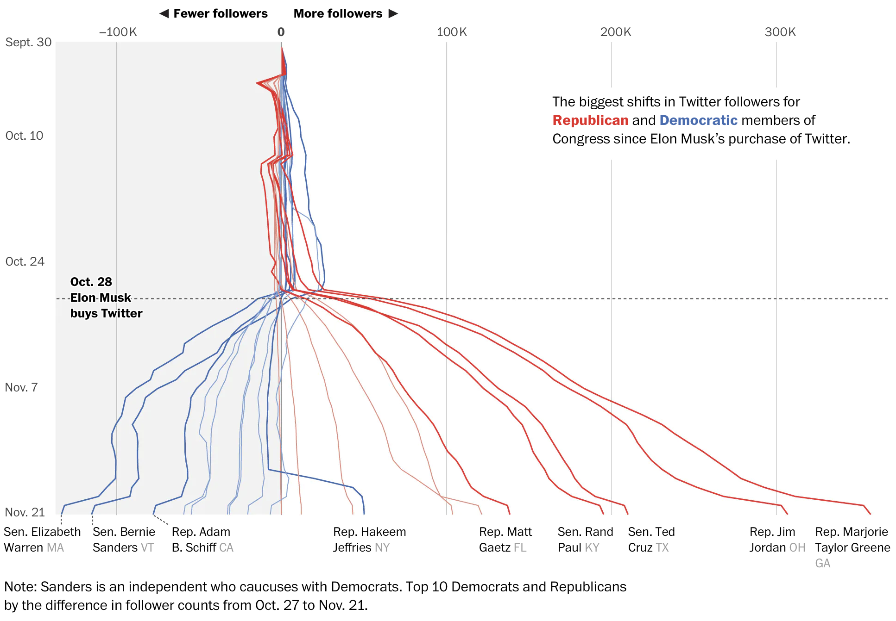

# Data Visualizations (Viz)
- "The greatest value of a picture is when it forces us to notice what we never expected to see."

          - Boxplot Inventor John Tukey
          - Great visualizations raise new questions          

## When Elon bought Twitter

{fig-align="center" width=9in}

::: notes
- This may be obvious with hindsight, but was not so clear at the time
- Done by data journalist Jeremy Merrill at WaPo
- Called a 'baseline chart'
- Not sure why they put time on the y axis tho?
- Hakeem Jeffries shift was when he decided to run for speaker
:::

## [DraftKings, FanDuel Searches during an NFL Game, 9-10 P.M.](https://drive.google.com/open?id=175yrLDY-W15TgBtumPa11WnwMwCeUmSF)

{fig-align="center" width=10in}

::: notes
- This graphic shows minute-by-minute search for DraftKings and Fanduel ads during the first thursday nfl game in 2015
- You can see that brand search increases 15-25x in the minutes a brand TV ad airs
- Notes: returns to baseline within 5 minutes; positive competitive spillovers; 
no evidence of accelerating search across time, so appears incremental; non-brand
ads do not seem to increase search for DK & FD
- I showed this to the Fanduel director of marketing research, she had no idea, they had no coordination across channels
- In fact their TV & search agencies were rivals in trying to get more spending
- Some brands are coordinating things better today but it's a hard problem
:::

## [SDPD Crime Reports Near UCSD](http://bar.rady.ucsd.edu/maps.html)

{fig-align="center" width=8in}

::: notes
- This map shows SDPD data on crimes reported near UCSD's main campus in 2012
- Note: possible that on-campus crimes were reported to UCSD's campus police rather than SDPD. Campus tends to be safe but I'm not sure it's this safe
- Still, something like this might help you decide where to live, or what to worry about
- Professor Hansen teaches in the MSBA program and maintains an online tutorial to do a bunch of cool analytics stuff
- Updating this with 2022 data would be a good challenge if you have free time
:::

## Viz build trust and understanding

-   Viz are *lingua franca* across disciplines
-   Eyeballs can interpret pictures quickly
-   Easily replicated -\> more easily trusted
-   Understandable to managers
-   Can detect unknown errors
-   Best when they raise deeper questions

::: notes
-   Pictures are easier than models or tables
-   Managers won't always understand viz accurately, but they'll always be interested
-   it's ironic we use such an obscure term (lingua franca) to mean something that everybody understands
:::

## Why you visualize data first

- 4 Datasets, Same $\hat{\beta}^{OLS}$

::: aside
- What does this tell you?
- For more, see [Same Stats, Different Graphs](https://www.research.autodesk.com/publications/same-stats-different-graphs/)
:::

::: notes
- The 4 datasets all generate the same OLS estimate for beta
- The relationships are quite different and imply different things
- If you only summarize with regression, you might miss smth important
:::

# Customer Analytics

::: notes
- Bring name tents & sharpies on day 1
:::

## Customer

-   Receives good or service in exchange for payment (money, time, attention)
-   Has agency: Can say "no"
-   "The purpose of business is to create and keep a customer." -Drucker
 
{fig-align="right" width="275"} 

::: aside
*related* Consumer, Client
:::

::: notes
-   The image is a dall-e2 drawing of 'happy customer with a shopping cart'
-   Client: Requires a service that is personally customized to their individual needs, possibly including the act of discovering their individual needs; often implies a longer term relationship or some type of fiduciary duty; trust is especially important.
-   Consumer: the one who uses the good or service; eg mom is customer but baby is consumer I kind of like the Serif theme.
:::

## Analytics

-   Using data to improve decisions
-   Started by Charles Taylor in the 1880s
-   Popularized by *Moneyball* (2011)
-   Measurement, Heuristics, Graphics, Models, Predictions, Automation, ...
-   Can be deceptively difficult

{fig-align="right" width=1.5in}

::: aside
-   *related* Expert systems, business intelligence, data science
:::

## First Law of Customer Analytics

-   No Customers, No Business

-   No Customers -\>  No Revenue -\>  No Profit -\>  No Business

::: aside
- Which owners or employees in the business can afford to ignore customers?
- Is talking to customers fun?
:::

## <!--#4 flavors of analytics-->

{fig-align="center" width=11in}

## <!--#Funnel-->

{fig-align="center"}

::: notes
-Retail has always been an early adopter of customer analytics -Catalogue retailers were the OGs -E-commerce more recently - talk about how to measure each of these Talk about drop-offs from each level to the next -Talk about easy ways to turn drop-offs into actions -These are examples of descriptive & diagnostic analytics -(aside: there are 3, and only 3, ways to make money: Customer Acquisition, Customer Retention, Customer Development)
:::

## E-commerce Analytics
 
{fig-align="center" width=11in}

::: notes
-800 ecommerce pros were surveyed about data-driven conversion tactics -Companies using 9+ methods were most satisfied with their conversion rates -Pros thought the optimal number of AB tests was 3-5 per month -As you can see, predictive & prescriptive analytics can be substantially more sophisticated than the simple funnel idea
:::

::: aside
[*Conversion Rate Optimization Report*](https://drive.google.com/file/d/1CODf7SpBS_-19jmR_mDCOaQRf3V24uaw/view?usp=sharing)
:::

 
# Customer Data

## Customer Data

-   Customer data show how customers and consumers learn, feel, behave and use products and services

-   Customer data increasingly drives marketing, but implementation varies widely

::: notes
-   ..."use of customer data to improve business decisionmaking"
-   ... "practice of meeting customer needs profitably"
-   We have new marketing analytics techniques, e.g. geofencing, retargeting, website morphing, sentiment analysis, seeded word-of-mouth
-   Marketing analytics have improved many traditional functions, e.g. ad targeting, pricing, product design, fraud detection, ROI measurements
:::

## How can we use customer data?

-   Customer relationship management: Acquire, develop, retain and "fire" customers
-   Marketing mix: Improve product offerings, prices, promotion, distribution
-   Understand customer heterogeneity for targeting, personalization, recommendations, product development...
-   Privacy and security, e.g. misuse, theft, regulatory compliance

::: notes
- We'll go deeper into that first bullet in week 9; this is how smart firms think about customer data internally
- That 2nd bullet reflects the outdated "4 Ps" thinking we talked about last week, but illustrates some available levers
- Third bullet will be the focus of weeks 3 & 6
- What are examples of privacy & security? (Ad fraud, financial fraud, ...)
:::

## How to evaluate customer data 

-   Accurate : The data are what we think they are
-   Representative : The data reflect the relevant customer population as a whole
-   Private : The data do no harm & comply with laws & ethics
-   Relevant: The right data for the decision at hand
-   Complete : Missingness causes problems

::: notes
-   Accurate: Are the data correct? Validated? Verifiable?
-   Representative: Do the data generalize? Who is (not) represented?
-   Private: Are data collected legally and ethically? Do customers know about your access and use?
-   Relevant: What decisions can the data help to inform?
-   Complete: How many observations are missing? Are NAs zeros or unmeasured? If unmeasured, are data missing randomly or systematically?
- Talking point: Are product reviews representative? What do you think? (Fraction of reviews, cascades, fake reviews)
:::

## Example: Nielsen

CONSUMER PANEL DATA

          - The Consumer Panel Data include longitudinal data beginning in 2004 with annual updates. These data track a panel of 40,000–60,000 US households and their purchases of fast-moving consumer goods from a wide range of retail outlets across all US markets. 

RETAIL SCANNER DATA

          - Retail Scanner Data consist of weekly pricing, volume, and store environment information generated by point-of-sale systems from more than 90 participating retail chains across all US markets. Data begin in 2006 and include annual updates. 

## 

{fig-align="center" width=8in}

::: notes
- "On July 9, 2020, the CEO of Goya, a national Latin foods brand with an estimated
$2 billion in annual global sales, praised President Donald Trump during a White House
meeting."
- Source: Liaukonyte, Tuchman & Zhu (2022)
:::

## 

{fig-align="center" width=6.5in}

::: notes
- Despite the calls for boycott, total sales rose, mostly because Republican areas started buying Goya
- Without customer data, we would be shooting in the dark in trying to figure out how social media polarization affected brand sales
:::

## Customer Data: Guiding Principle {.smaller}

-   Start simple. Complexify slowly. Why?
-   Never assume data are correct, clean, complete or as described. 

          - It's impossible to certify an absence of problems
          - Most commercial datasets have issues
          - Issues often detected months after project starts
          - ~70-90% of data scientist time spent checking and cleaning data
          - Credibility is hard to gain, easy to lose

{fig-align="right" width=7in}

::: notes
- How do you find the right balance between data trust and data skepticism? (Start simply)
:::

# Using Customer Data for Customer Analytics

## How do we "do" customer analytics? {.scrollable .smaller}

-   Decide what we want to do & how to judge performance
-   Collect, wrangle, clean & verify relevant data
-   Analyze data
-   Communicate analyses and recommendations
-   Make decisions
-   Implement data-driven decisions
-   Retrospectively evaluate and improve
-   Repeat
-   ...Once you have a stable process, automate carefully & monitor

## Challenges: Executives

-   May be territorial, or incentivized to be
-   May worry that analytics will constrain or replace them
-   May think data == magic
-   May prefer hunches or misunderstand uncertainty

::: notes
-   \`\`In God we trust; others must provide data''
:::

## Challenges: Analysts

-   Expensive
-   Hard to find
-   Not always current
-   Not always interested in business

## Challenges: Cultural

-   Do analytics make or justify decisions?
-   High- or low-trust environment? Tolerance for uncertainty?
-   Do messengers get rewarded or shot?
-   Are data available and integrated?
-   Do teams work together or compete?

::: notes
-   CFO: \`\`what's the ROI on the ad budget?''
-   CMO: \`\`1 million percent''
-   Simple data descriptives are often displayed on \`\`dashboards''
-   Facilitates human anomaly detection and decisionmaking, but underuses data
:::

## Signs of a great analytics org

-   C-level champion(s), i.e. C{E,A,F,M,O}O
-   Centralized team regulates data, arch., standards & tools
-   Decentralized analysts collaborate with execs
-   Analytics career tracks are well established
-   Careful in-housing/outsourcing decisions about analytics
-   Good examples?

::: notes
-   Career tracks include individual contributors
-   Efficient planning in advance: only do things that contribute to the bottom line.
-   Avoid unproductive efforts. Avoid \`\`pants-on-fire'' requests
-   Analytics as a process: Regular reassessments, improvements, iterations
-   Data are used to drive innovation, not just improve operations
-   My favorite examples: Amazon, Netflix
:::

## Analytics truisms

-   Analytics matters more in B2C than B2B (why?)
-   Selection effects are usually large

          treatment effects are usually small

-   Demographics don't predict behavior very well
-   Agencies lie about data sometimes
-   You have limited credibility. You may only get a few strikes
-   "If it's written in LaTeX, it's probably correct"

::: notes
-   Make sure nobody broke your code before you report huge anomalies
-   Always start with univariate descriptions and bivariate visualizations to test your understanding of the data
-   Beware outliers, especially in internet data; but understanding them can reveal a lot
-   Model-free evidence helps establish credibility before building models
-   Bayesian and Frequentist approaches usually offer similar insights, despite the cults
-   Simple models often perform similarly to complicated models in small and medium data
-   Given enough data, most flexible models should perform similarly
:::

# Our Class

## Course Design Principles

-   Survey the field with pointers for deeper learning 
-   Experiential learning:  "You don't understand it until you code it''
-   Free materials
-   Communication

        1. Website for syllabus, slides, scripts, data, readings
        2. Canvas for groups, deliverables & grades
        3. Piazza for all asynchronous interaction. No email
        4. After class, break or office hours for live discussions

-   [Course site & schedule](https://kennethcwilbur.github.io/mgt100/)

::: aside
- How do survey courses differ from other classes? | [Why R?](https://www.datacamp.com/blog/top-15-data-scientist-skills)
:::

## Tips to get an A

- Read the syllabus
- Budget 5-10 hours/week
- Between classes:

      1. Do homework solo
      2. Check homework with group, resolve differences
      3. Monitor Piazza 
      4. Read for the next class
      5. Fix a time/location, repeat 8 times 
      
- Contribute in class

::: aside
-   Midterm and final will be open-paper, closed-device
:::

## Integrity

-   We assign attending students to study groups in week 2

        - First homework is individual

-   It is OK to share answers and scripts within groups,  but not between groups

        - Exams are individual, offline, & based on homeworks
        - You are individually responsible for all deliverables
        - Script sharing is detectable, please be careful!
        - All grades are relative: Tell us if you observe integrity violations

-   We encourage you to use Gen AI; we use it too

## <!--#Intermission-->

{fig-align="center" width=6in}

-   Please enter your intentions for this class on Canvas.  How will you measure your effort?

# Vocab

Common language helps communication

## Customer level

-   Core need: identifiable problem a customer wants to solve. Could be functional, emotional, social, profit-motivated, etc. Related: desire, want, pain point

-   Core benefit: Customer's desired outcome of a purchase. E.g., commuters need to get to school, not necessarily cars

- Consumer: Entity that experiences the core benefit

- Customer: Entity that purchases and pays

::: aside
Client
:::

## Product level

-   Product/service/experience: Distinct offering that provides the core benefit

-   Features: Aspects of a product that provide additional tangible or intangible benefits

-   Contribution margin: Price --- marginal cost

-   Competitor: Any paid or free alternative that addresses the core need. E.g., commute by bike, walk, bus, trolley, Uber, scooter, skateboard; work from home

::: notes
-   Uber and Zoom are competitors because workers need to show that they are working in order to be retained and promoted. You would miss that if you define markets in terms of products.
:::

## Market level

-   Market: A group of potential customers with the same core need

-   Segment: Distinct subgroup of similar customers

-   Targeting: Which segment(s) a firm tries to serve

-   Positioning: Specification of product features to suit targeted segments

-   Marketing: Practice of meeting customer needs profitably
             [How to be good at marketing](https://www.youtube.com/watch?v=g_HPJ6KEQsM)

::: notes
-   Each market is composed of one of more segments
-   "STP" is a common marketing strategy framework
-   Marketing requires customer needs discovery/understanding, provision of an 
efficient solution, and pricing appropriately for everybody
:::

## Legacy Terms

-   3/4/5 C's: Customer, Competitor, Company;  Context; Complementors

-   4/.../10 P's:  Price, Product, Promotion, Place AKA distribution

# Coding & Script

## Coding errors

-   "The good news about computers is that they do what you tell them to do. The bad news is that they do what you tell them to do."

-   Conjecture:  (debugging difficulty) is exponential in (lines of code)

-   We can code fast or slow

## Coding Habits

-   Good habit: Test chunks as you code

-   Test = Check that output matches expectation

-   "Go slow to go fast"

    {width="364"}

::: aside
-   Bad habit: Write the script, run it, see where it breaks
-   Possibly fun digression, if time: Production code vs prototype code
:::

## Pipe \|\>

-   y \<- f(g(x)) is the same as

-   y \<- x \|\>

    g \|\>

    f

-   Why?

-   Old pipe was %\>%

## Today's script

-   [Install/update R and Rstudio](https://www.rstudio.com/products/rstudio/download/)
-   [Posit.Cloud](https://posit.cloud/)
-   Data Import/export
-   Data manipulation, summarization
-   5 verbs: Summarize, select, filter, arrange, mutate, group_by
-   Univariate statistics
-   Univariate plots
-   Bivariate statistics
-   Bivariate plots

{fig-align="right" width=2in}

# Wrapping up

## Homework 

-   Face photo, coding assignment

{fig-align="right" width=4in}

## Recap

-   Customer analytics : Using customer data to improve decisions 

-   Marketing : Meeting customer needs profitably

-   Analytics types:  Descriptive, Diagnostic, Predictive, Prescriptive

-   Summarize, select, filter, arrange, mutate, group_by

-   Good data are Representative, Unbiased, Private, Relevant, Complete

-   Data Viz are best way to start in customer analytics

{fig-align="right" width=2in}

## Going further

-   [Marketing Analytics for Data-Rich Environments](https://drive.google.com/file/d/1OjbctcHPksDpLy5QgrLdfj02FDEtEHrF/view?usp=share_link)

- [GGplot2 YT video](https://www.youtube.com/watch?v=HPJn1CMvtmI)

-   [*R for Data Science (2e)*](https://r4ds.hadley.nz/)

-   [*R for Marketing Research and Analytics*](https://drive.google.com/file/d/1OjpRFS6XRCdhyZGRv6l9DOONTIbFlbWi/view)

-   [GGplot2 Book](https://ggplot2-book.org/)

-   [*Advanced R*](https://adv-r.hadley.nz/)

-   [GGplot2 Book](https://ggplot2-book.org/)

{fig-align="right" width=2in}