##

{fig-align="center" width="13in"}

::: aside
Dog==Draymond AKA Dray AKA Click Clack AKA Major Jealous<br> Cat==Captain Kitty AKA Liquid AKA Hunter AKA Boomer
:::

# Data Visualizations (Viz)

-   "The greatest value of a picture is when it forces us to notice what
    we never expected to see."

    ```         
        - Boxplot Inventor John Tukey
        - Great visualizations raise new questions          
    ```

## Data Viz are older than 0
{fig-align="center" width="4in"}

::: aside
[source](https://www.datafix.com.au/BASHing/2020-08-12.html){target="_blank"}
:::

::: notes
-   Data tables are older than english; older than zero (est. 3 b.c.)
-   This is a drawing of an ancient Mesopotamian clay tablet
-   Estimated to be 3500 years old
-   Found near the Euphrates river in iraq
-   Data entry and data visualization are older than English
-   Next question raised: Are those blanks zeros or NAs ?
(what's an NA?)
-   Tables require study; pictures teach
-   Key lesson here: Only cavemen visualize data as tables
:::

## Translated

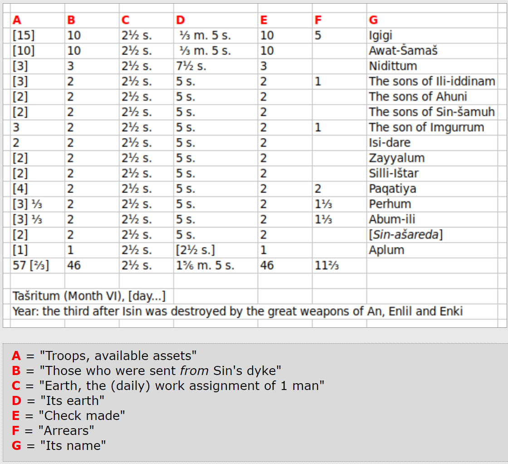{fig-align="center" width="6in"}

::: notes
-   This is an attempted translation of the original
-   It looks like column B and E are duplicates
-   A appears to be the sum of B(or E) and F
-   Looks like it may be accounting for construction labor or payments
-   Interesting that the date is relative
-   Column F is labeled "Arrears"--again, raising the question, are those zeros or NAs?
:::


## 

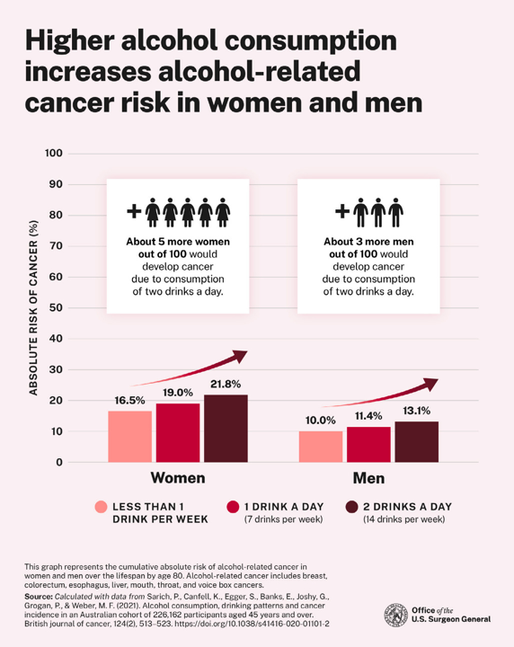{fig-align="center" width="5.5in"}

::: notes
-   portrait shape
-   shows absolute increase in risk, implies proportional increase
-   offers heterogeneous information, both for you and your loved one
-   provides information without undue effort to influence behavior
-   pleasing visual presentation (fonts/colors) despite grave topic
- Next questions: Is this causal? What's the uncertainty?
:::

## [](https://drive.google.com/open?id=175yrLDY-W15TgBtumPa11WnwMwCeUmSF){target="_blank"}

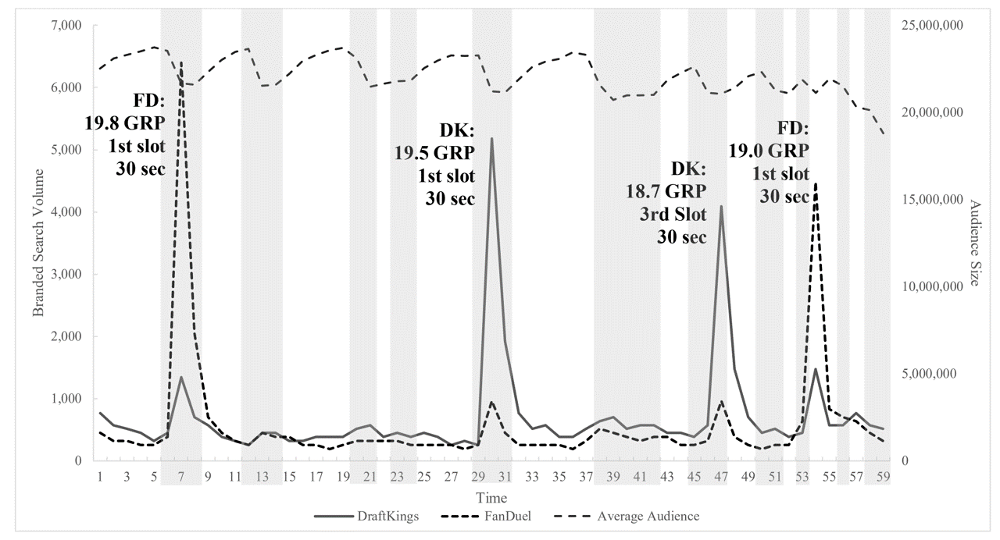{fig-align="center" width="10in"}

::: aside
Google searches for DraftKings, FanDuel during an NFL Game, 9-10 P.M. EST
:::

::: notes
-   This graphic shows minute-by-minute search for DraftKings and
    Fanduel ads during the first thursday nfl game in 2015
-   You can see that brand search increases 15-25x in the minutes a
    brand TV ad airs
-   Notes: returns to baseline within 5 minutes; positive competitive
    spillovers; no evidence of accelerating search across time, so
    appears incremental; non-brand ads do not seem to increase search
    for DK & FD
-   I showed this to the Fanduel director of marketing research, she had
    no idea, they had no coordination across channels
-   In fact their TV & search agencies were rivals in trying to get more
    spending
-   Some brands are coordinating things better today but it's a hard
    problem
:::


## [SDPD Crime Reports Near UCSD](http://bar.rady.ucsd.edu/maps.html){target="_blank"}

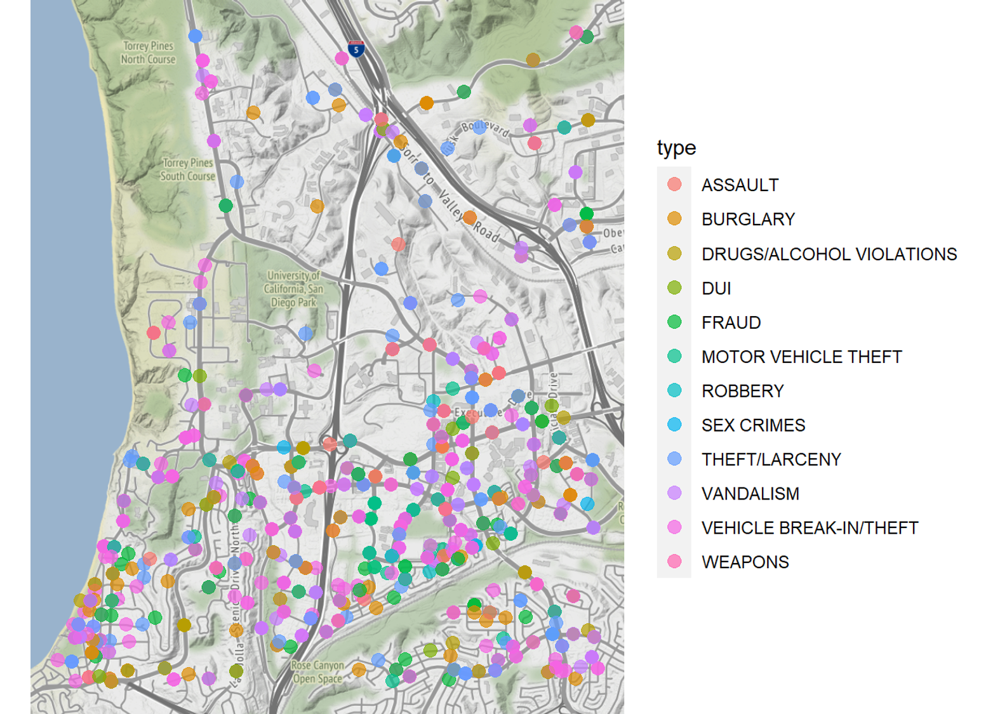{fig-align="center" width="6.5in"}

-   When is data zero vs. missing? Provenance is key
-   What kind of decisions could this inform?

::: notes
-   This map shows SDPD data on crimes reported near UCSD's main campus
    in 2012
-   Note: On-campus crimes were reported to UCSD's campus police rather
    than SDPD. Campus tends to be safe but I'm not sure it's this safe
-   Still, something like this might help you decide where to live, or
    what to worry about
-   Professor Hansen teaches in the MSBA program and maintains an online
    tutorial to do a bunch of cool analytics stuff
-   Updating this with 2022 data would be a good challenge if you have
    free time
:::

## Data *Provenance*

-   describes people, entities, and activities involved in producing,
    compiling, transforming & sharing data

        - Verifiability requires source data & cleaning scripts

-   Crucial in determining quality, reliability, trustworthiness

        - Investigating provenance requires and deepens domain expertise
        - Typically turns up unexpected information, and sometimes errors

-   When can you trust provenance information?

          - Best to treat provenance as hypotheses to be verified in the data
          - Usually, provenance descriptions are missing or imperfect
          - Financial info is most likely to be accurate due (accounting, auditing)
          - Considerations: Consent; Privacy; Missingness; Permissible uses
          - Sometimes, provenance descriptions are marketing documents


## Questions to ask

-   Data Origin, Measures, Quality, Verifiability

          -   How were the data produced?
          -   Who collected it, when and why?
          -   How is each variable measured? (surveys, APIs, sensors, etc; units)
          -   Is there a data dictionary or changelog?
          -   How can I verify individual datapoints?
          -   Certified by any third party? Who relies on them, for what?
          
-   Processing & Transformation

          -   What cleaning or manipulation was done?
          -   Who performed it and why? Can I see their scripts?
          -   Were missing values imputed? How?
          -   How were outliers handled?

::: aside
- GIGO: Garbage In, Garbage Out. Don't analyze noise
- [Go deeper](https://technologyadvice.com/blog/business-intelligence/data-provenance/){target="_blank"}
:::

## Viz can build trust, understanding

-   Eyeballs can interpret pictures quickly

        - Human brains are great at interpreting visual patterns, predictions
        - Can detect unknown errors

-   Understandable to managers

        - Viz choices enable narrative understanding, another common brain function

-   Viz are *lingua franca* across disciplines

        - Easily replicated -> more easily trusted
        - Trust can is a major issue in some corporate cultures

-   Viz succeed when they raise deeper questions

        - Asking the next question indicates acceptance
        - "I wonder why that is...." or "Maybe that's because..."
        - Viz usualy won't settle the matter; hence, the first step

::: notes
-   Pictures are easier than models or tables
-   Managers won't always understand viz accurately, but they'll usually
    be interested
-   it's ironic we use such an obscure term (lingua franca) to mean
    something that everybody can understand
:::


## 

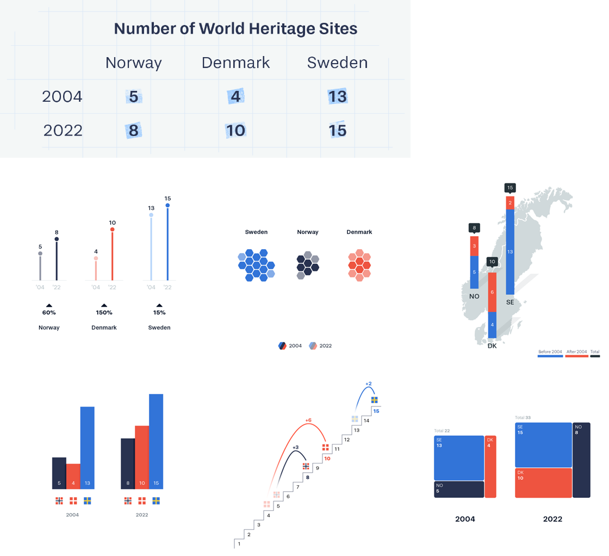{fig-align="center" height="7in"}

::: aside
[source](https://100.datavizproject.com/?trk=feed_main-feed-card_feed-article-content){target="_blank"}
:::

::: notes
- You can choose visualization elements to communicate your preferred interpretation, by highlighting particular contrasts or aspects of the data
- There are a LOT of degrees of freedom to do that
-   Source is "1 dataset 100 visualizations" .. A data visualization
    agency challenged itself to represent a simple dataset in 100
    different ways. Here are 6
-   Each image presents a different comparison ... let's walk through a
    few of them. 
    Go slow. Ask, "What does this first viz emphasize?"
    1. emphasizes absolute changes over time within country
    2. emphasizes 2022 datapoints by country
    3. Emphasizes country proximities within region
    (could have shown individual site locations on map instead?)
    4. Emphasizes cross-country comparisons within time
    5. Emphasizes Denmark leapfrogging Norway
    6. Aggregates to emphasize total number within each time
-   Effective visualizations focus on creating semantic meaning from
    data
-   Which meaning you want to emphasize or de emphasize is up to you
-   Visualization is an Art
:::


## Honest Viz

1. Usually start axes from 0, choose scales judiciously 

2. Show all relevant data, label accurately. Don't edit, trim

3. Discretize and smoothe judiciously

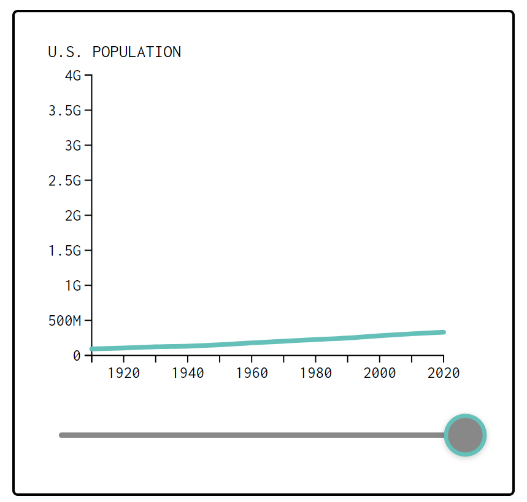{fig-align="right" width="3.5in"}

::: aside 
[Go deeper](https://flowingdata.com/projects/dishonest-charts/) 
:::

::: notes
There are so many degrees of freedom, that data viz could instead lead to misunderstanding (rather than understanding) 
Misleading viz can indicate bad faith
You want to avoid mistaken interpretations of your work, and identify misleading impressions created by others
::: 

## Visualize data before you analyze

-   4 Datasets, Same $\hat{\beta}^{OLS}$, i.e. same $\frac{x'x}{x'y}$

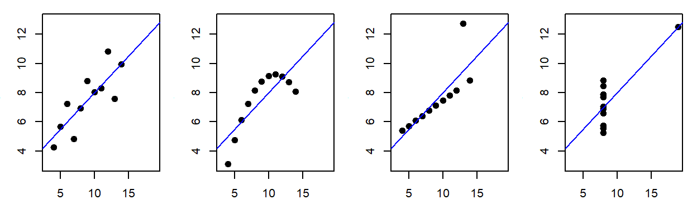{fig-align="center" width="8in"}

::: aside
-   What does each picture tell us?
    [Source](https://www.research.autodesk.com/publications/same-stats-different-graphs/){target="_blank"}
- This is why we shouldn't just use regression to summarize data
:::

::: notes
- The most common use of visualizations is private, for an analyst to understand the properties of a dataset
-   The 4 datasets all generate the same OLS estimate for beta
-   The relationships are quite different and imply different things
-   If you only summarize with regression, you might miss smth important
- As a consultant and researcher, when I observe a junior colleague neglect to visualize a dataset prior to analysis, I form a certain expectation
:::


# Customer Analytics


::: notes
-   Bring name tents & sharpies on day 1
:::

::: aside

:::

## Customer

-   Receives good or service in exchange for payment (money, time,
    attention)
-   Has agency: Can say "no"
-   "The purpose of business is to create and keep a
    customer."<br />-Drucker

{fig-align="right" width="275"}

::: aside
*related* Consumer, Client
:::

::: notes
-   The image is a dall-e2 drawing of 'happy customer with a shopping
    cart'
-   Client: Requires a service that is personally customized to their
    individual needs, possibly including the act of discovering their
    individual needs; often implies a longer term relationship or some
    type of fiduciary duty; trust is especially important.
-   Consumer: the one who uses the good or service; eg mom is customer
    but baby is consumer I kind of like the Serif theme.
:::

## Analytics

-   Using data to improve decisions
-   Started by Charles Taylor in the 1880s (mostly)
-   Popularized by *Moneyball* (2011) 
-   Measurement, Heuristics, Graphics, Models, Predictions, Automation, Optimization, Personalization, ...
-   Can be deceptively difficult

{fig-align="right" width="1.5in"}

::: notes
- Popularized more by the movie than the book
- I worked with a $50b CPG firm between 2015-2018 which spent $1b+ on coupons but had never previously measured returns on that spending. Managers involved called the effort 'Project Moneyball'
:::

::: aside
-   *related* Expert systems, business intelligence, data science, AI
-   Terms change frequently
:::

## First Law of Customer Analytics

-   No Customers, No Business

-   No Customers -\> <br>No Revenue -\> <br>No Profit -\> <br>No
    Business <br>*QED*
    
::: aside
-   Which owners or employees in the business can afford to ignore
    customers?
-   Is talking to customers fun?
:::

## Second Law of Customer Analytics

-   More Customers, More Profits

-   More Customers -\> <br>More Revenue -\> <br>More Profit <br>*QED*

        - These are empirical tendencies, not logical necessities
        - Individual customers can be unprofitable if (price-cost)<0

- Marketing Objective: Maximize Long-term Profits

        - Long-term focus mostly aligns our interest with customers
        - Goal is not only to acquire customers; also, keep and develop them
        - Sidesteps or reduces most ethical dilemmas
        - Short-run objective may profit before liability; I won't teach 
        
        

## Example of Great Marketing: Netflix

- Consumer surplus

        - Suppose customer pays $20/month, watches 60 hours: $0.33 per entertainment hour, or $0.13/hour with ads, or less with shared accounts
        - A la carte rentals are more like $1-2+/hour
        - Non-video entertainment tends to be much more expensive
        - Social benefits may accrue from shared viewing
        - Other streaming services may be competitive
        
- Producer surplus

        - NFLX spent $13B on content in 2023, 230 million subscribers, about $4.70/user/month
        - Cost structure: High fixed, low marginal 
        - Ads likely earning around $4-5 per recipient/month
        - Net profit margin about 20-22% in a competitive category

::: aside
- Other EDLP businesses: Costco, Trader Joes, Walmart (vs High-Low)
- Common tension between short-term management and long-term strategies
:::
        
        

## How can we use customer data?

-   Businesses have 4, and only 4, ways to make money:<br>
Acquire, develop, retain and "fire" customers

        This is called Customer relationship management (CRM): week 9

-   Marketing mix ("4 P's"): Improve product offerings, prices, promotion,
    distribution

-   Incorporate customer heterogeneity for targeting, personalization,
    recommendations, product development...

-   Privacy and security, e.g. misuse, theft, regulatory compliance

::: notes
-   We'll go deeper into that first bullet in week 9; this is how smart
    firms think about customer data internally
-   That 2nd bullet reflects the outdated "4 Ps" thinking we talked
    about last week, but illustrates some available levers
-   Third bullet will be the focus of weeks 3 & 6
-   What are examples of privacy & security? (Ad fraud, financial fraud,
    ...)
:::


## Example: Nielsen

CONSUMER PANEL DATA

```         
      - The Consumer Panel Data include longitudinal data beginning in 2004 with annual updates. These data track a panel of 40,000–60,000 US households and their purchases of fast-moving consumer goods from a wide range of retail outlets across all US markets. 
```

RETAIL SCANNER DATA

```         
      - Retail Scanner Data consist of weekly pricing, volume, and store environment information generated by point-of-sale systems from more than 90 participating retail chains across all US markets. Data begin in 2006 and include annual updates. 
```

## 

{fig-align="center" width="8in"}

::: notes
-   "On July 9, 2020, the CEO of Goya, a national Latin foods brand with
    an estimated \$2 billion in annual global sales, praised President
    Donald Trump during a White House meeting."
-   Source: Liaukonyte, Tuchman & Zhu (2022)
:::

::: aside
[source](https://pubsonline.informs.org/doi/pdf/10.1287/mksc.2022.1386){target="_blank"}
:::

## 

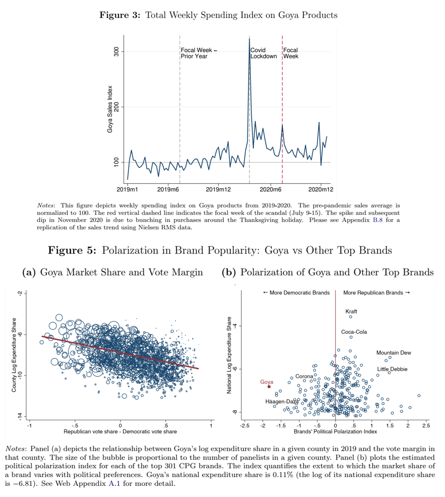{fig-align="center" width="6.5in"}

::: notes
-   Despite the calls for boycott, total sales rose, mostly because
    Republican areas started buying Goya
-   Without customer data, we would be shooting in the dark in trying to
    figure out how social media polarization affected brand sales
:::


## <!--#4 flavors of analytics-->

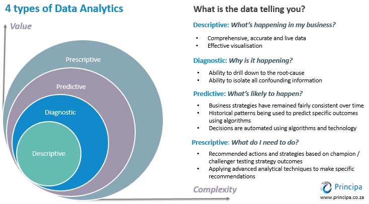{fig-align="center" width="11in"}

## <!--#Funnel-->

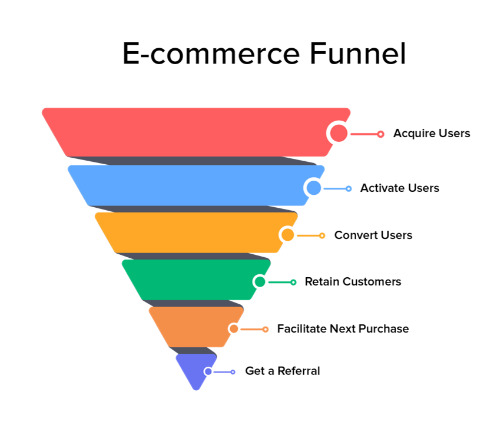{fig-align="center"}

::: notes
-Retail has always been an early adopter of customer analytics
-Catalogue retailers were the OGs -E-commerce more recently - talk about
how to measure each of these Talk about drop-offs from each level to the
next -Talk about easy ways to turn drop-offs into actions -These are
examples of descriptive & diagnostic analytics -(aside: there are 3, and
only 3, ways to make money: Customer Acquisition, Customer Retention,
Customer Development)
:::

## E-commerce Analytics

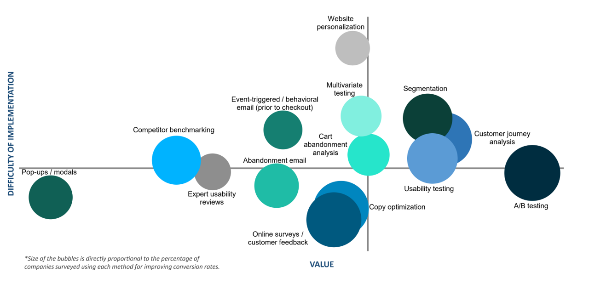{fig-align="center" width="11in"}

::: notes
-800 ecommerce pros were surveyed about data-driven conversion tactics
-Companies using 9+ methods were most satisfied with their conversion
rates 
-Pros thought the optimal number of AB tests was 3-5 per month 
-As you can see, predictive & prescriptive analytics can be substantially
more sophisticated than the simple funnel idea
:::

::: aside
[*Conversion Rate Optimization
Report*](https://drive.google.com/file/d/1CODf7SpBS_-19jmR_mDCOaQRf3V24uaw/view?usp=sharing){target="_blank"}
:::


# Using Customer Data for Customer Analytics

## How do we "do" customer analytics? {.scrollable .smaller}

-   Decide objectives & outcome metrics
-   Collect, wrangle, clean & verify relevant data
-   Analyze data
-   Communicate analyses and recommendations
-   Make decisions
-   Implement data-driven decisions
-   Retrospectively evaluate and improve
-   Repeat
-   ...Once you have a stable process, automate carefully & monitor

## Challenges: Executives

-   May be territorial, or incentivized to be
-   May worry that analytics will constrain or replace them
-   May think data == magic
-   May prefer hunches or misunderstand uncertainty

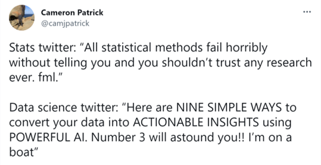{fig-align="right" width="5in"}

::: notes
-   \`\`In God we trust; others must provide data''
:::

## Challenges: Analysts

-   Expensive
-   Hard to find
-   Not always current
-   Not always interested in business

## Challenges: Cultural

-   Do analytics make or justify decisions?
-   High- or low-trust environment? Tolerance for uncertainty?

        - You have limited credibility. You may only get a few strikes

-   Do messengers get rewarded or shot?
-   Are data available and integrated?
-   Do teams work together or compete?

::: notes
-   CFO: \`\`what's the ROI on the ad budget?''
-   CMO: \`\`1 million percent''
-   Simple data descriptives are often displayed on \`\`dashboards''
-   Facilitates human anomaly detection and decisionmaking, but
    underuses data
:::

## Signs of a great analytics org

-   C-level champion(s), i.e. C{D,E,A,F,M,O}O
-   Centralized team regulates data, arch., standards & tools
-   Decentralized analysts collaborate with execs
-   Analytics career tracks are well established
-   Careful in-housing/outsourcing decisions about analytics
-   Good examples?

::: notes
-   Career tracks include individual contributors
-   Efficient planning in advance: only do things that contribute to the
    bottom line.
-   Avoid unproductive efforts. Avoid \`\`pants-on-fire'' requests
-   Analytics as a process: Regular reassessments, improvements,
    iterations
-   Data are used to drive innovation, not just improve operations
-   My favorite examples: Amazon, Netflix
:::

## Analytics truisms

-   Analytics matters more in B2C than B2B (why?)

-   Selection effects are usually large

    ```         
      treatment effects are usually small 
      Key exceptions: Price or "free" giveaways
    ```

-   Demographics don't predict behavior very well

-   Agencies lie about data sometimes

-   "If it's written in LaTeX, it's probably correct"

::: notes
-   Make sure nobody broke your code before you report huge anomalies
-   Always start with univariate descriptions and bivariate
    visualizations to test your understanding of the data
-   Beware outliers, especially in internet data; but understanding them
    can reveal a lot
-   Model-free evidence helps establish credibility before building
    models
-   Bayesian and Frequentist approaches usually offer similar insights,
    despite the cults
-   Simple models often perform similarly to complicated models in small
    and medium data
-   Given enough data, most flexible models should perform similarly
:::

# MGT 100

            - I am assuming you read the syllabus carefully


## Course Design Principles

-   Survey the field broadly, pointers for deeper learning

-   Focus on conceptual understanding: <br>"When it comes to LLMs, skillful prompting leaves amateurs in the dust."

-   Strict communication policies

    ```         
    1. Website for class content
    2. Canvas for study groups & grades
    3. Piazza for all asynchronous interaction. No email or canvas messages
    4. After class, break or office hours for live discussions
    ```

-   [Course site & schedule](https://kennethcwilbur.github.io/mgt100/){target="_blank"}

::: aside
-   How do survey courses differ from other classes? \| [Why
    R?](https://www.datacamp.com/blog/top-15-data-scientist-skills){target="_blank"}
:::

## Gen AI effects on productivity

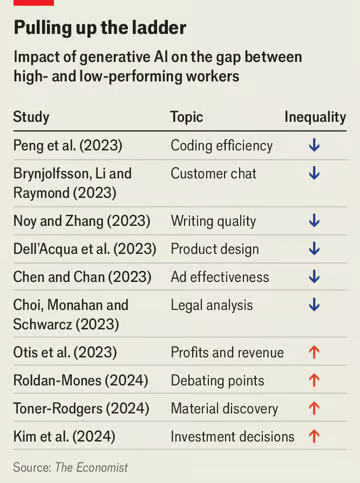{fig-align="center" width="4in"}

::: aside
- [source](https://archive.ph/cTMzY)
- Jobs where Gen AI decreases the skill gap may be at risk
::: 

## Tips to max your learning

-   Read the syllabus carefully

-   Attend and contribute as suggested in the syllabus

-   Budget 5-10 hours/week

-   Between classes:

    ```         
    1. Step through script carefully, understand everything.
    2. Do homework questions on your own
    3. Check homework with group, resolve differences
    4. Monitor Piazza and read for the next class
    5. Compile notes and homework answers to facilitate exam prep
    ```

::: aside
-   Exams are open-paper, closed-device. Live attendance required, please plan ahead.
:::

## Studying and Integrity

-   We assign attending students to study groups in week 2

-   It is OK to share homework scripts and answers

    ```         
    - We do not collect or assess homeworks. 
    - We do not provide homework answers.
    - Exam questions will test your familiarity and understanding of homework answers. More details forthcoming 
    ```

-   We encourage you to use Gen AI thoughtfully; we use it too

    ```         
    - LLMs are poor substitutes for human understanding
    - Be advised, you may get what you pay for
    - Free models are sometimes worse than useless
    ```


## <!--#Intermission-->

{fig-align="center" width="6in"}

-   Please write down your intentions for this class. <br>How will
    you measure your effort?

# Vocab

Common language helps communication

## Customer level

-   Core need: identifiable problem a customer wants to solve. Could be
    functional, emotional, social, profit-motivated, etc. Related:
    desire, want, pain point

-   Core benefit: Customer's desired outcome of a purchase. E.g.,
    commuters need to get to school, not necessarily cars

-   Consumer: Entity that experiences the core benefit

-   Customer: Entity that purchases and pays

::: aside
Client
:::

## Product level

-   Product/service/experience: Distinct offering that provides the core
    benefit

-   Features: Aspects of a product that provide additional tangible or
    intangible benefits

-   Value proposition: utility( Core benefit + features - price )

-   Contribution margin: Price --- marginal cost

-   Competitor: Any paid or free alternative that addresses the core
    need. E.g., commute by bike, walk, bus, trolley, Uber, scooter,
    skateboard; work from home

::: notes
-   Uber and Zoom are competitors because workers need to show that they
    are working in order to be retained and promoted. You would miss
    that if you define markets in terms of products.
:::

## Market level

-   Market: Potential customer group with common core need

-   Segment: Distinct subgroup of similar customers

-   Targeting: Which segment(s) a firm tries to serve

-   Positioning: Specification of product features to suit targeted
    segments

-   Marketing: Practice of meeting customer needs profitably 

          - Marketing: Business discipline that focuses most on customers
          - Ads & sales: Worthless without good value prop and positive margin
          - Poor implementation commonly leads to confusion with bullshit ("persuasive speech without regard for the truth" --Frankfurt 2005)
          
::: aside
[How to be good at marketing](https://www.youtube.com/watch?v=g_HPJ6KEQsM){target="_blank"}
[On Bullshit](https://archive.org/details/on-bullshit-by-harry-frankfurt)
:::

::: notes
-   Each market is composed of one of more segments
-   "STP" is a common marketing strategy framework
-   Marketing requires customer needs discovery/understanding, provision
    of an efficient solution, and pricing appropriately for everybody
- The word "marketing" does not appear in Frankfurt's book (but advertising does)
:::

## Legacy Terms

-   3/4/5 C's: Customer, Competitor, Company; <br>Context; Complementors

-   STP: Segmentation, Targeting, Positioning AKA Marketing Strategy

-   4/.../10 P's: <br>Price, Product, Promotion, Place AKA distribution AKA Marketing Tactics

            - You need to know these well if you interview for marketing roles
            - Generations of marketing professionals were educated to think this way, e.g. MGT 103 and Harvard MBAs
            - Still relevant, but less, thanks to customer data abundance & analytics 
            
::: aside
Start [here](https://griffinandco.marketing/blog/2018/10/25/the-5cs-of-marketing){target="_blank"} or [here](https://www.coursera.org/articles/4-ps-of-marketing){target="_blank"} or [here](https://en.wikipedia.org/wiki/Marketing){target="_blank"}
:::


# Coding & Script

## Coding errors

-   "The good news about computers is that they do what you tell them to
    do. The bad news is that they do what you tell them to do."

-   Conjecture: <br>(debugging difficulty) is exponential in (lines of
    code)

-   We can code fast or slow

## Coding Habits

-   Good habit: Test chunks as you code

-   Test = Manipulate text, verify output matches expectation

-   "Go slow to go fast"

    {width="364"}

::: aside
-   Bad habit: Write the script, run it, see where it breaks
-   Digression: Production code vs prototype code
:::

## Pipe \|\>

-   y \<- f(g(x)) is the same as

-   y \<- x \|\>

    g \|\>

    f

-   Why?

-   Old pipe was %\>% ; remains widely used

## Today's script

-   [Install/update R and
    Rstudio](https://www.rstudio.com/products/rstudio/download/){target="_blank"}
-   [Posit.Cloud](https://posit.cloud/){target="_blank"}
-   Data Import/export
-   Data manipulation, summarization
-   5 verbs: Summarize, select, filter, arrange, mutate, group_by
-   Univariate statistics
-   Univariate plots
-   Bivariate statistics
-   Bivariate plots

{fig-align="right" width="2in"}

# Wrapping up

## Recap

-   Customer analytics : <br>Using customer data to improve decisions

-   Data Viz should be the first step in customer analytics

-   Marketing : Meeting customer needs profitably

-   Analytics types: <br>Descriptive, Diagnostic, Predictive,
    Prescriptive

-   Summarize, select, filter, arrange, mutate, group_by

{fig-align="right" width="2in"}

## Going further

-   [Marketing Analytics for Data-Rich
    Environments](https://drive.google.com/file/d/1eF1upn8QEu5Xkk_HwlKqyr5MCx19CSsx/view?usp=sharing){target="_blank"}
    
-   [GGplot2 YT video](https://www.youtube.com/watch?v=HPJn1CMvtmI){target="_blank"}

-   [*R for Data Science (2e)*](https://r4ds.hadley.nz/){target="_blank"}

-   [*R for Marketing Research and
    Analytics*](https://drive.google.com/file/d/1eIZEtL5nrsQ1sknIARUQVtxLFyrHItMq/view){target="_blank"}

-   [GGplot2 Book](https://ggplot2-book.org/){target="_blank"}

-   [*Advanced R*](https://adv-r.hadley.nz/){target="_blank"}

{fig-align="right" width="2in"}
