##

{fig-align="center" height="450px"}

::: {.callout-note appearance="minimal"}
Dog==Draymond || Dray || Click Clack || Major Jealous  Cat==Luka || Liquid || Hunter || Captain Kitty
:::

# Data Visualizations (Viz)

- "The greatest value of a picture is when it forces us to notice what we never expected to see."
    - Boxplot Inventor John Tukey
- A visualization succeeds when it enables deeper questions, like "why"

::: {.source-url}
[Tukey (1977)](https://archive.org/details/exploratorydataa0000tuke_7616){target="_blank"}
:::

## Data Viz are older than 0

{fig-align="center" height="400px"}

::: {.callout-note appearance="minimal"}
This ancient Mesopotamian clay tablet is estimated to be nearly 4,000 years old. Data visualization is older than English and older than zero. Are those blanks zeros or missing values?
:::

::: {.source-url}
[source](https://www.datafix.com.au/BASHing/2020-08-12.html){target="_blank"}
:::

::: notes
- Data tables are older than english; older than zero (est. 3 b.c.)
- This is a drawing of an ancient Mesopotamian clay tablet
- Estimated to be 3500 years old
- Found near the Euphrates river in iraq
- Data entry and data visualization are older than English
- Next question raised: Are those blanks zeros or NAs? (what's an NA?)
- Tables require study; pictures teach
- Key lesson here: Only cavemen visualize data as tables
:::

## Translated

{fig-align="center" height="400px"}

::: {.callout-note appearance="minimal"}
This attempted translation shows what appears to be accounting for construction labor. Columns B and E look like duplicates, and A appears to sum B and F. Are those blanks zeros or missing data?
:::

::: notes
- This is an attempted translation of the original
- It looks like column B and E are duplicates
- A appears to be the sum of B(or E) and F
- Looks like it may be accounting for construction labor or payments
- Interesting that the date is relative
- Column F is labeled "Arrears"--again, raising the question, are those zeros or NAs?
:::

##

:::: {.columns}

::: {.column width="60%"}
{fig-align="center" height="600px"}
:::

::: {.column width="40%"}
::: {.callout-note appearance="minimal"}
This visualization shows absolute increase in cancer risk and offers information for different audiences, with a pleasing presentation despite a grave topic.

Does the graph show how much a person's cancer risk changes when they change their drinking behavior? (I.e., a "causal effect")
:::
:::

::::

::: notes
- portrait shape
- shows absolute increase in risk, implies proportional increase
- offers heterogeneous information, both for you and your loved one
- provides information without undue effort to influence behavior
- pleasing visual presentation (fonts/colors) despite grave topic
- Next questions: Is this causal? What's the uncertainty?
:::

## Viz can build trust, understanding

- Humans are great at interpreting visual patterns
- Can reveal unexpected data properties
- Understandable to non-specialists, including managers and customers
- Viz are *lingua franca* across disciplines
- Easily replicated -> More easily trusted
- Viz succeed when they raise deeper questions
    - Asking the next question indicates acceptance; facts prompt explanations
    - "I wonder why that is...." or "Maybe that's because..."
    - Viz usually won't settle major debates, but viz is the first step

::: notes
- Pictures are easier than models or tables
- Managers won't always understand viz accurately, but they'll usually be interested
- it's ironic we use such an obscure term (lingua franca) to mean something that everybody can understand
:::

##

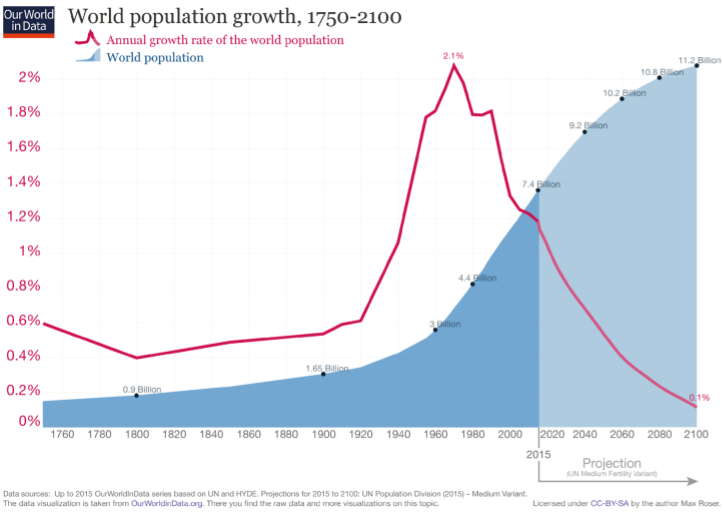{fig-align="center" height="420px"}

::: {.callout-note appearance="minimal"}
The world population curve has a sigmoid shape, also known as an S curve, in which growth increases and later decreases. A pop science book, *Population Bomb* by Ehrlich (1968), forecast mass starvation, since population was increasing exponentially but food production was increasing linearly. Why was Ehrlich's forecast so far from correct?
:::

::: {.source-url}
[Our World in Data](https://docs.google.com/presentation/d/1wQD2O976nyZdn4qm7OFSY9FTBCaVVTY4hEnyh3_EYas/edit?slide=id.p7#slide=id.p7){target="_blank"}
:::

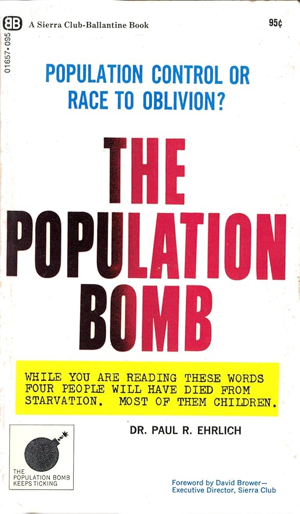{.absolute top="100" right="20" height="270px"}

::: notes
- Population curve is a textbook sigmoid/S-curve
- Growth rate peaked ~1962 at ~2.1%/year, now ~1%/year
- UN medium-variant projection: ~10.4B by 2100
- Key driver: fertility decline (next slide topic?)
- The post-2024 portion is a projection, not observed data
- Sigmoid = logistic growth curve, common in biology, epidemiology, technology adoption
- Ehrlich assumed that exponential growth would continue indefinitely, a faulty assumption
- Ehrlich failed to appreciate the effects of how declining child mortality, improving contraception and family planning would affect future mortality, even though the signs were there in the data
:::

##

{fig-align="center" height="500px"}

::: {.callout-note appearance="minimal"}
Google searches for DraftKings, FanDuel during an NFL Game, 9-10 P.M. EST. Commercial minutes are shaded. What do you see?
:::

::: {.source-url}
[Du et al. (2019)](https://drive.google.com/open?id=175yrLDY-W15TgBtumPa11WnwMwCeUmSF){target="_blank"}
:::

::: notes
- This graphic shows minute-by-minute search for DraftKings and Fanduel ads during the first thursday nfl game in 2015
- You can see that brand search increases 15-25x in the minutes a brand TV ad airs
- Notes: returns to baseline within 5 minutes; positive competitive spillovers; no evidence of accelerating search across time, so appears incremental; non-brand ads do not seem to increase search for DK & FD
- I showed this to the Fanduel director of marketing research, she had no idea, they had no coordination across channels
- In fact their TV & search agencies were rivals in trying to get more spending
- Some brands are coordinating things better today but it's a hard problem
:::

## SDPD Crime Reports Near UCSD

{fig-align="center" height="400px"}

::: {.callout-note appearance="minimal"}
This map graphs one year of San Diego Police Department police reports. When is data zero vs. missing? Provenance is key. What kind of decisions could this inform?
:::

::: {.source-url}
[Hansen](http://bar.rady.ucsd.edu/maps.html){target="_blank"}
:::

::: notes
- This map shows SDPD data on crimes reported near UCSD's main campus in 2012
- Note: On-campus crimes were reported to UCSD's campus police rather than SDPD. Campus tends to be safe but I'm not sure it's this safe
- Still, something like this might help you decide where to live, or what to worry about
- Professor Hansen teaches in the MSBA program and maintains an online tutorial to do a bunch of cool analytics stuff
- Updating this with 2022 data would be a good challenge if you have free time
:::

## Data *Provenance* {.smaller}

- Describes people, entities, and activities involved in producing, compiling, transforming & sharing data
    - Crucial in determining quality, reliability, trustworthiness
    - Verifiability requires source data & cleaning scripts
    - Investigating provenance requires and deepens domain expertise
    - Typically turns up unexpected information
- When can you trust provenance information?
    - Usually, provenance descriptions are imperfect. Best to treat provenance doc claims as hypotheses to be verified in the data
    - Financial variables are most likely to be accurate due to auditing requirements
    - Sometimes, provenance descriptions are marketing documents

::: {.callout-note appearance="minimal"}
A key principle in Business Analytics is GIGO: Garbage In, Garbage Out. Don't analyze noise.
:::

::: {.source-url}
[Jungco (2025)](https://technologyadvice.com/blog/business-intelligence/data-provenance/){target="_blank"}
:::

## {style="padding-top: 0; margin-top: -20px;"}

:::: {.columns style="margin-top: -10px; gap: 0px;"}

::: {.column style="width: 50%; line-height: 0;"}
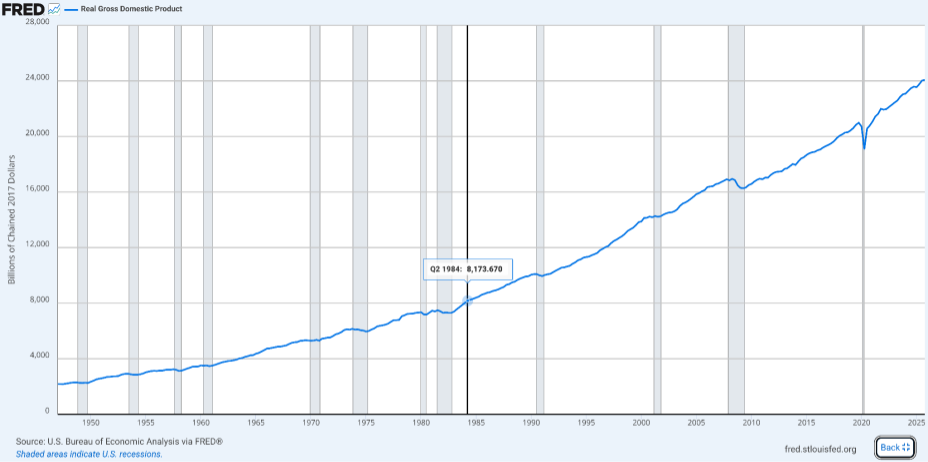{fig-align="center" height="243px" style="margin: 0 0 3px 0;"}

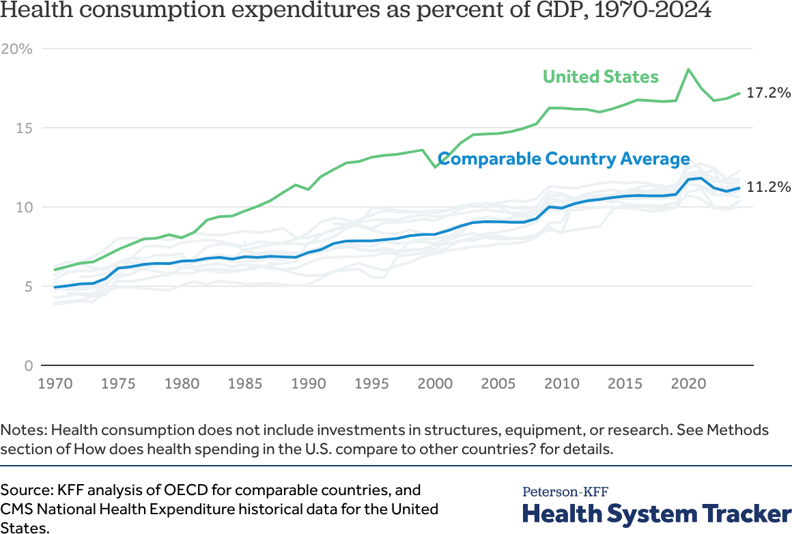{fig-align="center" height="243px" style="margin: 3px 0 0 0;"}
:::

::: {.column style="width: 50%; line-height: 0;"}
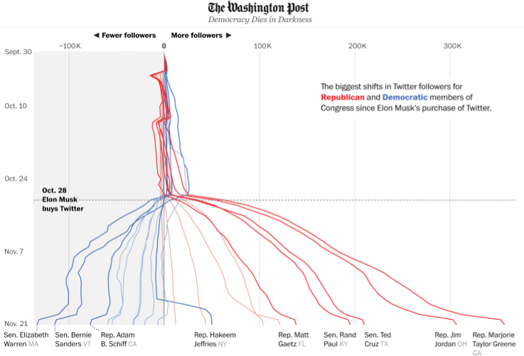{fig-align="center" height="243px" style="margin: 0 0 3px 0;"}

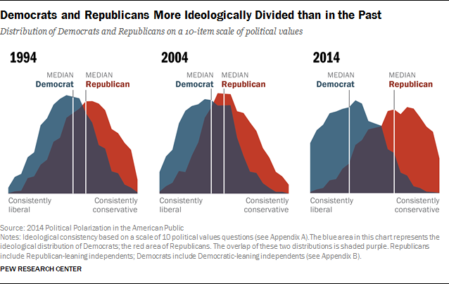{fig-align="center" height="243px" style="margin: 3px 0 0 0;"}
:::

::::

::: {.callout-note appearance="minimal" style="font-size: 0.8em; margin-top: 3px;"}
"Graphics journalists urge that each chart should make exactly one point – and it should be obvious how to read it. Often charts say (1) number goes up/down recently, (2) number goes up/down when some event occurred, (3) one set of lines diverges from another set of lines (or, one line is an outlier compared to the rest), (4) the distribution is bimodal." --Jeremy Merrill, WaPo. "Scientific charts are often the opposite of this -- they have four variables, six symbols and are explained two pages away."
:::

##

{fig-align="center" height="450px"}

::: {.callout-note appearance="minimal"}
The same dataset can be represented many different ways, each emphasizing different comparisons. Here is a very simple dataset; what comparison does each graphic communicate? How would you summarize each graphic in a sentence?
:::

::: {.source-url}
[source](https://100.datavizproject.com/?trk=feed_main-feed-card_feed-article-content){target="_blank"}
:::

::: notes
- You can choose visualization elements to communicate your preferred interpretation, by highlighting particular contrasts or aspects of the data
- There are a LOT of degrees of freedom to do that
- Source is "1 dataset 100 visualizations" .. A data visualization agency challenged itself to represent a simple dataset in 100 different ways. Here are 6
- Each image presents a different comparison ... let's walk through a few of them.
    Go slow. Ask, "What does this first viz emphasize?"
    1. emphasizes absolute changes over time within country
    2. emphasizes 2022 datapoints by country
    3. Emphasizes country proximities within region (could have shown individual site locations on map instead?)
    4. Emphasizes cross-country comparisons within time
    5. Emphasizes Denmark leapfrogging Norway
    6. Aggregates to emphasize total number within each time
- Effective visualizations focus on creating semantic meaning from data
- Which meaning you want to emphasize or de emphasize is up to you
- Visualization is an Art
:::

## Honest Viz

:::: {.columns}

::: {.column width="55%"}
1. Usually start axes from 0, choose scales judiciously
2. Show all relevant data, label accurately
3. Discretize and smooth judiciously
4. Show uncertainty when relevant
5. Cite data sources

::: {.callout-note appearance="minimal"}
Misleading visualizations can indicate bad faith. You want to avoid mistaken interpretations of your work, and identify misleading impressions created by others.
:::
:::

::: {.column width="45%"}
{fig-align="center" height="400px"}
:::

::::

::: {.source-url}
[Go deeper](https://flowingdata.com/projects/dishonest-charts/){target="_blank"}
:::

::: notes
There are so many degrees of freedom, that data viz could instead lead to misunderstanding (rather than understanding)
Misleading viz can indicate bad faith
You want to avoid mistaken interpretations of your work, and identify misleading impressions created by others
:::

## Visualize data before you model anything

- 4 Datasets, Same $\hat{\beta}^{OLS}$, i.e. same $\frac{x'x}{x'y}$

{fig-align="center" height="350px"}

::: {.callout-note appearance="minimal"}
This is why we shouldn't just use regression to summarize data. What does each picture tell us?
:::

::: {.source-url}
[Matejka & Fitzmaurice (2017)](https://www.research.autodesk.com/publications/same-stats-different-graphs/){target="_blank"}
:::

::: notes
- The most common use of visualizations is private, for an analyst to understand the properties of a dataset
- The 4 datasets all generate the same OLS estimate for beta
- The relationships are quite different and imply different things
- If you only summarize with regression, you might miss smth important
- As a consultant and researcher, when I observe a junior colleague neglect to visualize a dataset prior to analysis, I form a certain expectation
:::

# Customer Analytics

::: notes
- Bring name tents & sharpies on day 1
:::

## Customer {.smaller}

:::: {.columns}

::: {.column width="65%"}
- Receives good or service in exchange for payment (money, time, attention)
- Has agency: Can say "no"
- "The purpose of business is to create and keep a customer." -Drucker
- "There is only one boss. The customer. And he can fire everybody in the company from the chairman on down, simply by spending his money somewhere else." -Walton
- "In the long term, there's never any misalignment between customer interests and shareholder interests." -Bezos

::: {.callout-note appearance="minimal"}
*related* Consumer, Client
:::
:::

::: {.column width="35%"}
{fig-align="center" height="350px"}
:::

::::

::: notes
- The image is a dall-e2 drawing of 'happy customer with a shopping cart'
- Client: Requires a service that is personally customized to their individual needs, possibly including the act of discovering their individual needs; often implies a longer term relationship or some type of fiduciary duty; trust is especially important.
- Consumer: the one who uses the good or service; eg mom is customer but baby is consumer I kind of like the Serif theme.
:::

## Analytics

:::: {.columns}

::: {.column width="65%"}
- Using data to improve decisions
- Popularized by Charles Taylor in 1910s
- Further popularized by *Moneyball* (2011)
- From less to more sophisticated: Measurement, Heuristics, Graphics, Models, Predictions, Automation, Optimization, Personalization, ...
- Can be deceptively difficult

::: {.callout-note appearance="minimal"}
*related* Expert systems, business intelligence, data science, AI. Terms change frequently.
:::
:::

::: {.column width="35%"}
{fig-align="center" height="200px"}
:::

::::

::: notes
- Popularized more by the movie than the book
- I worked with a $50b CPG firm between 2015-2018 which spent $1b+ on coupons but had never previously measured returns on that spending. Managers involved called the effort 'Project Moneyball'
:::

## First Law of Customer Analytics

- No Customers, No Business
- No Customers -\>  No Revenue -\>  No Profit -\>  No Business  *QED*

::: {.callout-note appearance="minimal"}
Which owners or employees in the business can afford to ignore customers?
:::

## Second Law of Customer Analytics {.smaller}

- More Customers, More Profits
- More Customers -\>  More Revenue -\>  More Profit  *QED*
    - These are empirical tendencies, not logical necessities
    - Individual customers can be unprofitable if (price-cost)<0
- Marketing Objective: Maximize Long-term Profits
    - Long-term focus mostly aligns our interest with customers; Sidesteps or reduces most ethical dilemmas
    - Long-term focus seems to first attract customers, then retain and develop them

::: {.callout-note appearance="minimal"}
Marketing has a marketing problem. Most people confuse marketing with ads; sales; or bullshit ("persuasive speech without regard for the truth"). This is because real marketing decisions are made at the top of the org, and short-term incentives often lead marketers into unethical choices.
:::

## Example of Great Marketing: Netflix {.smaller}

- Consumer surplus
    - Suppose customer pays $20/month, watches 60 hours: $0.33 per entertainment hour, or $0.15/hour with ads, or less with shared accounts
    - A la carte rentals cost $1-2+/hour; other streaming services more per hour consumed
    - Non-video entertainment tends to be much more expensive
    - Social benefits may accrue from shared viewing
- Producer surplus
    - NFLX spent $18B on content in 2025, 325 million subscribers, about $4.60/user/month
    - Cost structure: High fixed, low marginal
    - Ads likely earning around $7-8 per recipient/month
    - Net profit margin about 24% in a competitive category

::: {.callout-note appearance="minimal"}
Strategic consistency reduces customer risk. Other EDLP (vs High-Low) businesses: Costco, Trader Joes, Walmart. Common tension between short-term management and long-term strategies.
:::

## How can we use customer data?

- Businesses have 4, and only 4, ways to make money: Acquire, develop, retain and "fire" customers
    - This is called Customer Relationship Management (CRM): week 8
- Marketing mix ("4 P's"): Improve product offerings, prices, promotion, distribution. Tactics we use to attract, develop, retain and fire customers
- Incorporate customer heterogeneity for targeting, personalization, recommendations, product development...

::: {.callout-note appearance="minimal"}
Firing customers is typically indirect, such as withdrawing preferred products or declining to encourage further purchasing. Why is firing customers usually controversial?
:::

::: notes
- We'll go deeper into that first bullet in week 9; this is how smart firms think about customer data internally
- That 2nd bullet reflects the outdated "4 Ps" thinking we talked about last week, but illustrates some available levers
- Third bullet will be the focus of weeks 3 & 6
- What are examples of privacy & security? (Ad fraud, financial fraud, ...)
:::

## Example: Nielsen

- **Consumer Panel Data** include longitudinal data beginning in 2004. These data track a panel of 40,000--60,000 US households and their purchases of fast-moving consumer goods from a wide range of retail outlets across all US markets.

- **Retail Scanner Data** consist of weekly pricing, volume, and in-store marketing info generated by point-of-sale systems from 90+ participating retail chains across all US markets. Data begin in 2006.

::: {.callout-note appearance="minimal"}
Retail industry always adopts customer analytics frameworks early. Consumer panel and retail scanner data are foundational in packaged goods categories.
:::

{.absolute top="-10" right="20" height="80px"}

##

:::: {.columns}

::: {.column width="60%"}
{fig-align="center" height="600px"}
:::

::: {.column width="40%"}
::: {.callout-note appearance="minimal"}
On July 9, 2020, the CEO of Goya praised President Trump during a White House meeting, generating calls for a consumer boycott.
:::
:::

::::

::: {.source-url}
[Liaukonyte, Tuchman & Zhu (2022)](https://pubsonline.informs.org/doi/pdf/10.1287/mksc.2022.1386){target="_blank"}
:::

::: notes
- "On July 9, 2020, the CEO of Goya, a national Latin foods brand with an estimated \$2 billion in annual global sales, praised President Donald Trump during a White House meeting."
- Source: Liaukonyte, Tuchman & Zhu (2022)
:::

##

:::: {.columns}

::: {.column width="60%"}
{fig-align="center" height="600px"}
:::

::: {.column width="40%"}
::: {.callout-note appearance="minimal"}
Despite calls for a boycott, total sales rose, mostly because Republican areas started buying Goya. Without customer data, we would be shooting in the dark.
:::
:::

::::

::: {.source-url}
[Liaukonyte, Tuchman & Zhu (2022)](https://pubsonline.informs.org/doi/pdf/10.1287/mksc.2022.1386){target="_blank"}
:::

::: notes
- Despite the calls for boycott, total sales rose, mostly because Republican areas started buying Goya
- Without customer data, we would be shooting in the dark in trying to figure out how social media polarization affected brand sales
:::

##

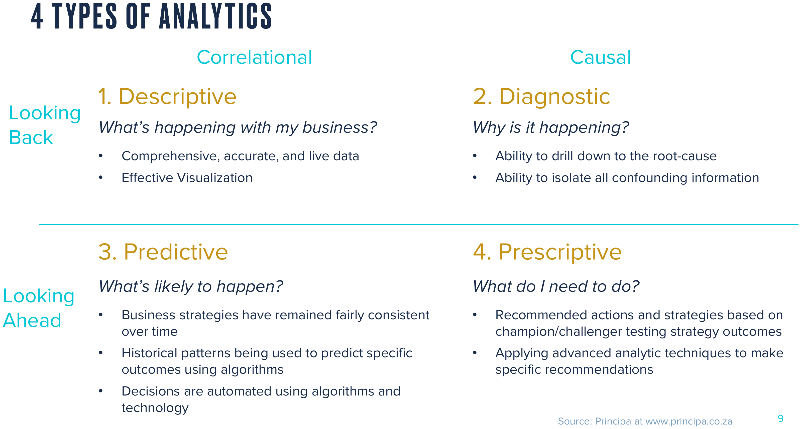{fig-align="center" height="400px"}

::: {.callout-note appearance="minimal"}
Descriptive (what happened), diagnostic (why), predictive (what will happen), and prescriptive (what should we do). Which type is hardest?
:::

##

{fig-align="center" height="400px"}

::: {.callout-note appearance="minimal"}
This model is also known as the purchase journey. Very likely the most popular empirical analytics framework ever in customer analytics. How does it facilitate decisionmaking?
:::

::: notes
- Retail has always been an early adopter of customer analytics
- Catalogue retailers were the OGs -E-commerce more recently - talk about how to measure each of these Talk about drop-offs from each level to the next -Talk about easy ways to turn drop-offs into actions -These are examples of descriptive & diagnostic analytics -(aside: there are 3, and only 3, ways to make money: Customer Acquisition, Customer Retention, Customer Development)
:::

## E-commerce Analytics

{fig-align="center" height="400px"}

::: {.callout-note appearance="minimal"}
These bubbles represent analytics techniques used to address customer funnel-related goals. 800 e-commerce pros were surveyed; companies using 9+ data-driven methods were most satisfied with their conversion rates. The optimal number of A/B tests was 3-5 per month. Why do you think pop-ups are so common?
:::

::: {.source-url}
[*Conversion Rate Optimization Report*](https://drive.google.com/file/d/1CODf7SpBS_-19jmR_mDCOaQRf3V24uaw/view?usp=sharing){target="_blank"}
:::

::: notes
- 800 ecommerce pros were surveyed about data-driven conversion tactics
- Companies using 9+ methods were most satisfied with their conversion rates
- Pros thought the optimal number of AB tests was 3-5 per month
- As you can see, predictive & prescriptive analytics can be substantially more sophisticated than the simple funnel idea
:::

## Signs of a great analytics org

- C-level champion(s), i.e. C{D,E,A,F,M,O}O
- Analytics career tracks are well established
- Centralized team regulates data, arch., standards & tools
- Decentralized analysts collaborate with execs
- Careful in-housing/outsourcing decisions about analytics

::: {.callout-note appearance="minimal"}
These are questions you can ask in job interviews.
:::

::: notes
- Career tracks include individual contributors
- Efficient planning in advance: only do things that contribute to the bottom line.
- Avoid unproductive efforts. Avoid ``pants-on-fire'' requests
- Analytics as a process: Regular reassessments, improvements, iterations
- Data are used to drive innovation, not just improve operations
- My favorite examples: Amazon, Netflix
:::

## Why is analytics hard? {.smaller}

:::: {.columns}

::: {.column width="20%"}
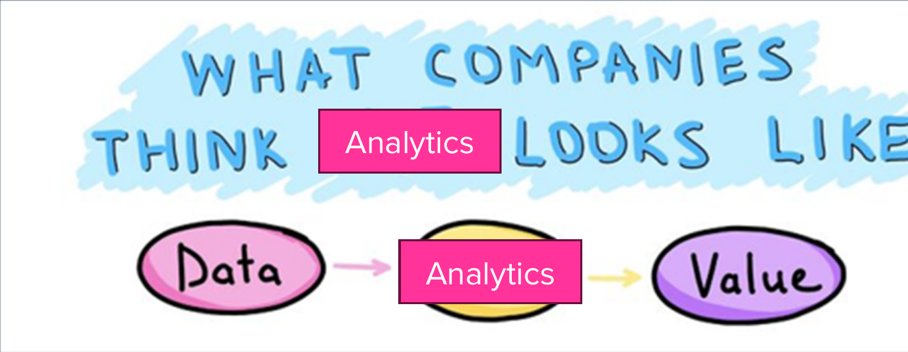{fig-align="right" width="100%"}
:::

::: {.column width="80%"}
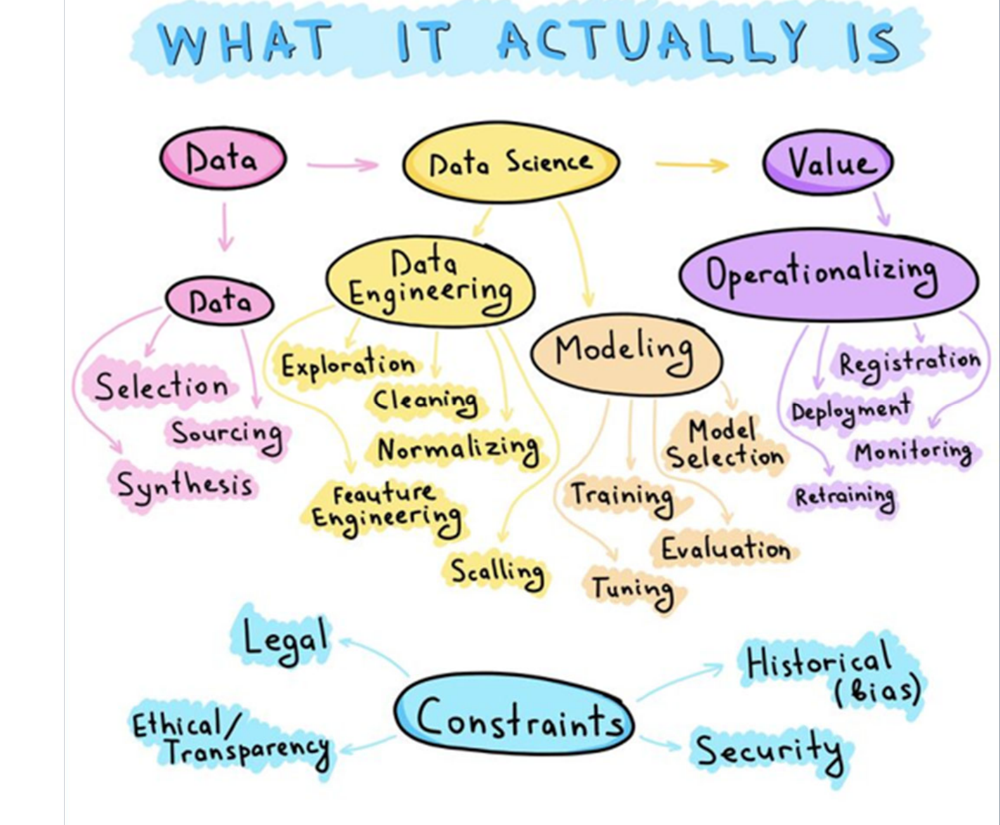{fig-align="center" height="298px"}
:::

::::

- **Executives** may be territorial, prefer hunches, or misunderstand what data can and cannot do
- **Analysts** are expensive, hard to find, and not always interested in the business context
- **Culture** determines whether analytics makes decisions or merely justifies them; low-trust environments punish messengers and underuse data

::: {.callout-note appearance="minimal"}
Analytics works best when leadership creates an environment that enables analytics investments and rewards disciplined decisionmaking, with retrospective decision evaluations and continuous-learning feedback loops. How have you seen analytics used in practice?
:::

## Analytics truisms

- Analytics matters more in B2C than B2B (why?)
- Selection effects are usually large
    - treatment effects are usually small
    - Key exceptions: Price or "free" giveaways
- Agencies lie about data sometimes
- "If it's written in LaTeX, it's probably correct"

::: notes
- Make sure nobody broke your code before you report huge anomalies
- Always start with univariate descriptions and bivariate visualizations to test your understanding of the data
- Beware outliers, especially in internet data; but understanding them can reveal a lot
- Model-free evidence helps establish credibility before building models
- Bayesian and Frequentist approaches usually offer similar insights, despite the cults
- Simple models often perform similarly to complicated models in small and medium data
- Given enough data, most flexible models should perform similarly
:::

# Vocab

Common language facilitates communication

## Customer level

- Core need: identifiable problem a customer wants to solve. Could be functional, emotional, social, profit-motivated, etc. Related: desire, want, pain point
- Core benefit: Customer's desired outcome of a purchase. E.g., commuters need to get to school, not necessarily cars
- Consumer: Entity that experiences the core benefit
- Customer: Entity that purchases and pays

::: {.callout-note appearance="minimal"}
In what markets does the customer often differ from the consumer? Known as "Choosing for others."
:::

## Product level

- Product/service/experience: Distinct offering that provides the core benefit
- Features: Aspects of a product providing additional tangible or intangible benefits
- Value proposition: Statement that describes utility( Core benefit + features - price )
- Contribution margin: Price --- marginal cost
- Competitor: Any paid or free alternative that addresses the core need. E.g., commute by bike, walk, bus, trolley, Uber, scooter, skateboard; work from home

::: notes
- Uber and Zoom are competitors because workers need to show that they are working in order to be retained and promoted. You would miss that if you define markets in terms of products.
:::

## Market level

- Market: Potential customer group with common core need
- Segment: Distinct subgroup of similar customers
- Targeting: Which segment(s) a firm tries to serve
- Positioning: Specification of product features to suit targeted segments
- Marketing: Practice of meeting customer needs profitably
    - Marketing: Business discipline that focuses most on customers
    - Ads & sales: Worthless without good value prop and positive margin

::: {.callout-note appearance="minimal"}
In what markets do Uber and Zoom compete?
:::

::: {.source-url}
[How to be good at marketing, by yours truly](https://www.youtube.com/watch?v=g_HPJ6KEQsM){target="_blank"} | [Frankfurt (2005)](https://archive.org/details/on-bullshit-by-harry-frankfurt){target="_blank"}
:::

::: notes
- Each market is composed of one of more segments
- "STP" is a common marketing strategy framework
- Marketing requires customer needs discovery/understanding, provision of an efficient solution, and pricing appropriately for everybody
- The word "marketing" does not appear in Frankfurt's book (but advertising does)
:::

## Legacy Terms

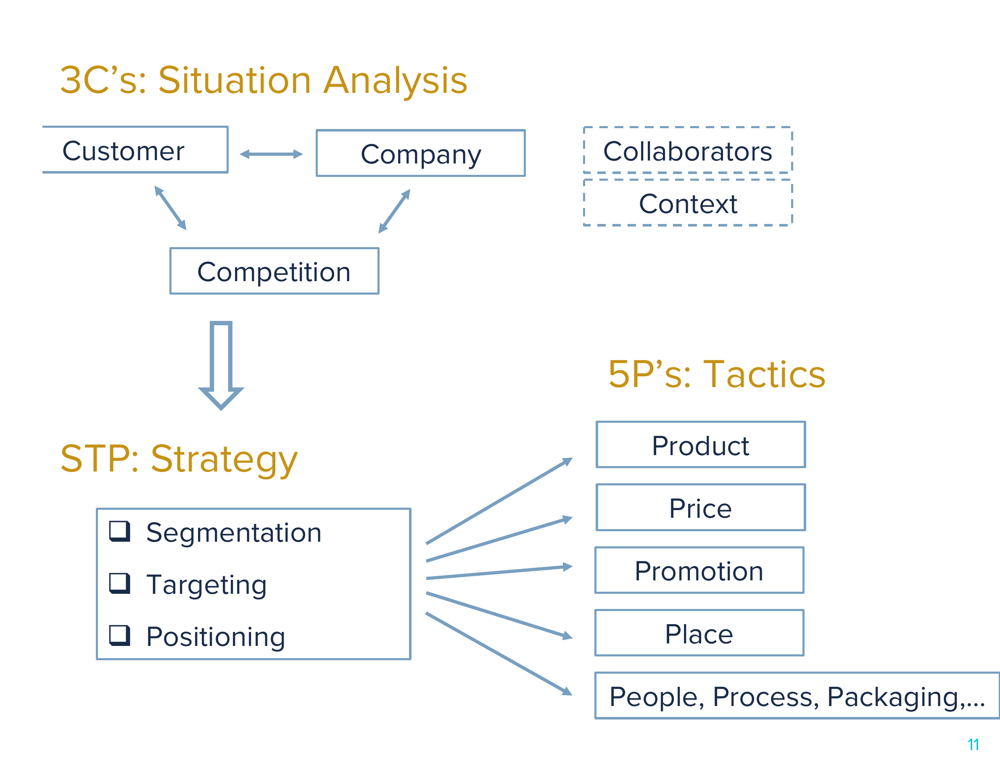{fig-align="center" height="350px"}

::: {.callout-note appearance="minimal"}
You need to know these well if you interview for marketing roles. Generations of marketing professionals were educated and continue to think this way. Still relevant, but less central, thanks to customer data & analytics abundance. MGT 103 complements this course well by covering these topics in depth, but without the same deep focus on customer data.
:::

::: {.source-url}
[Griffin & Co](https://griffinandco.marketing/blog/2018/10/25/the-5cs-of-marketing){target="_blank"} | [Coursera](https://www.coursera.org/articles/4-ps-of-marketing){target="_blank"} | [Wikipedia](https://en.wikipedia.org/wiki/Marketing){target="_blank"}
:::

##

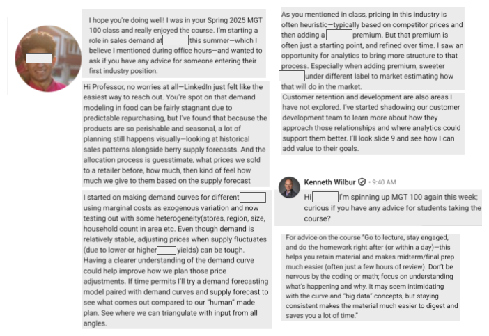{fig-align="center" height="500px"}

## MGT 100 Principles {.smaller}

- Survey the field broadly, pointers for deeper learning. [Why R?](https://www.datacamp.com/blog/top-15-data-scientist-skills){target="_blank"}
- Piazza for all asynchronous interaction. No email or canvas messages
    - Important for fairness, timeliness, contribution scores & instructional team collaboration
- "When it comes to LLMs, skillful prompting leaves amateurs in the dust."

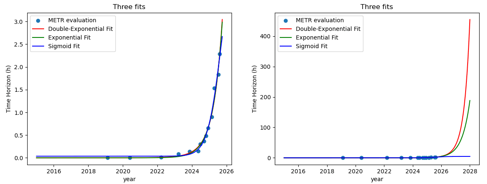{fig-align="center" height="280px"}

::: {.callout-note appearance="minimal"}
Y axes indicate the human-expert task-completion time (in hours) that a frontier agent can complete with 50% reliability. Cox (2006) said "How [the] translation from subject-matter problem to statistical model is done is often the most critical part of an analysis." What is model mis-specification? How does this figure into the public conversation about future AI capabilities? Will AI become all-powerful or should you study and build skills?
:::

::: {.source-url}
[gjm (2025)](https://www.lesswrong.com/posts/ZEuDH2W3XdRaTwpjD/hyperbolic-model-fits-metr-capabilities-estimate-worse-than){target="_blank"}
:::

## How I use and don't use LLMs (Apr. 2026) {.smaller}

:::: {.columns}

::: {.column width="50%"}
- I don't use LLMs to
    - Communicate with humans I know (don't want to offend)
    - Read challenging material
    - Ideate or scope projects
    - Decide how to code what I want
    - Verify code does what I asked
    - Write first drafts of anything I care about ("Writing is thinking")
:::

::: {.column width="50%"}
- I use Claude Code daily with `/effort max` to
    - Suggest code plans and write code
    - Check code output vs. prompts before I check it myself
    - Troubleshoot and debug errors
    - Copy edit and criticize my writing
    - Complicated searches
    - Summarize text and learn simple things
:::

::::

- Ken's LLM Usage Principles: 1. Embrace discomfort, maintain and deepen my differentiating skillset. 2. Use LLMs to speed up low-level tasks with great training data. 3. Use domain knowledge to challenge LLM output, go to primary sources to verify key points. 4. Training data contain all perspectives found on the internet, the prompt determines which perspective is reflected in the response. 5. All complicated prompts contain unstated assumptions, don't ask the LLM to fill in the blanks. 6. Never use a free LLM.

::: {.callout-note appearance="minimal" style="font-size: 1.15em;"}
My use/non-use cases reflect my role as an academic researcher and educator. Your optimal use/non-use cases are likely to differ. Where has LLM use helped in your education? Has it ever limited your education? How can it help in MGT 100?
:::

##

{fig-align="center" height="400px"}

::: {.callout-note appearance="minimal"}
Please write down your intentions for this class on Canvas. How will you measure your effort? Please don't say grades alone; grades are outcomes, not inputs. Measurement is central in analytics; you cannot manage what you do not measure.
:::

## Coding & Script

:::: {.columns}

::: {.column width="75%"}
- Conjecture:  (debugging difficulty) is exponential in (lines of code)
- We can code fast or slow. "Go slow to go fast"
- Pipe: y \<- f(g(x)) is the same as y \<- x \|\> g \|\> f
    - Old pipe was %\>% ; remains widely used

::: {.callout-note appearance="minimal"}
Bad habit: Write the whole script, run it, see where it breaks. Good habit: test each chunk before writing the next one.
:::
:::

::: {.column width="25%"}
{fig-align="center" height="180px"}
:::

::::

## Today's script

- Data Import/export
- Data manipulation, summarization
- 5 verbs: Summarize, select, filter, arrange, mutate, group_by
- Univariate statistics
- Univariate plots
- Bivariate statistics
- Bivariate plots

{.absolute bottom="20" right="20" height="100px"}

# Wrapping up

## Week 1 Competition {.smaller}

::: {style="font-size: 0.7em;"}
| Week (relative to endorsement) | Region | Goya sales |
|:-----:|:------:|:-----:|
| -4 | Right-leaning | 87 |
| -3 | Right-leaning | 85 |
| -2 | Right-leaning | 87 |
| -1 | Right-leaning | 90 |
| 0 | Right-leaning | 140 |
| 1 | Right-leaning | 133 |
| 2 | Right-leaning | 110 |
| 3 | Right-leaning | 95 |
| -4 | Left-leaning | 158 |
| -3 | Left-leaning | 159 |
| -2 | Left-leaning | 158 |
| -1 | Left-leaning | 159 |
| 0 | Left-leaning | 176 |
| 1 | Left-leaning | 170 |
| 2 | Left-leaning | 162 |
| 3 | Left-leaning | 158 |
:::

::: {.callout-note appearance="minimal"}
Visualize Goya's weekly average sales in right- and left-leaning regions pre/post a major endorsement. Data: `goyadata <- readRDS(url("https://raw.githubusercontent.com/kennethcwilbur/mgt100/main/data/goya_sales.rds"))`

Your visualization should make a clear point and be very easy to understand. Submit your R script and visualization on Canvas.
:::

{.absolute bottom="20" right="20" height="120px"}

## Recap

- Customer analytics :  Using customer data to improve decisions
- Data Viz is the first step in customer analytics
- Marketing : Meeting customer needs profitably
- Analytics types:  Descriptive, Diagnostic, Predictive, Prescriptive
- Summarize, select, filter, arrange, mutate, group_by

{.absolute bottom="20" right="20" height="100px"}

## Going further

- [Data-enabled storytelling (Wilke 2019)](https://clauswilke.com/dataviz/telling-a-story.html){target="_blank"}
- [GGplot2 YT video](https://www.youtube.com/watch?v=HPJn1CMvtmI){target="_blank"}
- [Elegant Graphics for Data Analysis (3e)](https://ggplot2-book.org/){target="_blank"}
- [Big Book of R](https://www.bigbookofr.com/){target="_blank"}: Lovingly curated, well organized, free resource directory for nearly any R problem
- [A Layered Grammar of Graphics (Wickham 2007)](https://drive.google.com/file/d/1tCpTd3kaodD4FPgUF5dUjol1RhuZUXao/view?usp=drive_link){target="_blank"}

{.absolute bottom="20" right="20" height="100px"}
