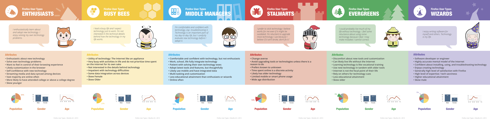
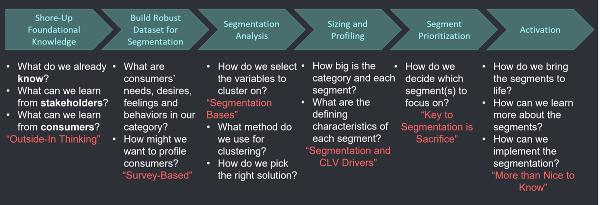
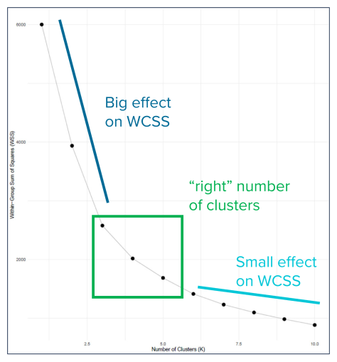
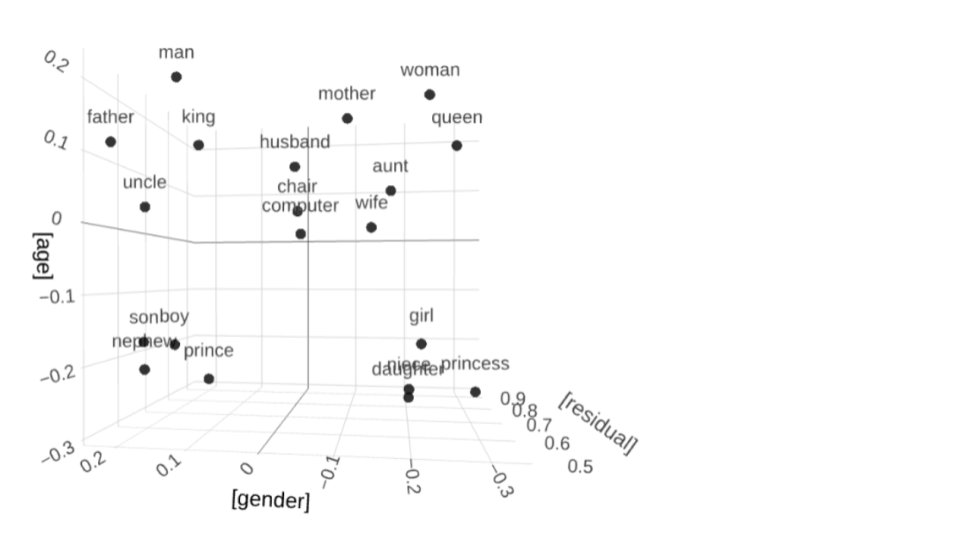
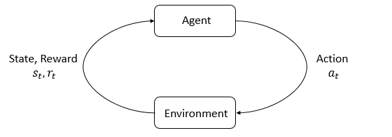

# Segmentation

-   Putting the S into STP

## Heterogeneity {.smaller}

-   A fancy way to say that customers differ, e.g.
    -   Product needs--usage intensity, frequency, context; loyalty
        -   Most important dimension of heterogeneity, by far
        -   This perspective differs from the reading
    -   Demographics--often overrated as predictors of behavior
    -   Psychographics--Orientation to Art, Status, Religion, Family, ...
    -   Location
    -   Experience
    -   Information
    -   Attitudes
-   Differences may predict purchases, wtp, usage, satisfaction, retention, ...

::: {.callout-note appearance="minimal"}
Product needs predict behavior far better than demographics. Why might marketers still default to demographic segmentation?
:::

## 

{fig-align="center" height="450px"}

::: {.callout-note appearance="minimal"}
Few people ask for room-temperature tea. Why did Coke introduce Coke Zero when it already had Diet Coke? Sometimes when you try to appeal to everyone, you appeal to nobody. How can you predict how the market will react to your product?
:::

::: notes
-   Coke Zero: taste, gender, Pepsi Max, shelfspace; original advertising strategy
:::

## Market Segmentation

-   *Segments*: distinct customer groups with similar attributes *within* a segment, different attributes *between* segments
    -   Fundamental since the 1960s
    -   Numerous segmentation techniques exist
    -   Customer Response Profiles embody segments
    -   B2B segments: customer needs, size, profitability, internal structure
-   Segmentation should drive most customer decisions

::: notes
-   Typical B2B value props: increased revenue, cost saving, time savings, risk reduction
:::

## Measurable

{fig-align="center" height="400px"}

::: {.callout-note appearance="minimal"}
Good segments must be measurable -- you need data to identify who belongs to each group. Why do you think those high-FICO accounts are unprofitable?
:::

::: notes
-   Why do you think those high-FICO accounts are unprofitable?
:::

## Substantial

{fig-align="center" height="450px"}

::: {.callout-note appearance="minimal"}
Small segments can sustain profitable niche-focused services, but if you go too small, you can't sustain operations. Which of these services do you think survived?
:::

::: notes
-   1 of these is out of business, and the other 3 appear dead
:::

## Is segmenting by gender sexist?

{fig-align="center" height="400px"}

::: {.callout-note appearance="minimal"}
Segmenting markets by gender or other demographics may reflect real differences in customer needs, or may reflect a lazy categorization. Sexism or discrimination usually requires some notion of unfairness. Who decides when it's OK to tailor target products to particular demographics?
:::

::: notes
-   Literally, yes
-   When is that bad?
:::

## 

{fig-align="center" height="340px"}

::: {.callout-note appearance="minimal"}
We have some high-quality evidence that some products targeted toward women do not cost more than identical products targeted toward men. Gender-based price differences are sometimes conflated with preferences or costs that correlate with gender. Should we ban price differences between products that target different genders?
:::

::: source-url
[Moshary et al. (2026)](https://drive.google.com/file/d/1BKA1Q9Qnanffq2cy8KtMNAfQEwp7QJrD/view?usp=drive_link){target="_blank"}
:::

::: notes
-   Yet there still may be an equity-based argument for gender-based pricing regulation, given that women tend to earn less and spend more on children
:::

## Customer demographics

-   In some markets-- makeup, diapers, sports, shoes-- demographics correlate strongly with behaviors
-   In most markets-- smartphones, universities, software, cars-- demographics correlate weakly with behaviors
-   Demographics don't typically cause purchases, but may predict real differences in customer needs
-   Why do we so often overrate demographics as predictors of behavior?

::: {.callout-note appearance="minimal"}
Demographics are easily measurable, visually perceivable, and how many people identify themselves. But what really predicts customer purchases? Why do customers buy things?
:::

::: notes
-   Answer: Because they are easily measurable for most consumers; because most people best understand what they can perceive visually; because many people identify themselves in these terms; but not because they describe the most important behavioral differences in marketing, so we have to set our priors appropriately
-   Big caveat: There are certainly categories where these variables correlate strongly with other relevant factors (makeup, diapers, sports, trucks)
:::

# Segmentation in Action

-   Who does it
-   Browser example
-   Why we keep it quiet

## 

{.absolute bottom="20" right="20" height="70px"}

-   Walmart divides its market into 9 segments and targets 4. Which ones?

::: {style="font-size: 0.85em; margin-top: 10px;"}
```{=html}
<table style="border-collapse: collapse; width: 70%; margin: 0 auto;">
  <tr>
    <td style="border: none; width: 22%;"></td>
    <td style="border: 1px solid #ccc; text-align: center; padding: 8px; width: 26%;">Low Price<br>Sensitivity</td>
    <td style="border: 1px solid #ccc; text-align: center; padding: 8px; width: 26%;">Mid Price<br>Sensitivity</td>
    <td style="border: 1px solid #ccc; text-align: center; padding: 8px; width: 26%;">High Price<br>Sensitivity</td>
  </tr>
  <tr>
    <td style="border: 1px solid #ccc; padding: 8px;">Low Income</td>
    <td style="border: 1px solid #ccc; height: 80px;"></td>
    <td style="border: 1px solid #ccc; height: 80px;"></td>
    <td style="border: 1px solid #ccc; height: 80px;"></td>
  </tr>
  <tr>
    <td style="border: 1px solid #ccc; padding: 8px;">Mid Income</td>
    <td style="border: 1px solid #ccc; height: 80px;"></td>
    <td style="border: 1px solid #ccc; height: 80px;"></td>
    <td style="border: 1px solid #ccc; height: 80px;"></td>
  </tr>
  <tr>
    <td style="border: 1px solid #ccc; padding: 8px;">High Income</td>
    <td style="border: 1px solid #ccc; height: 80px;"></td>
    <td style="border: 1px solid #ccc; height: 80px;"></td>
    <td style="border: 1px solid #ccc; height: 80px;"></td>
  </tr>
</table>
```
:::

::: {.callout-note appearance="minimal"}
If Walmart only targets 4 out of 9 segments, how many segments should your business target?<br>Press c to draw
:::

::: notes
-   Walmart CMO: Divide customers into low/mid/high income vs low/mid/high price sensitivity (9 segments). Targeted 4 segments: 3 low income and also the high-income/high-price-sensitive segment. This is why you see BMWs and Mercedes in walmart parking lots. If *Walmart* only targets 4 out of 9 segments, your business will not go after the whole market
:::

## Customer Response Profiles: Firefox Users {.smaller}

-   Mozilla's market research began with customer observations to develop hypotheses; proceeded with in-depth customer interviews to understand motivations for observed behaviors; and concluded with a large survey sample to measure prevalence.

{fig-align="center" height="280px"}

::: {.callout-note appearance="minimal"}
This is a fairly common procedural approach to market research, which usually involves data generation to answer questions about customers (see MGT 108R). What do you notice about segment sizes? Why do the demographic stats follow the user needs?
:::

::: source-url
[source](https://blog.mozilla.org/ux/2013/08/firefox-user-types-in-north-america/){target="_blank"}
:::

## 

{fig-align="center" height="400px"}

::: {.callout-note appearance="minimal"}
Why did Mozilla publicize its segmentation scheme? To convince its volunteer developers that typical users are much less technical and interested in simpler features than what those engineers want to build. You must always remember that your customers, by and large, are very different from you, and that you need to rely on data to understand them: your own experience is not reliably predictive.
:::

::: source-url
[Hattula et al. (2025)](https://drive.google.com/file/d/1f0H8A4K20wtpZR2LymJrsX-Hy-ojE-Bf/view?usp=drive_link){target="_blank"}
:::

::: notes
-   https://www.nngroup.com/articles/computer-skill-levels/ - in combination w mozilla exercise, you can deliver the point validated by this paper: https://journals.sagepub.com/doi/10.1509/jmr.13.0296
:::

## Firms usually obfuscate targeting

-   UO website: "We stock our stores with what we love, calling on our --- and our customer's --- interest in contemporary art, music and fashion. ...
-   "We offer a lifestyle-specific shopping experience for the educated, urban-minded individual in the 18 to 30 year-old range...''

{.absolute bottom="20" right="20" height="30px"}

## Firms usually obfuscate targeting {.smaller}

-   Earnings call: "Our customer is from traditional homes and advantage, but this offers them the benefit of rebellion...
-   Our customer is exposed to new ideas and philosophies. This can be a real involvement and work, or it could be just talk.
-   Irreverence and concern can live together. Often products sell well that represent the concerns they have but also can speak to their irreverence.
-   Our customer leads a pretty cloistered existence although they deem themselves worldly...they believe that they're right and they believe that everything that's happening to them is what's happening everywhere.
-   Our customer is highly involved in mating and dating behavior...one of the primary drives for their spending behavior...they work hard to postpone adulthood... ''

::: {.callout-note appearance="minimal" style="font-size: 1.3em;"}
Internal language shows deep understanding of target customer needs. How would UO customers feel about this characterization?
:::

{.absolute bottom="20" right="20" height="30px"}

## Customer Data Platform (CDP) - 4 jobs {.smaller}

1.  Data collection
    -   Intake data from numerous disparate sources: in-house, direct partners, data brokers, public data
2.  Data unification or harmonization
    -   Authenticate and de-duplicate rows and columns
3.  Data comprehension
    -   Generate inferences, test hypotheses, make predictions, estimate models
    -   Covers descriptive, diagnostic & predictive analytics
4.  Data activation
    -   Prescriptive analytics: Use data to inform and automate marketing actions

-   Automated platforms for transacting & transmitting data: [AWS Data Exchange](https://aws.amazon.com/data-exchange/){target="_blank"}, [Databricks Marketplace](https://www.databricks.com/product/marketplace){target="_blank"}, [Snowflake Marketplace](https://app.snowflake.com/marketplace?search=marketing){target="_blank"}

::: {.callout-note appearance="minimal"}
Previously called "CRM systems," "data warehouses," "data lakes." The names change but the core jobs remain the same. Which of these 4 jobs do you think is hardest to do well?
:::

## 

-   Suppose we segment the smartphone market according to each customer's desired brand.
-   Is this a good approach?

## How to pick attributes? {.smaller}

-   We want to segment based on attributes that drive sales, profit, retention. But how?

1.  Theory, experience
2.  Market research
3.  Customer database
4.  Consult customer experts (salespeople)
5.  Find out what other firms are doing
6.  Let sales data pick for us (het. logit)

::: {.callout-note appearance="minimal"}
How can we find out how our competitors are segmenting the market?
:::

{.absolute bottom="20" right="20" height="80px"}

::: notes
-   NO. We're using our desired outcome as an input. It's circular. We won't get anywhere.
-   Smartphone brand choices can change, so segments would be transitory.
-   Customer differences interact with products to drive choices. We don't use customer choices to define the customers who made them.
:::

## Segmentation in Practice

{fig-align="center" width="900px"}

::: {.callout-note appearance="minimal"}
This process illustrates how analytics techniques are often most useful when integrated within cross-functional teams, enabling the domain experts and business users to collaborate on the outputs.
:::

::: notes
-   How GBK approaches a segmentation project
:::

## K-Means {.smaller}

-   Simple, elegant approach to define $k=1,\ldots,K$ segments
-   Main idea: Choose $K$ centroids $\{C_1, ..., C_K\}$ to minimize total within-segment variation:

$$ \min \sum_{k=1}^K W(C_k)$$

-   where $W(C_k)$ measures variation among customers assigned to segment $k$

::: {.callout-note appearance="minimal"}
K-Means is an early unsupervised ML algorithm that categorizes objects without known truth. Many alternative approaches exist. K-Means formalizes an intuitive idea: find K groups that maximize internal similarity. How does average internal similarity change with K?
:::

## K-Means {.smaller}

-   Most common $W(C_k)$ function is Euclidean distance
-   Given a set of $i \in I_k$ customers in segment $k$, each with $p=1,...,P$ measured attributes $x_{ip}$,

$$ W(C_k)=\sqrt {\sum_{i \in I_k} \sum_{p} (x_{ip}-\bar{x}_{kp})^2}$$

where $\bar{x}_{kp}$ is the average of $\bar{x}_{ip}$ for all $i \in I_k$, and the centroid is $C_k=(\bar{x}_{k1}, ..., \bar{x}_{kP})$

::: {.callout-note appearance="minimal"}
Next, we talk about how we get the $I_k$ segment membership sets.
:::

::: notes
-   the exponents are somewhat arbitrary, could just as easily be power 1, 3, or whatever. Depends on how much we want to penalize outliers
-   we've taken the customer assignments for granted so far; that's like assuming we know the answer before we write the program
:::

## K-Means Algorithm {.smaller}

-   How do we assign customers to segments?
-   There are nearly $K^n$ ways to partition $n$ obs into $K$ clusters
-   Happily, a simple algorithm finds a local optimum:

1.  Randomly choose $K$ centroids
2.  Assign every customer to nearest centroid
3.  Compute new centroids based on customer assignments
4.  Iterate 2-3 until convergence
5.  (Optional) Repeat 1-4 for many random centroids
    -   You will run this in Week 2 script. Let's illustrate it in class

## 

{fig-align="center" height="350px"}

::: {.callout-note appearance="minimal" style="font-size: 0.85em;"}
We usually use 'hillclimbers' to optimize numeric functions. Imagine I asked you to find the highest point on campus; how? What if I asked you to find the highest point on Earth?<br><br>$W(C_k)$ is not globally convex, so we can't guarantee a global minimum. Thus, we pick many starting points, and see which offers the lowest $W(C_k)$.<br><br>Note: Some algos promise to find global minimum, but this is only provable for a globally convex function.
:::

```{=html}
<!--This slide is here just to explain what's the difference between a local
and global minimum (in 1 dimension), to explain why step 5 on the previous slide exists, and to mention that properties of the data can lead us into local minima from unlucky
starting points-->
```

## Ways to pick K {.smaller}

::::: columns
::: {.column width="55%"}
1.  "Scree Plot" or "Elbow method": showing how quickly $W(C_k)$ decreases with $K$. Can balance accuracy with parsimony, but may be haphazard
2.  Internal Indices: e.g., run K-Means within distinct data partitions and then quantify how centroid stability changes with $K$
3.  External Indices: compare clustering algorithm results to an external dataset or some source of known truth
:::

::: {.column width="45%"}
{fig-align="center" height="300px"}
:::
:::::

::: {.callout-note appearance="minimal"}
K-means is a simple clustering algorithm and may perform poorly when data exhibit particular properties. There are many, many more sophisticated approaches.
:::

::: source-url
[See Boehmke for more](https://uc-r.github.io/kmeans_clustering){target="_blank"}
:::

# Market Mapping

-   Positioning in attribute space
-   Economic theories of differentiation: Vertical, horizontal
-   PCA & Perceptual maps

## Marketing strategy {.smaller}

::::: columns
::: {.column width="60%"}
-   *S*egmentation: How do customers differ
-   *T*argeting: Which segments do we seek to attract and serve
-   *P*ositioning
    -   What value proposition do we present
    -   How do our product's objective attributes compare to competitors
    -   Where do customers perceive us to be
    -   How do we want to influence consumer perceptions
-   Market mapping enables Positioning
:::

::: {.column width="40%"}
{fig-align="center" height="200px"}
:::
:::::

::: {.callout-note appearance="minimal"}
The idea of Positioning was adapted from military battlefield tactics: Where are our infantry? Where is the enemy? Which troops do we direct where to win? Market mapping enables quantifiable and evaluable strategic decisions.
:::

::: notes
-   Positioning was adapted from military battlefield tactics
-   Where are our infantry? where are enemy infantry? Now which troops do we direct to go where in order to win?
:::

## Market Maps {.smaller}

-   *Market maps* use customer data to depict competitive situations. Why?
    -   Understand brand/product positions in the market
    -   Track changes
    -   Identify new products or features to develop
    -   Understand competitor imitation/differentiation decisions
    -   Evaluate results of recent tactics
    -   Cross-selling, advertising, identifying complements or substitutes, bundles...
-   We often lack ground truth data
    -   Using a single map to set strategy is risky
    -   Repeated mapping builds confidence ("Movies, not pictures")
-   Many large brands do this regularly

## Product Differentiation {.smaller}

::::: columns
::: {.column width="50%"}
**Vertical (Quality)**

-   Attributes where more is better, all else constant
    -   Efficacy, e.g. CPU speed or horsepower
    -   Efficiency, e.g. power consumption
    -   Input good quality (e.g. clothes, food)
-   Important: not everyone buys the better option (why not?)
:::

::: {.column width="50%"}
**Horizontal (Fit or Match)**

-   Attributes w heterogeneous valuations
    -   Physical location
    -   Familiarity, e.g. what you grew up with
    -   Taste, e.g. sweetness or umami
    -   Brand image, e.g. Tide, Jif, Coca-Cola
    -   Complements, e.g. headphones or charging cables
:::
:::::

::: notes
-   Because prices adjust to reflect quality differences in equilibrium
-   Hence not everyone can afford to buy the best option
:::

## Hotelling (1929)

{fig-align="center" height="400px"}

::: {.callout-note appearance="minimal"}
Hotelling argued persuasively that sellers of a commodity could generate economic profits, simply because consumer transportation costs generate local market power. What is a "marginal consumer"?
:::

::: notes
-   You can imagine this as 2 ice cream vendors on the beach boardwalk selling the exact same product, which do you go buy from? So then how does that one adjust his prices?
-   How far can he raise his prices?
-   In this way you can see that product differentiation can directly create profit margins
-   Depending on transportation costs vs price responsiveness, competition can lead vendors to agglomerate (locate in the same spot) or differentiate (spread out). Can help to explain things like colocation of car dealerships or far-flung hotels
-   Can also think of this as a transcontinental railway
:::

## Ice cream vendors

{fig-align="center" height="400px"}

::: {.callout-note appearance="minimal"}
What happens when an ice cream vendor moves toward her competitor?
:::

::: notes
-   equilibrium locations depend on
-   
    (a) transportation costs (concave/convex/linear)
-   price responsiveness
-   costs of choosing or moving locations
-   long-term competitive interactions between rival firms
:::

## Median voter theorem

{fig-align="center" height="400px"}

::: {.callout-note appearance="minimal"}
A famous theoretical application of the Hotelling line predicts that two competing political parties may adopt similar positions, if both try to appeal to the same median voter, even if nearly every other voter might prefer a different position.
:::

::: notes
-   This gives a basic theory about how politicians choose positions
-   and why the 2 US parties are so similar in so many positions
:::

## 

-   Case study: Suppose you are the UCSD Chancellor, tasked with increasing in-state freshman enrollments
-   You want to map UC campuses in the market for California freshman applicants
-   You posit that selectivity and time-to-degree matter most
    -   Students want to connect with smart students
    -   Students want to graduate on time

::: {.callout-note appearance="minimal"}
This two-attribute restriction is simply to enable graphing. What other attributes might matter for university choice?
:::

## 

{fig-align="center" height="450px"}

::: {.callout-note appearance="minimal"}
LA vs. Berkeley: Is that ordering right? Market maps are only as good as the data and attributes we choose.
:::

::: source-url
[source code & data](https://github.com/kennethcwilbur/mgt100/blob/a90ef6d6ec3788fd76333f8aa882a7067a008803/uc_example_20260325.R){target="_blank"}
:::

## 

{fig-align="center" height="450px"}

::: {.callout-note appearance="minimal"}
"Movies, not pictures" -- tracking positions over time reveals trends that a single snapshot might miss. What changes do you notice?
:::

::: source-url
[source code & data](https://github.com/kennethcwilbur/mgt100/blob/a90ef6d6ec3788fd76333f8aa882a7067a008803/uc_example_20260325.R){target="_blank"}
:::

## What if there are too many product attributes to graph?

-   Enter Principal Components Analysis
    -   Powerful way to summarize data
    -   Projects high-dimensional data into a lower dimensional space
    -   Designed to minimize information loss during compression
    -   Pearson (1901) invented; Hotelling rediscovered (1933 & 36)

::: {.callout-note appearance="minimal"}
PCA facilitates market mapping by optimally compressing high-dimensional product attribute spaces to graphable lower-dimensional spaces.
:::

## Principal Components Analysis (PCA)

1.  Store $K$ continuous attributes for $J>K$ products in $X$, a $J\times K$ matrix
2.  Consider $X$ a $K$-dimensional space containing $J$ points
3.  Calculate $X'X$, a $K \times K$ covariance matrix of the attributes
4.  1st $n$ eigenvectors of the attribute covariance matrix give unit vectors to map products in $n$-dimensional space
    -   We'll use first 1 or 2 eigenvectors for visualization

::: {.callout-note appearance="minimal"}
We customarily rank-order the principal components in descending order of variance explained, so the first is always the most important, second is second-most important, etc. What is the max number of principal components possible in a K-dimensional space?
:::

::: source-url
[In-depth PCA tutorial](https://www.cs.cmu.edu/~elaw/papers/pca.pdf){target="_blank"} \| [Visual Explainer](https://setosa.io/ev/principal-component-analysis/){target="_blank"}
:::

::: notes
-   Closely related technique: Factor analysis
-   A common approach: First run PCA, then run a cluster analysis like K-means on reduced data
:::

## 

{fig-align="center" height="450px"}

::: {.callout-note appearance="minimal"}
Project each datapoint orthogonally onto the best-fit line (R-sq = .86). This is the core geometric idea behind PCA -- finding the direction that explains the most variation in the data.
:::

::: source-url
[source code](https://github.com/kennethcwilbur/mgt100/blob/a90ef6d6ec3788fd76333f8aa882a7067a008803/uc_example_20260325.R){target="_blank"}
:::

## 

{fig-align="center" height="350px"}

::: {.callout-note appearance="minimal"}
Now, just graph the 1-dim line with the original points projected onto it. Do the relative conclusions hold up? What does PC1 mean? How much information did we lose? Note, these are standardized data; that's why some relative positions change. Now imagine projecting from 20-dimensions down to 2.
:::

::: source-url
[source code](https://github.com/kennethcwilbur/mgt100/blob/a90ef6d6ec3788fd76333f8aa882a7067a008803/uc_example_20260325.R){target="_blank"}
:::

## PCA FAQ {.smaller}

1.  How do I interpret the principal components?
    -   Principal components are the "new axes" for the newly-compressed space. Each is a linear combination of all of the original space's axes
2.  What are the main assumptions of PCA?
    -   Variables are continuous and linearly related
    -   Principal components that explain the most variation matter most
3.  How do I choose the \# of principal components?
    -   Business criteria: Usually 1 or 2 if you mainly want to visualize the data. When doing something more sophisticated, consider how trading off compression vs. data loss affects your objective
    -   Statistical criteria: Cume variance explained, scree plot, eigenvalue \> 1
4.  What are some similar tools to PCA?
    -   Factor analysis, linear discriminant analysis, correspondence analysis...

::: {.callout-note appearance="minimal"}
Key PCA choices: Which variables to include, how many PCs to keep, how to interpret locations in space. What would you do if the first component explains only 30% of variance?
:::

## How does PCA relate to K-means? {.smaller}

-   K-Means identifies clusters within a dataset
    -   K-Means augments a dataset by identifying similarities within it
    -   K-Means never discards data
-   PCA combines data dimensions to condense data with minimal information loss
    -   PCA optimally reduces data dimensionality
    -   PCA facilitates visual interpretation but does not identify similarities
-   Both are unsupervised ML algos
    -   Both have "tuning parameters" (e.g. \# segments, \# principal components)
    -   They serve different purposes & can be used together
    -   E.g. run PCA to first compress large data, then K-Means to identify similar points
    -   Or, K-Means to identify clusters, then PCA to visualize centroids in 2D space

::: {.callout-note appearance="minimal"}
PCA compresses; K-Means groups. They complement each other well: compress first to remove noise, then cluster, or cluster first then compress to visualize. Why does the order matter?
:::

## Conceptual organization

{fig-align="center" height="400px"}

::: {.callout-note appearance="minimal"}
Understanding the landscape of ML algorithms helps you choose the right tool for the job. Where does K-Means fit?
:::

::: source-url
[What are Embeddings by Boykis](https://drive.google.com/file/d/1fWszsqTpWn7OqKreZxAr0MqezC-eToG4/view?usp=sharing){target="_blank"}
:::

## Mapping Practicalities

1.  How to measure intangible attributes like trust?
    -   Survey consumers, e.g. "How much do you trust this brand?"
2.  What if we don't know, or can't measure, the most important attributes?
    -   Multidimensional scaling
3.  How should we weigh attributes?

::: {.callout-note appearance="minimal"}
Marketing research measures subjective perceptions. Demand modeling can help weigh attributes.
:::

{.absolute bottom="20" right="20" height="100px"}

::: notes
Answers: 1. Market research. Trust example: Life insurance // credence goods 2. Measure customer perceptions instead of reality, e.g. perceived engine power 3. Customer listening 4. Demand modeling, see weeks 5-6 5. You have to gather new data and draw a new map We're going to scratch the surface on 3 of these questions in what follows Take MGT 109 (Market research) for much more
:::

## Multidimensional Scaling {.smaller}

1.  Suppose you can measure product similarity
2.  For $J$ products, populate the $J\times J$ matrix of similarity scores
    -   With J brands, we have J points in J dimensions. Each dimension j indicates similarity to brand j. PCA can project J dimensions into 2D for plotting
3.  Use PCA to reduce to a lower-dimensional space
    -   Pro: We don't need to predefine attributes
    -   Con: Axes can be hard to interpret and validate

-   MDS Intuition
    -   With a ruler and map, measure distances between 20 US cities ("similarity")
    -   Record distances in a 20x20 matrix: PCA into 2D should recreate the map
    -   But, we don't usually know the map we are recreating, so we look for ground-truth comparisons to indicate credibility and reliability

::: {.callout-note appearance="minimal"}
Applications: political candidate positioning, personality trait perception, brand/product perception.
:::

## Example: Netzer et al. (2012)

{fig-align="center" height="400px"}

::: {.callout-note appearance="minimal"}
Netzer et al. pioneered using text data from online car reviews to construct market maps. Brand similarity rankings came from organic pairwise comparisons within text reviews. How does this approach compare to marketing research surveys?
:::

::: source-url
[Source: "Mine Your Business" by Netzer et al. (2012)](https://pubsonline.informs.org/doi/pdf/10.1287/mksc.1120.0713){target="_blank"}
:::

## 

{fig-align="center" height="450px"}

::: {.callout-note appearance="minimal"}
The map on the left is based on co-occurrence of car brands within text reviews; the map on the right is based on switching data from JD Power. The map clearly shows distinct submarkets. How do these two data sources compare? Comparisons like this are called "convergent validity."
:::

::: notes
-   Graphic comes from Netzer et al. (JMR 2012)
-   Map on the left: Based on co-occurrence of car brands within text car reviews
-   Map on the right: Based on switching data from JD Power
-   How do they compare?
-   Map clearly shows distinct submarkets of car brands
:::

## 

{fig-align="center" height="450px"}

::: {.callout-note appearance="minimal"}
The authors also showed how to relate MDS results to attribute space. Notice that "attributes" are N-grams of words. Which features do consumers use to compare these brands?
:::

::: notes
-   Authors also showed how to relate MDS results to attribute space
-   Notice that "attributes" are N-grams of words, many make sense, some don't
:::

## How to weigh product attributes?

-   *Demand modeling* uses product attributes and prices to explain customer purchases
-   *Heterogeneous demand modeling* uses product attributes, prices and customer attributes to explain purchases
    -   "Revealed preferences": Demand models explain observed choices in uncontrolled market environments

::: {.callout-note appearance="minimal"}
How does demand modeling differ from PCA in choosing product attribute weights?
:::

# Text data

-   The Challenge
-   Embeddings
-   Reinforcement Learning
-   LLMs: How do they work

## The Challenge {.smaller}

-   Suppose an English speaker knows $n$ words, say $n=10,000$
-   How many unique strings of $N$ words can they generate?
    -   $N=1$: $10{,}000$
    -   $N=2$: $10{,}000^2=100{,}000{,}000$
    -   $N=3$: $10{,}000^3=1{,}000{,}000{,}000{,}000=1$ Trillion
    -   $N=4$: $10{,}000^4=10^{16}$
    -   $N=5$: $10{,}000^5=10^{20}$
    -   $N=6$: $10{,}000^6=10^{24}=1$ Trillion Trillions
    -   ....
-   Why do we make kids learn proper grammar?
    -   Average formal written English sentence is \~15 words

::: {.callout-note appearance="minimal"}
Grammar narrows down the set of unique sentences a person can generate, making prediction easier and enabling mutual understanding. The combinatorial explosion of language is a core challenge for any text analysis method.
:::

::: notes
-   Because it narrows down the set of unique sentences they can generate, making our prediction task easier, and thereby enables us to understand them
:::

## Embeddings {.smaller}

-   Represent words as vectors in high-dim space. Really, "tokens," but assume words==tokens for simplicity
-   Assume $W$ words, $A<W$ abstract concepts. Assume we have all text data from all history. Each sentence is a point in $W$-dimensional space, with each coordinate $w=1,...,W$ indicating a count of word $w$ within the sentence
-   We could run PCA to reduce from $W$ to $A$ dimensions. We have now *encoded* every sentence as a point in continuous A-space using a 'bag-of-words' approach

{fig-align="center" height="200px"}

::: {.callout-note appearance="minimal"}
Embeddings connect text analysis to the PCA and dimensionality reduction ideas we just covered. Words become points in a continuous space, enabling mathematical operations on language. How does this compare to what we did with product attributes?
:::

::: source-url
[Bandyopadhyay et al. (2022)](https://www.cs.cmu.edu/~dst/WordEmbeddingDemo/EAAI-2022-Word-Embedding.pdf){target="_blank"}
:::

## Cool things about embeddings

-   We can do math using words!

{fig-align="center" height="200px"}

::: {.callout-note appearance="minimal"}
Other classics include dollar - USA + UK ≈ pound ; Google - search + social ≈ Facebook. Triton - UCSD + UCLA ≈ \_\_\_\_ ?
:::

::: source-url
[Mikolov et al. (2013)](https://arxiv.org/abs/1301.3781){target="_blank"} \| [Pennington et al. (2014)](https://nlp.stanford.edu/pubs/glove.pdf){target="_blank"}
:::

## 

{fig-align="center" height="450px"}

::: {.callout-note appearance="minimal"}
Suppose we had many many sentences, and defined 13 binary attributes for the presence of each of these 13 words. We could run PCA to reduce that 13-dimensional word space to a 2-dimensional concept space. Suppose we were to add a third dimension; what might it represent?
:::

::: source-url
[source code](https://drive.google.com/file/d/1h8fR8wjdF9ay-ulCHqXDjExL98nElSfP/view?usp=sharing){target="_blank"}
:::

## 

{fig-align="center" height="450px"}

::: {.callout-note appearance="minimal"}
We could visualize each sentence within the concept space as a sequence of points. We could use this sequence data to train an autoregressive model to predict each sentence's next point given the sequence's history up to that point. What would that model commonly be called?
:::

::: source-url
[source code](https://drive.google.com/file/d/1h8fR8wjdF9ay-ulCHqXDjExL98nElSfP/view?usp=sharing){target="_blank"}
:::

## Many ways to encode embeddings

{fig-align="center" height="350px"}

::: {.callout-note appearance="minimal"}
Transformers were developed to translate languages, e.g. mapping 'sombrero' to 'hat.' When trained well, they can transform data of generic type x to generic type y. There has been rapid progress in the past 20 years thanks to digital data, faster computers, and better algorithms.
:::

::: source-url
[What are Embeddings by Boykis](https://drive.google.com/file/d/1fWszsqTpWn7OqKreZxAr0MqezC-eToG4/view?usp=sharing){target="_blank"} \| [Boykis (2025)](https://vickiboykis.com/2025/09/01/how-big-are-our-embeddings-now-and-why/){target="_blank"}
:::

## RLHF

-   Reinforcement Learning is a statistical paradigm to learn optimal actions for a given environment, action space and reward space
-   HF refers to Human Feedback, which is generated through market research in which humans indicate which sequence completions are best

{fig-align="center" height="150px"}

::: {.callout-note appearance="minimal"}
Have you ever trained a dog to sit? If yes, you provided the reward function: You get treat/praise if and only if you sit. The dog learns its "policy function" through experimentation. What is the reward function in RLHF for LLMs?
:::

::: source-url
[OpenAI RL Intro](https://spinningup.openai.com/en/latest/spinningup/rl_intro.html#key-concepts-and-terminology){target="_blank"} \| [Deeper treatment by Raschka (2025)](https://magazine.sebastianraschka.com/p/the-state-of-llm-reasoning-model-training){target="_blank"}
:::

## How LLMs work {.smaller}

Train once: Pre-train on all digital text to learn possible sequences in concept-space; train via RLHF

Then, when you input a prompt:

1.  Embed: Encode prompt as a sequence of points in concept-space
2.  Attend: Transformer layers reconsider each token's contextual location relative to all other tokens and its own position
    -   'the bank of the river' vs 'the bank near the river'
3.  Sample: Output a probability distribution over all possible next tokens; sample one
4.  Append: Add the sampled token to the previous prompt
5.  Repeat steps 1-4 until a stopping condition is met

Sell access to customers, train a bigger model, teach the model to improve itself, take over the world.

::: {.callout-note appearance="minimal"}
Newer 'reasoning' features break this process up into sub-steps for complex prompts, and evaluate subsequence utility via narrower versions of RLHF. For example, if a prompt response includes specifying and then solving a math problem, the output can be compared against a database of correctly-solved problems, and discarded if the wrong solution was provided, and a new sequence can be generated. This usually involves generating multiple sequences and outputting the most-rewarded.
:::

::: source-url
[Karpathy video (2025)](https://www.youtube.com/watch?v=7xTGNNLPyMI){target="_blank"} \| [Vaswani et al. (2017)](https://arxiv.org/abs/1706.03762){target="_blank"} \| [Karpathy blog (2025)](https://karpathy.bearblog.dev/year-in-review-2025/){target="_blank"}
:::

## Class script

-   Standardizing variables
-   Iris example
-   Running & graphing kmeans
-   Use PCA to map the smartphone market

{.absolute bottom="20" right="20" height="100px"}

# Wrapping up

## Competition

<li>Download the class survey <a href="https://drive.google.com/file/d/1qR4Bq79-QTiiNl-e8d4dbuDEWxFSLu3m/view?usp=sharing" target="_blank">data</a> and <a href="https://drive.google.com/file/d/19LcBCf4nCWoBM0SvI4_BKPTkexpBj7Mf/view?usp=drive_link" target="_blank">summary</a></li>

-   Run K-Means to cluster the respondents
-   Give a meaningful name to each cluster
-   Run PCA so that you can visualize the centroids in two dimensions
-   Visualize the cluster centroids in two-dimensional space and use point sizes to indicate cluster sizes, and label the centroids, in order to map the distribution of MGT 100 students' career ambitions

::: {.callout-note appearance="minimal"}
Try to make your visualization easy to understand. Test it on your friends before you submit.
:::

{.absolute bottom="20" right="20" height="120px"}

## Recap {.smaller}

-   Customer needs best predict customer behavior, not demos
-   Market maps depict competition, aid positioning
-   K-Means augments a dataset by identifying similarities within it
-   PCA compresses high-dim data into low-dim space w minimal information loss
-   Embeddings represent words as points in concept-space
-   Large language models are trained using RLHF to predict recursive sequences of next-words

{.absolute bottom="20" right="20" height="100px"}

## Going further

-   [Book: Applied Causal Inference Powered by ML and AI](https://drive.google.com/file/d/1-FDlJI7LgKK0sjYn3MdIpHhapnmi1f19/view?usp=drive_link){target="_blank"}
-   [Deep Dive into LLMs like ChatGPT by Karpathy (2025)](https://www.youtube.com/watch?v=7xTGNNLPyMI){target="_blank"}
-   [Tracing the thoughts of a large language model](https://www.anthropic.com/research/tracing-thoughts-language-model){target="_blank"}
-   [K-Means Clustering: An Explorable Explainer](https://k-means-explorable.vercel.app){target="_blank"}
-   [Learning the k in k-means (Hammerly and Elkan 2003)](https://drive.google.com/file/d/1e_nj4vuzHWy0ADcWPug0XjoYObC20Yvc/view?usp=drive_link){target="_blank"}

{.absolute bottom="20" right="20" height="100px"}
