# Segmentation 

-   Putting the S into STP 
-   Note: I don't duplicate the reading

## Heterogeneity {.scrollable .smaller}

-   A fancy way to say that customers differ, e.g.
  -   Product needs--usage intensity, frequency, context; loyalty
  
          - Most important dimension of heterogeneity, by far
          - This perspective differs from the reading

  -   Demographics--often overrated as predictors of behavior
  -   Psychographics--Orientation to Art, Status, Religion, Family, ...
  -   Location
  -   Experience
  -   Information
  -   Attitudes

-   Differences may predict purchases, wtp, usage, satisfaction, retention, ...

## 

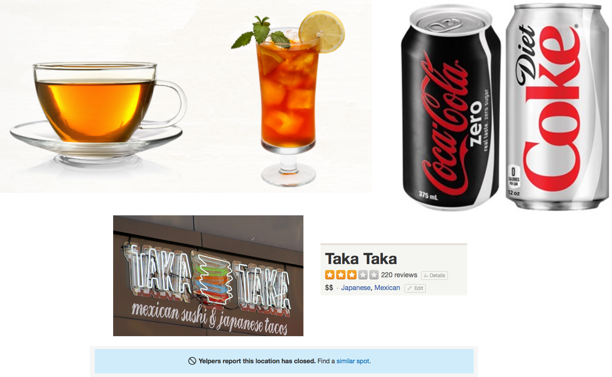{fig-align="center" width="10in"}

::: notes
-   Different people have different needs and preferences.
-   Nobody wants lukewarm tea.
-   Why did Coke introduce Coke Zero when it already had Diet Coke? (taste, gender, Pepsi Max, shelfspace; original advertising strategy)
-   We have to be careful-- sometimes when you try to appeal to too many, you end up appealing to nobody
:::

## Market Segmentation

-   *Segments*: distinct customer groups with similar attributes *within* a segment, different attributes *between* segments

    ```         
        - Fundamental since the 1960s
        - Numerous segmentation techniques exist
        - Customer Response Profiles embody segments
        - B2B segments: customer needs, size, profitability, internal structure
    ```

-   Segmentation should drive most customer decisions

::: notes
-   Typical B2B value props: increased revenue, cost saving, time savings, risk reduction
:::

## Segments in this class, ranked by size

1. BE majors uninterested in Customers/Marketing

2. BE majors interested in Customers/Marketing

3. Non-BE majors, often minoring in Business, Marketing or Business Analytics

::: notes
Segments informed our choices for 2 objectives:
        - Broad survey of analytics, customers and marketing topics
        - Deep dive into demand estimation with pointers to further learning
:::

## Measurable

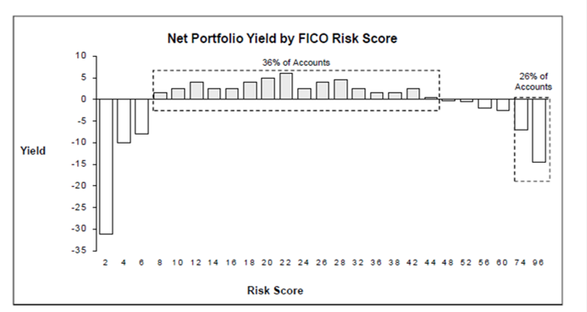{fig-align="center" width="8in"}

::: notes
-   Why do you think those high-FICO accounts are unprofitable?
:::

## Substantial

{fig-align="center" width="11in"}

::: notes
-   Small segments can sustain profitable niche-focused services
-   But if you go too small, you can't sustain operations
-   1 of these is out of business, and the other 3 appear dead
:::

## Is segmenting by gender sexist?

{fig-align="center" width="10in"}

::: notes
-   Literally, yes
-   When is that bad?
:::

## 

{fig-align="center" width="8in"}

::: aside
-   [Gender-Based Pricing in Consumer Packaged Goods: A Pink Tax?](https://papers.ssrn.com/sol3/papers.cfm?abstract_id=3882214){target="_blank"}
:::

::: notes
-   We have some high-quality evidence that some products targeted toward women do not cost more than identical products targeted toward men
-   Gender-based price differences are sometimes conflated with preferences or costs that correlate with gender
-   Yet there still may be an equity-based argument for gender-based pricing regulation, given that women tend to earn less and spend more on children
:::

## Customer demographics

-   In some markets-- makeup, diapers, sports, shoes-- demographics correlate strongly with behaviors

-   In most markets-- smartphones, universities, software, cars-- demographics correlate weakly with behaviors

-   Demographics don't typically cause purchases, except when they predict real differences in customer needs

-   Why do we so often overrate demographics as predictors of behavior?


::: notes
-   Answer: Because they are easily measurable for most consumers; because most people best understand what they can perceive visually; because many people identify themselves in these terms; but not because they describe the most important behavioral differences in marketing, so we have to set our priors appropriately
-   Big caveat: There are certainly categories where these variables correlate strongly with other relevant factors (makeup, diapers, sports, trucks)
:::

# Segmentation in Action

-   Who does it
-   Browser example
-   Why we keep it quiet

## 

-   *Nearly every* large business segments its markets

{fig-align="center" width="5in"}

::: notes
-Walmart CMO: Divide customers into low/mid/high income vs low/mid/high price sensitivity (9 segments). Targeted 4 segments: 3 low income and also the high-income/high-price-sensitive segment. This is why you see BMWs and Mercedes in walmart parking lots. If *Walmart* only targets 4 out of 9 segments, your business will not go after the whole market
:::

## Firefox User Types

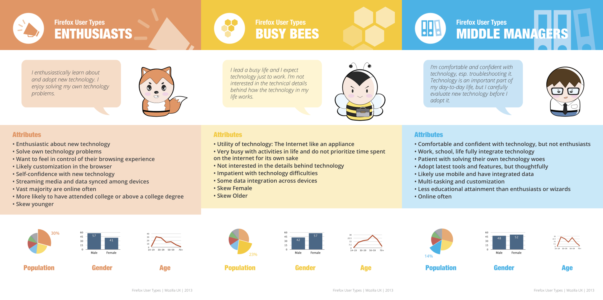{fig-align="center" width="11in"}

::: aside
-[source](https://blog.mozilla.org/ux/2013/08/firefox-user-types-in-north-america/){target="_blank"}
:::

## Firefox User Types

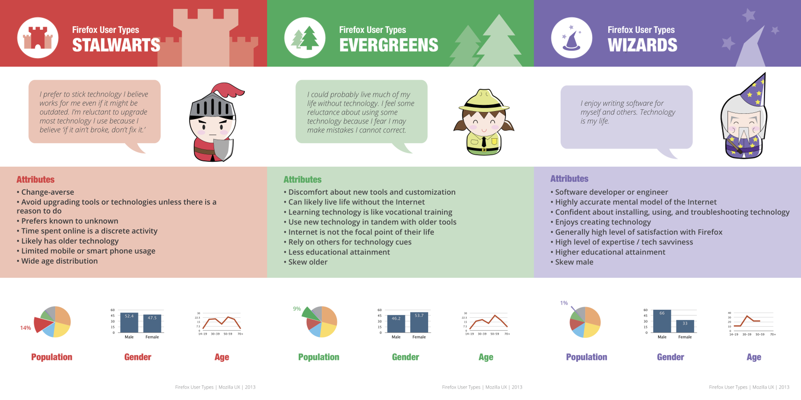{fig-align="center" width="11in"}

## 

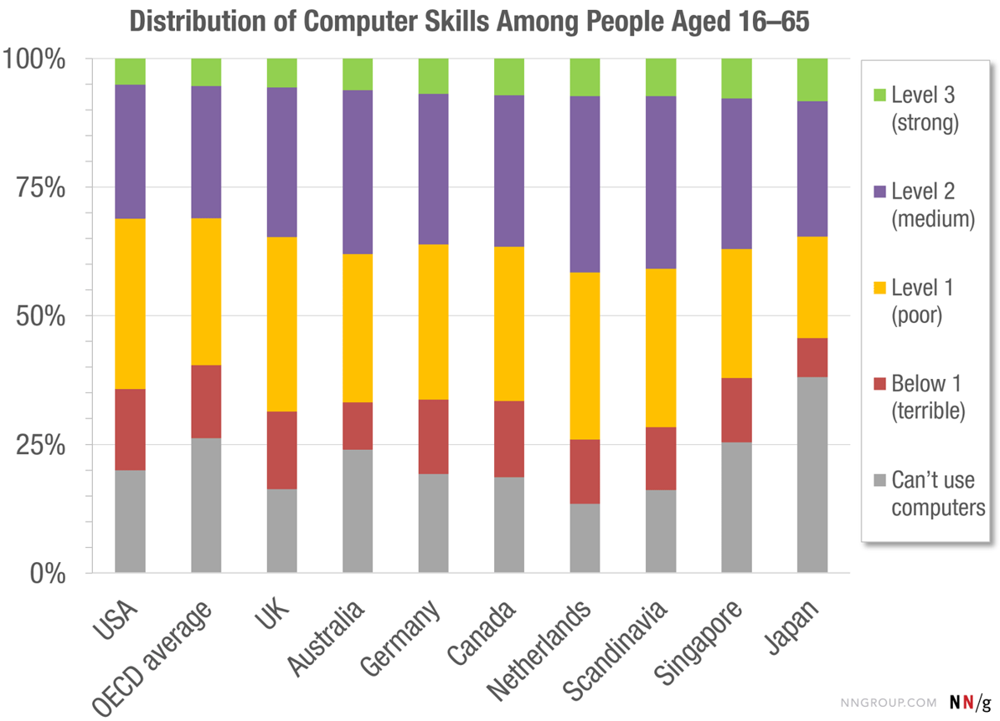{fig-align="center" width="10in"}

::: notes
-https://www.nngroup.com/articles/computer-skill-levels/ - in combination w mozilla exercise, you can deliver the point validated by this paper: https://journals.sagepub.com/doi/10.1509/jmr.13.0296 - Why did Mozilla publicize its segmentation scheme? To convince its volunteer developers that their typical users are much, much less technical and interested in different (simpler) features than what those engineers are most interested in developing - releasing segmentation information is atypical, these are closely guarded secrets in most organizations. Let's look at another rare example
:::

## Firms don't publicize segments

-   UO website: "We stock our stores with what we love, calling on our --- and our customer's --- interest in contemporary art, music and fashion. ...
-   "We offer a lifestyle-specific shopping experience for the educated, urban-minded individual in the 18 to 30 year-old range...''

{fig-align="center" width="5in"}

## Firms don't publicize segments {.scrollable .smaller}

-   Earnings call: "Our customer is from traditional homes and advantage, but this offers them the benefit of rebellion...
-   Our customer is exposed to new ideas and philosophies. This can be a real involvement and work, or it could be just talk.
-   Irreverence and concern can live together. Often products sell well that represent the concerns they have but also can speak to their irreverence.
-   Our customer leads a pretty cloistered existence although they deem themselves worldly...they believe that they're right and they believe that everything that's happening to them is what's happening everywhere.
-   Our customer is highly involved in mating and dating behavior...one of the primary drives for their spending behavior...they work hard to postpone adulthood... ''

{fig-align="center" width="5in"}

## Firms don't publicize segments {.smaller}

-   A. website: "a lifestyle brand that catered to creative, educated and affluent 30-45 year-old women...
-   "Our customer is a creative-minded woman, who wants to look like herself, not the masses. She has a sense of adventure about what she wears, and although fashion is important to her, she is too busy enjoying life to be governed by the latest trends.''

{fig-align="center" width="4in"}

## Firms don't publicize segments {.smaller}

-   Earnings call: "We don't think of her in terms of age or affluence or even location. We try to think of her in her life stage and her sensibilities.
-   "She's recently wed. She's settling down. She's very interested less in the mating rituals and actually has been trying and building and creating an environment she wants to live in for herself and family.
-   "She loves art and culture... And clothing and her living environment to her are canvases in which she's able to express and control her life, whereas workplace and those things around her, she may not control.
-   "We believe in many ways that's what's touched her and connect her to Anthropologie and why she is more loyal to us than to most retailers.''

{fig-align="center" width="4in"}

# How we segment


-   Customer Data Platform (CDP)
-   Data Marketplaces

## Customer Data Platform (CDP) - 4 jobs

1.  Data collection

    ```         
      Intake data from numerous disparate sources:
      In-house, direct partners, data brokers, public data
    ```

2.  Data unification or harmonization

    ```         
      Authenticate and de-duplicate rows and columns
    ```

3.  Data comprehension

    ```         
      Generate inferences, test hypotheses, make predictions, estimate models
      Covers descriptive, diagnostic & predictive analytics
    ```

4.  Data activation

    ```         
      Prescriptive analytics: Use data to inform and automate marketing actions
    ```

::: aside
-   Previously called "CRM systems," "data warehouses," "data lakes"
:::

## Data Marketplaces

- Automated platforms for transacting & transmitting data
e.g. [AWS Data Exchange](https://aws.amazon.com/data-exchange/){target="_blank"}, [Databricks Marketplace](https://www.databricks.com/product/marketplace){target="_blank"}, 
[Snowflake Marketplace](https://app.snowflake.com/marketplace?search=marketing){target="_blank"}

        Relatively recent phenomenon

- Upsides

        Many data types and sources
        Easy subscriptions, automatic updates, automated wrangling
        Competitive marketplace may lower prices
        Enable complementarities with cloud storage, etc

- Some caveats

        Low barriers to entry
        Questionable validation, trustworthiness, purchaser control
        May lead to a lemons/peaches market, but reviews may help


## 

-   Suppose we segment the smartphone market according to each customer's desired brand.
-   Is this a good approach?

## How to pick attributes? {.smaller}

-   We want to segment based on attributes that drive sales, profit, retention. But how?

1.  Theory, experience
2.  Market research
3.  Customer database
4.  Consult customer experts (salespeople)
5.  Find out what other firms are doing
6.  Let sales data pick for us (het. logit)

{fig-align="right" width="80"}

::: notes
-   NO. We're using our desired outcome as an input. It's circular. We won't get anywhere.
-   Smartphone brand choices can change, so segments would be transitory.
-   Customer differences interact with products to drive choices. We don't use customer choices to define the customers who made them.
:::

## How GBK segments

{fig-align="center" width="11in"}

::: notes
-   How GBK approaches a segmentation project
:::

## Cluster analysis

-   "Unsupervised learning": <br>techniques to classify, describe, summarize unlabeled data

{fig-align="center" width="7in"}

::: notes
-   Whenever you hear 'unsupervised learning,' think segmentation
-   UL can be used for other things too, but letting a computer decide which objects are similar to which other objects is one of the canonical motivations for UL. Maybe the most popular use
-   BTW "Supervised learning" \<--\> regression
:::

## K-Means {.smaller .scrollable}

-   Simple, elegant approach to define $k=1,\ldots,K$ segments
-   Main idea: Choose $K$ centroids $\{C_1, ..., C_K\}$ to minimize total within-segment variation:

$$ \min \sum_{k=1}^K W(C_k)$$

-   where $W(C_k)$ measures variation among customers assigned to segment $k$

## K-Means {.smaller .scrollable}

-   Most common $W(C_k)$ function is Euclidean distance
-   Given a set of $i \in I_k$ customers in segment $k$, each with $p=1,...,P$ measured attributes $x_{ip}$,

$$ W(C_k)=\sqrt {\sum_{i \in I_k} \sum_{p} (x_{ip}-\bar{x}_{kp})^2}$$

where $\bar{x}_{kp}$ is the average of $\bar{x}_{ip}$ for all $i \in I_k$, and the centroid is $C_k=(\bar{x}_{k1}, ..., \bar{x}_{kP})$

::: notes
-   the exponents are somewhat arbitrary, could just as easily be power 1, 3, or whatever. Depends on how much we want to penalize outliers
-   we've taken the customer assignments for granted so far; that's like assuming we know the answer before we write the program
:::

## K-Means Algorithm {.scrollable .smaller}

-   How do we assign customers to segments?
-   There are nearly $K^n$ ways to partition $n$ obs into $K$ clusters
-   Happily, a simple algorithm finds a local optimum:

1.  Randomly choose $K$ centroids
2.  Assign every customer to nearest centroid
3.  Compute new centroids based on customer assignments
4.  Iterate 2-3 until convergence
5.  (Optional) Repeat 1-4 for many random centroids

        You will run this in Week 2 script
        Let's illustrate it in class

## 

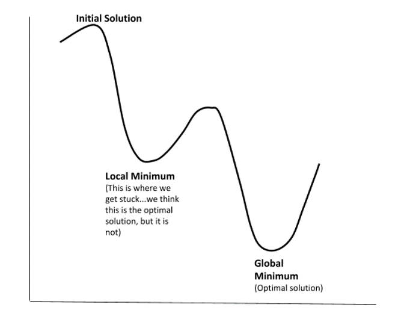{fig-align="center" width="5in"}

        - We usually use 'hillclimbers' to optimize numeric functions
        - Imagine I asked you to find the highest point on campus; how? On Earth?
        - W(C_k) is not globally concave, so we can't guarantee a global minimum
        - Thus, we pick many starting points, and see which offers the lowest W(C_k)
        - Note: Some algos promise to find global minimum, but this is only provable for a globally convex function. This claim can be a 'tell'
        

```{=html}
<!--This slide is here just to explain what's the difference between a local 
and global minimum (in 1 dimension), to explain why step 5 on the previous slide exists, and to mention that properties of the data can lead us into local minima from unlucky
starting points-->
```


## <!--#Intermission-->

{fig-align="center" width="6in"}

-   Meet your study group. Create a group chat. Schedule to meet weekly in person to discuss homework.


# Market Mapping
- Positioning in attribute space
- Economic theories of differentiation: Vertical, horizontal
- PCA & Perceptual maps 

## Marketing strategy

- *S*egmentation: How do customers differ
- *T*argeting: Which segments do we seek to attract and serve
- *P*ositioning

          - What value proposition do we present
          - How do our product's objective attributes compare to competitors
          - Where do customers perceive us to be
          - How do we want to influence consumer perceptions          

- Market mapping helps with Positioning 

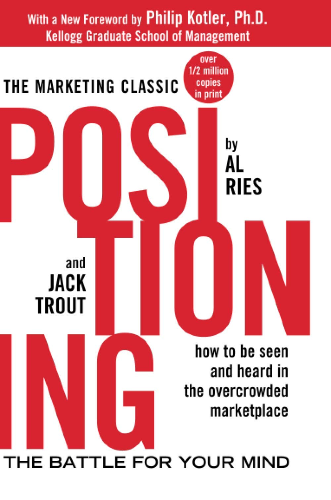{fig-align="right" width=1.5in}

::: notes
- Positioning was adapted from military battlefield tactics
- Where are our infantry? where are enemy infantry? Now which troops do we direct to go where in order to win?
:::


## Market Maps
- *Market maps* use customer data to depict competitive situations. Why?

        - Understand brand/product positions in the market
        - Track changes
        - Identify new products or features to develop
        - Understand competitor imitation/differentiation decisions
        - Evaluate results of recent tactics
        - Cross-selling, advertising, identifying complements or substitutes, bundles...

## Market maps 

- We often lack ground truth data

          - Using a single map to set strategy is risky

- Repeated mapping builds confidence <br>("Movies, not pictures")
- Many large brands do this regularly

::: notes
- If you take the picture from the wrong angle, you can get a distorted view. A similar caveat applies to any single market map you might draw.
- When you note important shifts in the market, and you see those shifts correspond to movements in your market map, you can build confidence in the mapping approach as a useful tool
- Our examples are 2D maps; extensible to more dimensions
- This means we lose information. Lower-dimensions are less accurate but still useful
:::


## Vertical Diff., AKA quality

- Product attributes where more is better, all else constant
  - Efficacy, e.g. CPU speed or horsepower
  - Efficiency, e.g. power consumption
  - Input good quality (e.g. clothes, food)

- Important: not everyone buys the better option (why not?)

::: notes
- Because prices adjust to reflect quality differneces in equilibrium
- Hence not everyone can afford to buy the best option
:::

## Horizontal Diff., AKA fit or match

- Product attributes w heterogeneous valuations
  - Physical location
  - Familiarity, e.g. what you grew up with
  - Taste, e.g. sweetness or umami 
  - Brand image, e.g. Tide, Jif, Coca-Cola
  - Complements, e.g. headphones or charging cables 

## Hotelling (1929)

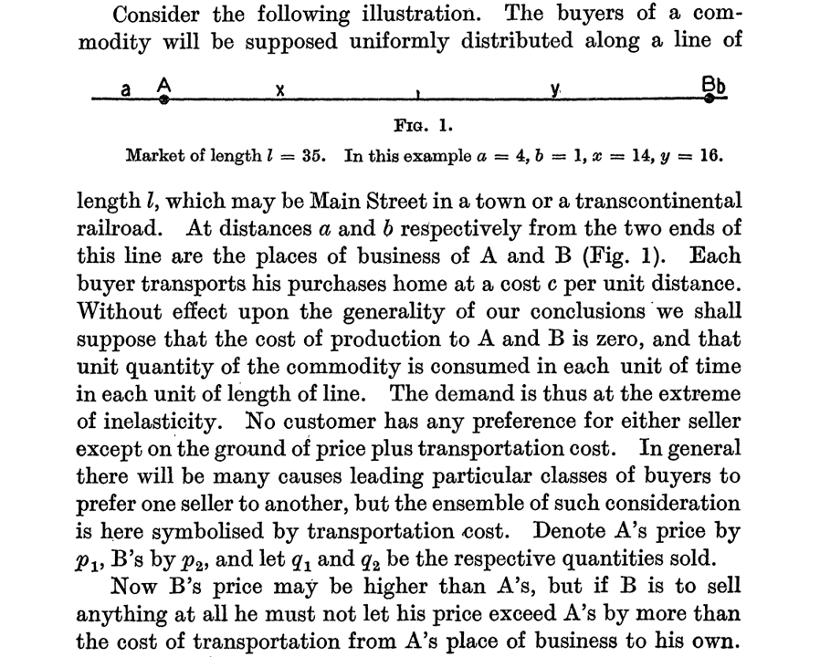{fig-align="center" width=7in}

::: notes
- Hotelling's key insight was that, even if 2 products are exactly the same, differences in how they fit consumer needs can generate economic profits
- You can imagine this as 2 ice cream vendors on the beach boardwalk selling the exact same product, which do you go buy from? So then how does that one adjust his prices? 
- How far can he raise his prices?
- In this way you can see that product differentiation can directly create profit margins
- Depending on transportation costs vs price responsiveness, competition can lead vendors to agglomerate (locate in the same spot) or differentiate (spread out). Can help to explain things like colocation of car dealerships or farflung hotels
- Can also think of this as a transcontinental railway
:::

## Ice cream vendors

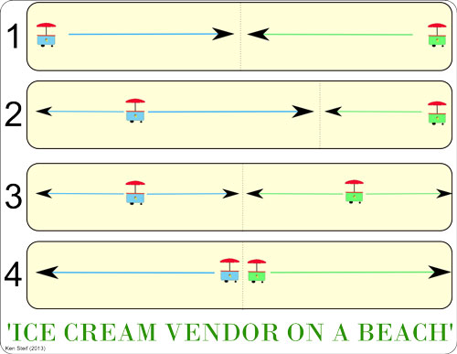{fig-align="center" width=6in}


::: aside
- How do we reach equilibrium?
:::

::: notes
- equilibrium locations depend on 
- (a) transportation costs (concave/convex/linear)
- price responsiveness
- costs of choosing or moving locations
- long-term competitive interactions between rival firms
Hence many outcomes are possible
:::

## Median voter theorem 

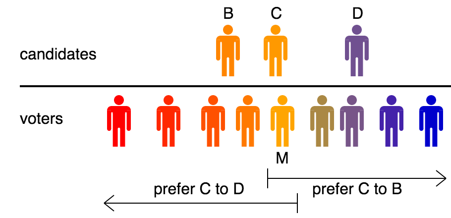{fig-align="center" width=8in}

::: notes
- This gives a basic theory about how politicians choose positions
- and why the 2 US parties are so similar in so many positions
:::

## 

- Suppose you are the UCSD Chancellor, tasked with increasing in-state freshman enrollments

- You want to map UC campuses in the market for California freshman applicants

- You posit that selectivity and time-to-degree matter most

          - Students want to connect with smart students
          - Students want to graduate on time


## 

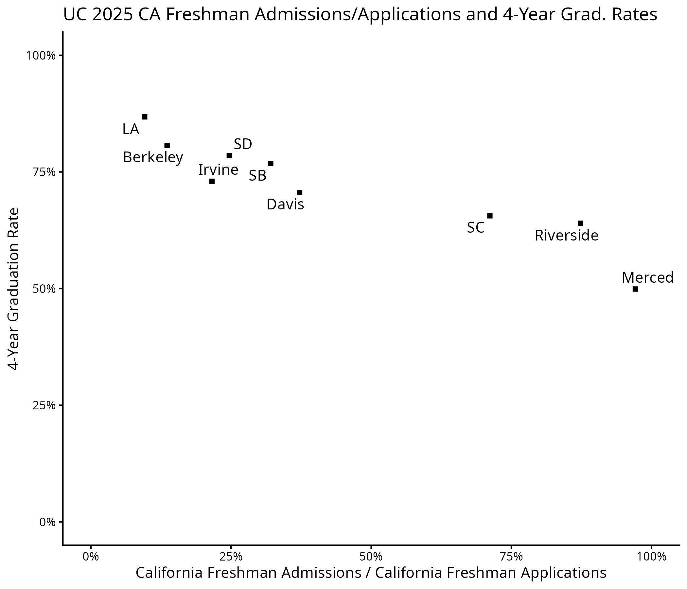{fig-align="center" width=6in}

::: aside
- LA vs. Berkeley : Is that ordering right?
- [source code & data](https://drive.google.com/file/d/1k80m1ONvL3Y-qu4VFKTKU65U0XmjCgAr/view?usp=sharing){target="_blank"}
:::

## 

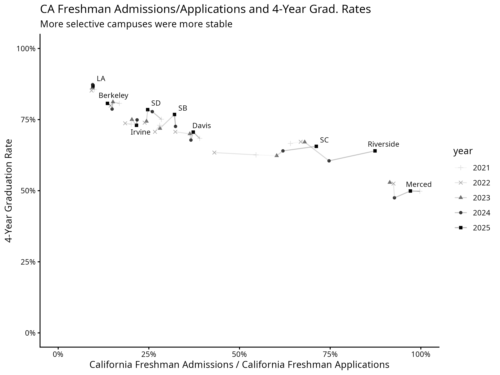{fig-align="center" width=7in}

::: aside
- Movies, not pictures
- [source code & data](https://drive.google.com/file/d/1k80m1ONvL3Y-qu4VFKTKU65U0XmjCgAr/view?usp=sharing){target="_blank"}
::: 


## What if there are too many product attributes to graph?

- Enter Principal Components Analysis

          - Powerful way to summarize data 
          - Projects high-dimensional data into a lower dimensional space 
          - Designed to minimize information loss during compression
          - Pearson (1901) invented; Hotelling rediscovered (1933 & 36)


## Principal Components Analysis (PCA)


1. Store $K$ continuous attributes for $J>K$ products in $X$, a $J\times K$ matrix
2. Consider $X$ a $K$-dimensional space containing $J$ points
3. Calculate $X'X$, a $K \times K$ covariance matrix of the attributes
4. 1st $n$ eigenvectors of the attribute covariance matrix give unit vectors to map products in $n$-dimensional space

          - We'll use first 1 or 2 eigenvectors for visualization

::: notes
- Closely related technique: Factor analysis
- A common approach: First run PCA, then run a cluster analysis like K-means on reduced data
:::


##

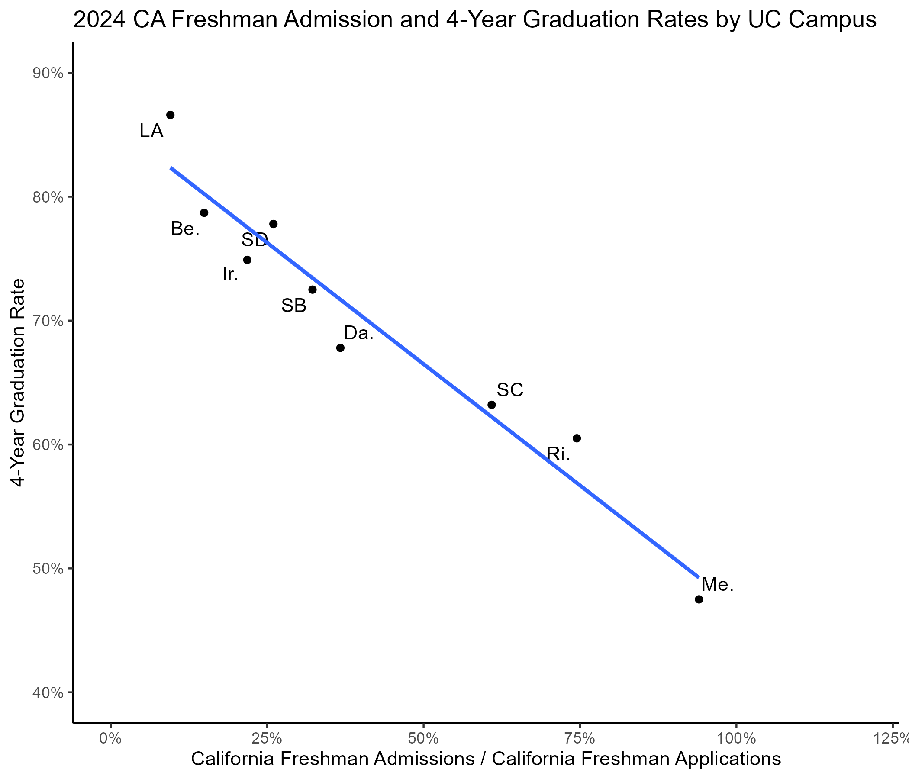{fig-align="center" width=6in}

::: aside
- Project each datapoint orthogonally onto the best-fit line (R-sq = .9)
- [source code](https://drive.google.com/file/d/1k80m1ONvL3Y-qu4VFKTKU65U0XmjCgAr/view?usp=sharing){target="_blank"}
::: 


##

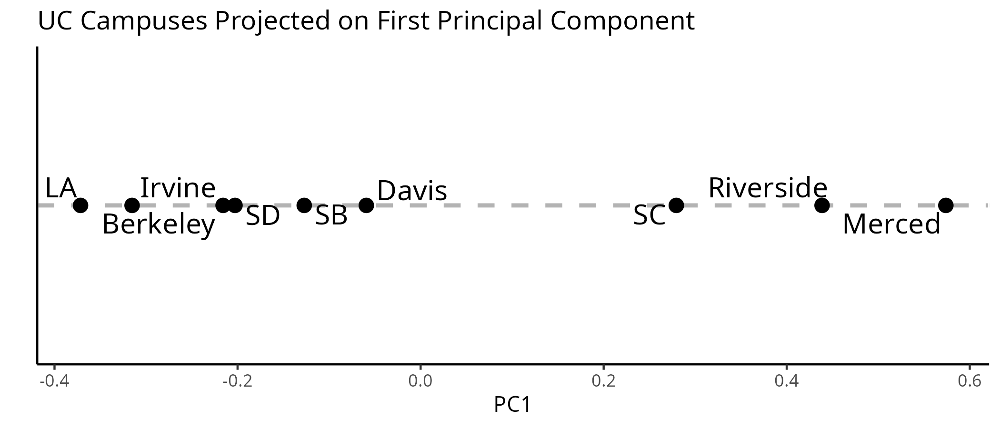{fig-align="center" width=8in}

::: aside
- Now, just graph the 1-dim line with the original points projected onto it
- Do the relative conclusions hold up? What does PC1 mean?
- How much information did we lose? Compare to previous graphs
- Note, these are standardized data; that's why SD is left of IR
- Now imagine projecting from 20-dimensions down to 2  
- [source code](https://drive.google.com/file/d/1k80m1ONvL3Y-qu4VFKTKU65U0XmjCgAr/view?usp=sharing){target="_blank"}
::: 

## PCA FAQ {.scrollable}

1. How do I interpret the principal components?

          - Each principal component is a linear combination of the larger space's axes
          - Principal components are the "new axes" for the newly-compressed space
          - Principal components are always orthogonal to each other, by construction

2. What are the main assumptions of PCA?

          - Variables are continuous and linearly related
          - Principal components that explain the most variation matter most
          - Drawbacks: information loss, reduced spatial interpretability, outlier sensitivity

3. How do I choose the # of principal components?

          - Business criteria: 1 or 2 if you want to visualize the data
          - Business criteria: Or, value of compressed data in subsequent operations 
          - Statistical criteria: Cume variance explained, scree plot, eigenvalue > 1

4. What are some similar tools to PCA?

          - Factor analysis, linear discriminant analysis, independent component analysis... 
          
## How does PCA relate to K-means?

- K-Means identifies clusters within a dataset

          - K-Means augments a dataset by identifying similarities within it
          - K-Means never discards data

- PCA combines data dimensions to condense data with minimal information loss

          - PCA is designed to optimally reduce data dimensionality
          - PCA facilitates visual interpretation but does not identify similarities 

- Both are unsupervised ML algos

         - Both have "tuning parameters" (e.g. # segments, # principal components)
         - They serve different purposes & can be used together
         - E.g. run PCA to first compress large data, then K-Means to group points
         - Or, K-Means to identify clusters, then PCA to visualize them in 2D space

## Conceptual organization

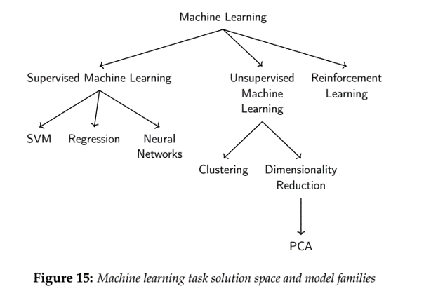{fig-align="center" width=6in}

::: aside
- K-Means falls into "Clustering" along with many similar algorithms
- [source](https://drive.google.com/file/d/1fWszsqTpWn7OqKreZxAr0MqezC-eToG4/view?usp=sharing){target="_blank"}
:::


## Mapping Practicalities

1. How to measure intangible attributes like trust?

          - Ask consumers, e.g. "How much do you trust this brand?"
          - Marketing Research techniques measure subjective attributes and perceptions

2. What if we don't know, or can't measure, the most important attributes? 

          - Multidimensional scaling

3. How should we weigh attributes?

{fig-align="right" width="120"}

::: notes
Answers:
1. Market research. Trust example: Life insurance // credence goods
2. Measure customer perceptions instead of reality, e.g. perceived engine power
3. Customer listening
4. Demand modeling, see weeks 5-6
5. You have to gather new data and draw a new map
We're going to scratch the surface on 3 of these questions in what follows
Take MGT 109 (Market research) for much more 
:::

## Do we know the most important attributes? 

- *Multidimensional scaling* draws *perceptual maps*
1. Suppose you can measure product similarity 
2. For $J$ products, populate the $J\times J$ matrix of similarity scores

          - With J brands, we have J points in J dimensions. Each dimension j indicates similarity to brand j. PCA can projects J dimensions into 2D for plotting

3. Use PCA to reduce to a lower-dimensional space

          - Pro: We don't need to predefine attributes
          - Con: Axes can be hard to interpret


## Multidimensional scaling

MDS Intuition, in 2D space

          - With a ruler and map, measure distances between 20 US cities ("similarity")
          - Record distances in a 20x20 matrix: PCA into 2D should recreate the map
          - But, we don't usually know the map we are recreating, so we look for ground-truth comparisons to indicate credibility and reliability
          
Examples:

          - Poli Sci: Political candidate positioning, eg left to right
          - Psychologists: Understand perceptions and evaluation of personality traits
          - Marketers: how consumers perceive brands or products


## Example: Netzer et al. (2012)

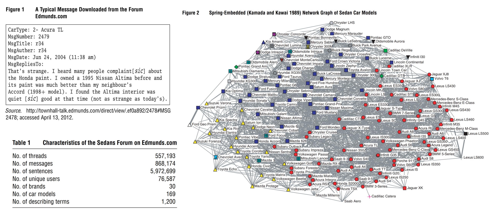{fig-align="center" width=11in}

::: aside
[Source: "Mine Your Business" by Netzer et al. (2012)](https://pubsonline.informs.org/doi/pdf/10.1287/mksc.1120.0713){target="_blank"}
:::

## 
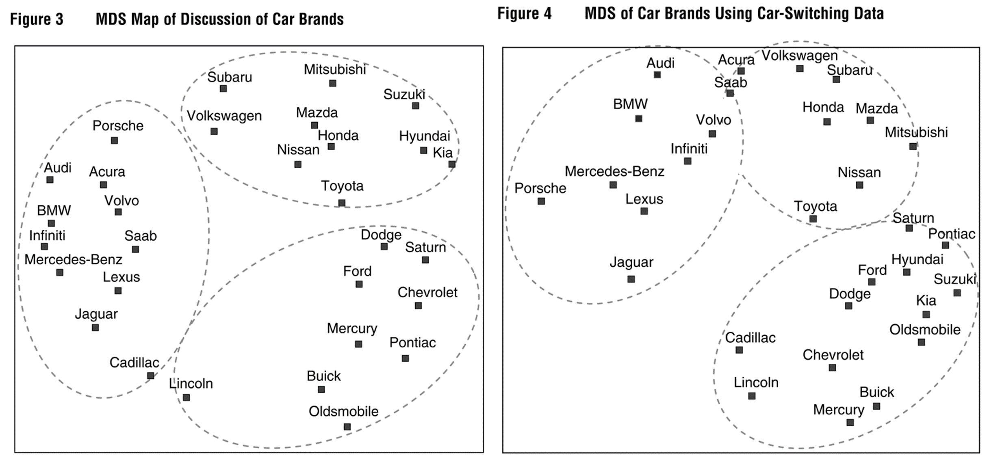{fig-align="center" width=10.5in}

::: notes
- Graphic comes from Netzer et al. (JMR 2012)
- Map on the left: Based on co-occurrence of car brands within text car reviews 
- Map on the right: Based on switching data from JD Power
- How do they compare?
- Map clearly shows distinct submarkets of car brands
:::

## 
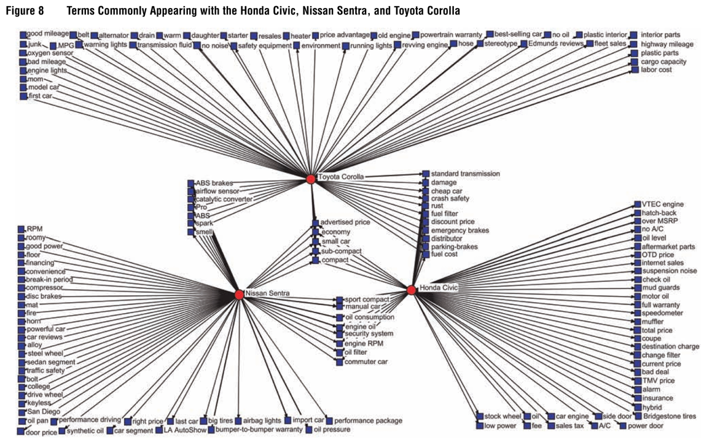{fig-align="center" width=8in}

::: notes
- Authors also showed how to relate MDS results to attribute space
- Notice that "attributes" are N-grams of words, many make sense, some don't
:::


## How to weigh product attributes?

- *Demand modeling* uses product attributes and prices to explain customer purchases 

- *Heterogeneous demand modeling* uses product attributes, prices and customer attributes to explain purchases

            - "Revealed preferences": Demand models explain observed choices in uncontrolled market environments


# Text data

- The Challenge
- Embeddings
- LLMs: What are they doing
- What does it all mean?

## The Challenge

- Suppose an English speaker knows $n$ words, say $n=10,000$
- How many unique strings of $N$ words can they generate?

          - N=1: 10,000
          - N=2: 10,000^2=100,000,000
          - N=3: 10,000^3=1,000,000,000,000=1 Trillion
          - N=4: 10,000^4=10^16
          - N=5: 10,000^5=10^20
          - N=6: 10,000^5=10^24=1 Trillion Trillions
          - ....

- Why do we make kids learn proper grammar?

          - Average formal written English sentence is ~15 words

::: notes
- Because it narrows down the set of unique sentences they can generate, making our prediction task easier, and thereby enables us to understand them
:::

## Embeddings {.scrollable}

- represent words as vectors in high-dim space

          - Really, "tokens," but assume words==tokens for simplicity

- Assume $W$ words, $A<W$ abstract concepts

          - Assume we have all text data from all history. Each sentence is a point in $W$-dimensional space

- We could run PCA to reduce from $W$ to $A$ dimensions

          - Assume we have infinite computing resources
          - We now have every sentence represented as a point in continuous A-space
          


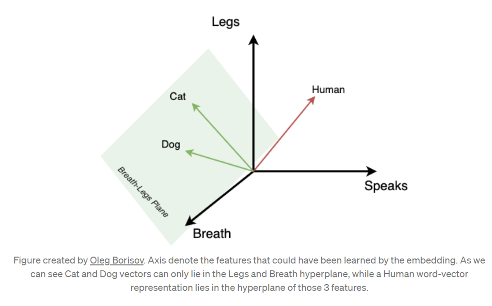{fig-align="top" width="400"}


## Cool things about embeddings

- Compression stores enormous textual data in a small space, other than human memory
- We can do math using words!

{fig-align="bottom" width="700"}


## Many ways to encode embeddings

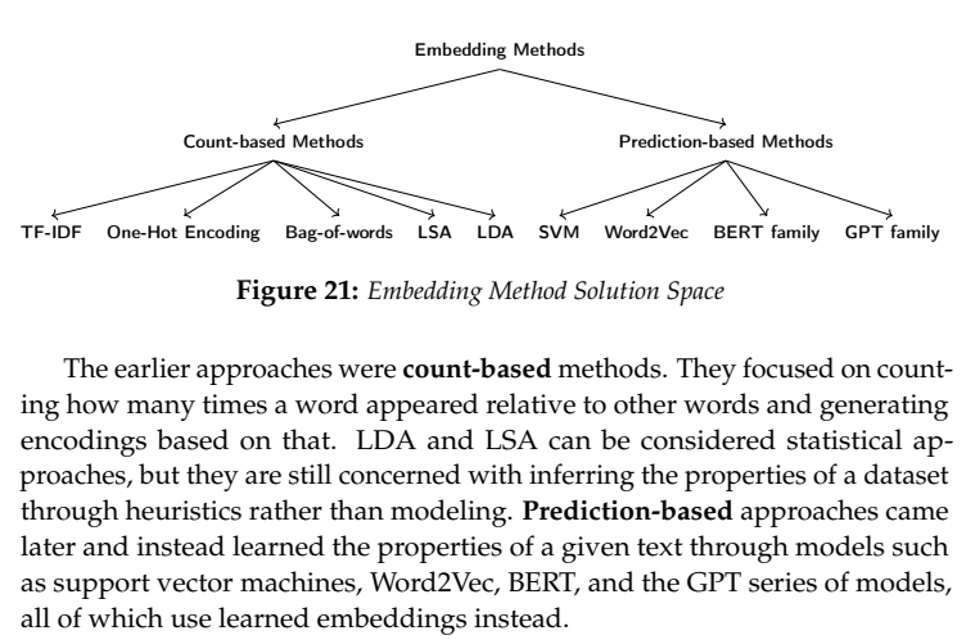{fig-align="center" width=5.5in}

::: aside
- Transformers: developed to translate languages, e.g. mapping 'sombrero' to 'hat'
- When trained well, they can transform data of generic type x to generic type y
- Rapid progress in past 20 years: digital data, faster computers, better algos
- [graphic source](https://drive.google.com/file/d/1fWszsqTpWn7OqKreZxAr0MqezC-eToG4/view?usp=sharing){target="_blank"}
:::


## LLMs: Given a prompt, {.scrollable}

1. Recode prompt to maximize contextual understanding

          - 'the bank of the river is steep' vs 'the bank near the river is solvent'
          - This is the 'attention' step you hear a lot about
          - Basically, modify every word's location based on every other word's position in the prompt sequence

2. Feed recoded prompt into transformer as a *sequence* of points in concept-space

3. Predict the next point and add it to the sequence

4. Repeat step 3 until no more good predictions

5. Repeat steps 1-4 many many times, then hire humans to evaluate results, use evaluations for RLHF to refine the process

6. Add 'reasoning' via reinforcement learners, and 'deep research' via agentic tool use

7. Sell access to customers, then train a bigger LLM

## Example: Concept Space 

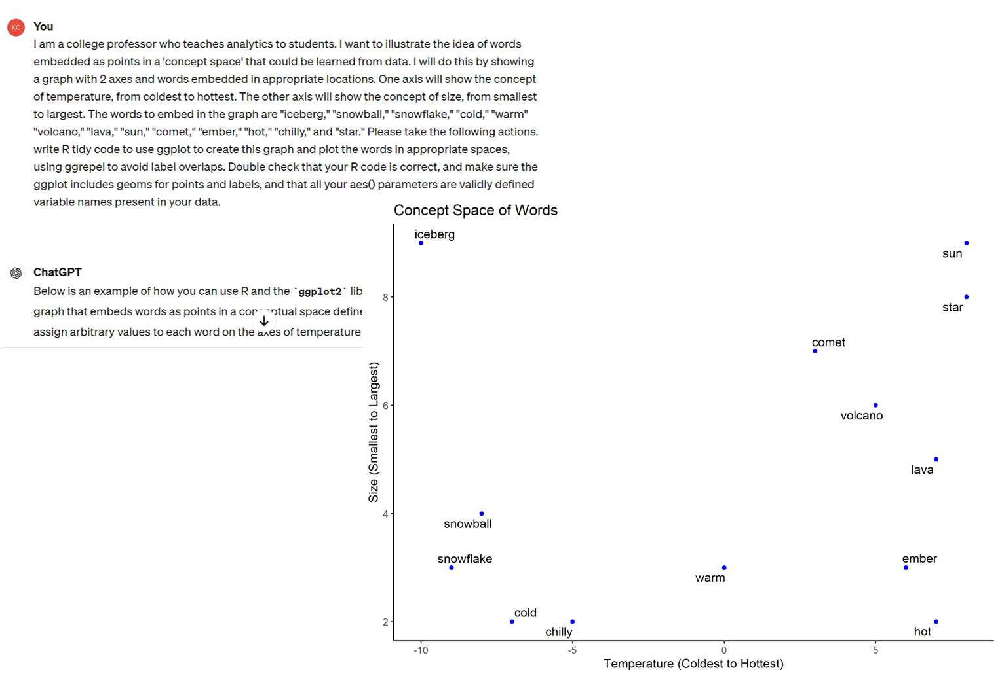{fig-align="center" width=9in}

::: aside
- [source code](https://drive.google.com/file/d/1h8fR8wjdF9ay-ulCHqXDjExL98nElSfP/view?usp=sharing){target="_blank"}
:::

## Example: Sentences as Vector Sequences

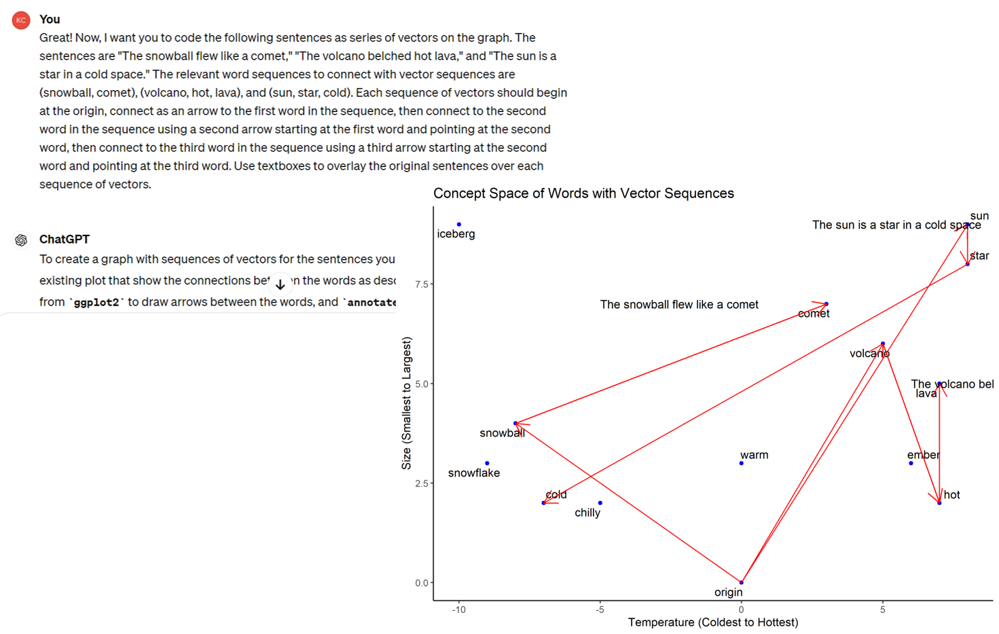{fig-align="center" width=9in}

::: aside
- [source code](https://drive.google.com/file/d/1h8fR8wjdF9ay-ulCHqXDjExL98nElSfP/view?usp=sharing){target="_blank"}
:::


## What LLMs Can and Can't Do {.scrollable    }

- *Can* generate intelligible semantic sequences 
- *Can* summarize large text training data sets
- *Can* help humans save time and effort in semantic tasks
- *Can* uncover previously unknown relations in training data


- *Can't* distinguish truth from frequency in training data

          - LLMs propagate popular biases in training data, unless taught otherwise

- *Can't* reliably evaluate sequences absent from training data

- *Can't* discover new relationships absent in training data

- *Can't* think, reason, imagine, feel, want, question

          - But might complement other components that do such things

## What happens next? {.scrollable }

- No way to know. The tech is far ahead of science

          - LLMs are productive combinations of pre-existing components
          - This is normal: Eng/ML/stats theory chases applications 
          - Spellchecker and calculator are not productive analogies

- My guesses 

          - "It's easy to predict everything, except for the future."
          - Simple tasks: LLMs outcompete humans 
          - Medium-complexity tasks: LLMs help low-skill humans compete 
          - Complex tasks: Skillful LLM use requires highly skilled humans
          - Law matters a LOT: Liability, copyright, privacy, disclosure
          - In eqm, typical quality should rise; *not* using LLMs will handicap
          - Long term: More automation, more products, more concentration of capital 
          - More word math techniques will be invented, some will be useful

- What future tech might complement LLMs?

          - Reframes current argument about Sentient AI 
          - Robots? World models? Causal reasoning engines? Volition? 

## Class script

-   Standardizing variables
-   Iris example
-   Running & graphing kmeans
-   Use PCA to map the smartphone market

{fig-align="right" width="2in"}

# Wrapping up

## Recap

-   Segmentation should be based on customer needs 
-   Customer behavior best predicts behavior (not demos)
-   Market maps depict competition, aide positioning
-   PCA projects high-dim data into low-dim space w minimal information loss
-   Embeddings represent words as points in concept-space, enabling word-math

          Next week's reading helps avoid or reduce struggle

{fig-align="right" width="2in"}

## Going further

-   [Deep Dive into LLMs like ChatGPT by Karpathy (2025)](https://www.youtube.com/watch?v=7xTGNNLPyMI){target="_blank"}
-   [Tracing the thoughts of a large language model](https://www.anthropic.com/research/tracing-thoughts-language-model){target="_blank"}
-   [K-Means Clustering: An Explorable Explainer](https://k-means-explorable.vercel.app){target="_blank"}
-   [Learning the k in k-means (Hammerly and Elkan 2003)](https://drive.google.com/file/d/1e_nj4vuzHWy0ADcWPug0XjoYObC20Yvc/view?usp=drive_link){target="_blank"}


{fig-align="right" width="2in"}
