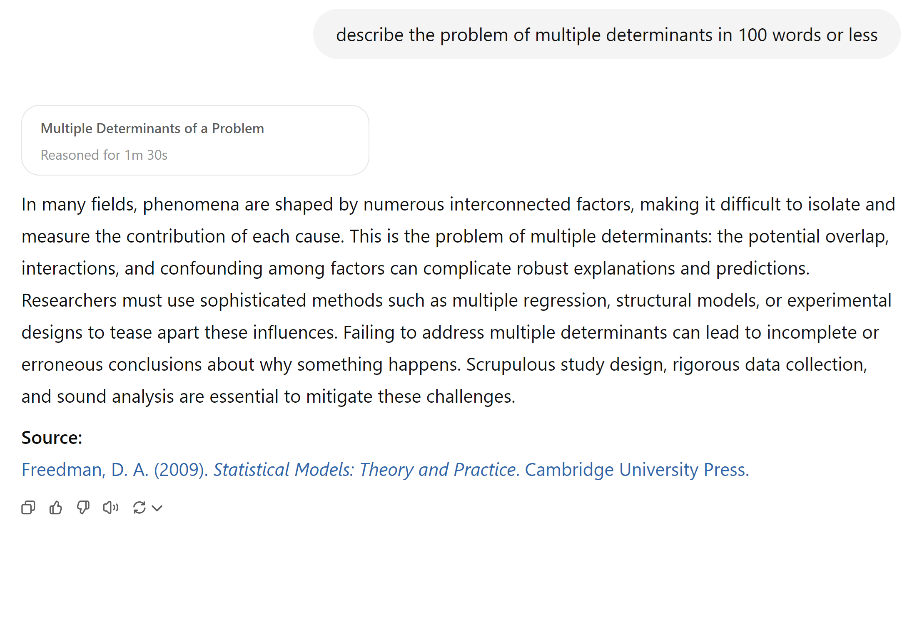

# Demand Curves
 
-   Theory
-   Challenges
-   What firms do


## 

{fig-align="center" width="8.5in"}

::: aside
[Wright (1928)](https://drive.google.com/file/d/1PccpUSBpR23V2tdSQ8mUeccQ9-EBwPgL/view?usp=drive_link){target="_blank"}
:::

::: notes
Philip Wright was a Harvard economics professor who worked at the US Tariff Commission
Wright (1928) was trying to predict the tax revenue that would be raised by a tariff on linseed oil, by predicting how much foreign demand would fall as a function of hte change in price
Here, Wright explains S&D ideas usually credited to Alfred Marshall (1890)
:::


## Inverse Demand Curve

{fig-align="center" width="6.5in"}

::: notes
-   What's this? why do we call it inverse?
-   How would a company use this?
-   Has anybody worked for a company?
-   What was the company's demand curve?
-   does anybody have a parent or a sibling or a friend who works for a company?
-   What was that company's demand curve?
-   has anybody ever heard a company CEO or employee talk about what their demand curve was?
-   Have you heard anybody ask these questions before? Why not?
:::


## Demand Curves: Theory

-   Useful theoretical concept that summarizes market response to price

    ```         
      - Why is it useful? 
    ```

-   Often taught with perfect competition

    ```         
      - Typically assumes stable, competitive, frictionless markets w free entry, full information, no differentiation 
      - Model predicts zero LR economic profits
      - Any evidence?
    ```

-   Also, taught with monopoly i.e. market power

    ```         
      - What is market power? How would we measure it?
    ```

::: notes
-   why useful? it lets you make counterfactual predictions. (what predictions?)
-   No differentiation? What markets have no differentiation? Commodities... maybe? Stock market?
-   what does competitive mean exactly? how do we measure it?
-   intellectual property rights, company capabilities, consumer information sets all limit direct competition in most markets
:::

## Demand Curves: Challenges

-   Idealized demand curves are hard to estimate (why?)

-   Where do product attributes come in?

          - What if we don't observe all attributes? "Price endogeneity"


-   Many things can predict demand

          - preferences, information, advertising, quality, match value, quality, complements, substitutes, competitor prices, entry, taxes and other policies, retail distribution, nature of equilibrium, stockpiling, consumer income, ...

-   What do we need to estimate Demand?

          - Observable, exogenous variation in costs or price
          - Otherwise, "price endogeneity" will bias demand estimates


::: notes
-   We're going to need a model and exogenous price variation to estimate demand
:::

## How firms learn demand

-   Market research

        - Conjoint analysis, customer interviews, simulated purchase environments 

-   Expert judgments, e.g. salesforce input

-   Cost-driven price adjustments

          - Often one-sided

-   Demand modeling with archival data

-   Price experiments

          - Market tests, digital experiments, bandits, digital coupons

-   Best practice: triangulation

::: notes
-   In many markets, costs can drive prices up, but they seldom drive them down
-   If we disregard reactance and dynamics (stockpiling, reference prices, competitors), experiments are the single best way to learn demand, e.g. dube & misra (2019)
:::

## Price Experiments

-   Ideally, the best way to learn demand, because you create exogenous price variation; but...

    -   Competitors & consumers can observe price variation

    -   May change purchase timing, stockpiling or <br>reference prices

    -   Competitors, distribution partners or suppliers may react

-   Hence, experimenting to learn demand may change future demand

## Demand Modeling: Pros

-   Relatively inexpensive for large organizations

-   Fully compatible with price experiments

          - Either/or framing would be a false dichotomy: "Yes-and"

-   Confidential, fast

-   Depends on real consumer choices, i.e. revealed preferences

          - As opposed to stated preferences

- Enables demand predictions at counterfactual prices

- Enables predictions of competitor pricing response

- Prediction accuracy: evaluable after price changes

## Demand Modeling: Cons

-   Requires data, exogenous price variation, time, effort, training, commitment, trust, organizational buy-in

-   Always subject to untestable modeling assumptions

-   Requires the near future to resemble the recent past

    ```         
        - To be fair, all predictive analytic techniques require these 3
    ```

::: notes
-   Data and variation are distinct; e.g. if price never changed, good luck estimating demand
-   what does exogenous mean? We'll talk about that more later
-   corr(future, past): Your estimated demand curve might become unreliable just when you need it the most
-   Hence most often used in mature, stable markets; not so much in startups
-   If you don't know what you're doing, you can pay a nearly infinite amount for the service
-   If you do it wrong, it may range from useless to badly misleading (would you know?)
:::

# Do Demand Models Work? {.smaller}

-   Evidence is supportive, but not thick

        - Informally, I know several people who maintain demand models in large orgs
        - Formal evidence requires researchers and firm to collaboratively (a) estimate demand, (b) act on demand estimates, (c) observe how actions affect outcomes, & (d) report the results publicly. Very hard to do & incentives conflict
        - Demand modeling can also go badly, e.g. due to price endogeneity


    -   [Misra & Nair (2011)](https://papers.ssrn.com/sol3/papers.cfm?abstract_id=1474462){target="_blank"} : B2B sales & salesforce compensation

    -   [Nair et al. (2017)](https://papers.ssrn.com/sol3/papers.cfm?abstract_id=2399676){target="_blank"} : Casino loyalty rewards

    -   [Pathak and Shi (2021)](https://economics.mit.edu/research/publications/how-well-do-structural-demand-models-work-counterfactual-predictions-school){target="_blank"} : School choice

    -   [Dube and Misra (2023)](https://drive.google.com/file/d/1Jsr9BvPI4IKrHnr6O_pNBKF_gotCxWFH/view?usp=sharing){target="_blank"} : ZipRecruiter ad pricing
    
    -   [Ko et al. (2024)](https://papers.ssrn.com/sol3/papers.cfm?abstract_id=4293532){target="_blank"} : E-Commerce Apparel

# Multinomial Logit

-   history, math, discussion

## Multinomial Logit (MNL) {.smaller}

-   Time tested, famous, popular demand model
-   Ported to econ from stats & psych by McFadden (1974, 1978, 1981; "Logistic regression'')

{fig-align="center" width="9in"}


::: notes
-   McFadden was an economist working to empiricize theoretical models of individual choice
-   In early 1970s, he was funded by NSF to predict how BART would change transit in SF
- He organized a team that collected pre-BART transportations choices by commuters in neighborhoods that were to receive BART stations. Product attributes included things like walking distance, waiting time, financial cost, and automotive preference dummy
-   He estimated a MNL using pre-BART individual level survey data, then simulated how transit choices would change after BART began operation
-   This table shows how his predictions mapped onto the post-BART choices: he pretty much nailed his BART ridership predictions
-   This stood in contrast to survey-based results, which predicted much larger BART ridership
-   High-profile early "win" for MNL, combined with theoretical interpretation, led to model adoption
:::

## Multinomial Logit (MNL) {.scrollable .smaller}

-   Let $i$ index consumers, $j=1,...,J$ products, and $t$ index choice occasions

-   Assume each $i$ gets indirect utility $u_{ijt}$ from product $j$ in market $t$:

$$u_{ijt}=x_{jt}\beta-\alpha p_{jt}+\epsilon_{ijt}$$

-   Then, assuming each $i$ picks the $j$ that maximizes $u_{ijt}$, has unit demand, and that $\epsilon_{ijt}\sim$*i.i.d.*$EV_1(0,1)$, market share is

$$Prob.\{u_{ijt}>u_{ikt}\forall{k\ne j}\}\equiv s_{jt}=\frac{e^{x_{jt}\beta-\alpha p_{jt}}}{\sum_{k=1}^J e^{x_{kt}\beta-\alpha p_{kt}}}$$

With $N_t$ consumers, $q_{jt}(\vec{x}; \vec{p})=N_t s_{jt}$. See Train 2009 sec 3.10 for proof

-   Estimating $\alpha$ and $\beta$ enables us to predict *every product's quantity response* to a change in *any product's attributes* $x_{jt}$ or price $p_{jt}$

::: notes
-   AKA multinomial logistic regression
-   t could be repeated observations of a single market, multiple distinct markets at the same time, or both
-   We obtain the market share formula by integrating the likelihood of u_ijt exceeding all other u_ikt's, over the space of the epsilons and the i's
-   the reason we assume iid EV(0,1) is bc it gives us this nice tractable expression with useful properties
-   s_jt is bounded by 0 and 1
:::

## MNL: Common factors {.scrollable .smaller}

-   Suppose $\gamma_{t}$ indicates how popular the category is in market $t$, so utility is $u_{ijt}=\gamma_{t}+x_{jt}\beta-\alpha p_{jt}+\epsilon_{ijt}$. Then market share becomes

$$s_{jt}=\frac{e^{\gamma_{t}+x_{jt}\beta-\alpha p_{jt}}}{\sum_{k=1}^J e^{\gamma_{t}+x_{kt}\beta-\alpha p_{kt}}}$$

$$s_{jt}=\frac{e^{\gamma_{t}}   e^{x_{jt}\beta-\alpha p_{jt}}}{e^{\gamma_{t}}\sum_{k=1}^J e^{x_{kt}\beta-\alpha p_{kt}}}$$

$$s_{jt}=\frac{e^{x_{jt}\beta-\alpha p_{jt}}}{\sum_{k=1}^J e^{x_{kt}\beta-\alpha p_{kt}}}$$

- Similar exercise applies to individual-specific intercepts $\gamma_i$, or individual-time interactions $\gamma_{it}$. Only differences across products affect predicted market shares

::: notes
-   Hence any factor that doesn't vary across products will drop out of the model
:::

## MNL: Share differences { .smaller}

-   We set product $j=1$ utility to $u_{i1t}=\epsilon_{i1t}$ to normalize utility, i.e.

$$s_{1t}=\frac{1}{\sum_{k=1}^J e^{x_{kt}\beta-\alpha p_{kt}}}$$

-   Hence for every $j\ne 1$, consider an affine transformation of market shares:

$$ln(s_{jt})-ln(s_{1t})=x_{jt}\beta-\alpha p_{jt}$$

-   Looks like a regression equation... we sometimes add an error $\xi_{jt}$ to represent unobserved product attributes:

$$ln(s_{jt})-ln(s_{1t})=x_{jt}\beta-\alpha p_{jt}+\xi_{jt}$$

-   We use the $(J-1)T$ *differences* in market shares to estimate demand parameters

::: notes
-   Often, we normalize the non-purchase option which has no attributes, and call it the "outside option"
:::

## MNL Estimation {.smaller}

Define $y_{ijt} \equiv 1\{i \text{ chose } j \text{ in } t\}$. I.e., $y_{ijt}=1$ iff $i$ choose $j$ at $t$; otherwise $y_{ijt}=0$.

1. Maximum likelihood: Assume the probability of observation $\{i,j,t\}$ is $s_{jt}^{y_{ijt}}$; <br>then lik. is $L(\beta    )=\prod\limits_{\forall i,j,t} s_{jt}^{y_{ijt}}$; & choose parameters to maximize log lik: 

$$\sum_{\forall i,j,t} y_{ijt}\ln s_{jt}$$


2. Method of Moments: Choose $\alpha$ and $\beta$ to solve some vector of "moments," i.e. interactions between exogenous observables $z$ and error terms, e.g.  

$$ \sum_{\forall j,t}z_{jt} (\frac{\sum_{\forall i}y_{ijt}}{N_t} - s_{jt})=0$$

3. Linearize the model, choose parameters to minimize the sum of square errors


## MNL Goodness-of-fit Statistics {.smaller}

-   Discrete choice models predict *choice probabilities* rather than *choices*, because utility is always unobserved; hence nonstandard fit statistics

-   Predicted outcomes are inherently stochastic, so limited predictive ability

1.  Likelihood Ratio Test: (not R-sq)

$$\rho=1-\frac{ln L(\hat\beta)}{ln L(0)}$$

-   As $L(\hat\beta)\to 1$, $ln L(\hat\beta)\to 0$, $\rho\to 1$
-   As $ln L(\hat\beta)\to ln L(0)$, $\rho\to 0$

            -   Heuristic: 0.2-0.4 is pretty good

2.  Hit Rate: % of individuals for whom most-probable choice was actually chosen

3.  R-sq using prediction errors at the $jt$ level

::: notes
-   #3 is appealing idea but based on fewer data points than estimation
:::

## MNL Pros

1. Microfounded, i.e. behavioral predictions are consistent with a clearly specified theory of consumer choice

          - Economists widely believe that microfounded models are more generalizable than purely statistical models*

2. Extensions accommodate preference heterogeneity

          - We'll cover 3 types of extensions when we cover heterogeneous demand modeling


3. Likelihood function is globally concave in the parameters, ensuring fast and reliable estimation

          - Remember our local vs. global optimum discussion?        

::: aside
*[This paper](https://economics.mit.edu/sites/default/files/2023-11/Theory_Transfer.pdf){target="_blank"} supports this belief
:::

## MNL Cons

1. Assuming $\epsilon_{ijt}\sim$*i.i.d.*$EV_1(0,1)$ is convenient but unrealistic

        - Alternatives exist but can be computationally expensive

2. Analyst selects the choice set $J$, market size $N_t$, attributes $x_{jt}$, and price structure $p_{jt}$. 

        - What's a j? What's a t? What's in x? How do we measure p? Who's in N?
        - "Tuning factors" or "Analyst degrees of freedom"

3. Market share derivatives depend on market shares alone (IIA; see Train Sec. 3.6)

4. Price Endogeneity 

          - Affects all demand models

::: notes
-   Unobservables would likely be correlated across people, products and markets
-   We would expect more-differentiated products to face less-elastic demand, holding market shares constant
-   Derivatives statement presented without proof, refer interested students to the chapter. Some people think this property is appealingly simple, but it would be more realistic if the derivatives depended on the attribute levels or prices directly
:::

## IIA: Deeper dive

-   Famous example from McFadden (1974)
-   Suppose you estimate demand for transportation with three options: {Blue Bus, Red Bus, Car}, each with 33% market share
-   Now suppose you painted the red buses blue and want to predict market shares in the new choice set: {Blue Bus, Car}
-   MNL will predict Blue Bus and Car shares of 50%, not 67% and 33% (why?)

## IIA: Remedies

IIA is testable & usually rejected by data

Common remedies:

1.  Extend the model to impose structure on choice set, <br>e.g. Nested Logit or Ordered Logit

2.  Change $\epsilon_{ijt}\sim$*i.i.d.*$EV_1(0,1)$, e.g. Multivariate Probit with correlated errors

3.  Change model structure so IIA property does not obtain, e.g. heterogeneous logit

# Price endogeneity: <br>10 INSANE explanations 

- #4 will SHOCK you. Like, comment, subscribe
- Covered on the exam (promise)


## 

{fig-align="center" width="13in"}

::: aside
[Wright (1928)](https://drive.google.com/file/d/1PccpUSBpR23V2tdSQ8mUeccQ9-EBwPgL/view?usp=drive_link){target="_blank"}
:::

::: notes
Same guy that we opened with-- on the very next page after introducing supply & demand
Wright gives the classic S&D identification argument
We need supply shifters to trace out the demand curve
We need demand shifters to trace out the supply curve
If we only have endogenous P&Q, we cannot estimate either curve's shifts, since both move frequently
:::

## 2. Fundamental issue 


-   Demand model is a causal price-quantity relationship <br>
Observed prices endogenously depend on all demand and supply determinants<br>
Exogenous price variation required to distinguish correlation from causation ("identification")

        - Price endogeneity is a "data problem" not a "modeling problem"
        - Hard to verify empirically--needed data is missing--but widely believed important
        - Implies wrong demand slope, biased demand predictions

-   Typically, bias will be toward zero ("too flat"), hence underestimating price sensitivity

        - Affects all demand models, not just MNL

## 3. E-Commerce Example

- Imagine an unobserved demand shock, such as a viral Tiktok post, increases Amazon product awareness and sales

- Sales spike, inventory drops, automated pricing system increases price to manage inventory

- What do data show? Corr(sales, price) > 0 !!

        - Common enough to be unsurprising when this happens

## 4. An Analogy

- Foot size data significantly predict reading comprehension!

        - In fact, both are caused by age, among other factors
        - In this case, age "shifts" that causes both foot size and reading comprehension to change
        - Without age, you cannot accurately estimate the causal relationship 

{fig-align="center" width="1.5in"}

- Also, crib purchase data significantly predict childbirth!

::: notes
People with tiny feet cannot read. Like, at all
:::


## 5. Oft-unobserved price drivers

1. Unobserved preference shocks

2. Retail distribution, prominence, stocking

3. Advertising

4. Competitor prices, ads, preference shocks, retail

5. Consumer income

6. Market size variation over time

Any may correlate with equilibrium prices, leading to endogeneity biases

## 6. General model interpretation

- Posit a model $p=f(q,e)$ for $p=$price, $q=$quantity, <br>$e=$error reflecting all relevant unobservables; estimate $\frac{dp}{dq}$

- What does $\frac{dp}{dq}$ mean exactly?

      1. Correlation: Empirical tendency of p to change with q 
      
      2. Causality: Causal effect of 1-unit change of q on p

- Standard econometric assumptions only admit #2 when $corr(q,e)==0$ ("exogenous")      

      Hence, what we can learn depends on what we cannot see
      
- 1 is descriptive analytics; 2 is diagnostic analytics

## 7. Parameter bias

- Suppose we use OLS to estimate $p=\alpha + q\beta + \epsilon$

- We mistakenly believe that $corr(q,\epsilon)==0$

- $\hat{\beta}$ is *biased* to fit the model's assumption that $\sum q\epsilon=0$

- Wrong $\hat{\beta}$ means wrong demand curve slope<br>
...implies wrong demand predictions in response to price<br>
...recommended price will be wrong, may reduce profit

## 8. Multiple determinants

- Price causes quantity demanded; but so do other things

{fig-align="center" width="7.5in"}


## 9. Sports example

- You have data on Lakers ticket prices and sales before and after the Luka trade

- Prices and sales are both higher after the trade 

- Does this mean that higher price caused higher sales?

{fig-align="right" width="4in"}

## 10. Feedback effects 

- Uber surge pricing: <br>
Positive Demand shocks can increase price<br>
Negative Supply shocks can increase price

- System adjusts the price without knowing the "cause" per se

- Digital pricing systems adjust rapidly

{fig-align="right" width="2.6vin"}

::: aside
[Read more](https://anubpattnaik.medium.com/how-does-uber-do-price-surge-using-location-data-cfee03415022){target="_blank"}
:::


## Common solutions

-   Experiments 

- Quasi-experiments using archival data

      1. Instrumental variables
      2. Regression discontinuities
      3. Natural experiments
      4. Difference-in-differences
      5. Synthetic controls
      6. Double/debiased machine learning
      

## Exogenous smartphone price variation

- Smartphone discounts are randomly assigned, <br>
thus we have exogenous price variation to identify $\beta$

        - This class focuses on how we can use demand models

        - Leave endogeneity remedies to future econometrics classes or graduate study
        
        - For now, this is a demand modeling risk to be understood

::: notes
- When archival demand modeling disagrees with price experiments, endogeneity is a possible culprit, among other possibilities. It's important, but we could easily spend the rest of the quarter on this topic, and we would rather spend the time on what we can do with models.
-   Your standard advice to a firm would be to induce nonobvious experimental variation when possible in order to estimate price responsiveness, such as price variation across markets or targeted coupons
-   Price response tends to be pretty strong so you don't necessarily need a big intervention
:::

## <!--#Intermission-->

{fig-align="center" width="6in"}

-   Describe price endogeneity in your own words

          Generate a novel example related to price and demand
          Explain how to resolve it

## Class script

-   Wrangle data
-   Estimate MNL
-   Interpret parameters and SEs
-   Assess model fit

{fig-align="right" width="2in"}

# Wrapping up

## Recap {.smaller}

-   Demand modeling enables data-driven sales predictions for counterfactual prices and attributes
-   MNL is popular bc it is powerful, microfounded and tractable
-   MNL has some important limitations (eg, IIA) which can be alleviated by modeling heterogeneity
-   Price endogeneity is a data problem that biases demand parameter estimates when price is correlated with unobserved supply or demand shifters. Can be resolved through experimental or quasi-experimental techniques

{fig-align="right" width="2in"}

## Going further {.smaller}

-   [Supply, Demand, and the Instrumental Variable: Lessons for Data Scientists from the Economist’s Toolbox](https://medium.com/data-science/supply-demand-and-the-instrumental-variable-lessons-for-data-scientists-from-the-economists-21af225187cd){target="_blank"}

- [Causal inference in economics and marketing](https://drive.google.com/file/d/1vPl8oULQrZDQN8RlKolufLuwETLd-I3Z/view?usp=sharing){target="_blank"}

-   [Discrete Choice Analysis with R](https://drive.google.com/file/d/1Js1sJgxxaA2Ph_4SuhcKxLS9FYqoZFm3/view?usp=sharing){target="_blank"}

-   [Microeconometric models of consumer demand by Dube (2018)](https://drive.google.com/file/d/1JsTh_ZYI1hU2TR93qmPYgsEuYIU4Upu_/view?usp=sharing){target="_blank"}

-   [Empirical Models of Demand and Supply in Differentiated Products Industries by Gandhi & Nevo](https://drive.google.com/file/d/1Js1sJgxxaA2Ph_4SuhcKxLS9FYqoZFm3/view?usp=sharing){target="_blank"}

::: notes
-   Varian (2016) covers causal inference in marketing
-   Dube (2019) surveys the literature on demand modeling
-   Gandhi & Nevo survey demand modeling & consider it simultaneously with supply modeling. Nevo was the chief economist at the FTC, Gandhi at AirBnB
:::

{fig-align="right" width="2in"}
