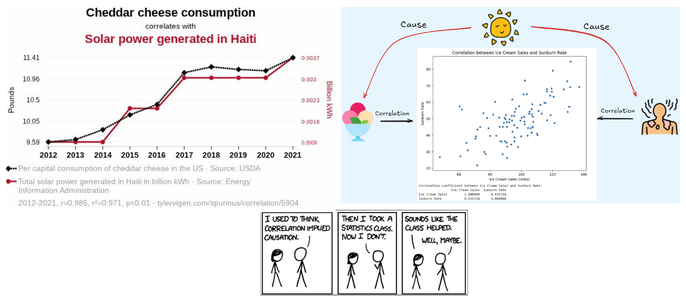
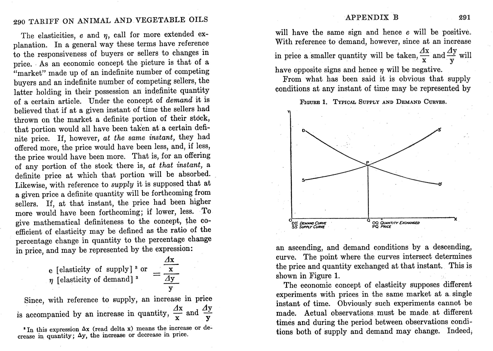
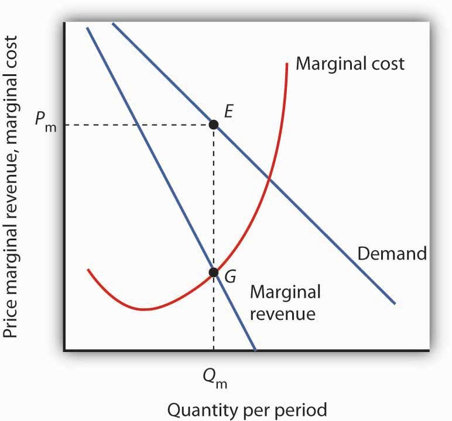
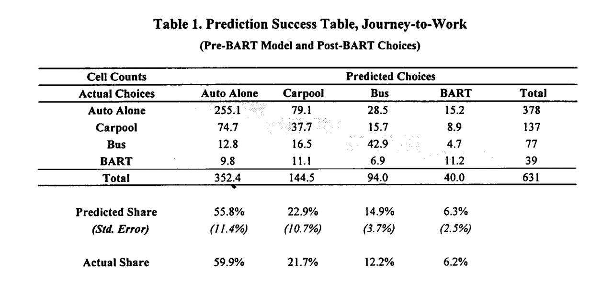
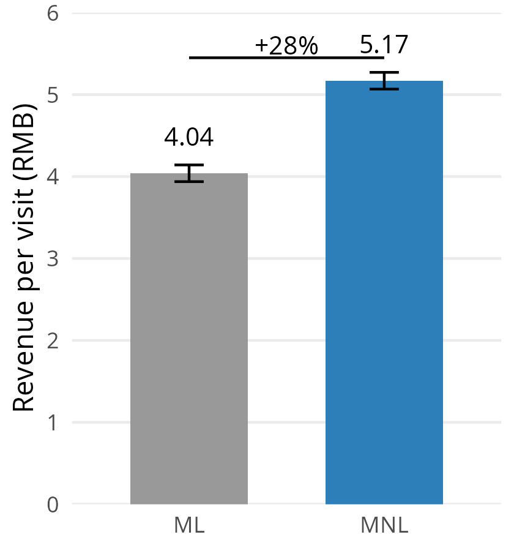
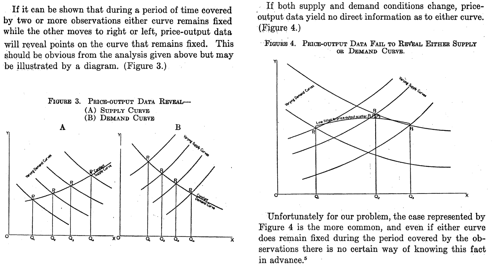
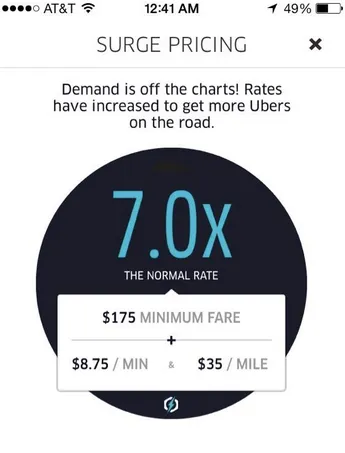
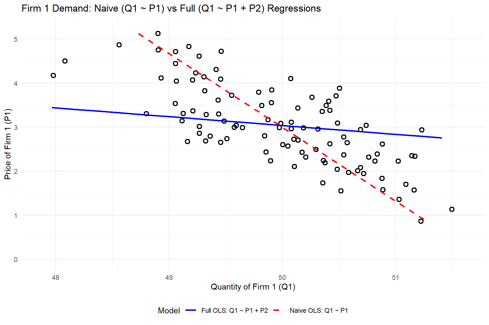
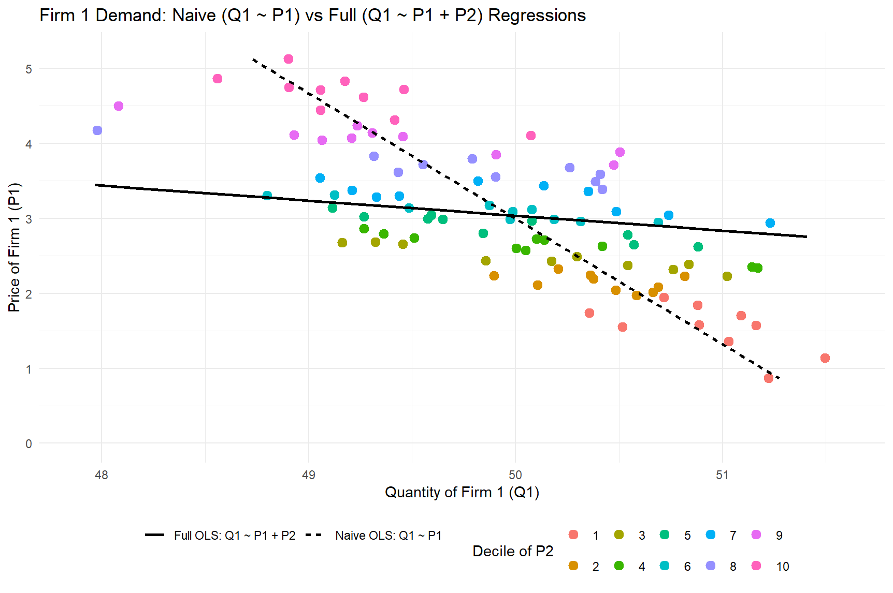

##

{fig-align="center" height="450px"}

::: {.callout-note appearance="minimal" style="font-size: 0.75em;"}
Correlation is the empirical tendency for two variables to move together. We hypothesize about a causal relationship using logic and judgment. If X "causes" Y, then if we intervene to change prob(X=x), prob(Y=y|X=x) will change as a result.
:::

::: {.source-url}
[Spurious Correlations](https://www.tylervigen.com/spurious-correlations){target="_blank"} | [XKCD](https://xkcd.com/552/){target="_blank"}
:::

# Demand Curves

- Theory
- Challenges
- What firms do


##

{fig-align="center" height="420px"}

::: {.callout-note appearance="minimal"}
Philip Wright was an economics professor on sabbatical at the US Tariff Commission. Wright (1928) predicted the tax revenue that would be raised by a tariff on linseed oil, by predicting how much foreign demand would fall as a function of the change in price. Does he describe demand as a correlational or a causal relationship? Similar ideas go farther back, to Alfred Marshall (1890).
:::

::: {.source-url}
[Wright (1928)](https://drive.google.com/file/d/1PccpUSBpR23V2tdSQ8mUeccQ9-EBwPgL/view?usp=drive_link){target="_blank"}
:::

::: notes
Philip Wright was a Harvard economics professor who worked at the US Tariff Commission
Wright (1928) was trying to predict the tax revenue that would be raised by a tariff on linseed oil, by predicting how much foreign demand would fall as a function of the change in price
Here, Wright explains S&D ideas usually credited to Alfred Marshall (1890)
:::


## Demand Curve

{fig-align="center" height="400px"}

::: {.callout-note appearance="minimal" style="font-size: 0.75em;"}
The demand curve is the relationship between price and quantity demanded. Why do we call it "inverse"? Marginal revenue shows how total revenue is changing at each price. Marginal cost represents the cost of each additional unit of quantity supplied. Where does the firm maximize profit? Where does the firm maximize revenue? <br><br>Have you ever heard any coworker or relative talk about a business's demand curve? Why or why not?
:::

::: notes
- What's this? why do we call it inverse?
- How would a company use this?
- Has anybody worked for a company?
- What was the company's demand curve?
- does anybody have a parent or a sibling or a friend who works for a company?
- What was that company's demand curve?
- has anybody ever heard a company CEO or employee talk about what their demand curve was?
- Have you heard anybody ask these questions before? Why not?
:::


## Demand Curves: Theory

- Useful theoretical concept that summarizes market response to price
    - Firms maximize $\pi=(p-c) \cdot q(p)-F$
    - Where does demand come in?
- Often taught with perfect competition, or monopoly with market power
- Also applies to firm-specific "residual demand" in differentiated-product markets

::: {.callout-note appearance="minimal"}
Demand curves enable counterfactual predictions — "what would happen to sales if we changed the price?"
:::

::: notes
- why useful? it lets you make counterfactual predictions. (what predictions?)
- No differentiation? What markets have no differentiation? Commodities... maybe? Stock market?
- what does competitive mean exactly? how do we measure it?
- intellectual property rights, company capabilities, consumer information sets limit direct competition in most markets
:::

## Demand Curves: Challenges {.smaller}

- Where do product attributes come in?
- Many things can predict demand
    - [preferences, information, advertising, quality, match value, complements, substitutes, interoperability, competitor prices, switching costs, entry, taxes and other policies, retail distribution, nature of equilibrium, stockpiling, consumer income, brand image, consumer trust, certainty, ...]{style="font-size: 0.7em;"}

- What do we need to estimate Demand?
    - Observable, exogenous price variation
    - Otherwise, "price endogeneity" will bias demand estimates, leading to a correlational relationship rather than a causal relationship

::: {.callout-note appearance="minimal" style="font-size: 1.15em;"}
Have you heard of price endogeneity before? What is it?<br>The key insight: you need exogenous variation in price to isolate the causal effect from correlates of both price and sales. What does "exogenous" mean here?
:::

::: notes
- We're going to need a model and exogenous price variation to estimate demand
:::

## How firms usually learn demand

- Market research
    - Conjoint analysis, customer interviews, simulated purchase environments
- Expert judgments, e.g. salesforce input
- Cost-driven price adjustments
    - Often one-sided: costs can drive prices up, but seldom drive them down
- Demand modeling with archival data
- Price experiments
    - Market tests, digital experiments, bandits, digital coupons

::: {.callout-note appearance="minimal"}
Firms use many approaches to learn demand, but best practice is triangulation — combining multiple methods. Why might relying on a single approach be risky?
:::

::: notes
- In many markets, costs can drive prices up, but they seldom drive them down
- If we disregard reactance and dynamics (stockpiling, reference prices, competitors), experiments are the single best way to learn demand, e.g. dube & misra (2019)
:::

## Price Experiments

- "Yes-and": Price experiments create exogenous price variation, which works synergistically with demand modeling. But...
    - Competitors & consumers can observe price variation
    - May change purchase timing, stockpiling or <br>reference prices
    - Competitors, distribution partners or suppliers may react
- Price experiments can change future demand, input costs, competition
    - Price experiments w/o demand modeling leaves money on table

::: {.callout-note appearance="minimal"}
What might competitors, distribution partners, or suppliers react to price variation?<br><br>Why might combining experiments with demand modeling be better than either alone?
:::

## Demand Modeling: Pros

- Relatively inexpensive for large organizations
- Confidential, fast
- Depends on real consumer choices, i.e. revealed preferences
    - As opposed to stated preferences
- Enables demand predictions at counterfactual prices
- Enables predictions of competitor pricing response
- Prediction accuracy: evaluable after price changes

::: {.callout-note appearance="minimal"}
Demand modeling uses real consumer choices (revealed preferences) rather than survey responses (stated preferences). It's also confidential and fast compared to running market experiments. What's the difference between revealed preferences and stated preferences, and why does it matter?
:::

## Demand Modeling: Cons

- Requires data, exogenous price variation, time, effort, training, commitment, trust, organizational buy-in
    - Data and variation are distinct: if price never changed, you could not estimate demand
- Always subject to untestable modeling assumptions
- Requires the near future to resemble the recent past
    - Hence most often used in mature, stable markets

::: {.callout-note appearance="minimal"}
To be fair, all sophisticated predictive & prescriptive analytic techniques require these 3. Which of these challenges do you think is the biggest? Which are shared by other demand estimation techniques?
:::

::: notes
- Data and variation are distinct; e.g. if price never changed, good luck estimating demand
- what does exogenous mean? We'll talk about that more later
- corr(future, past): Your estimated demand curve might become unreliable just when you need it the most
- Hence most often used in mature, stable markets; not so much in startups
- If you don't know what you're doing, you can pay a nearly infinite amount for the service
- If you do it wrong, it may range from useless to badly misleading (would you know?)
:::

# Do Demand Models Work? {.smaller}

- Evidence is supportive, but not thick
    - Informally, I know several people who maintain demand models in large orgs. They say yes
    - Scientific evidence requires researchers and firm to collaboratively (a) estimate demand, (b) act on demand estimates, (c) observe how actions affect outcomes, & (d) report the results publicly. Hard to do & incentives conflict
    - Demand modeling can also go badly, e.g. due to price endogeneity
    - [Misra & Nair (2011)](https://papers.ssrn.com/sol3/papers.cfm?abstract_id=1474462){target="_blank"} : B2B sales & salesforce compensation
    - [Nair et al. (2017)](https://papers.ssrn.com/sol3/papers.cfm?abstract_id=2399676){target="_blank"} : Casino loyalty rewards
    - [Pathak and Shi (2021)](https://economics.mit.edu/research/publications/how-well-do-structural-demand-models-work-counterfactual-predictions-school){target="_blank"} : School choice
    - [Feldman et al. (2022)](https://drive.google.com/file/d/1NRL6_SoM9PE6vlwoz7f6xUsgzCvIEqZX/view?usp=drive_link){target="_blank"} : Taobao/Tmall product assortments
    - [Dube and Misra (2023)](https://drive.google.com/file/d/1Jsr9BvPI4IKrHnr6O_pNBKF_gotCxWFH/view?usp=sharing){target="_blank"} : ZipRecruiter ad pricing
    - [Ko et al. (2024)](https://papers.ssrn.com/sol3/papers.cfm?abstract_id=4293532){target="_blank"} : E-Commerce apparel promotions
    - Hayashida (2026) : Perishable food

# Multinomial Logit

- history, math, properties, discussion

## Positioning the MNL

- Old, famous model; probably the most popular demand model
- Still very much used to estimate demand; many fancy new demand models extend MNL
- Ported to Economics from Psych/Stats by Daniel McFadden (1970s)
    - Thurstone 1927, Luce 1959, Marshak 1959, also called multinomial logistic regression
- Typical econometric exposure goes like this:
    - $y$ is continuous, e.g. quantity sales: Linear regression
    - $y$ is binary, e.g. buy or don't buy: Logit/Probit
    - $y$ is categorical, e.g. buy X or Y or Z: MNL

## Daniel McFadden & BART {.smaller}

:::: {.columns}

::: {.column width="35%"}
{fig-align="center" height="220px"}
:::

::: {.column width="65%"}
- Economist working at UC Berkeley to empiricize theoretical models of individual choice
- In the early 1970s, funded by NSF to predict how BART would change transit in San Francisco
- Collected pre-BART transportation choices by surveying commuters in neighborhoods slated for BART stations
- Product attributes: walking distance, waiting time, financial cost, automotive preference
- Estimated MNL on pre-BART survey data, then predicted post-BART transit choices
:::

::::

::: {.callout-note appearance="minimal" style="font-size: 1.15em;"}
McFadden (1974, 1978, 1981) introduced the Multinomial Logit (MNL) model into Econ by showing it was consistent with theories of rational choice. MNL was based on earlier work in stats & psych ("logistic regression"), and became probably the most popular demand model. Ken Train, who wrote the pre-class reading, assisted McFadden's research at Berkeley, and later became a Berkeley professor.
:::

## Multinomial Logit (MNL) {.smaller}

{fig-align="center" height="300px"}

::: {.callout-note appearance="minimal" style="font-size: 1.15em;"}
This table shows how his predictions mapped onto the post-BART choices: he pretty much nailed his BART ridership predictions. This stood in contrast to survey-based results, which predicted much larger BART ridership. High-profile early "win" for MNL, combined with theoretical interpretation, led to model adoption. What was the confidence interval on the MNL predicted share for BART ridership? Why did survey-based predictions overestimate BART ridership compared to the model-based approach?
:::

::: notes
- McFadden was an economist working to empiricize theoretical models of individual choice
- In early 1970s, he was funded by NSF to predict how BART would change transit in SF
- He organized a team that collected pre-BART transportations choices by commuters in neighborhoods that were to receive BART stations. Product attributes included things like walking distance, waiting time, financial cost, and automotive preference dummy
- He estimated a MNL using pre-BART individual level survey data, then simulated how transit choices would change after BART began operation
- This table shows how his predictions mapped onto the post-BART choices: he pretty much nailed his BART ridership predictions
- This stood in contrast to survey-based results, which predicted much larger BART ridership
- High-profile early "win" for MNL, combined with theoretical interpretation, led to model adoption
:::

## Multinomial Logit (MNL) {.scrollable .smaller}

- Let $i$ index consumers, $j=1,...,J$ products, and $t$ index choice occasions
- Assume each $i$ gets indirect utility $u_{ijt}$ from product $j$ in market $t$:

$$u_{ijt}=V_{jt}+\epsilon_{ijt}=x_{jt}\beta-\alpha p_{jt}+\epsilon_{ijt}$$

- Then, assuming each $i$ picks the $j$ that maximizes $u_{ijt}$, has unit demand, and that $\epsilon_{ijt}\sim$*i.i.d.*$EV_1(0,1)$, market share is

$$s_{jt}=Prob\{u_{ijt}>u_{ikt}\forall{k\ne j}\}=\int \left(\prod_{k\ne j} e^{-e^{-(\epsilon_{ijt}+V_{jt}-V_{kt})}}\right) e^{-\epsilon_{ijt}}e^{-e^{-\epsilon_{ijt}}} \, d\epsilon_{ijt} = \frac{e^{x_{jt}\beta-\alpha p_{jt}}}{\sum_{k=1}^J e^{x_{kt}\beta-\alpha p_{kt}}}$$

With $N_t$ consumers, $q_{jt}(\vec{x}; \vec{p})=N_t s_{jt}$. Estimating $\alpha$ and $\beta$ enables us to predict *every product's quantity response* to a change in *any product's attributes* $x_{jt}$ or price $p_{jt}$

::: {.callout-note appearance="minimal"}
The integral simplifies because of the distributional assumption on $\epsilon_{ijt}$; see Train 3.10. What does *i.i.d.* mean?
:::

::: notes
- AKA multinomial logistic regression
- t could be repeated observations of a single market, multiple distinct markets at the same time, or both
- We obtain the market share formula by integrating the likelihood of u_ijt exceeding all other u_ikt's, over the space of the epsilons and the i's
- the reason we assume iid EV(0,1) is bc it gives us this nice tractable expression with useful properties
- s_jt is bounded by 0 and 1
:::

## MNL: Theoretical properties {.smaller}

- Suppose $\gamma_{t}$ indicates how popular the category is in market $t$, so utility is $u_{ijt}=\gamma_{t}+x_{jt}\beta-\alpha p_{jt}+\epsilon_{ijt}$. Then market share becomes

  $$s_{jt}=\frac{e^{\gamma_{t}+x_{jt}\beta-\alpha p_{jt}}}{\sum_{k=1}^J e^{\gamma_{t}+x_{kt}\beta-\alpha p_{kt}}}=\frac{e^{x_{jt}\beta-\alpha p_{jt}}}{\sum_{k=1}^J e^{x_{kt}\beta-\alpha p_{kt}}}$$

    - Similar exercise applies to individual-specific intercepts $\gamma_i$, or individual-time interactions $\gamma_{it}$. Only differences across products affect predicted market shares
- We usually normalize $V_{1t}=0$ for one product, and other products utilities are identified in reference to product 1

  $$s_{1t}=\frac{1}{\sum_{k=1}^J e^{x_{kt}\beta-\alpha p_{kt}}}$$

    - We use the $(J-1)T$ *differences* in market shares to estimate demand parameters
    - Often, we normalize the non-purchase option (the "outside option") which has no observed attributes

::: notes
- Any factor that doesn't vary across products will drop out of the model
- Often, we normalize the non-purchase option which has no attributes, and call it the "outside option"
:::

## MNL Estimation {.smaller}

Define $y_{ijt} \equiv 1\{i \text{ chose } j \text{ in } t\}$. I.e., $y_{ijt}=1$ iff $i$ choose $j$ at $t$; otherwise $y_{ijt}=0$.

1. Maximum likelihood: Assume the probability of observation $\{i,j,t\}$ is $s_{jt}(\alpha,\beta)^{y_{ijt}}$; <br>then likelihood function is $L(\alpha,\beta)=\max\limits_{\alpha,\beta}\prod\limits_{\forall i,j,t} s_{jt}(\alpha,\beta)^{y_{ijt}}$; & choose parameters to maximize log lik:

$$\max_{\alpha,\beta}\sum_{\forall i,j,t} y_{ijt}\ln s_{jt}(\alpha,\beta)$$


2. Linearize the model, choose parameters to minimize the sum of square errors to estimate using market-level data

$$ln(s_{jt})-ln(s_{1t})=x_{jt}\beta-\alpha p_{jt}+\xi_{jt}$$

## MNL Estimation Intuition {.smaller}

*Estimating* the model means finding $\alpha$ and $\beta$ to maximize the predicted probabilities of **chosen** products ($y=1$), and minimize the probabilities of **not-chosen** products ($y=0$)

| Person | Product | $y$ | $p$ | $x$ |
|--------|---------|-----|-----|-----|
| A | 1 | 0 | — | — |
| A | 2 | 0 | 4 | 5 |
| A | 3 | **1** | 2 | 4 |
| B | 1 | 0 | — | — |
| B | 2 | **1** | 2 | 5 |
| B | 3 | 0 | 2 | 4 |

If $\alpha=1$ and $\beta=1$: $\quad V_1=0$ (normalization); $\quad V_2=5-p_2$; $\quad V_3=4-2=2$ $\quad s_{jt}=\frac{e^{x_{jt}\beta-\alpha p_{jt}}}{\sum_{k=1}^J e^{x_{kt}\beta-\alpha p_{kt}}}$

- $P_{A2}=e^{1}/(e^{0}+e^{1}+e^{2})=0.24$; $\quad P_{A3}=e^{2}/(e^{0}+e^{1}+e^{2})=0.67$
- $P_{B2}=e^{3}/(e^{0}+e^{3}+e^{2})=0.71$; $\quad P_{B3}=e^{2}/(e^{0}+e^{3}+e^{2})=0.26$

::: {.callout-note appearance="minimal"}
Person A chose product 3 and Person B chose product 2. Product 1 is the "outside option" — not purchasing. What happens to the choice probabilities if you change $\alpha$ to $1.1$? What if you change $\alpha$ to $0.9$?
:::

## MNL Goodness-of-fit Statistics {.smaller}

- MNL predicts *choice probabilities* rather than *choices*, because utility is always unobserved; hence nonstandard fit statistics

1. Likelihood Ratio Test: (not R-sq)

$$\rho=1-\frac{ln L(\hat\beta)}{ln L(0)}$$

- As $L(\hat\beta)\to 1$, $ln L(\hat\beta)\to 0$, $\rho\to 1$
- As $ln L(\hat\beta)\to ln L(0)$, $\rho\to 0$
    - Heuristic: 0.2-0.4 is pretty good

2. Hit Rate: % of individuals for whom most-probable choice was actually chosen

3. R-sq using prediction errors at the $jt$ level

::: notes
- #3 is appealing idea but based on fewer data points than estimation
:::

## MNL Pros & Cons {.smaller}

- **Pro:** Microfounded, i.e. behavioral predictions are consistent with a clearly specified theory of consumer choice: utility maximization
    - Economists widely believe that microfounded models are more generalizable than purely statistical models*
- **Pro:** Extensible to accommodate preference heterogeneity
- **Pro:** Likelihood function is globally concave in $\alpha$ and $\beta$, ensuring fast and reliable estimation
- **Con:** Assuming $\epsilon_{ijt}\sim$*i.i.d.*$EV_1(0,1)$ is algebraically convenient but unrealistic
    - More likely, more similar products would experience more similar demand shocks
    - Alternatives exist but can be computationally expensive; market share functions require more computation
- **Con:** Analyst selects the choice set $j=1,...,J$, market size $N_t$, attributes $x_{jt}$, and price structure $p_{jt}$.
    - What's a j? What's a t? What's in x? How do we measure p? Who's in N?
- **Con:** Market share derivatives depend on market shares alone (IIA; see Train Sec. 3.6)

::: {.source-url}
*[Andrews, Fudenberg, Lei, Liang, and Wu (2023)](https://economics.mit.edu/sites/default/files/2023-11/Theory_Transfer.pdf){target="_blank"} supports this belief
:::

::: notes
- Unobservables would likely be correlated across people, products and markets
- We would expect more-differentiated products to face less-elastic demand, holding market shares constant
- Derivatives statement presented without proof, refer interested students to the chapter. Some people think this property is appealingly simple, but it would be more realistic if the derivatives depended on the attribute levels or prices directly
:::

## IIA: Deeper dive {.smaller}

- Famous example from McFadden (1974): Suppose you estimate demand for transportation with three options: {Blue Bus, Red Bus, Car}, each with 33% market share, and you include product intercepts in utility
    - Now suppose you evaluate a counterfactual in which you paint all of the red buses blue, and then you predict market shares in the new choice set {Blue Bus, Car}
    - MNL will predict Blue Bus and Car shares of 50%, not 67% and 33%
    - Why? MNL infers $V_{jt}$ based on market shares, so equal market shares imply equal $V_{jt}$

{.absolute bottom="20" right="20" height="150px"}

::: {.callout-note appearance="minimal"}
IIA is testable and usually rejected by data. Common remedies: (1) impose structure on the choice set (e.g., Nested Logit, Ordered Logit); (2) relax the i.i.d. $EV_1$ error assumption (e.g., Multivariate Probit with correlated errors); or (3) change model structure so IIA does not obtain (e.g., heterogeneous logit).
:::

## MNL in Practice: Alibaba {.smaller}

:::: {.columns}

::: {.column width="65%"}
- Alibaba recommends 6 personalized products, chosen from thousands, on homepage to maximize sales revenue
- Previously: ML algorithm predicted each product's purchase probability independently, then displayed the 6 with highest expected revenue
- Feldman et al. (2022) proposed using MNL instead, because MNL captures substitution across products — if two displayed products are similar, they cannibalize each other's demand rather than generating new sales
- Field experiment with 5M+ customers on Tmall/Taobao: ML predicted purchase probabilities more accurately, but MNL generated 28% more revenue per visit
- Why? ML ignores substitution and may waste display slots on similar products. MNL's $s_{jt}$ formula links all products through the denominator, so it selects more diverse assortments
:::

::: {.column width="35%"}
{fig-align="center" height="190px"}

{fig-align="center" height="190px"}
:::

::::

::: {.callout-note appearance="minimal"}
Better prediction does not always lead to better decisions. What matters is not just how likely a customer is to buy each product, but how products compete with each other for the customer's attention.
:::

::: {.source-url}
[Feldman et al. (2022)](https://drive.google.com/file/d/1NRL6_SoM9PE6vlwoz7f6xUsgzCvIEqZX/view?usp=drive_link){target="_blank"}
:::

# Price endogeneity: <br>35 INSANE explanations

- #4 will SHOCK you. Like, comment, subscribe
- Covered on the exam...ask lots of questions


## Classic Identification Argument

{fig-align="center" height="380px"}

::: {.callout-note appearance="minimal" style="font-size: 0.75em;"}
Same guy that we opened with — on the very next page after introducing supply & demand, Wright describes the price endogeneity problem, plus how to resolve it. We need supply shifters to trace out the demand curve. We need demand shifters to trace out the supply curve. If we only have endogenous P&Q, we cannot estimate either curve's shifts, since both move frequently. We've known about price endogeneity for about 100 years now.
:::

::: {.source-url}
[Wright (1928)](https://drive.google.com/file/d/1PccpUSBpR23V2tdSQ8mUeccQ9-EBwPgL/view?usp=drive_link){target="_blank"}
:::

::: notes
Same guy that we opened with-- on the very next page after introducing supply & demand
Wright gives the classic S&D identification argument
We need supply shifters to trace out the demand curve
We need demand shifters to trace out the supply curve
If we only have endogenous P&Q, we cannot estimate either curve's shifts, since both move frequently
:::

## 2. Fundamental issue {.smaller}

- By definition, demand model is a causal price-quantity relationship <br>
Yet observed prices typically correlate with other demand and supply determinants<br>
Exogenous price variation req'd to distinguish correlation from causation ("identification")
    - Price endogeneity is a "data problem" not a "model problem"
    - Can be hard to verify empirically--needed data is missing--but widely believed important
    - Implies wrong demand slope, biased demand predictions
- Sign of bias depends on unobserved correlation
    - If corr(price,unobs)<0 --> estimated demand is "too flat" or too elastic
    - If corr(price,unobs)>0 --> "too steep" or too inelastic
    - Affects all demand models, not just MNL

::: {.callout-note appearance="minimal"}
Data science is amazingly useful for making data-driven decisions, but doesn't always consider the importance of missing data. Econometrics, by contrast, carefully considers what we can or cannot learn from available data, but is more focused on inference than action. What can you gain by combining the two disciplines?
:::

## 3. E-Commerce Example

- Imagine an unobserved demand shock, such as a viral Instagram post, increases Amazon product awareness and sales
- Sales spike, inventory drops, automated pricing system increases price to monetize remaining inventory and avoid stocking out
- What do data show? Corr(sales, price) > 0 !!
    - Common enough to be unsurprising when this happens

::: {.callout-note appearance="minimal"}
This is a concrete example of how automated pricing creates price endogeneity. The price increase was caused by the demand shock, not the other way around. What would happen if you tried to estimate demand from this data without accounting for the shock?
:::

## 4. An Analogy

:::: {.columns}

::: {.column width="60%"}
- Foot size significantly predicts reading comprehension among children!
    - In fact, age causes foot size and age causes reading comprehension
- Also, crib purchases significantly predict childbirth!
:::

::: {.column width="40%"}
{fig-align="center" height="300px"}
:::

::::

::: notes
People with tiny feet cannot read. Like, at all
:::


## 5. Sports example

- Suppose you observe daily sports team ticket prices and sales before and after the team acquires a very popular player
- Prices and sales are both higher after the trade
- Does this mean that higher price caused higher sales?

{.absolute bottom="20" right="20" height="180px"}

::: {.callout-note appearance="minimal"}
The Luka trade shifted demand — more fans want to see the Lakers now. Prices and attendance both rose, but the higher price didn't cause the higher attendance. What's the omitted variable here?
:::

## 6. Example: Digital systems

:::: {.columns}

::: {.column width="60%"}
- Uber surge pricing: <br>
Positive Demand shocks increase price<br>
Negative Supply shocks increase price
- System adjusts the price without knowing the causes
    - Many digital inventory-based pricing systems are similar
:::

::: {.column width="40%"}
{fig-align="center" height="300px"}
:::

::::

::: {.callout-note appearance="minimal"}
These automated systems' pricing decisions ensure that price and quantity variables will both be correlated with unobserved demand- and supply-shifters. Would it be possible to escape price endogeneity in demand estimation?
:::

::: {.source-url}
[Pattnaik](https://anubpattnaik.medium.com/how-does-uber-do-price-surge-using-location-data-cfee03415022){target="_blank"}
:::

## 7. Shrinkflation

{fig-align="center" height="280px"}

- Shrink the package, maintain the price
- Also, "Skimpflation" : reduce ingredient intensity

::: {.callout-note appearance="minimal"}
What is the best measure of price? Is it per-unit, or per-volume? Consumers are more responsive to price adjustments than to changes in product size, so shrinkflation and skimpflation can effectively obfuscate price increases. But what would this do to demand estimates?
:::

::: {.source-url}
[Archived examples](https://archive.ph/uYt1j){target="_blank"} | [r/shrinkflation](https://old.reddit.com/r/shrinkflation/top/?sort=top&t=all){target="_blank"} | [Janssen and Kasinger (2025)](https://papers.ssrn.com/sol3/papers.cfm?abstract_id=4783491){target="_blank"}
:::


## 8. Oft-unobserved price correlates

1. Changes in consumer preferences, income, market size
2. Retail distribution, prominence, stocking
3. Digital marketing, including search ads, display ads, affiliates, influencers, coupons
4. Competitor prices, preference shocks, retail, dig mktg

Any may correlate with equilibrium prices, leading to endogeneity biases if left uncontrolled

::: {.callout-note appearance="minimal"}
This is called the "Problem of Multiple Determinants," emphasizing the challenge of isolating individual causal relationships when many causes exist, and when causes may co-occur with each other. Where else does this challenge manifest?
:::


## 9. General model interpretation {.smaller}

- Posit a model $q=f(x,p,e)$ for $p=$price, $q=$quantity, <br>$e=$error reflecting all relevant unobservables; use data to estimate $\frac{dq}{dp}$
- What does $\frac{dq}{dp}$ mean exactly? 2 possibilities:
    1. Correlation: Empirical tendency of $q$ to change with $p$, holding other observable attributes $x$ constant
    2. Causality: Causal effect of 1-unit change of $p$ on $q$
    - 1 is descriptive analytics; 2 is diagnostic analytics
- Standard econometric assumptions only admit #2 when $corr(p,e)==0$ ("exogenous")
    - Hence, what the estimates can teach us depends on $e$, which we cannot see
    - This is a tricky situation: When can we trust our demand model?
    - Answer 1: When we have exogenous price variation, hence $corr(p,e)==0$; OR
    - Answer 2: When we observe all demand drivers; but this is typically unreasonable to expect

::: {.callout-note appearance="minimal"}
This is a great place to ask questions.
:::


## 10a. Simulation {.smaller}

- Suppose 2 firms, correlated cost shocks and correlated prices, MNL demand
- Suppose true demand is $q_1=f(p_1, p_2, \epsilon_1, \epsilon_2)$
- Suppose firm 1 uses OLS to estimate $q_1=\alpha + p_1\beta + \epsilon$
    - This mistakenly implies that $corr(p,\epsilon)==0$
    - Incorrect: $corr(p_1,p_2)>0$, and $p_2$ omitted, hence $p_2$ is in epsilon
- $\hat{\beta}$ is *biased* to fit the OLS model's assumption that $\sum p_1\epsilon=0$
- Wrong $\hat{\beta}$ means wrong demand curve slope<br>
...implies wrong demand predictions in response to price<br>
...recommended price will be wrong, may reduce profit

::: {.callout-note appearance="minimal" style="font-size: 1.15em;"}
This type of mistake could arise from a company failing to identify a relevant competitor, and therefore neglecting to include it in the choice set. Is that a plausible scenario?
:::

## 10b. Simulated data generating process


```
# 1. Simulation parameters and correlated cost shocks
set.seed(14)                   # for reproducibility
n_periods    <- 100            # number of periods
market_size  <- 100            # total market size (e.g. number of customers)
rho          <- 0.9            # influence of costshock1 on costshock2

# Demand model parameters
alpha       <- 0.2             # price sensitivity (common across products)
intercept1  <- 9               # baseline utility for product 1
intercept2  <- 9               # baseline utility for product 2
# (Outside option utility is normalized to 0)

# Simulate cost shocks for the two firms (correlated)
shock1 <- rnorm(n_periods)
shock2 <- rho * shock1 + (1 - rho) * rnorm(n_periods)

# Derive prices from costs (higher cost shock -> higher price)
base_cost <- 1
price1 <- 3 * base_cost + shock1
price2 <- 3 * base_cost + shock2
cor(price1, price2)

# 2. Compute market shares and quantities using multinomial logit demand
data <- tibble(
  period = 1:n_periods,
  shock1 = shock1,
  shock2 = shock2,
  price1 = price1,
  price2 = price2
) %>%
  mutate(
    # Indirect utilities for each product and outside option:
    U1 = intercept1 - alpha * price1,
    U2 = intercept2 - alpha * price2,
    U0 = 0,  # outside option utility (baseline 0)
    # Convert utilities to choice probabilities (logit formula):
    expU1 = exp(U1),
    expU2 = exp(U2),
    expU0 = exp(U0),
    share1 = expU1 / (expU1 + expU2 + expU0),
    share2 = expU2 / (expU1 + expU2 + expU0),
    Q1 = market_size * share1,
    Q2 = market_size * share2,
    Q0 = market_size * (1 - share1 - share2)
  )

# Create decile variable for Firm 2's price
data <- data %>%
  mutate(p2_decile = ntile(price2, 10))

# 3. OLS regressions for Firm 1's demand
model_naive <- lm(Q1 ~ price1, data = data)
summary(model_naive)

model_full  <- lm(Q1 ~ price1 + price2, data = data)
summary(model_full)
```

::: {.callout-note appearance="minimal"}
Scroll to read the full script, or download and run it.
:::

::: {.source-url}
[Source code](https://drive.google.com/file/d/12ymiHGmilJANlvBgrj5FZYWNasKTCWMu/view?usp=sharing){target="_blank"}
:::

##

```
> # 3. OLS regressions for Firm 1's demand
> model_naive <- lm(Q1 ~ price1, data = data)
> summary(model_naive)

Call:
lm(formula = Q1 ~ price1, data = data)

Residuals:
     Min       1Q   Median       3Q      Max
-1.31867 -0.34908 -0.00637  0.32919  1.19378

Coefficients:
            Estimate Std. Error t value Pr(>|t|)
(Intercept) 51.78942    0.17660  293.26   <2e-16 ***
price1      -0.59737    0.05565  -10.73   <2e-16 ***
---
Signif. codes:  0 '***' 0.001 '**' 0.01 '*' 0.05 '.' 0.1 ' ' 1

Residual standard error: 0.5011 on 98 degrees of freedom
Multiple R-squared:  0.5404,	Adjusted R-squared:  0.5357
F-statistic: 115.2 on 1 and 98 DF,  p-value: < 2.2e-16

> model_full  <- lm(Q1 ~ price1 + price2, data = data)
> summary(model_full)

Call:
lm(formula = Q1 ~ price1 + price2, data = data)

Residuals:
       Min         1Q     Median         3Q        Max
-4.177e-04 -6.103e-05  7.340e-06  7.187e-05  7.270e-04

Coefficients:
              Estimate Std. Error t value Pr(>|t|)
(Intercept)  5.000e+01  7.456e-05  670528   <2e-16 ***
price1      -4.999e+00  1.321e-04  -37832   <2e-16 ***
price2       4.998e+00  1.489e-04   33571   <2e-16 ***
---
Signif. codes:  0 '***' 0.001 '**' 0.01 '*' 0.05 '.' 0.1 ' ' 1

Residual standard error: 0.0001478 on 97 degrees of freedom
Multiple R-squared:      1,	Adjusted R-squared:      1
F-statistic: 1.226e+09 on 2 and 97 DF,  p-value: < 2.2e-16
```

::: {.callout-note appearance="minimal"}
How do the demand slope estimates differ between the two models? Scroll to compare price1 estimates.
:::

##

{fig-align="center" height="450px"}

::: {.callout-note appearance="minimal"}
We used the exact same data to estimate both models, but they produced very different demand curves. Which appears to better fit the data?
:::

::: notes
The mis-specified model estimated a less-negative effect of p1 on q1, which then appears steeper on the graph because we are graphing inverse demand — p as a function of q — rather than q as a function of p.
:::

##

{fig-align="center" height="450px"}

::: {.callout-note appearance="minimal"}
Each color indicates a decile of Price2 realizations, such as the lowest 1-10%, 11-20%, ..., highest 91-100%. Is price2 an unobserved variable that biases the Naive OLS model's estimate of how Q1 responds to price1?
:::

## Common solutions {.smaller}

- Experiments
    - Randomizing price eliminates confounding with unobservables
    - Gold standard, but has drawbacks mentioned earlier
- Quasi-experiments using archival data (beyond class scope)
    1. Instrumental variables
    2. Regression discontinuities
    3. Natural experiments
    4. Difference-in-differences
    5. Synthetic controls
    6. Double/debiased machine learning
- Model the price-setting process
    - But without exogenous price variation, this can be difficult to evaluate

::: {.callout-note appearance="minimal"}
Best practice is to use multiple approaches and triangulate.
:::

## Exogenous smartphone price variation

- Smartphone discounts are randomly assigned, <br>
thus we have exogenous price variation to identify $\alpha$
    - This class focuses on how we can use demand models
    - Endogeneity remedies: Future metrics classes or graduate study
    - Treat the topic as a demand modeling risk to be understood
- In practice, standard advice is to induce nonobvious experimental price variation, such as variation across markets or targeted coupons

::: notes
- When archival demand modeling disagrees with price experiments, endogeneity is a possible culprit, among other possibilities. It's important, but we could easily spend the rest of the quarter on this topic, and we would rather spend the time on what we can do with models.
- Your standard advice to a firm would be to induce nonobvious experimental variation when possible in order to estimate price responsiveness, such as price variation across markets or targeted coupons
- Price response tends to be pretty strong so you don't necessarily need a big intervention
:::

##

{fig-align="center" height="400px"}

- Describe price endogeneity in your own words
    - Generate a novel example related to price and demand
    - If time, explain how you might resolve it

## Class script

- Wrangle data
- Estimate MNL
- Interpret parameters and SEs
- Assess model fit

{.absolute bottom="20" right="20" height="100px"}

# Wrapping up

## Competition

- Estimate MNL with phone dummies and price on each of the 3 cohorts separately
- Create a visualization showing how the price sensitivity parameter has changed across the 3 years

::: {.callout-note appearance="minimal"}
Use the class script as a starting point. Follow good visualization practices from week 1. Make your visualization beautiful and clear.
:::

{.absolute bottom="20" right="20" height="120px"}

## Recap

- Demand modeling enables data-driven sales predictions for counterfactual prices and attributes, facilitating profit maximization
- MNL is popular bc it is powerful, microfounded and tractable
- MNL has limitations (eg, IIA), but is extensible by modeling heterogeneity
- Price endogeneity is a "data problem" that biases demand parameter estimates when price is correlated with unobserved demand shifters. Usually resolved with exogenous price variation

{.absolute bottom="20" right="20" height="100px"}

## Going further

- [Supply, Demand, and the Instrumental Variable: Lessons for Data Scientists from the Economist's Toolbox](https://medium.com/data-science/supply-demand-and-the-instrumental-variable-lessons-for-data-scientists-from-the-economists-21af225187cd){target="_blank"}
- [Causal inference in economics and marketing (Varian 2016)](https://drive.google.com/file/d/1vPl8oULQrZDQN8RlKolufLuwETLd-I3Z/view?usp=sharing){target="_blank"}
- [Discrete Choice Analysis with R](https://drive.google.com/file/d/1KHzy6TkFxy5LArFv6cNpCMWEiLCO8tEl/view?usp=sharing){target="_blank"}
- [Microeconometric models of consumer demand by Dube (2018)](https://drive.google.com/file/d/1JsTh_ZYI1hU2TR93qmPYgsEuYIU4Upu_/view?usp=sharing){target="_blank"}
- [Empirical Models of Demand and Supply in Differentiated Products Industries by Gandhi & Nevo](https://drive.google.com/file/d/1Js1sJgxxaA2Ph_4SuhcKxLS9FYqoZFm3/view?usp=sharing){target="_blank"}

::: notes
- Varian (2016) covers causal inference in marketing
- Dube (2019) surveys the literature on demand modeling
- Gandhi & Nevo survey demand modeling & consider it simultaneously with supply modeling. Nevo was the chief economist at the FTC, Gandhi at AirBnB
:::

{.absolute bottom="20" right="20" height="100px"}
