## Segmentation case study: Quidel

-   Leading B2B manufacturer of home pregnancy tests
-   Tests were quick and reliable
-   Wanted to enter the B2C HPT market
-   Market research found 2 segments of equal size; <br>what were they?

## 

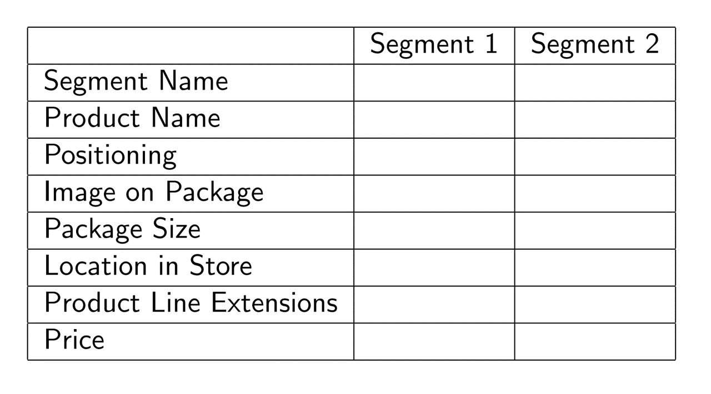{fig-align="center"}

::: notes
<!---   Answers: Hopefuls; Fearfuls (Notice, the same woman can be in segment 1, and then be in segment 2 just a short time later, holding the customer and partner identities constant) Conceive; QuickVue
-   "The simplest, most trusted way of knowing when your family will grow or begin"; "A reliable source of peace of mind in 30 seconds"
-   Baby; No Image, nondescript packaging
-   Baby aisle; Next to contraception
-   Ovulation testing; STD tests (strep, chlamydia)
-   QuickVue came in packs of 2; Conceive sold 40 to a box at 15% premium per strip
-   So you see how understanding your customer can help optimize tangible and intangible features-->
- How did price sensitivity differ between the two segments?
:::

## 

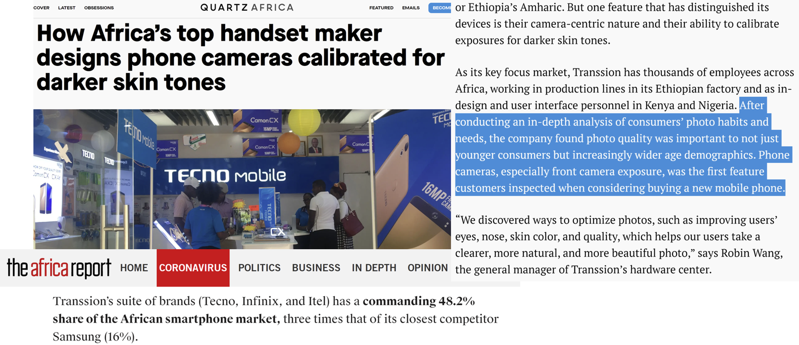{fig-align="center"}  

::: aside
-   [Full article](https://web.archive.org/web/20220217070659/https://qz.com/africa/1633699/transsions-tecno-infinix-camera-phones-made-for-dark-skin-tones/){target="_blank"}
- [2022 Pixel Ad](https://drive.google.com/file/d/1Eg43MlBHhdipjI3JvveIjnbZhnrnKsPW/view?usp=drive_link){target="_blank"}
:::

::: notes
-   Key learning here: Understanding how customer preferences differ between segments can enable optimization of product attributes for specific segments
- In this case, because most smartphone users never change the default camera settings, the default settings were optimized given local preferences, leading to a 48% market share for transsion
- The Google ad suggests that Google is also figuring out some of the same heterogeneous preferences for smartphone camera attributes, and how tuning defaults for local markets might increase sales
:::

## Digital Default Frequencies {.smaller}

- [Classic study:](https://archive.uie.com/brainsparks/2011/09/14/do-users-change-their-settings){target="_blank} 95% of MS Word users maintained original default options

- [Classic study:](https://blog.mozilla.org/metrics/2011/08/25/do-90-of-people-not-use-ctrlf/){target="_blank} 81-90% of users don't use Ctrl+F

- [Classic study:](https://www.nngroup.com/articles/the-power-of-defaults/){target="_blank} Randomizing top 2 search results only changed click rates from 42%/8% to 34%/12%

- [2021 data:](https://assets.publishing.service.gov.uk/media/63f61bc0d3bf7f62e8c34a02/Mobile_Ecosystems_Final_Report_amended_2.pdf){target="_blank} Safari has 90% share on iPhone, Chrome (74%) and Samsung Internet (15%) have 89% share on Android

        - Chrome always preinstalled on Android, Samsung Internet preinstalled on 58% of Android devices

- Why? Behavioral research:

        - Defaults are good enough
        - Changing defaults is hard
        - Changing defaults is uncertain/ambiguous
        - User assumes product designer knows best--sometimes correctly
        - Popularity implies utility
        - Possible fear of exclusion or norm deviation 

- Implies importance of understanding customer needs (aka market research) prior to initial product offerings 

::: notes
Usage data may or may not indicate misunderstandings of customer needs
:::


# Het. Demand Models

1. Discrete heterogeneity by segment
2. Continuous heterogeneity by customer attributes
3. Individual-level demand parameters

              - We'll code 1 & 2
              - 3 is often best but needs advanced techniques --> graduate study


::: notes
-   Multiple approaches can be used together
:::

## MNL Demand

-   Recall our MNL market share function $s_{jt}=\frac{e^{x_{jt}\beta-\alpha p_{jt}}}{\sum_{k=1}^{J}{e^{x_{kt}\beta-\alpha p_{kt}}}}$

          - Recall that the model can predict how *any* change in x_{jt} or p_{jt} would affect *all* phones' market shares
          -  What is \alpha? What is \beta?
          
-   What are the model's main limitations?

          1. Assumes all customers have the same preferences
          2. Assumes all customers have same price sensitivity 
          3. IIA: Predictions become unreliable when choice sets change
          4. Requires exogenous price variation to estimate \alpha (all demand models)          
          5. Assumes iid \epsilon distribution: Convenient but unrealistic
          Modeling heterogeneity can alleviate 1-3 and enable better predictions

::: notes
- Everything here is review; please ask about anything unclear
-   By construction, base model assumes away the possibilities that (i) preference parameters vary across customer segments, or (ii) covary with customer attributes, or (iii) differ across customers at all. So we've ruled out the existence of hopefuls and fearfuls
- where are the hopefuls and fearfuls?
:::

## Het. Demand Models : Intuition

1. MNL estimates quality; Het MNL estimates quality & fit 

          Recall vertical vs. horizontal product differentiation

2. Better "counterfactual predictions" for strategic variables that enter the model and predict sales

          - Pricing: price discrimination, two-part tariffs, fees, targeted coupons
          - Advertising: Ad targeting, frequency, media, channels
          - Product: Targeted attributes, line extensions, brand extensions
          - Distribution: Partner selection, intensity/shelfspace, in-store environment
          - M&A: Oft used in antitrust merger reviews

Biggest risks? Overfitting ; Misuse

          - Who has heard of cross-validation?


## 1. Discrete heterogeneity by segment {.scrollable .smaller}

-   Assume each customer $i=1,...,N$ is in exactly 1 of $l=1,...,L$ segments with sizes $N_l$ and $N=\sum_{l=1}^{L}N_l$

        - We will use 3 kmeans segments based on 6 usage variables
        - We take usage variables as best available proxies for customer needs

-   Assume preferences are uniform within segments & vary between segments

        - Consistent with the definition of segments

-   Replace $u_{ijt}=x_{jt}\beta-\alpha p_{jt}+\epsilon_{ijt}$ with $u_{ijt}=x_{jt}\beta_l-\alpha_l p_{jt}+\epsilon_{ijt}$
-   That implies $s_{ljt}=\frac{e^{x_{jt}\beta_l-\alpha_l p_{jt}}}{\sum_{k=1}^{J}e^{x_{kt}\beta_l-\alpha_l p_{kt}}}$ and $s_{jt}=\sum_{l=1}^{L}N_l s_{ljt}$
-   Alternatively, it is also possible to estimate segment memberships

          - Pro: don't have to define the segment memberships ex ante
          - Cons: noisy, demanding of the data; may change w time; may neglect available theory; possible numerical problems. Need a lot of data to do this well

::: notes
-   [Kamakura & Russell (1989)](https://www.jstor.org/stable/pdf/3172759.pdf){target="_blank"}
:::

## 2. Continuous heterogeneity by customer attributes {.scrollable .smaller}

-   Let $w_{it}\sim F(w_{it})$ be observed customer attributes that drive demand, e.g. usage

-   $w_{it}$ is often a vector of customer attributes including an intercept

-   Assume $\beta=\delta w_{it}$ and $\alpha=w_{it} \gamma$ :: $\delta$ & $\gamma$ conformable matrices

-   Then $u_{ijt}=x_{jt}\delta w_{it}- w_{it} \gamma p_{jt} +\epsilon_{ijt}$ and

$$s_{jt}=\int \frac{e^{x_{jt}\delta w_{it}- w_{it}\gamma p_{jt} }}{\sum_{k=1}^{J}e^{x_{kt}\delta w_{it}- w_{it}\gamma p_{kt}  }} dF(w_{it}) \approx \frac{1}{N_t}\sum_i \frac{e^{x_{jt}\delta w_{it}- w_{it}\gamma p_{jt}}}{\sum_{k=1}^{J}e^{x_{kt}\delta w_{it}- w_{it}\gamma p_{kt}}}$$

          - We usually approximate this integral with a Riemann sum

-   What goes into $w_{it}$? What if $dim(x)$ and/or $dim(w)$ is large?

::: notes
-   We could use theory to restrict elements of $\gamma$ or $\delta$ to 0
-   We could use PCA to project x and/or w into lower-dimensional spaces
-   We could use Lasso, Ridge, Elastic Net, etc. for data-driven parsimony
-   [Riemann sums](https://en.wikipedia.org/wiki/Riemann_sum){target="_blank"}
-   [Goettler & Shachar (2001)](https://www.jstor.org/stable/2696385){target="_blank"}
:::

## 3. Individual demand parameters {.scrollable .smaller}

-   Assume $(\alpha_i,\beta_i)\sim F(\Theta)$

            - Includes the Hierarchical Bayesian Logit 

-   Then $s_{jt}=\int\frac{e^{x_{jt}\alpha_i-\beta_i p_{jt}}}{\sum_{k=1}^{J}e^{x_{jt}\alpha_i-\beta_i p_{jt}}}dF(\Theta)$
-   Typically, we assume $F(\Theta)$ is multivariate normal, for convenience, and estimate $\Theta$

    - We usually have to approximate the integral, often use Bayesian techniques (MSBA/PhD)
    -   Or, we can estimate $F$ but that is very very data intensive
    -   In theory, we can estimate all $(\alpha_i,\beta_i)$ pairs without $\sim F(\Theta)$ assumption, but requires numerous observations & sufficient variation for each $i$. Most data intensive

::: notes
-   The Bayesian estimation techniques are compute intensive and usually require MCMC sampling; see MSBA
:::

## How to choose? 

Humans choose the model. How do you know if you specified the best model?

            - "All models are wrong. Some models are useful" (Box)
            - “Truth is too complicated to allow anything but approximations.”​ (von Neumann)
            - "The map is not the territory" (Box)
            - "Scientists generally agree that no theory is 100% correct. Thus, the real test of knowledge is not truth, but utility" (Hariri)
            - No model is ever "correct," No assumption is ever "true" (why not?)
            
- Model selection: A Judgment Problem

            - How do you choose among plausible specifications?
            - Involves both model selection--which f() in y=f(x)--and covariate selection
            - Use modeling purpose and constraints as model selection criterion
            - What are our demand modeling objectives?


## 

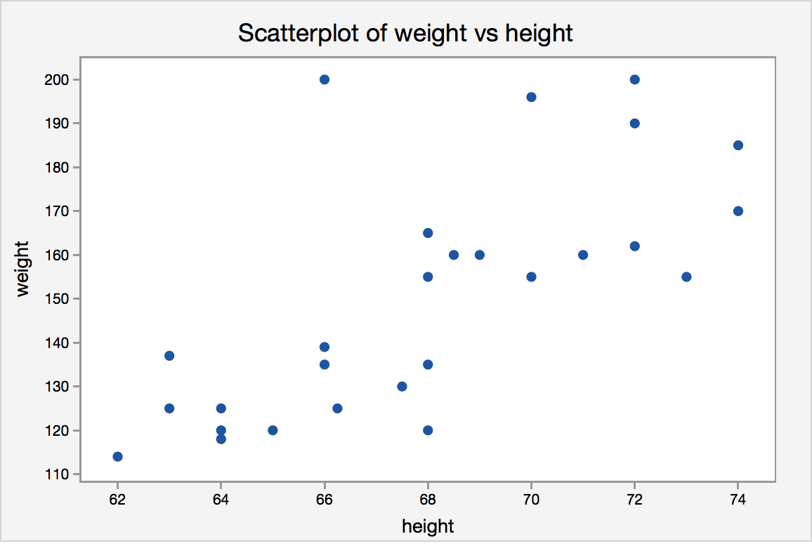{fig-align="center" width=8in}  

::: aside
- Should you model weight=f(height) or height=f(weight)? 
:::


::: notes
- Notice the many:1 correspondence of weight to height, may make prediction difficult
- notice the discrete nature of height measurements
- consider the theoretical relationship
- Does it matter whether height is measured in inches (adults) or centimeters (babies)?
- Ultimately it depends on your purpose. "All models are wrong, some models are useful"
-  Considerations: Theory; Modeling objective; Precision; Causal ordering
:::


## Model specification

-   Bias-variance tradeoff

          - Adding predictors always increases model fit
          - Yet parsimony often improves predictions

-   Many criteria drive model selection

          - Modeling objectives
          - Theoretical properties
          - Model flexibility 
          - Precedents & prior beliefs
          - In-sample fit
          - Prediction quality
          - Computational properties

## 

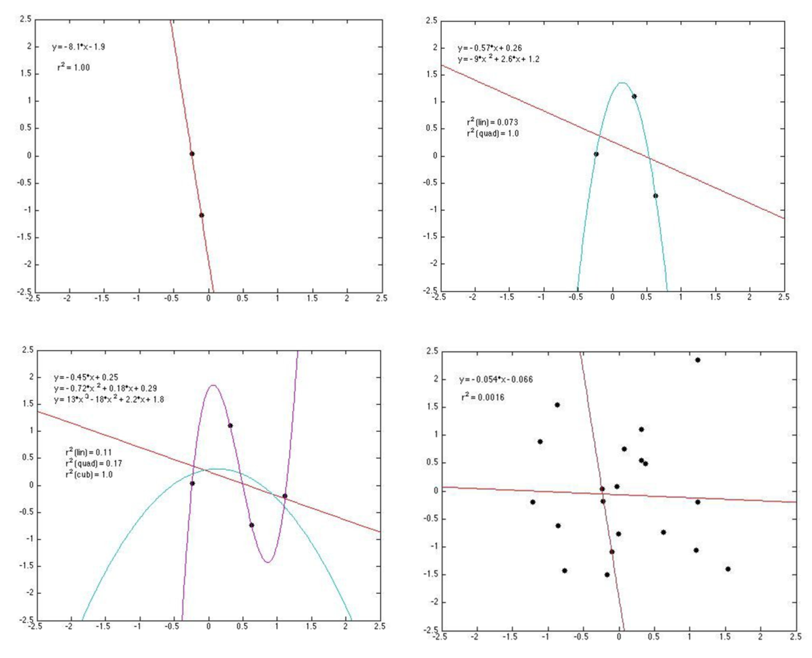{fig-align="center" width=8.5in}

::: notes
- Here we want to visualize the process of overfitting
- Let's imagine you're estimating demand at a B2B firm with few customers
- Suppose you had 2 data points. You standardize your variables and fit a line. R2 = 1 !!
- Then you get another data point. You standardize again and fit a quadratic. R2 = 1 !!
- Then you get a 4th data point. Standardize again & fit a cubic. R2 = 1 undefeated
- ... you see the problem here? ... consider # of degrees of freedom & # of parameters
- Finally, suppose you had lots of data as in lower-right. Then you might discover the relationship is actually quite weak, and you have been dramatically overestimating the strength of the relationship up until now
- Is the true relationship actually changing with your sample size? Or are you just getting more data points?
- [Source](https://www.quora.com/What-is-an-intuitive-explanation-of-over-fitting-particularly-with-a-small-sample-set-What-are-you-essentially-doing-by-over-fitting-How-does-the-over-promise-of-a-high-R%C2%B2-low-standard-error-occur){target="_blank"}
- Another example: Suppose you studied for an exam by memorizing every word of the textbook. Then the professor asked you questions that asked you to apply your understanding of the text. If the only thing you did was return the text contents, you would get the questions wrong. That would be overfitting.
:::

## How to evaluate overfitting?

- Retrodiction = "RETROspective preDICTION"

            - Knowing what happened enables you to evaluate prediction quality
            - We can compare different models and different specifications on retrodictive accuracy
            
- We can even train a model to maximize retrodiction quality ("Cross-validation") 

            - Most helpful when the model's purpose is prediction
            - More approaches: Choose intentionally simple models
            - Penalize the model for uninformative parameters: Lasso, Ridge, Elastic Net, etc.


## Cross-validation {.smaller}

-   General approach to evaluate retrodiction performance and overfitting risk among a set of competing models $m=1,...,M$. Algorithm:

1.  Randomly divide the data into $K$ distinct folds
2.  Hold out fold $k$, use remaining $K-1$ folds to estimate model $m$, then predict outcomes in fold $k$; store prediction errors
3.  Repeat 2 for each $k$
4.  Repeat 2&3 for every model $m$
5.  Retain model $m$ with minimal prediction errors, usually MAPE or MSPE

::: notes
-   We often learn that most reasonable models perform similarly
- It's really important to keep in mind that cross-validation is simply 1 input into the model selection criterion. It will matter most when our main objective is prediction. Even then it won't be the sole model selection criterion
:::

##

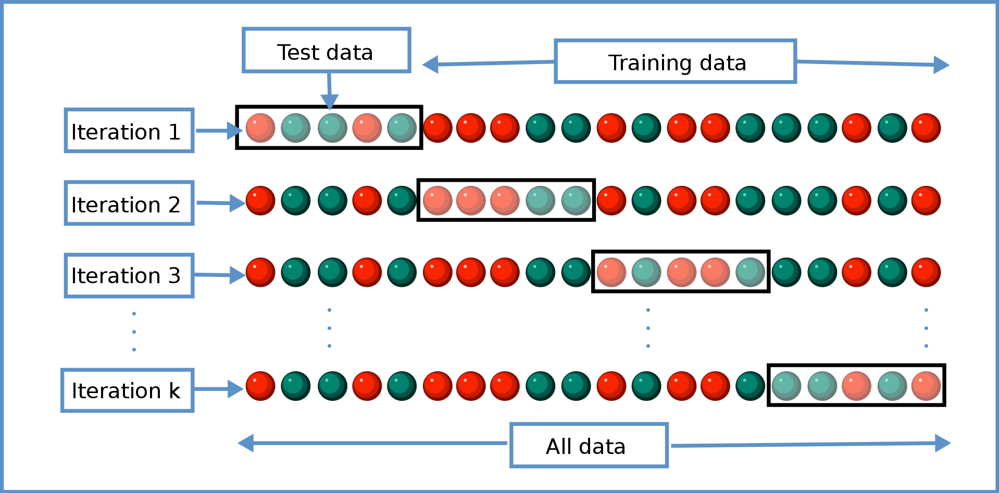{fig-align="center" width=9in}

            - You estimate every model K times (K=4 in the graphic)
            - Each estimation uses a different (K-1)/K proportion of the data
            - We evaluate each model's retrodiction quality K times, then average them
            - When K=N, we call that "leave-one-out" cross-validation
            - Important: cross-validation is just one tool in the box. Not the only
            - Final model selection also depends on theory, objectives, other criteria


## Ex-post evaluations {.smaller}

-   Can a model be robust to major changes in the data-generating process?
-   Non-random holdouts are strong tests, but can only be retrospective

{fig-align="center" width=6.5in}

::: notes
- [Source](https://drive.google.com/file/d/14zNalkNR6HKNjaKfewpCh9-fWReu06Mp/view){target="_blank"}
:::
 
## Het demand: Misuse Risks{.smaller}

-   Customer attributes should reflect differences in customer needs 

-   Customer data should be high quality (GIGO, Errors-in-variables biases)

-   Use needs to consider qualitative factors {effectiveness, legality, morality, privacy, conspicuousness, equity, reactance}
      -   Guiding principle (not a rule): <br>Using data to legally, genuinely serve customers' interests is usually OK
      -   Using private data against customer interest can harm some consumers, break laws, incur liability. One lawsuit can kill a start-up
      -   Major US laws: COPPA, GLBA, HIPAA, patchwork of state laws
-   Adding heterogeneity to a demand model does not resolve price endogeneity. Still need exogenous price variation

::: notes
- Overfitting is an empirical risk that could harm prediction quality
- Misuse is an analyst or management risk that could harm prediction utility
:::


# Some evidence

-   How does demand model performance depend on specification and training data?

## Research question {.scrollable .smaller}

-   Suppose we

    1.  Train demand model $M$ to predict mayonnaise sales ...

    2.  ... using information set $X$ ...

    3.  ... & choose targeted discounts for each consumer to maximize firm profits

        ```         
         - Essentially 3rd-degree price discrimination
        ```

-   Separately, using different data, we nonparametrically estimate how each individual responds to price discounts

    ```         
          - This gives us ground-truth to assess each household's response to price discount
          - But, the nonparametric estimate can't give counterfactual predictions; we need M for that
    ```

-   How do targeted coupon profits depend on $M$ and $X$?

    ```         
          - We use model M and data X to predict profits of offering targeted price discounts to particular households
          - We use ground-truth to calculate household response, then calculate profits across all households
          - We'll also compare to no-discount and always-discount strategies
    ```

::: aside
-   [Optimal Price Targeting (MkSc 2022)](https://drive.google.com/file/d/1ZruRntqyLfLyvYE7kCXCqUNJOfxhpwuq/view?usp=sharing){target="_blank"}
:::

## Lil bit of theory

-   For any price discount \< contribution margin, giving a targeted discount to...

    -   ... our own brand-loyal customer directly reduces profit

    -   ... a marginal customer may increase profit

    -   ... another brand's loyal customer does not change profit

-   So the demand model's challenge is to distinguish marginal customers from loyal customers
    
            - This research disregards the `post-promotion dip' for simplicity

::: aside
- Assumes no cost of targeted discount. A coupon cost would be more complex
:::


## Information sets $X$

1.  Base Demographics: <br>Income, HHsize, Retired, Unemployed, SingleMom

2.  Extra Demographics: Age, HighSchool, College, WhiteCollar, #Kids, Married, #Dogs, #Cats, Renter, #TVs

3.  Purchase History: BrandPurchaseShares, BrandPurchaseCounts, DiscountShare, FeatureShare, DisplayShare, #BrandsPurchased, TotalSpending

::: notes
-   The base demographic covariate set was motivated by prior literature
-   The purchase history data indicate how often each individual responded to past price discounts, and how brand loyal they were in the past to each brand, so those should be powerful predictors in this context
:::

## Demand Models $M$ {.scrollable}

1.  Bayesian Logit models (3)

    ```         
         - Based on utility maximization in which consumers compare utility and price of each available product
         - Includes Hierarchical and Pooled versions
    ```

2.  Multinomial Logit Regressions (2)

    ```         
         - Estimated via Lasso and Elastic Net to reduce overfitting
    ```

3.  Neural Network (2)

    ```         
         - Including single-layer and deep NN
    ```

4.  KNN: Nearest-Neighbor Algorithm (1)

5.  Random Forests (2)

    ```         
         - Including standard RF for bagging and XGBoost for boosting
    ```

::: aside
-   All models trained using 5-fold cross validation. See [paper](https://drive.google.com/file/d/1ZruRntqyLfLyvYE7kCXCqUNJOfxhpwuq/view?usp=sharing){target="_blank"} and [estimation code](https://drive.google.com/drive/folders/1Gmx8kxp2GSxLsA4edEhCrlRuMcf0LR37?usp=drive_link){target="_blank"} for further details
:::

## How do we answer the question?

1. Economic criteria: <br>What profit does each $M$-$X$ combination imply?

        - Depends on counterfactual predictions: What if we had selected different customers to receive coupons?
        - Quantifies prediction quality in profit terms

2. Statistical criteria: <br>How well does each $M$-$X$ fit its training data?

        - Generally, what the models are generally trained to maximize

Economic and statistical criteria can be very different

        - Doing well on one does not imply doing well on the other
        - Which one do we care more about in customer analytics?

## 

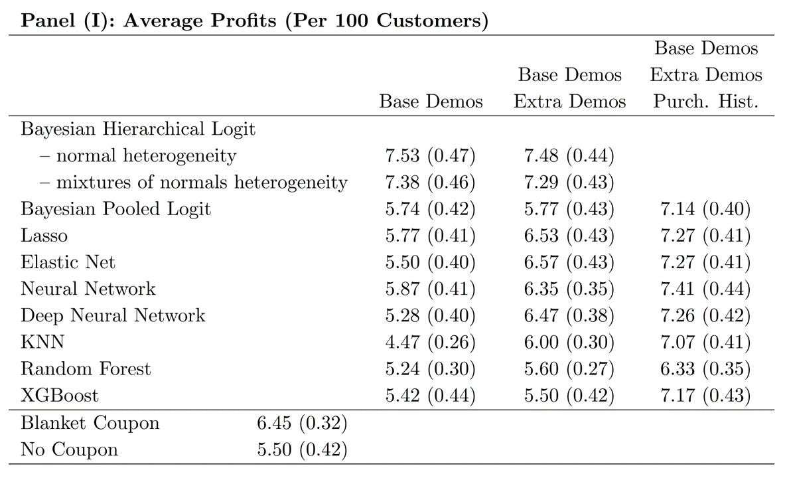{fig-align="center"}

::: notes
-   Notice first that giving everyone a coupon gives higher profits than giving nobody a coupon, suggesting maybe the firm was pricing too high previously. We can't typically assume optimal pricing in the marketplace, because demand changes, and most firms don't estimate demand
-   Bayesian Hierarchical Logit performs well even without purchase history data, because it constructs a likelihood for every consumer based on observed purchases
-   Among base demographics only, none of the ML models outperform the blanket coupon
-   With expanded demographics, ML models come closer to blanket-coupon profits
-   ML models perform much better when they have better purchase history data to learn from
-   Bayesian hierarchical logit is not defined for purchase history column because the model's likelihood essentially builds in-sample purchase history into the posterior through the unobserved heterogeneity distribution; that's why it does well even when it only has base demos
-   pooled logit does not allow for unobserved heterogeneity
:::

## 

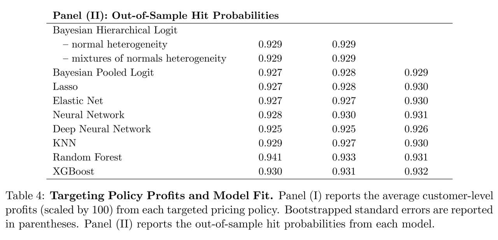{fig-align="center"}

::: notes
-   Profit dfce's across models are not because of major gaps in average prediction performance; they come from picking the right customers
-   Ranking models by average prediction error differs greatly from ranking them by expected profits!
-   Can skip over this if short on time
:::

## 

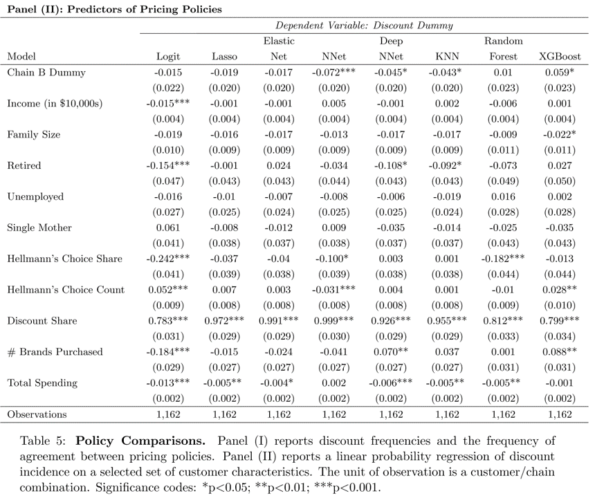{fig-align="center" width="8in"}

::: notes
-   Past purchases on discount are, by far, the strongest predictor of models' discount policies
-   Total spending is 2nd strongest
:::

## Takeaways

-   To predict behavior, use past behavior

-   Economic theory can help demand models to perform well with limited behavioral data

-   ML model performance depends critically on data quality & abundance. Counterfactual predictions do not always outperform economic models

-   Statistical performance $\ne$ economic performance

::: notes
-   This paper is useful overall but it has a couple of weaknesses
-   
    1.  They could have done more to show how price targeting relates to brand loyalty or nonloyalty
-   
    2.  I wish they had shown correlations between the 3 covariate sets
:::

# Conjoint Analysis

- Generates stated-preference data to estimate heterogeneous demand model, to enable counterfactual predictions and optimal product designs
- Probably the most popular quant marketing framework: >10k studies/year (Sawtooth 2008)

## Choosing Product Attributes

- Until now, we studied existing product attributes 

    - What about choosing new product attribute levels? 
    - Or what about introducing new products?

- Enter conjoint analysis: Attributes are <b>Con</b>sidered <b>joint</b>ly<br>Survey and model to estimate attribute utilities 

        - Autos, phones, hardware, durables
        - Travel, hospitality, entertainment
        - Professional services, transportation
        - Consumer package goods

- Combines well with cost data to select optimal attributes 

::: notes
- Developed in the 1960s
:::
        
## Conjoint analysis implementation {.smaller}

1. Identify $K$ product attributes and levels/values $x_k$ : These constitute points in your attribute space

          - Screen size: 5.5", 6", 6.5", 7"
          - Memory: 8 GB, 16 GB, 32 GB, 64 GB, 128 GB
          - Price: $199, $399, $599, $799, $999

2. Recruit consumer participants to make choices

          - Choose a representative sample of your target market
          - Offer 8-15 choices among 3-5 hypothetical attribute bundles

3. Sample from product space, record consumer choices

4. Specify model, i.e. $U_j=\sum_{k}x_{jk}\beta_k-\alpha_k p_j+\epsilon_j$ <br>and $P_j=\frac{\sum_{k}x_{jk}\beta_k-\alpha_k p_j}{\sum_l\sum_{k}x_{lk}\beta_k-\alpha_k p_l}$

          - Beware: p is price , P is choice probability or market share

5. Calibrate choice model to estimate attribute utilities

6. Combine estimated model with cost data to choose product locations and predict outcomes


## Sample choice task

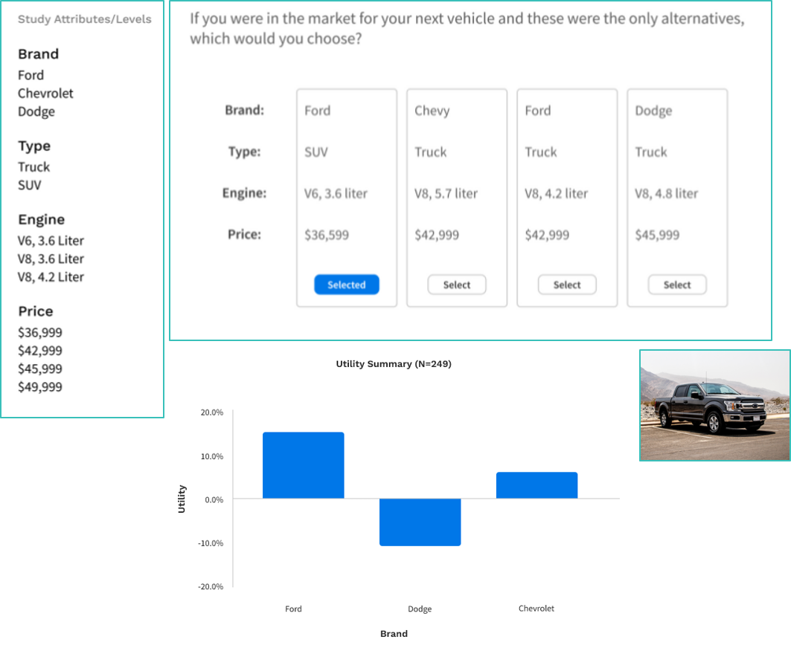{fig-align="center" width=7in}

::: aside
- Stated-preference vs revealed-preference
- [Source](https://sawtoothsoftware.com/conjoint-analysis){target="_blank"}
:::


## Case study: UberPOOL

- In 2013, Uber hypothesized  

      - some riders would wait and walk for lower price
      - some riders would trade pre-trip predictability for lower price
      - shared ridership could ↓ average price and ↑ quantity
      - more efficient use of drivers, cars, roads, fuel

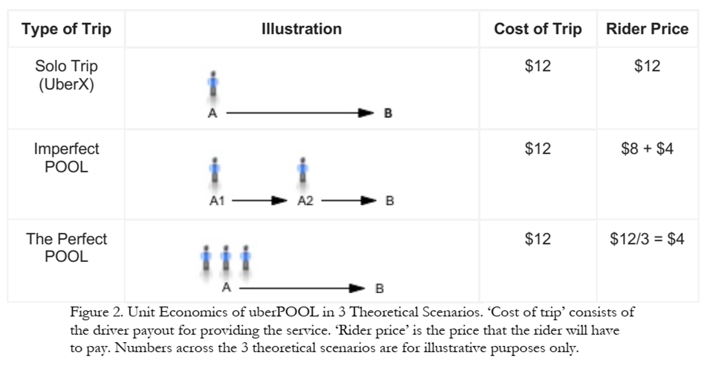{fig-align="center" width=6in}

::: aside
Source: [UberPOOL white paper](https://drive.google.com/file/d/1fjbMV3AdN7HedfAOMCcobaRnCEMq8vbh/view?usp=drive_link){target="_blank"}
:::

::: notes
- Important note: Figure 2 is mistaken in the paper. It has the illustrations flipped on bottom 2 rows. I corrected it in the slides.
:::

## Business case was clear! But ...

- Shared rides were new for Uber

            - Rider/driver matching algo could reflect various tradeoffs            
            - POOL reduces routing and timing predictability 

- Uber had little experience with price-sensitive segments

            - What price tradeoffs would incentivize new behaviors?
            - How much would POOL expand Uber usage vs cannibalize other services?

- Coordination costs were unknown

            - "I will never take POOL when I need to be somewhere at a specific time"
            - Would riders wait at designated pickup points?
            - How would comunicating costs upfront affect rider behavior?
            
- Uber used market research to design UberPOOL


## Approach

1. 23 in-home diverse interviews in Chicago and DC

          - Interviewed {prospective, new, exp.} riders to (1) map rider's regular travel, (2) explore decision factors and criteria, (3) a ride-along for context
          - Findings identified 6 attributes for testing

2. Online Maximum Differentiation Survey 

          - Selected participants based on city, Uber experience & product; N=3k, 22min

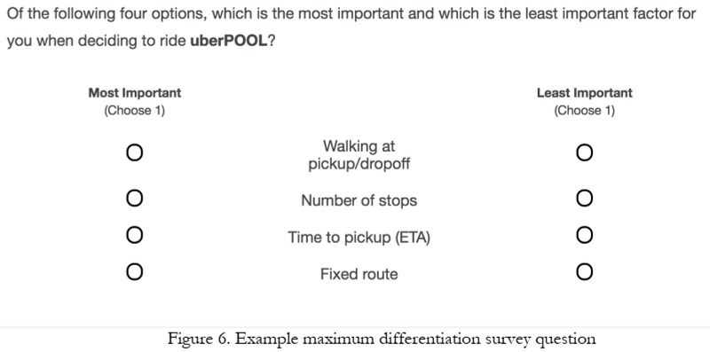{fig-align="center" width=5.7in}

## Maxdiff results {.smaller}

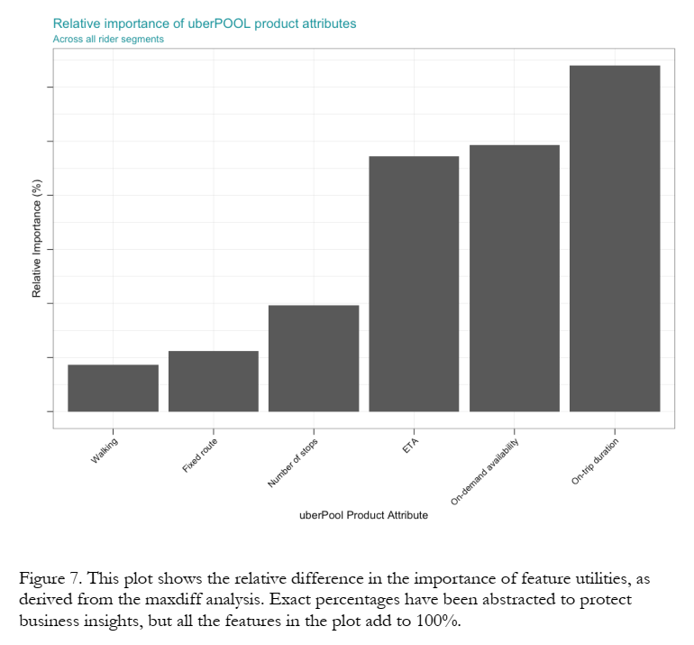{fig-align="center" width=5in}

::: aside
- Asking for most or least important, Maxdiff survey design is less susceptible to "scale effects" 
- That is to say, going from a 2-point to 3-, 5- or 7-point scale can change judgements
- Fixed route and number of stops were relatively unimportant, hence excluded from conjoint
:::

::: notes
Max diff is also called best-worst scaling
Avoids logical 'ranking' exercises that may predict choices poorly
Identifies most and least important attributes in a set
:::

## Conjoint Attribute Space

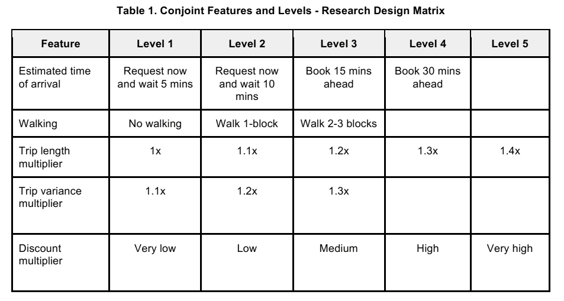{fig-align="center" width=9in}

::: notes
- Based on Maxdiff, Uber tested a conjoint analysis with ETA, walking, trip length, trikp variance and discount
- Notice that we can have different # of levels per attribute
- These are the data that go into the X variables in the model
- X also may include some customer attributes
:::

## Conjoint Sample Question

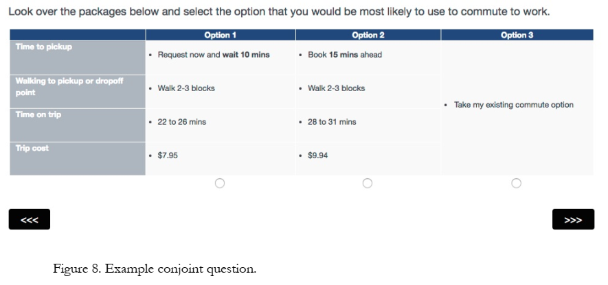{fig-align="center" width=9in}

::: notes
- This is an example of how the choice task looked to participants
- Data sample was 18,000 riders contacted via email in 2017
- Resulted in 1,934 completed surveys, response rate of 10.7%, 5.5 minutes/survey
- 5 respondents selected for $500 amazon gift cards
:::

## Conjoint Model

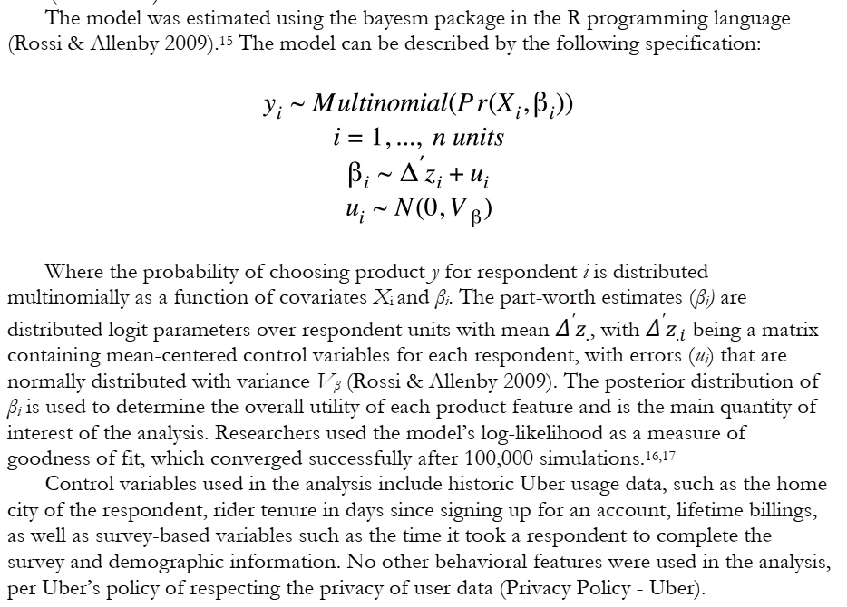{fig-align="center" width=5in}

::: aside
- This is a heterogeneous choice model estimated with an Hierarchical Bayesian estimation framework
- Similar to MNL, but assumes errors ~ joint normal (not iid), different s() function
:::

## Conjoint Findings

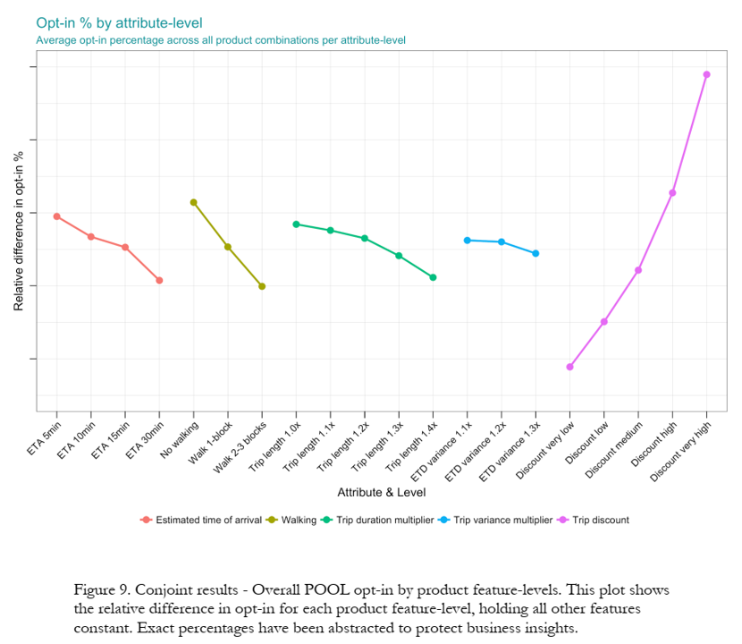{fig-align="center" width=8.5in}

::: notes
- Unfortunately, Uber did not give us the Y axis labels. That's common when firms worry about competitive secrecy
- We can see that ETA matters
- We can see that walking matters as much as ETA
- Trip length seems to matter also less over the range tested
- ETD variance doesn't matter as much, at least within the range tested
- Price matters a LOT
- Uber also found some heterogeneous results: 
- "Newer riders are more price sensitive"
- "Shorter commutes make you more likely to opt in but also more sensitive to walking than riders with a longer commute"
:::

## Product Redesign

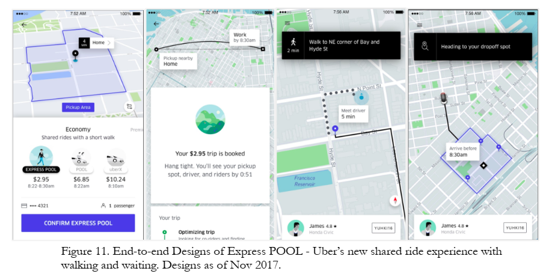{fig-align="center" width=9in}

::: notes
- This graphic shows how Uber redesigned the app to show product attributes
- Including how far to walk; how long to destination; variance in ETD; and price
- For example, POOL intentionally delayed matching by 40 seconds on average while searching for additional riders
- The representation of walking distance was nontrivial. The first version (leftmost panel) had to be redesigned (rightmost panel) when it led consumers to overestimate total walking
- The new product was launched with the tag line "Walk a little, save a lot'
:::

## Business Results

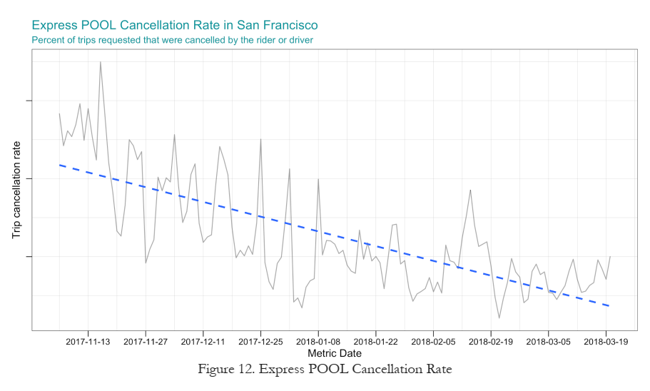{fig-align="center" width=9in}

::: notes
- Uber shared limited revenue data, but this is one clear example of improving efficiencies
- UberPOOL had been live in SF the longest; this looks like a meaningful decrease in cancellations
:::

## More Products

{fig-align="center" width=3in}

::: notes
- Apparently this approach is working out for Uber... 
- They are offering lots more options, including Uber Pet
:::


## Conjoint: Limitations, Workarounds{.smaller .scrollable}

- We may fail to consider most important attributes or levels

        - But we can consult with experts beforehand and ask participants during

- Additive utility model may miss interactions or other nonlinearities

        - But this is testable & can be specified in the utility model

- Exploring a large attribute space gets expensive

        - But we can prioritize attributes and use efficient, adaptive sampling algorithms

- Assumes accurate hypothetical choices based on attributes 

        - But we can train consumers how to mimic more organic choices 

- Participants may not represent the market

        - But we can measure & debias some dimensions of selection 

- Choice setting may not represent typical purchase contexts

        - I.e., stated preferences may not equal revealed preferences
        - But we can model the retail channel and vary # of competing products
        - We can perform conjoint regularly to evaluate predictive accuracy

- Participant fatigue or inattention

        - But we can incentivize, limit choices, check for preference reversals
        
- Consumer preferences evolve

        - But we can repeat our conjoints regularly to gauge durability, predict trends
        
::: notes
- ["the importance of making responses incentive compatible is evaluated. The most directly relevant evidence comes from laboratory experiments, where one can crisply compare environments in which the responses are incentive compatible and those where they are not. This distinction has typically been examined by just looking at choices made when the consequences are hypothetical or imagined, and comparing them to choices made when the consequences are real. There is systematic evidence of differences in responses across a wide range of elicitation procedures" (Harrison 2022")](https://drive.google.com/file/d/1GJ4SD3W81gWVRZv17rUmioeqUKUukYFd/view?usp=share_link){target="_blank"}
:::


# Wrapping up


## Class script

-   Add heterogeneity to MNL model
-   Individual-level heterogeneity via price-minutes interaction
-   Segment-level heterogeneity via segment-attribute interactions
-   Both

{fig-align="right" width=2in}

## Recap

-   Heterogeneous demand models enable personalized and segment-specific policy experiments 

-   Demand models can incorporate discrete, continuous and/or individual-level heterogeneity structures

-   Heterogeneous demand models fit better, but beware overfitting and misuse

- Conjoint analysis uses stated-preference data to map markets and predict profits of product locations in attribute space

{fig-align="right" width=2in}

## Going further

-   [Train (2009), Chapters 7-12](https://eml.berkeley.edu/books/choice2.html){target="_blank"}

-   [Reconciling modern machine learning practice and the bias-variance trade-off](https://arxiv.org/abs/1812.11118){target="_blank"}

- MGT 108R to design & run conjoint analyses

- Conjoint literature is huge. Good entry points: [Chapman 2015](https://drive.google.com/file/d/1hVKKbfyJgGLusiySXCFFAeBtIAFkTmH5/view?usp=sharing){target="_blank"}, [Ben-Akiva et al 2019](https://drive.google.com/file/d/1hJzBl9UHabKxQPmP1xI51VX7VlLuMAwH/view?usp=drive_link){target="_blank"}, [Green 2022](https://drive.google.com/file/d/1hWkhH1nNUnp03ScTb8q3HaGKodev06VG/view?usp=drive_link){target="_blank"}, [Allenby et al. 2019](https://drive.google.com/file/d/1hKkvptyW8noB1Iudra77yjdpPy9Nj7Tw/view?usp=drive_link){target="_blank"}


{fig-align="right" width=2in}
