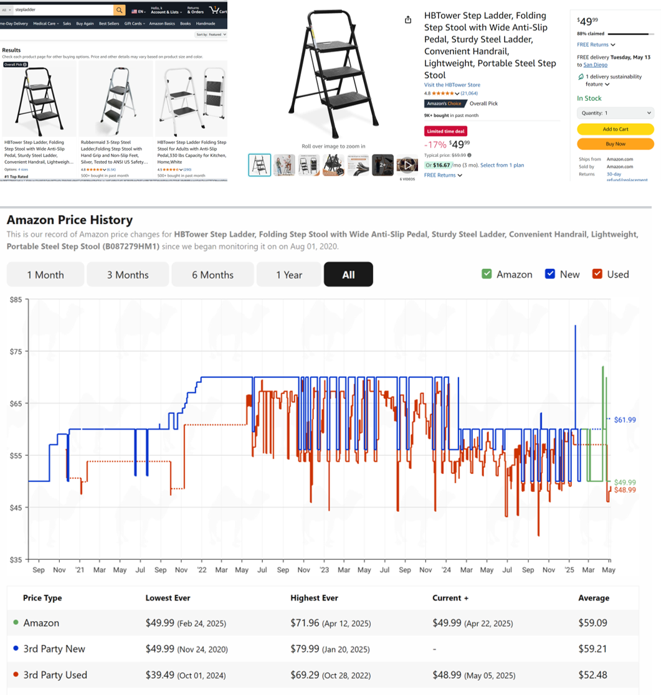
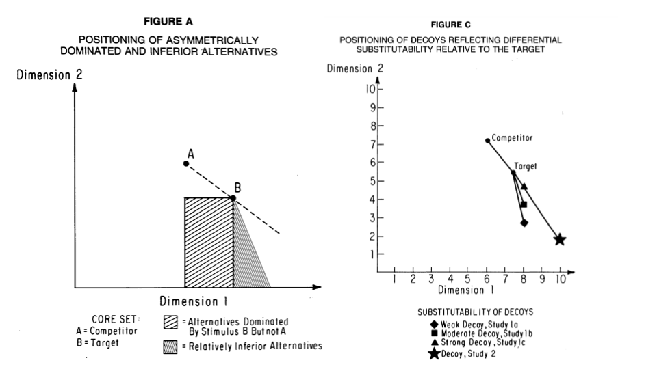
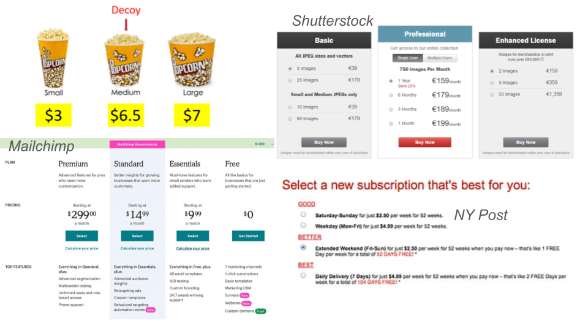
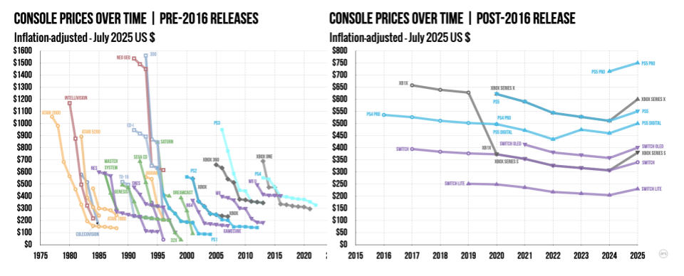

##

{fig-align="center" height="440px"}

::: {.callout-note appearance="minimal"}
As far as I know, most companies are not using sophisticated personalized pricing algorithms. It would be possible for them to do so. To me, this speaks to a widespread concern about the nontransparency of personalized pricing practices, and the possible use of personal data to work against customer interests.
:::

::: {.source-url}
[FTC (2025)](https://www.ftc.gov/news-events/news/press-releases/2025/01/ftc-surveillance-pricing-study-indicates-wide-range-personal-data-used-set-individualized-consumer){target="_blank"}
:::

##

{fig-align="center" height="462px"}

::: {.callout-note appearance="minimal"}
Costco practices indicate the value and versatility of using price as a signaling tool. But why do you think they use price, rather than just putting signs on the shelf?
:::

::: {.source-url}
[EBITDA Catalyst](https://www.ebitdacatalyst.com/pricing-strategy/costco-prices-bargains-brilliance-brand-consistency){target="_blank"}
:::

::: notes
Possible explanations:
- Minimizes promotion signaling costs, keeps shelf uncluttered
- Regular Costco customers pay a lot of attention to price
- Maintain the EDLP brand image (illusion), discourage strategic purchase timing, minimize hi-lo perceptions
- Gives Regulars advantage over newbies (price discrimination)
:::

##

{fig-align="center" height="495px"}

::: {.callout-note appearance="minimal"}
Camelcamelcamel and other price trackers can help you decide whether to buy now or wait. How many shoppers use them?
:::

::: {.source-url}
[camelcamelcamel](https://camelcamelcamel.com/product/B087279HM1?tp=all&cpf=amazon-new-used){target="_blank"} | See also PriceSpy, SmartScout; but not Honey or Keepa
:::

# How firms set prices
- Importance and challenge
- Common approaches
- Economic Value to the Customer
- Van Westendorp

## Pricing importance {.smaller}

::: {style="font-size: 0.85em;"}
- #2 topic after two-sided value creation
- Widely cited research by McKinsey
    - 1% price increase can lead to 11% profit increase
    - 1% price decrease can lead to 8% profit decrease
    - Logic assumes no decrease in quantity
    - Correlations, but widely misinterpreted as causal
- Consultants say most companies price too low; price is low-hanging fruit
- Counterpoint: "Your margin is my opportunity"
:::

::: {.callout-note appearance="minimal"}
Competition usually leads to thin margins. 5-15% is common. Therefore, minor pricing improvements can lead to substantial profit improvements.
:::

## Price changes are risky & scary

{fig-align="center" height="405px"}

::: {.callout-note appearance="minimal"}
Internal costs are easiest to discover. Competitor actions are the second-easiest to track and know. Customer factors are usually the biggest gap. Why do you think that is?
:::

## How firms usually set prices {.smaller}

- Most common: Limited-data analyses
    - EVC / Value pricing, Competitor price benchmarking, Cost-based pricing

- Stated-Preference Data
    - Open-ended: How much are you wtp? $___
    - Prompted: Would you buy (product) at ($price)?
    - Interviews, Focus Groups, Von Westendorp surveys
    - Conjoint Analysis: Designs can be incentivized or not

- Revealed-Preference Data
    - Simulated purchase environments, Test markets
    - Algorithms (bandits, rev mgmt), Experiments ([Amazon pricing labs](https://drive.google.com/file/d/1dJBGbOY-SwwIoNFjMvIBTXMmwtT_VA__/view){target="_blank"})
    - Demand estimation
        - Requires data, exogenous price variation, human attention/expertise

- Customer co-determination
    - Monopsony, auctions, negotiation, pay-what-you-want

- None: Seller takes market price

::: notes
- Those first three are goldilocks: too high, just right, too low
:::

## Pricing strategies are secret

- What not announce your pricing strategy?

- We can survey pricing managers anonymously, but (i) nonrandom selection, (ii) survey design inconsistencies, and (iii) self-reporting biases

- Salt taken, let's look at pricing manager surveys

::: {.callout-note appearance="minimal"}
What are the costs and benefits of price strategy transparency?
:::

::: notes
- Competitor can predict your price changes & "play you like a fiddle"
- Your pricing approach may draw criticism, you may be fired
- Little to no upside of announcing, loads of downside
:::

##

{fig-align="center" height="520px"}

::: {.callout-note appearance="minimal"}
Cost-driven pricing and Competitor price-tracking were the two most common approaches, by far. Why?
:::

::: {.source-url}
[Keeney, Lawless & Murphy (2010)](https://drive.google.com/file/d/1_g6l5VJfzeU00PYR_sjYmfzfrNR39LBE/view?usp=drive_link){target="_blank"} | 1,000 Irish businesses surveyed — how often is each approach used?
:::

##

{fig-align="center" height="460px"}

::: {.callout-note appearance="minimal"}
Digital-native businesses are more savvy, on average. Why do you think Value-based pricing correlates so strongly with annual revenue?
:::

::: {.source-url}
[OpenView (2023)](https://openviewpartners.com/blog/state-of-saas-pricing-2023){target="_blank"} | Survey of SaaS pricing managers, by ann. rev. | Top 3 strategies so common that others are unreported
:::

##

{fig-align="center" height="400px"}

::: {.callout-note appearance="minimal"}
This survey sample came from a platform promoting pricing algorithms; the bias is clear in the results. But even still, many firms using algorithms do not update their prices very often. Why?
:::

::: {.source-url}
[Spann et al. (2024)](https://drive.google.com/file/d/1_SjOjLa1Gf_AXdfhef0pME6RKHqwNVX8/view?usp=sharing){target="_blank"} survey of pricing managers on [EPP](https://www.pricingplatform.com/){target="_blank"}, a pricing/customer-growth nfp promoting algorithms
:::

::: notes
nfp == not-for-profit
:::

## Value Pricing: Price in (cost, wtp)

- But... how do you learn wtp? Esp. if you have not sold before?
    - For large time/budget: Conjoint, simulated purchase environments, test markets, ...
    - For small time/budget: Economic Value to the Customer (EVC)

- EVC: estimates customer benefit from a product, relative to the next best alternative

- EVC & VP are often used by new firms, highly differentiated products, firms lacking credible market research and related expertise

- Steps: 1. Calculate EVC, 2. Choose a price in (Cost, EVC)

::: {.callout-note appearance="minimal"}
Some of you will start companies, and you will use EVC to identify value-improvement opportunities, investment potential, and price ceiling; and you will likely recalculate EVC many times as you refine your offering
:::

::: notes
- You might need EVC for your start-up
- 
:::

## How to calculate EVC(x$\vert$y)

1. Select the best available alternative y and find its price
    - Interview target customers to learn how they solve the core need (y)
    - If wrong y, EVC estimate will be too high

2. Determine non-price costs of using y and x
    - Include start-up costs and/or post-purchase costs
    - Make sure NonPriceCosts(x) exclude the price of x (why?)

3. Determine the incremental economic value of x over y
    - Usually, functional benefits or non-price cost savings

4. EVC(x$\vert$y) = Price(y) + ( NonPriceCosts(x) - NonPriceCosts(y) ) + IncrementalValue(x$\vert$y)
    - In practice, 99% of effort is getting the assumptions right

## EVC tips

- y might not be a commercial product

- EVC and y often vary across customer segments
    - Calculate heterogeneous EVC(x|y) for multiple y

- Qualitative factors influence price selection in (cost,EVC)

- If EVC(x$\vert$y)<0, reconsider target customer and/or value proposition

## Example: What is EVC(Batteroo Boost$\vert$y)?

- The Batteroo Boost is a durable metal sleeve that increases disposable battery life by 800%. With a thickness of just 0.1 millimetres, the sleeve can be fitted over any size battery, in any size compartment

- Assume the typical battery costs \$0.50

::: {.callout-note appearance="minimal"}
Batteroo Boost raised almost \$400k on [Indiegogo](https://www.indiegogo.com/en/projects/bobroohparvar/batteroo-extend-battery-life-significantly){target="_blank"}
:::

::: notes
- Reference product is no sleeve
- Batteroo Boost allows the consumer to avoid buying 8 extra batteries, resulting in a potential cost savings of 8*0.50=4.00 for each battery whose life is extended
- Suppose one Batteroo Boost is durable enough to extend the lives of 10 batteries
- Then IV = 10*4 = 40 and EVC=40
- You might reasonably assume other benefits, such as increased usefulness of battery-operated devices, or reduced nuisance costs of changing and storing batteries, but these are hard to quantify with confidence.
- Note: when selecting a price, you have to consider psychological factors such as:
- Discount factors & the time horizon over which consumers are willing to amortize a purchase
- Risk that Batteroo Boost benefits may not work as advertised
- Consumer skepticism about marketer claims
- I would recommend a price that is far, far below EVC in this case
- (Price was 2.50 in 2019)
:::

## Choosing p in (cost, EVC) {.smaller}

:::: {.columns}

::: {.column width="70%"}
- Pricing 'Thermometer:' How much inducement do you give your customer?

- Some advise:  $Price = Cost + (EVC - Cost) \cdot z\%$
    - I've heard z = 25%, 33%, 50%, and 70%
    - Do you want profits or growth?

- Human factors to consider:
    - Perceived benefit - actual benefit
    - Perceived costs - actual costs
    - Consumer price sensitivity, reference price
    - Established pricing benchmarks
    - Fairness, signaling
    - Customer risk of adoption, skepticism; brand credibility

::: {.callout-note appearance="minimal"}
Why do you think EVC exceeds Perceived Value?
:::
:::

::: {.column width="30%"}
{fig-align="center"}
:::

::::

::: notes
- These factors also pertain to other price setting approaches
:::

## Why not just ask customers for their WTP?

- Hypothetical bias: Stated answers $\ne$ real behavior

- They don't know: WTP is constructed in context, not stored in memory

- Strategic bias: Respondents may overstate or understate to influence firm's product launch decision or pricing decision

- Lack of competition: Purchases require tradeoffs vs. alternatives

- Social desirability/Identity: People may signal self-image ("I'm not cheap")

::: {.callout-note appearance="minimal"}
Miller et al. (2011) find that incentivized methods recover true demand curve better than non-incentivized methods; non-incentivized methods underestimate price sensitivity
:::

::: {.source-url}
[Miller et al. (2011)](https://drive.google.com/file/d/1F2YyFCKyvmQblrFh_hM17dt5ZctNhfbx/view?usp=sharing){target="_blank"}
:::

## Van Westendorp Pricing Model

- Goal: Elicit distributions of customer price perceptions

- Survey target customers: At price $X is (product)...
    - Too Cheap? I.e., that you would question its quality
    - Acceptably Cheap?
    - Acceptably Expensive?
    - Too Expensive? I.e., that you would not consider buying

- Ask for many values of $X, then plot 4 CDFs
    - Too Cheap and Acceptably Cheap decrease with price
    - Acceptably Expensive and Too Expensive increase with price
    - Crossing points bound the "Acceptable Price Range"

::: {.source-url}
R package [pricesensitivitymeter](https://cran.r-project.org/web/packages/pricesensitivitymeter/pricesensitivitymeter.pdf){target="_blank"}
:::

## {.smaller}

{fig-align="center" height="300px"}

- "Too cheap" meets "Acceptably Expensive": "Point of Marginal Cheapness"
    - VW says: Price<PMC signals poor quality

- "Acceptably Cheap" meets "Too Expensive": "Point of Marginal Expensiveness"
    - VW says: Price>PME prices out most of your market

- "Too Cheap" meets "Too Expensive": Possibly min. # of price-refusers

- "Good Value" meets "Expensive": Possibly max. # of price-accepters

- These confusing ideas are largely hypothetical and not well validated

::: {.source-url}
[Van Westendorp (1976)](https://docs.google.com/document/d/1uV89dTqNuPz0qAb72jgUMmLl7T0x9Hi_qcY9SteaRPQ/edit?usp=sharing){target="_blank"}
:::

::: notes
- Extensible to also ask about stated purchase intentions; Newtom/Miller/Smith 1993, "A market acceptance extension to traditional price sensitivity measurement"
- Thinking about intersections of 4 CDFs is sufficiently difficult that it will dazzle some consulting clients
- Probably best to use this to evaluate other price-setting approaches outputs, rather than on its own to set price
:::

# Pricing factors

- Human Factors
- Economic Factors
- Price Elasticity of Demand

## Signals and *Perceived Quality* {.smaller}

- Signals of high quality
    - High prices, Brand names, Warranties, Return policies, Ad spending (e.g., Super Bowl ads)
    - Costly signals when the firm doesn't deliver
    - Brand reputation can convey credibility

- Signals of low quality
    - Low prices, Price promotions, Price-matching guarantees
    - Low-quality ads, or too many ads, "B-list" celebrities
    - Signals that look too good to be true
    - "If it's so good, why is it so cheap?''

- Prescription: Price consistent with your quality position in the market
    - Otherwise, you undercut your own message and leave money on the table
    - Findings replicate in numerous contexts

::: {.callout-note appearance="minimal"}
Suppose you offer the best product in the market at the lowest price; will you be able to corner the market?
:::

::: notes
- In marketing we focus on perceived quality, because consumers typically don't know actual quality.
- Consumers typically rely on signals to form perceptions about unobserved quality
:::

## Human factors: Price as a signal

{fig-align="center" height="400px"}

::: {.callout-note appearance="minimal"}
Price can be a powerful signal of quality. Occasionally, we even see reverse-price-wars. How much do you think Nadal paid for that haircut?
:::

::: notes
- This is Julien Farel, who operates a high-end salon in Midtown East, NYC
- That's Rafael Nadal in the first picture
- So this Farel guy must be a great stylist right?
- Or maybe he gives Nadal free haircuts in exchange for the photo op?
- He'll cut your hair for the low low price of $1250
- If you need the best haircut ever, where do you go?
- How do you know which stylist is the best one?
- Price can be a powerful signal of quality
- Sometimes (rarely) we even see reverse-price-wars, as high-end service providers try to outdo each other
:::

##

{fig-align="center" height="450px"}

::: {.callout-note appearance="minimal"}
Perceived price is affected by objective price, price presentation, and perceived price fairness, which in turn is driven by consumer factors like experiences, income, reference price, and comparison to others. MGT 104 & 107 go deeper
:::

::: {.source-url}
[Krishna (2009)](https://drive.google.com/file/d/1tPZQ0CnfjswEc4t9loBHXLlQ0hOWmUtR/view?usp=drive_link){target="_blank"}
:::

::: notes
Price signaling effects are an example of a `human factor' in pricing
Many such human factors have been documented by experimentalists
The basic idea here is that price and price presentation can affect both perceived price and perceived price fairness
Perceived price is also affected by internal consumer factors, such as past experiences, income, reference price, etc
We'll go through a few more (inexhaustive)
If you really like this stuff, take Ania's consumer behavior elective in winter quarter
:::

## Human factors: Cognitive Costs

- Total customer cost is &ensp;&ensp;= Cognitive cost to decide the purchase &ensp;&ensp;\+ Physical cost to acquire the product &ensp;&ensp;\+ Financial payment

- Simplicity can increase sales. Remove frictions

{fig-align="center" height="155px"}

::: {.callout-note appearance="minimal"}
Have you ever abandoned a purchase because you had to jump through too many hoops? 72% of e-commerce carts get abandoned without purchase. Counterpoint: A limited amount of friction can help sellers of complex products to screen customers, engage customers, and communicate with customers
:::

::: {.source-url}
[Bertini et al. (2023)](https://archive.ph/Jy3b6){target="_blank"}
:::

## Human factors: Perceived prices

- Which is the better bargain?
    - Regular price $0.89, sale price $0.75
    - Regular price $0.93, sale price $0.79

::: {.callout-note appearance="minimal"}
How do you evaluate these two pairs of price discounts? How do most consumers evaluate them?
:::

::: notes
- Context was margarine sales; 80+pct chose 1st pair; most likely explanation:     (in)numeracy makes people think a drop in the 10s place of 2 is larger than a drop in the 10s place of 1
:::

## Left-digit bias: Demand Effects

{fig-align="center" height="400px"}

::: {.callout-note appearance="minimal"}
Strulov-Shlain used ground coffee data to estimate price elasticity within each ten-cent range of prices observed in the category, showing demand discontinuities at dollar boundaries. But maybe the shoppers just hadn't had their coffee yet?
:::

::: {.source-url}
[Strulov-Shlain (2023)](https://drive.google.com/file/d/10ozvSRKXBvL_W95IPVqFCMUCn1kUW-Js/view?usp=drive_link){target="_blank"}
:::

::: notes
- This graph shows grocery product demand at quasi-random price points, estimated in a careful way by Avner Strulov-Shalin at U-Chicago
- There are clear discontinuities in price elasticity when the left-most digit changes
:::

## Left-digit bias: Lyft rides

{fig-align="center" height="400px"}

::: {.callout-note appearance="minimal"}
Lyft ran a huge pricing experiment with 21+ million riders. Offer acceptances jumped discontinuously at dollar thresholds. (But why did they draw their demand curve upside down?!)
:::

::: {.source-url}
[List et al. (2023)](https://drive.google.com/file/d/1Gqrow1qhiQ8lw6gHBLZp8UPkCaoTp152/view?usp=drive_link){target="_blank"}
:::

::: notes
- This graph shows the empirical probability of a Lyft rider declining a ride, depending on the price estimate quoted in the app
- Clearly, increasing the digit before the decimal has a discontinuous effect on ride probability
- Source: John List at U-Chicago
:::

## Human factors: Price salience

:::: {.columns}

::: {.column width="60%"}
- Show the price early, late or never?
    - Drinks in a loud nightclub
    - USPS "Forever Stamps"
    - Price advertising, coupons

- Price salience emphasizes Savings or Exclusivity

::: {.callout-note appearance="minimal"}
"If you have to ask, you can't afford it." When should prices be salient (upfront, hard-to-miss, repeated) vs. hidden (revealed late, easy to miss, costly to obtain)?
:::
:::

::: {.column width="40%"}
{fig-align="center" height="423px"}
:::

::::

## Human factors: Anchoring {.smaller}

- "You are lying on the beach on a hot lazy afternoon.  For about an hour now, you have been thinking about an ice-cold bottle of your favorite beer.  One of your friends gets up to make a phone call and offers to get you your favorite beer from a *small run-down grocery store* on the way back.  Your friend says that the beer might be expensive and asks the maximum price that you are willing to pay.  If the price is higher, your friend won't buy the beer.  What is your maximum price?
- ... *fancy resort hotel* ...

::: {style="font-size: 1.3em;"}
- Your turn:
    - You'd like a fancy boba. The tea shop on campus sells them for $11. The location on Balboa is selling them for $3 today. Do you drive to Balboa?
    - You'd like a Yeti cooler. Target on campus is selling them for $118. The location on Balboa is selling them for $110 today. Do you drive to Balboa?
:::

::: {.callout-note appearance="minimal" style="font-size: 1.3em;"}
Where do people get their reference prices? And when does bargain hunting make us happy?
:::

::: {.source-url}
Classic study by [Thaler (2008)](https://drive.google.com/file/d/1LAvYXVvUAhT6r2-MB6tt0drSb7_Y092J/view?usp=drive_link){target="_blank"} in Marketing Science
:::

::: notes
- AKA Reference price
- This was back when we had to get up to make phone calls
- This was back when we made phone calls
:::

## Decoy Effects {.smaller}

:::: {.columns}

::: {.column width="50%"}
- Brand A: Rated 50/100, priced at 1.80
- Brand B: Rated 70/100, priced at 2.60

- 33% chose A
:::

::: {.column width="50%"}
- Brand A: Rated 40/100, priced at 1.60
- Brand B: Rated 50/100, priced at 1.80
- Brand C: Rated 70/100, priced at 2.60

- 47% chose B (why?)
:::

::::

{fig-align="center" height="276px"}

::: {.callout-note appearance="minimal"}
Proportionality: New items take share from existing items in proportion to their original shares (MNL: IIA property) 
Substitutability: New item takes share disproportionately from more similar items (Heterogeneous Logit) 
Attraction: New item may increase the relative desirability of similar items, especially within contextual evaluations (decoy) 
All three effects may operate simultaneously to explain customer purchase data
:::

::: {.source-url}
[Huber & Puto (1983)](https://drive.google.com/file/d/1ELVlLMa-ihr6xKt8thIJT43UhdJeUabX/view?usp=drive_link){target="_blank"}
:::

::: notes
- You see this frequently in SAAS
- Huber and Puto (1982)
:::

##

{fig-align="center" height="500px"}

::: {.callout-note appearance="minimal"}
Decoy pricing is common in some industries, especially Software-as-a-Service (SaaS). Sometimes price menus become cluttered
:::

## When do Attraction/Decoy Effects Obtain? {.smaller}

- "Ninety-one attempts to produce an attraction effect produced only 11 reliable effects." --Yang and Lynn (2014)

- "...we are aware of only five studies that report an attraction effect using choice stimuli that are not highly stylized...we could not replicate the results of any of these studies..." Authors conducted 27 more studies in which attributes could be sensorially experienced, finding 0 decoy/attraction effects. --Frederick et al. (2014)

- When a product menu includes dominated options, consumers mistrust the choice architect and reduce purchase incidence -- Bogard et al. (2024)

- Large-scale field evidence: Wu & Cosguner (2020) found significant dominant/dominated effects in calibrated model-based simulations of online diamond sales; Devine et al. (2025) found a robust but small effect of 1% in retail wine sales; Rafai et al. (2021) found no evidence when experimentally adding dominated options to online flight search results

::: {.callout-note appearance="minimal"}
Decoy pricing can work, but it has been overextended beyond its original boundaries of clear dominance/dominated relationships. Be careful implementing decoy pricing outside of vertical product differentiation, and never ever implement without careful testing
:::

::: {.source-url}
[Yang and Lynn (2014)](https://drive.google.com/file/d/1G25KZLRudBTPHkpND8ep1l2MgiInBHH4/view?usp=drive_link){target="_blank"} | [Frederick et al. (2014)](https://drive.google.com/file/d/1mpr9MOVTrHur09bSvtnsHCtnUTJp-VfP/view?usp=drive_link){target="_blank"} | [Bogard et al. (2024)](https://drive.google.com/file/d/1Xws8mAReVjmUPtMA_RorvCDdkC2Qb-so/view?usp=drive_link){target="_blank"} | [Wu & Cosguner (2020)](https://drive.google.com/file/d/1xQCTEwnx2KCTvR2q7raIBMu_Mb-HlAAs/view){target="_blank"} | [Devine et al. (2025)](https://drive.google.com/file/d/1HzljlzCUr34q7TEDqou1z2g6iCgo0J8u/view?usp=drive_link){target="_blank"} | [Rafai et al. (2021)](https://drive.google.com/file/d/1OS9uoex-nSkhCG_19bwdEiCkZ4nabeEh/view?usp=drive_link){target="_blank"}
:::

## Economic factors: Price discrimination

- Amazon v. B&N

- Purchase time: Airline, Cruise tickets
- Needs: e.g. Business vs. Home segments
- Skimming by delivery time: Movie release windows
- Geography: Typically accounts for 20\% of variation in online prices
- Quantity: Cups of coffee, Paper towels
- New/loyal customer, merit (veterans, seniors), ability to pay/sliding scale, value provided, cost of supply

::: {.callout-note appearance="minimal"}
Why set only one price when you can set many prices instead? Always frame differences as discounts: a "student discount" sounds much nicer than the equivalent "non-student premium." Framing is more acceptable when it advantages a vulnerable segment, without explicitly excluding another segment
:::

##

{fig-align="center" height="400px"}

::: {.callout-note appearance="minimal"}
Game consoles used to use price skimming to price discriminate between gamers, but that appears to have stopped. Why?
:::

::: {.source-url}
[Ars Technica](https://web.archive.org/web/20260211191015/https://arstechnica.com/gaming/2025/08/todays-game-consoles-are-historically-overpriced/){target="_blank"}
:::

::: notes
A very big deal in this graph: Nintendo Switch price had no nominal decrease for 5-year span, longest ever, an apparent sign of fantastic demand persistence. Also may show diminishing category competition, or a strategic decision to maintain high margins.
:::

## Economic factors: Beware a price war! {.smaller}

- If you explicitly mention a competitor's price
    - You make Customer aware of Competitor
    - Competitor may notice: You invite them to match or retaliate

- Better to price-compare vs. unnamed/generic competitor

- Who wins a price war?
    - Only one winner: Customer
    - All firms suffer, some die
    - Most likely to survive: Seller with lowest cost structure
    - Smart firms avoid price wars & keep costs secret

{.absolute bottom="20" right="20" height="100px"}

::: {.callout-note appearance="minimal"}
Why does cost secrecy usually help to avoid price wars?
:::

## Price Elasticity of Demand {.smaller}

- $elas.=\frac{d(lnq)}{d(lnp)}=\frac{p}{q}\frac{dq}{dp}\le 0$; Typically becomes more negative as price falls

- Elasticity is "scale-free" : % change response to % change, because a change in ln(X) is approximately equal to the % change in X

- For $-1<elas.<0$, demand is inelastic; for $elas.<-1$, demand is elastic

- Elasticity calculation depends on method
    - We can approximate $\frac{dq}{dp}$ with two points and no demand model
    - If we specify demand model, we can calculate $\frac{dq}{dp}$ based on the model
    - Elasticity calculations will be sensitive to interval widths and model assumptions

::: {.callout-note appearance="minimal"}
Revenue is maximized at $elas.=-1$. For $elas.<-1$, you can increase revenue by reducing price. For $elas.>-1$, you can increase revenue by increasing price. Profits are maximized at $MR=MC$
:::

## Price Elasticity of Demand

- $elas.=\frac{d(\ln q)}{d(\ln p)}=\frac{p}{q}\frac{dq}{dp}$

- A special class of demand functions have constant elasticity
    - $q=e^\alpha p^\beta$ for $\alpha>0$ & $\beta>0$, then $elast.=\beta$
    - Implies $\ln q=\alpha+\beta \ln p$, called "log-log"
    - Need exogenous price variation to estimate a causal effect $\beta$; otherwise, $\beta$ should be interpreted as a correlation

- C.E. imposes a restrictive shape on demand & enables easy price optimization, given marginal cost data, but if C.E. shape is incorrect, C.E. approach will lead to suboptimal pricing

::: {.callout-note appearance="minimal"}
C.E. demand is popular because it is easy. However, C.E. assumes that customers with different wtp all have the same price sensitivity. When might that make sense, or not make sense?
:::

## Price optimization: CED vs. het. MNL {.smaller}

:::: {.columns}

::: {.column width="50%"}
**Constant Elasticity of Demand**

- Assume the convenient function:
    - $q(p) = e^\alpha p^\beta$

- This implies:
    - $\ln(q) = \alpha + \beta \ln(p)$

- Slope coefficient is elasticity:
    - $\frac{d\ln(q)}{d\ln(p)} = \frac{p}{q}\frac{dq}{dp} = \beta$

- You can show that maximizing $\pi=(p-c)q(p)$ yields optimal price $p^*$:
    - $p^* = \frac{c}{1 + \frac{1}{\beta}}$
:::

::: {.column width="50%"}
**Het. MNL Demand Model**

- Estimated sales from market-share predictions at each candidate price:
    - $q(p) = M \hat{s}(p)$

- Profit at each candidate price:
    - $\pi(p) = q(p) (p - c)$

- Try many candidate prices, pick the one that maximizes profit:
    - $p^* = \arg\max_{\{p\}} \pi(p)$
:::

::::

::: {.callout-note appearance="minimal"}
RHS is called a "grid search." It's less mathematically elegant but more robust, and generally works better. You can use a grid search to evaluate whether demand elasticity is constant (how?); but you cannot use CE Demand to predict the results of a grid search
:::

{.absolute bottom="20" right="20" height="60px"}

## Considerations & Extensions

- We typically assume marginal cost c is locally constant, because accounting systems are usually not designed to estimate how c changes with q

- We can use our demand model to predict how we should respond to another firm's price change, so long as q(p) depends on the other firm's price (as in the MNL or het. MNL)

- We can calculate optimal multiproduct pricing by including a sum across products in our profit function

::: {.callout-note appearance="minimal"}
We'll optimize product line pricing in week 7
:::

::: notes
- More elegant mathematical solutions assume globally concave demand & convex costs. Both may conditions may be absent (examples); grid search just works
- Tie competitor price reaction back to earlier discussion about common pricesetting approaches
:::

## Class script

- Use demand model to trace out a demand curve

- Compare different arc elasticity results

- Conduct a grid search to find the profit-maximizing price, all else constant

- Compare the grid search result to the CE-demand price

- Consider multi-product price optimization

{.absolute bottom="20" right="20" height="100px"}

# Wrapping up

## Competition {.smaller}

- Calculate Apple's best-response A1 price as a function of Samsung's S1 price
    - Use the class dataset with `mdat1` and the week 6 model `out10`; assume Apple's A1 marginal cost is $450
    - For each S1 price in {$599, $649, $699, $749, $799, $849, $899, $949, $999}, grid-search A1 prices and find the A1 price that maximizes Apple's A1 profit, holding all other prices fixed

- Plot A1's profit-maximizing price (y-axis) against S1's price (x-axis, using the 9 S1 price points above) — this is Apple's best-response pricing curve

{.absolute bottom="20" right="20" height="120px"}

## Recap

- The most common and easiest price setting methods are competitor price matching and cost-based pricing. Both are incomplete
- Consumers usually expect product prices to reflect quality positions in the marketplace
- Optimal pricing requires attention to both economic factors and human factors

{.absolute bottom="20" right="20" height="100px"}

## Going further

- [Willingness to Pay Measurement Approaches](https://drive.google.com/file/d/1aViODb4xVvhMNbr4vL46JsDPAtmt6GqV/view?usp=sharing){target="_blank"}

- [Science of price experimentation at Amazon](https://drive.google.com/file/d/1dJBGbOY-SwwIoNFjMvIBTXMmwtT_VA__/view){target="_blank"}

- [Behavioral Pricing](https://drive.google.com/file/d/1tPZQ0CnfjswEc4t9loBHXLlQ0hOWmUtR/view?usp=drive_link){target="_blank"}

- [More than a Penny's Worth: Left-Digit Bias and Firm Pricing](https://drive.google.com/file/d/10ozvSRKXBvL_W95IPVqFCMUCn1kUW-Js/view?usp=drive_link){target="_blank"}

- [Dynamic Online Pricing with Incomplete Information Using Multiarmed Bandit Experiments](https://drive.google.com/file/d/1ah2dpahU2m8xelJ1N32EBwNy3e9HEJMl/view?usp=drive_link){target="_blank"}

- [Universal Paperclips](https://www.decisionproblem.com/paperclips/index2.html){target="_blank"} : Fun price setting game

{.absolute bottom="20" right="20" height="100px"}
