 
 
## 

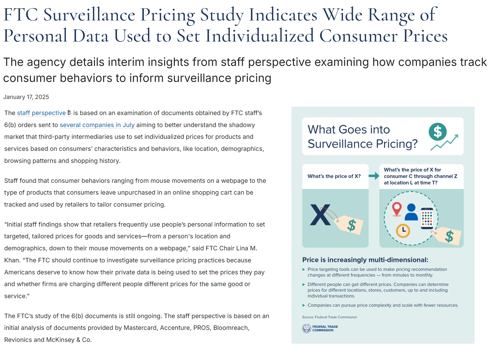{fig-align="center" width=9.5in}

::: aside
[orig](https://www.ftc.gov/news-events/news/press-releases/2025/01/ftc-surveillance-pricing-study-indicates-wide-range-personal-data-used-set-individualized-consumer){target="_blank"}
:::

##

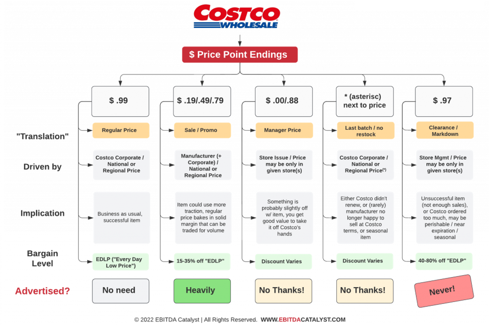{fig-align="center" height=6in}

::: aside
[source](https://www.ebitdacatalyst.com/pricing-strategy/costco-prices-bargains-brilliance-brand-consistency){target="_blank"} "Bargains on bargains"... Why not use signs?
:::

::: notes
Possible explanations: 
- Minimizes promotion signaling costs, keeps shelf uncluttered
- Regular Costco customers pay a lot of attention to price
- Maintain the EDLP brand image (illusion), discourage strategic purchase timing, minimize hi-lo perceptions
- Gives Regulars advantage over newbies (price discrimination)
:::

# How firms set prices
- Importance and challenge
- Common approaches
- Economic Value to the Customer
- Human factors
- Using Demand Model to Price

## Pricing importance {.scrollable}

- #2 topic after two-sided value creation

- Average US net margin is 8% ([Damodaran Online](https://pages.stern.nyu.edu/~adamodar/New_Home_Page/datacurrent.html){target="_blank"})

- Widely cited research by McKinsey 

      - 1% price increase can lead to 11% profit increase 
      - 1% price decrease can lead to 8% profit decrease
      - Logic assumes no decrease in quantity
      - Correlations, but widely misinterpreted as causal
      
- Consultants say most companies price too low; price is low-hanging fruit

- "Your margin is my opportunity" 

## Price changes are risky & scary {.scollable}

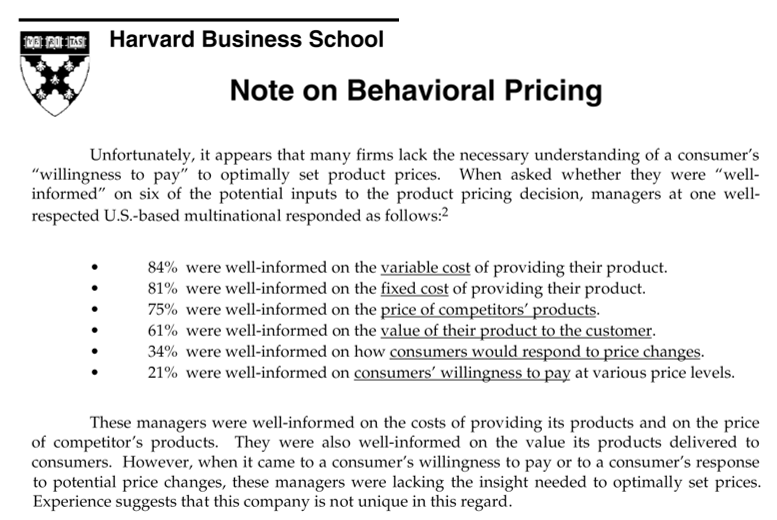{fig-align="center" width=8in}

## How firms set prices {.smaller .scrollable}

#### Limited-data analyses
- EVC / Value pricing
- Competitor price benchmarking
- Cost-based pricing

#### Stated-Preference Data
- Open-ended: How much are you wtp? $___
- Prompted: Would you buy (product) at ($price)?
- Conjoint Analysis: Designs can be incentivized or not

#### Revealed-Preference Data
- Simulated purchase environments, Test markets
- Algorithms (bandits, rev mgmt), Experiments ([Amazon pricing labs](https://drive.google.com/file/d/1dJBGbOY-SwwIoNFjMvIBTXMmwtT_VA__/view){target="_blank"})
- Demand estimation
    
      - Requires data, exogneous price variation, human attention/expertise 

#### Customer co-determination

- Monopsony, auctions, negotiation, pay-what-you-want

#### None

- Seller takes market price    

::: notes
- Those first three are goldilocks: too high, just right, too low
:::

## Pricing strategies are secret

- What not announce your pricing strategy?

- We can survey pricing managers anonymously, but (i) nonrandom selection, (ii) survey design inconsistencies, and (iii) self-reporting biases

- Salt taken, let's look at pricing manager surveys

::: notes
- Competitor can predict your price changes & "play you like a fiddle"
- Your pricing approach may draw criticism, you may be fired
- Little to no upside of announcing, loads of downside
:::

## 

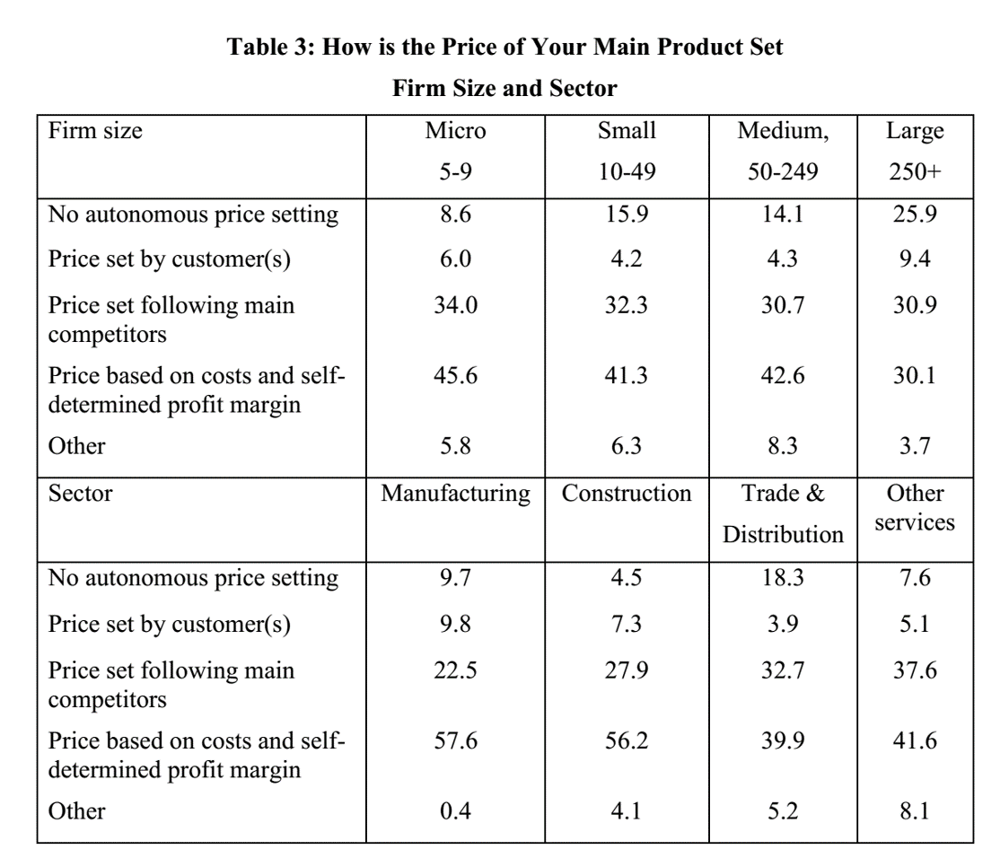{fig-align="center" width=6.5in}

::: aside
- [Keeney, Lawless, Murphy (2010)](https://drive.google.com/file/d/1_g6l5VJfzeU00PYR_sjYmfzfrNR39LBE/view?usp=drive_link){target="_blank"} surveyed 1k Irish businesses
- How often is each approach used?
:::

##

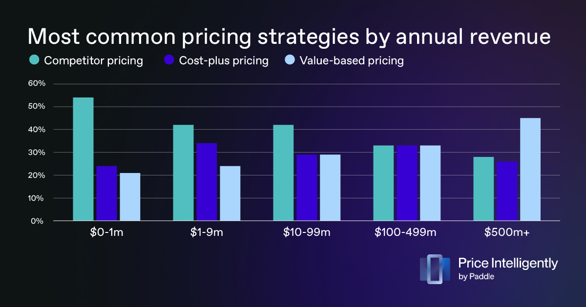{out-width="\\linewidth"}

::: aside
- Source: Survey of SaaS pricing managers by [OpenView (2023)](https://openviewpartners.com/blog/state-of-saas-pricing-2023){target="_blank"}, by ann rev
- Top 3 strategies are so common that others are unreported
:::

## 

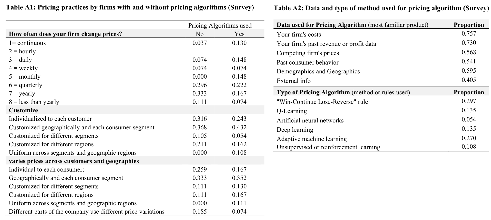{out-width="\\linewidth"}

::: aside
- [Spann et al. (2024)](https://drive.google.com/file/d/1_SjOjLa1Gf_AXdfhef0pME6RKHqwNVX8/view?usp=sharing){target="_blank"} survey of pricing managers on [EPP](https://www.pricingplatform.com/){target="_blank"}, a pricing and customer growth nfp that promotes pricing algorithms
- Skewed sample: 2/3 of respondents reported using algorithms
:::

::: notes
nfp == not-for-profit
:::

## Value Pricing: Price in (cost, wtp) {.scrollable .smaller}

- But... how do you learn wtp? Esp. if you have not sold before?

    - For large time/budget: Conjoint, simulated purchase environments, test markets, ...
    - For small time/budget: Economic Value to the Customer (EVC)

- EVC: estimates customer benefit from a product, relative to the next best alternative
    
- EVC & VP are often used by new firms, highly differentiated products, firms lacking
credible market research and related expertise

- Steps: 1. Calculate EVC, 2. Choose a price in (Cost, EVC)

::: notes
- You might need EVC for your start-up
- 
:::

## How to calculate EVC(x$\vert$y)

1. Select the best available alternative y and find its price

       - Interview target customers to learn how they solve the core need (y)
       - If wrong y, EVC estimate will be too high

2. Determine non-price costs of using y and x
    
       - Include start-up costs and/or post-purchase costs
       - Make sure NonPriceCosts(x) exclude the price of x (why?)
    
3. Determine the incremental economic value of x over y

       - Usually, functional benefits or non-price cost savings    

4. EVC = Price(y) + ( NonPriceCosts(y) - NonPriceCosts(x) ) + IncrementalValue(x$\vert$y)

       - In practice, 99% of effort is getting the assumptions right 
    

## EVC tips

- y might not be a commercial product. 

- EVC and y often vary across customer segments

      - Calculate heterogeneous EVC(x|y) for multiple y

- Unquantifiable factors influence price selection in (cost,EVC)

- If EVC(x$\vert$y)<0, reconsider product or target customer

## Example: What is EVC(Batteriser$\vert$y)?

- The Batteriser is a durable metal sleeve that increases disposable battery life by 800%. With a thickness of just 0.1 millimetres, the sleeve can be fitted over any size battery, in any size compartment

- Assume the typical battery costs \$0.50

::: notes 
- Reference product is no sleeve
- Batteriser allows the consumer to avoid buying 8 extra batteries, resulting in a potential cost savings of 8*0.50=4.00 for each battery whose life is extended
- Suppose one Batteriser is durable enough to extend the lives of 10 batteries
- Then IV = 10*4 = 40 and EVC=40
- You might reasonably assume other benefits, such as increased usefulness of battery-operated devices, or reduced nuisance costs of changing and storing batteries, but these are hard to quantify with confidence.
- Note: when selecting a price, you have to consider psychological factors such as:
- Discount factors & the time horizon over which consumers are willing to amortize a purchase
- Risk that Batteriser benefits may not work as advertised
- Consumer skepticism about marketer claims
- I would recommend a price that is far, far below EVC in this case
- (Price was 2.50 in 2019)
::: 
    
## "Pricing Thermometer'' {.scrollable }

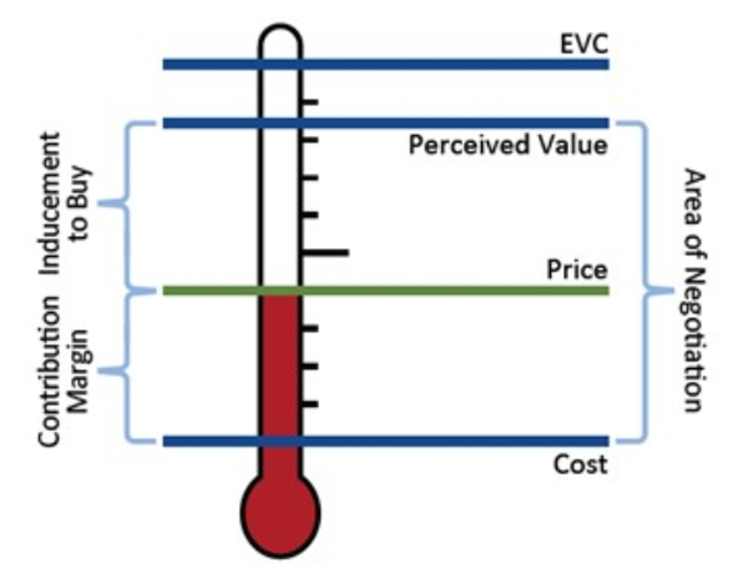{fig-align="center" width=3.5in}
   
- How much inducement do you give your customer?
- How will customers, competitors, suppliers react? 

      - SR vs. LR? More judgment than math. "Your margin is my opportunity"

## Choosing p in (cost, EVC)
- Some advise:  $Price = Cost + (EVC - Cost)*{z%}$ 

       - I've heard z = 25%, 33%, 50%, and 70%
       - Do you want profits or growth? What's your exit?

- Human factors to consider when making your judgment:

      - Perceived benefit - actual benefit
      - Perceived costs - actual costs
      - Consumer price sensitivity, reference price of y 
      - Established pricing benchmarks
      - Fairness, signaling 
      - Customer risk of adoption, skepticism; brand credibility

::: notes
- These factors also pertain to other price setting approaches 
:::

## Conjoint works for pricing too

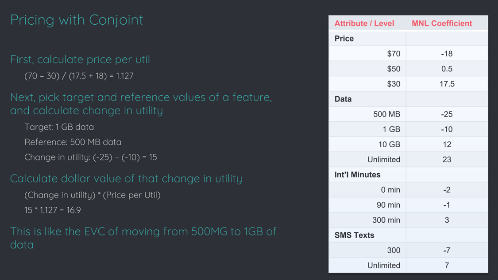

## Van Westendorp Pricing Model

- Goal: Estimate stated WTP *range* for each customer

- Survey target customers: At what price is (product)...

        - Too Cheap? I.e., that you would question its quality
        - Acceptably Cheap?
        - Acceptably Expensive?
        - Too Expensive? I.e., that you would not consider buying 

- Plot CDFs 

        - Too Cheap and Acceptably Cheap decrease with price
        - Acceptably Expensive and Too Expensive increase with price
        - Crossing points bound the Acceptable Price Range 

::: aside
- R package [pricesensitivitymeter](https://cran.r-project.org/web/packages/pricesensitivitymeter/pricesensitivitymeter.pdf){target="_blank"}
:::

## {.scrollable}

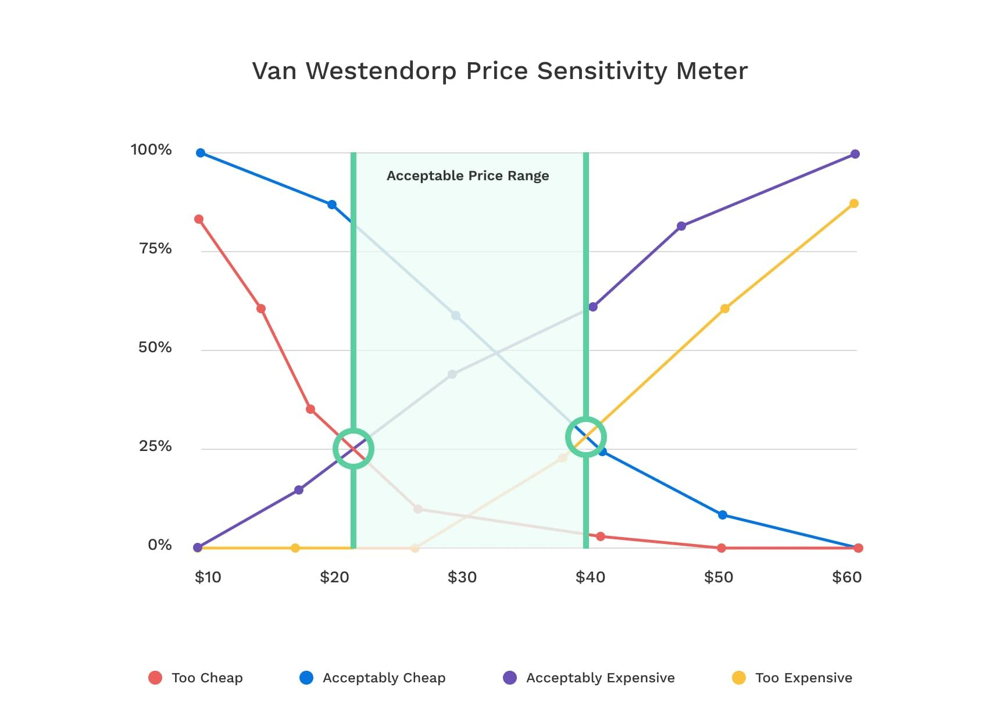{fig-align="center" width=8in}

- "Too cheap" meets "Acceptably Expensive": "Point of Marginal Cheapness"

          - VW says: Don't price below PMC

- "Acceptably Cheap" meets "Too Expensive": "Point of Marginal Expensiveness"

          - VW says: Don't price above PME

- "Too Cheap" meets "Too Expensive": Min. # of price-refusers

- "Good Value" meets "Expensive": Possibly max. # of price-accepters

- Strengths 

          - Estimable with survey data only; Estimates distributions of consumer heterogeneity; Incorporates reference prices and price-quality signals
          - Extensible to incorporate stated purchase intentions at each price. Add cost data, you can then max. profits

- Limitations

          - Identifies a price range, not a price
          - Thinking about 4 CDFs is difficult, easy to misinterpret
          - Stated-preference data only; disregards competitors & marginal costs, hence don't use standalone
          - Limited field evidence that it works well

::: notes
- Extensible to also ask about stated purchase intentions; Newtom/Miller/Smith 1993, "A market acceptance extension to traditional price sensitivity measurement” 
- Thinking about intersections of 4 CDFs is sufficiently difficult that it will dazzle some consulting clients
- Probably best to use this to evaluate other price-setting approaches outputs, rather than on its own to set price
:::

## Signals and *Perceived Quality*

- Signals of high quality

      - High prices, Brand names, Warranties, Return policies, Ad spending
      - Costly signals when the firm doesn't deliver
      - Brand reputation can convey credibility

- Signals of low quality

      - Low prices, Price promotions, Price-matching guarantees
      - Signals that look too good to be true
      - "If it's so good, why is it so cheap?''

- Prescription: Price consistent with your quality position in the market

      - Otherwise, you undercut your own message and leave money on the table
      - Findings replicate in numerous contexts 

::: notes
- In marketing we focus on perceived quality, because consumers typically don't know actual quality. 
- Consumers typically rely on signals to form perceptions about unobserved quality
:::

## Human factors: Price as a signal

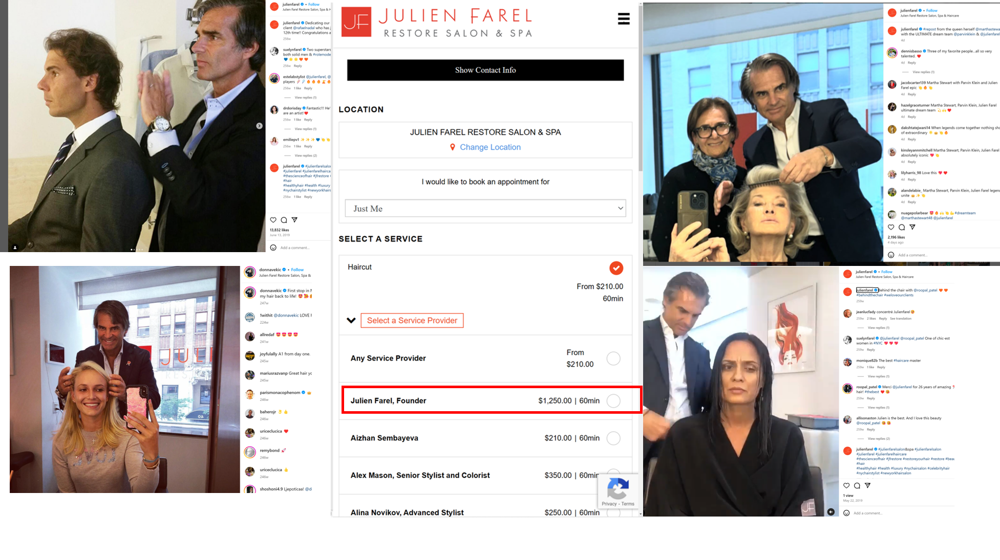{fig-align="center" width=10in}

::: notes
- This is Julien Farel, who operates a high-end salon in Midtown East, NYC
- That's Rafael Nadal in the first picture
- So this Farel guy must be a great stylist right?
- Or maybe he gives Nadal free haircuts in exchange for the photo op?
- He'll cut your hair for the low low price of $1250
- If you need the best haircut ever, where do you go? 
- How do you know which stylist is the best one?
- Price can be a powerful signal of quality
- Sometimes (rarely) we even see reverse-price-wars, as high-end service providers try to outdo each other
:::

##

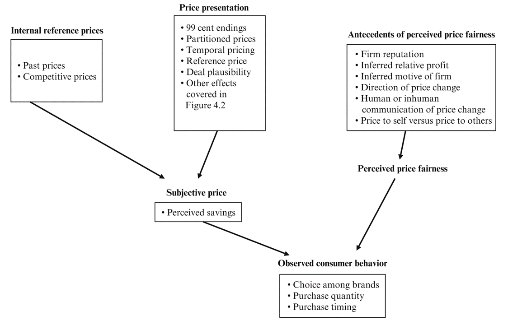

::: aside
- We'll go through a few examples
- Source: [Krishna (2009)](https://drive.google.com/file/d/1tPZQ0CnfjswEc4t9loBHXLlQ0hOWmUtR/view?usp=drive_link){target="_blank"}
:::

::: notes
Price signaling effects are an example of a `human factor' in pricing
Many such human factors have been documented by experimentalists
The basic idea here is that price and price presentation can affect both perceived price and perceived price fairness
Perceived price is also affected by internal consumer factors, such as past experiences, income, reference price, etc  
We'll go through a few more (inexhaustive)
If you really like this stuff, take Ania's consumer behavior elective in winter quarter
:::

## Human factors: Non-monetary costs

- Total customer cost is 

      Cognitive cost to decide the purchase 
      + Physical cost to acquire the product 
      + Financial payment

- Simplicity can increase sales. Remove frictions

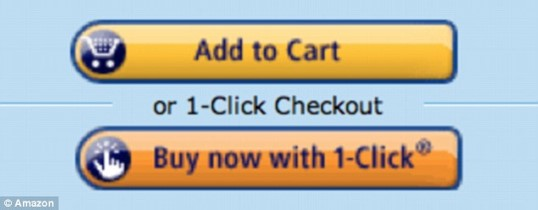{fig-align="center" width=4in}

## Human factors: Perceived prices

- Which is the better bargain?

    - Regular price $0.89, sale price $0.75
    - Regular price $0.93, sale price $0.79

::: notes 
- Context was margarine sales; 80+pct chose 1st pair; most likely explanation:     (in)numeracy makes people think a drop in the 10s place of 2 is larger than a drop in the 10s place of 1
:::    
    

## Left-digit bias: Demand Effects {.scrollable}

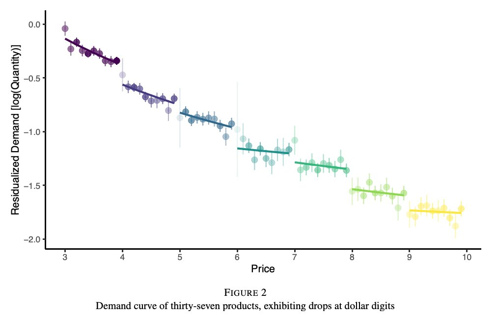{fig-align="center" width=8in}

::: notes
- This graph shows grocery product demand at quasi-random price points, estimated in a careful way by Avner Strulov-Shalin at U-Chicago
- There are clear discontinuities in price elasticity when the left-most digit changes
:::

## Left-digit bias: Lyft rides

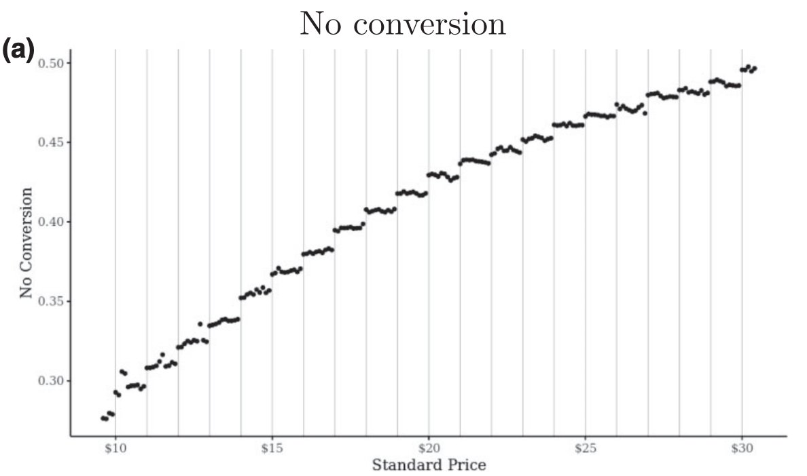{fig-align="center" width=8in}

::: notes
- This graph shows the empirical probability of a Lyft rider declining a ride, depending on the price estimate quoted in the app
- Clearly, increasing the digit before the decimal has a discontinuous effect on ride probability
- Source: John List at U-Chicago
:::

## 

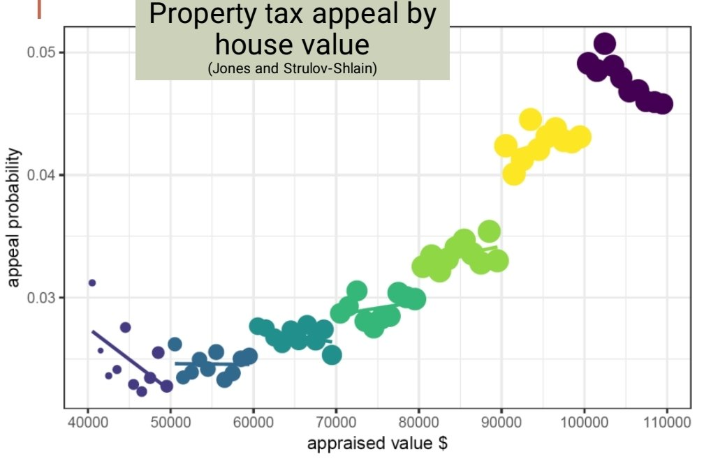{fig-align="center" width=8in}

::: notes
- Not pricing data, but more strong evidence of consumer left-digit bias
- This graph shows the likelihood that a homeowner will appeal their property tax appraisal, as a function of the house's appraised value
- Not only are there strong left-digit effects, crossing the hundred-thousand threshold reverses the trend in (100,110k). 
- Most likely those who were over $105k have already experienced the hundred-thousand shock before, so show lower likelihood to appeal
- Source: Jones & Strulov-Shalin (2023)
:::

## Human factors: Anchoring {.smaller}
- "You are lying on the beach on a hot lazy afternoon.  For about an hour now, you have been thinking about an ice-cold bottle of your favorite beer.  One of your friends gets up to make a phone call and offers to get you your favorite beer from a *small run-down grocery store* on the way back.  Your friend says that the beer might be expensive and asks the maximum price that you are willing to pay.  If the price is higher, your friend won’t buy the beer.  What is your maximum price?  
- ... *fancy resort hotel* ...

::: aside
- Classic study by [Thaler (2008)]() in Marketing Science
:::

::: notes
- AKA Reference price
- This was back when we had to get up to make phone calls
- This was back when we made phone calls
:::

## Human factors: Price salience

- Show the price early, late or never?

      - Drinks in a loud nightclub
      - USPS "Forever Stamps"
      - Price advertising, coupons

- Price salience emphasizes Savings or Exclusivity
      
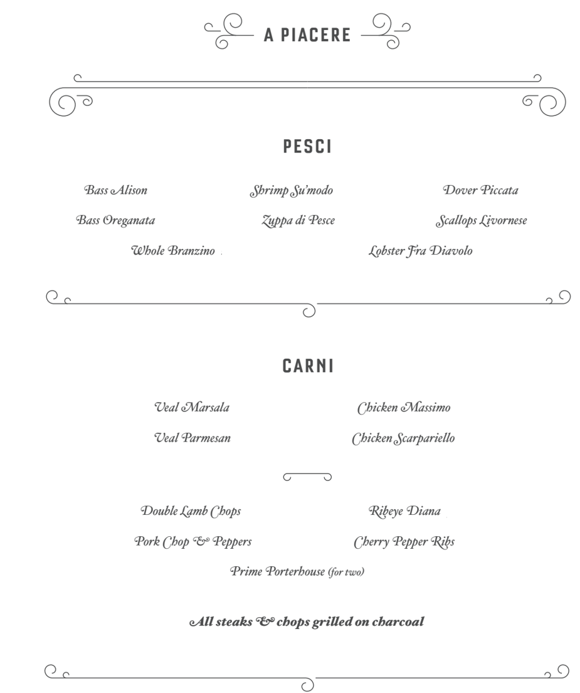{fig-align="center" width=3in}

## Human factors: Decoy effects

- Choose 1:

    - Brand A: Rated 50/100, priced at 1.80
    - Brand B: Rated 70/100, priced at 2.60

- 33% chose A

## Human factors: Decoy effects

- Choose 1:

    - Brand A: Rated 40/100, priced at 1.60
    - Brand B: Rated 50/100, priced at 1.80
    - Brand C: Rated 70/100, priced at 2.60

- 47% chose B (why?)

::: notes
- You see this frequently in SAAS  
- Huber and Puto (1982)
:::

## Field evidence in Diamonds

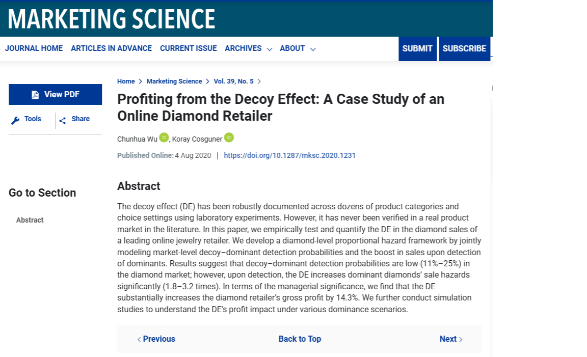{fig-align="center" width=8in}

::: aside
- [Source: Wu & Cosguner (2020)](https://drive.google.com/file/d/1xQCTEwnx2KCTvR2q7raIBMu_Mb-HlAAs/view?usp=sharing){target="_blank"}
:::

::: notes

:::

## 4 vertical attributes

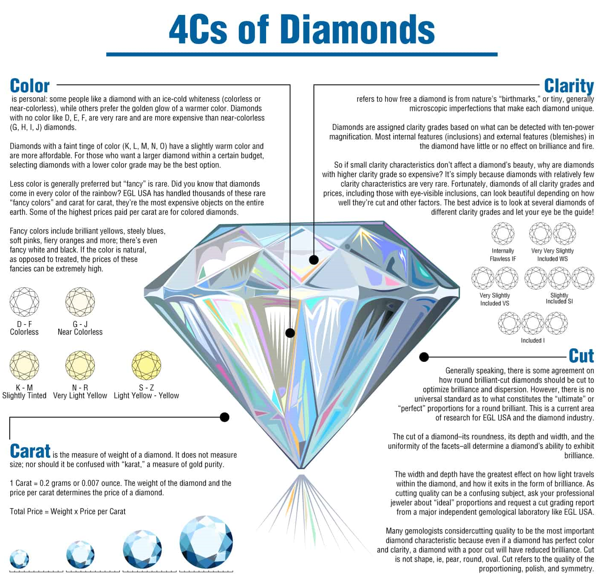{fig-align="center" width=5in}

::: aside
- All 4 attributes are essentially discrete, allowing exact comparisons and clear dominant/dominating relationships
:::

::: notes
- Color measures colorlessness-colorfulness. Text suggests some horizontalness; that's mainly to give lower-paying customers a reason to justify a lower price point, because prices increases with colorfulness. Note that the scale is ordinal
- Clarity measures the number of inclusions and blemishes, which everyone agrees on
- Carat measures weight and is rounded to nearest integer
- Cut measures shape and ability for light to pass through; hence, sparkle, which everyone likes
:::

## Decoy Effect Research

- Context: Online diamond sales

          - #1 online diamond retailer, 50% share, big US brand 
          - Retailer used a drop shipping model and fixed 18-20% markup
          - Anonymous diamond suppliers create listings, set prices
          - Diamonds listed individually; listings disappear upon purchase
          - Consumers filter by attributes and price
          - Retailer orders filtered listings by ascending price
          - Great setting: Rare-purchase category, high-price, limited/no fit attributes, many unknowledgeable consumers 

- Wu & Cosguner 

          - Scraped 7 months of 2.7 million daily diamond listings 
          - Decoy-dominant relationships were frequent
          - Estimated decoy/dominant effect on time-to-sale

## Dominant-Dominated Diamond Pair {.smaller .scrollable}

- **Dominant/decoy pair** defined as either:
  1. Same attributes, different prices
  2. Dominated attributes, disordered prices
  - In both cases, dominant is more attractive, decoy is less attractive

- **Example**: 
  - **Dominant**: 1-carat, Excellent cut, D color, VVS1 clarity, $3000 price
  - **Decoy**: 1-carat, Very Good cut, D color, VVS1 clarity, $3500 price

- Search result listings made decoy/dominant pair detection difficult, so detection depended on frequency of dominant/decoy listings

## Findings

- 11%-25% of diamond listings had a dominant or decoy listing
- Dominant diamonds sold 1.8-3.2x faster with decoy listings
- Simulations predict Decoy Effect increased retailer's gross profit by 14.3%

::: aside
[Here](https://drive.google.com/file/d/1-oCY2mGHdLq2_yxL8hJTMQPU_8TYZ25y/view?usp=sharing){target="_blank"} is a snippet of the diamonds data, including prices and attributes
:::

---

## Economic factors: Price discrimination {.smaller .scrollable}

- Amazon v. B&N 

- Purchase time: Airline, Cruise tickets
- Needs: e.g. Business vs. Home segments
- Skimming by delivery time: Movie release windows    
- Geography: Typically accounts for 20\% of variation in online prices
- Quantity: Cups of coffee, Paper towels
- Reduce resentment via new/loyal customer, merit (veterans, seniors), ability to pay/sliding scale, value provided, cost of supply
- Always frame price differences as discounts

## 

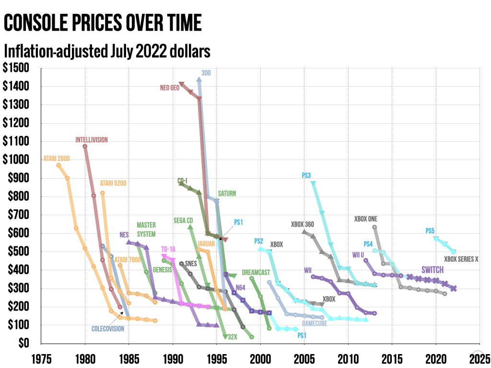{fig-align="center" width=7in}

::: aside
- Price Skimming downsides: 1. Where to start, how often to drop, how much?  2. When it does work, it may upset customers, encourage strategic purchase timing, reduce loyalty, attract competition. Data: [Ars Tecnica](https://web.archive.org/web/20240427000657/https://arstechnica.com/gaming/2022/08/will-the-nintendo-switch-ever-see-a-price-drop/){target="_blank"}
:::

::: notes
A very big deal in this graph: Nintendo Switch price had no nominal decrease for 5-year span, longest ever, an apparent sign of fantastic demand persistence. Also may show diminishing category competition, or a strategic decision to maintain high margins.
:::

## Economic factors: Beware a price war! {.smaller}
- If you explicitly mention a competitor's price

    - You make Customer aware of Competitor
    - Competitor will notice: You invite them to match or retaliate
- Better to price-compare  vs. unnamed/generic competitor
    
- Who wins a price war?

    - Only one winner: Customer
    - All firms suffer, some die
    - Most likely to survive: Seller with lowest cost structure 
    - Smart firms avoid price wars & keep costs secret

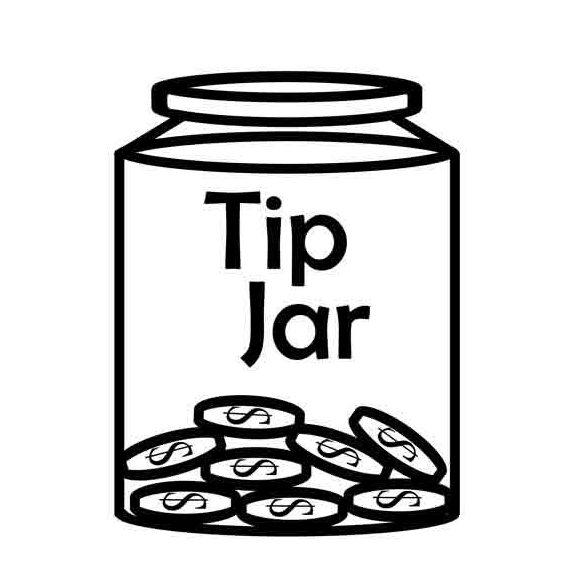{fig-align="right" width=1in}

## Price Elasticity of Demand

- $elas.=\frac{d(lnQ)}{d(lnP)}=\frac{P}{Q}\frac{dQ}{dP}\le 0$    

- For $-1<elas.<0$, we say demand is price-inelastic
- For $elas.<-1$, we say demand is price-elastic
- Elasticity is "scale-free" : % change response to % change
- We can calculate elasticity at a point, or on an interval Results depend on interval width and demand curvature
- Narrower intervals yield more precise elasticities

## Price Elasticity of Demand

- $elas.=\frac{d(lnQ)}{d(lnP)}=\frac{P}{Q}\frac{dQ}{dP}$    

- A special class of demand functions have constant elasticity

    $Q=e^a*P^b$ for $a>0$ & $b>0$, then $elast.=b$

    Implies $ln Q=\alpha+\beta lnP$, called "log-log"
        
        Still need exogenous price variation for to estimate a causal effect
        
        Otherwise, beta should be interpreted as a correlation
        
- C.E. imposes a particular shape on demand & enables easy price optimization, given marginal cost data 

- But, C.E. restricts demand -> can lead to suboptimal pricing

## How to use demand model to set price{.smaller .scrollable}
- $q_j(p_j)=N\hat{s}_j(p_j)$
- Total contribution = $\pi(p) = q_j(p_j)[p_j-c_j(q_j(p_j))]$
- Grid search:

  - Choose candidate prices $p_m = p_1, p_2, ..., p_M$
  - $p^*=argmax_{p_m} \pi(p_m)$
  - Optional: Repeat using a more refined grid around $p^*$

- We often assume $c_j(q_j(p_j))=c$ for convenience
- Multiproduct line pricing requires sum over brand's owned products
- Can you predict competitor price reaction, or how your demand responds to new competitor price? How?

::: notes
- More elegant mathematical solutions assume globally concave demand & convex costs. Both may conditions may be absent (examples); grid search just works
- Tie competitor price reaction back to earlier discussion about common pricesetting approaches
:::
 

{fig-align="right" width=1.5in}
 

## Class script

- Use demand model to trace out a demand curve and optimize price

{fig-align="right" width=2in}

## Recap

- The most common price setting methods are value pricing, competitor price matching, and cost-based pricing. All 3 are incomplete
- Consumers usually expect product prices to reflect quality positions in the marketplace
- Optimal pricing requires attention to both economic factors and human factors 

{fig-align="right" width=2in}

## Going further

- [Willingness to Pay Measurement Approaches](https://drive.google.com/file/d/1aViODb4xVvhMNbr4vL46JsDPAtmt6GqV/view?usp=sharing){target="_blank"}

- [Science of price experimentation at Amazon](https://drive.google.com/file/d/1dJBGbOY-SwwIoNFjMvIBTXMmwtT_VA__/view){target="_blank"}

- [Behavioral Pricing](https://drive.google.com/file/d/1tPZQ0CnfjswEc4t9loBHXLlQ0hOWmUtR/view?usp=drive_link){target="_blank"}

- [More than a Penny’s Worth: Left-Digit Bias and Firm Pricing](https://doi.org/10.1093/restud/rdac082){target="_blank"}

- [Dynamic Online Pricing with Incomplete Information Using Multiarmed Bandit Experiments](https://drive.google.com/file/d/1ah2dpahU2m8xelJ1N32EBwNy3e9HEJMl/view?usp=drive_link){target="_blank"}

- [Universal Paperclips](https://www.decisionproblem.com/paperclips/index2.html){target="_blank"} : Fun price setting game

{fig-align="right" width=2in}
