# What is a brand?

##

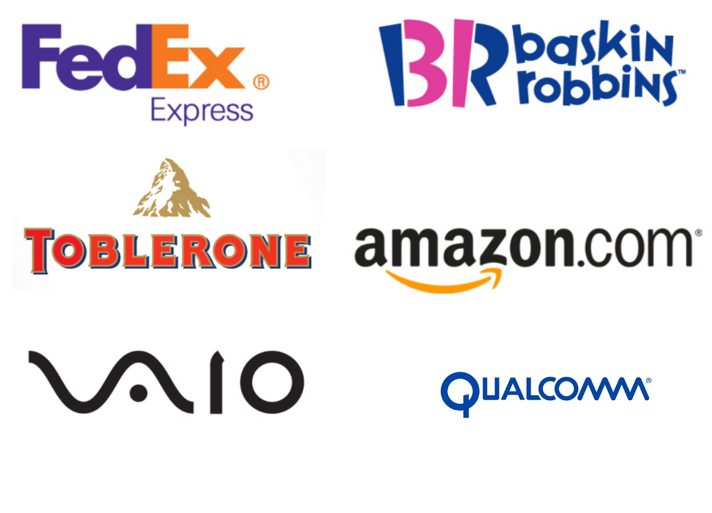{fig-align="center" height="450px"}

::: {.callout-note appearance="minimal"}
When I say brand, most people think about logos. What are the hidden meanings in these images?
:::

::: notes
- Branding is one of the most widely misunderstood topics in marketing. Most people equate brands with logos
- It is interesting, though, to look at the ways in which brands try to visually communicate their value propositions. Some make sense (in terms of being aligned with value), others are differentiating but not necessarily aligned with value proposition
- FedEx: Note the arrow in negative space
- Toblerone: Another use of negative space – the bear is the symbol of Bern, Switzerland, where Toblerone is headquartered.
- Vaio: Symbolizes transition from analog frequency wave to digital
- Amazon: A to Z represents wide assortment; arrow is a smile
:::

##

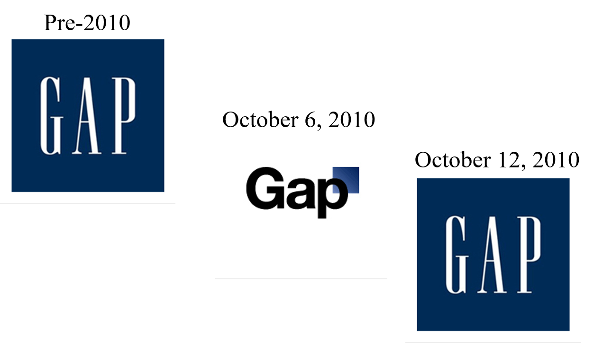{fig-align="center" height="440px"}

::: {.callout-note appearance="minimal"}
The Gap adopted its iconic logo in 1969. It launched a multimillion-dollar redesign in October 2010, then scrapped it six days later after a backlash. Why scrap it?
:::

::: notes
- That was a multimillion dollar redesign that was scrapped in 6 days
:::

##

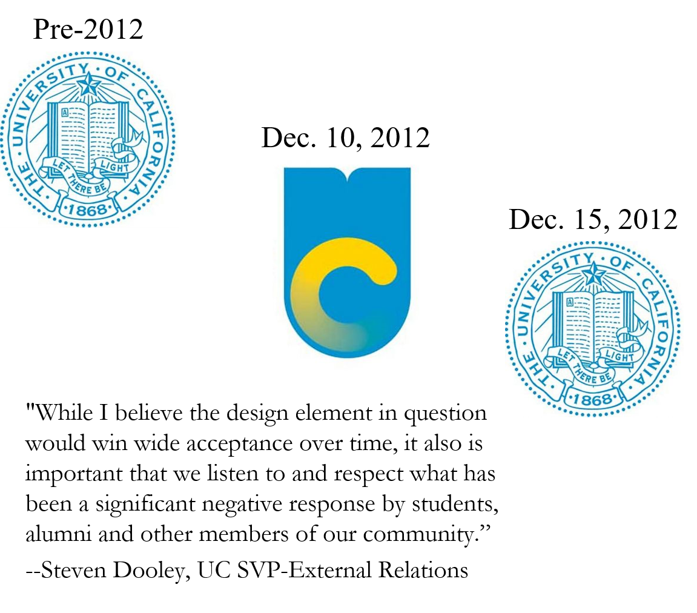{fig-align="center" height="440px"}

::: {.callout-note appearance="minimal"}
UC adopted its seal in 1884. We paid a relatively paltry $386k for this new logo, but we only kept it for five days. Why? The current wordmark was rolled out more quietly in 2013
:::

::: {.source-url}
[NBC Bay Area (2012)](https://web.archive.org/web/20201112013533/https://www.nbcbayarea.com/news/local/university-of-california-adopts-new-logo-144-years-later/2069724/){target="_blank"} | [99% Invisible (2012)](https://99percentinvisible.org/episode/episode-69-the-brief-and-tumultuous-life-of-the-new-uc/){target="_blank"} | [UCOP Wordmark](https://ucop.edu/){target="_blank"}
:::

::: notes
- People said the new logo looked like a toilet bowl, or a "loading" mouse icon
:::

##

{fig-align="center" height="396px"}

::: {.callout-note appearance="minimal"}
In 1998, CBS bought the Westinghouse Corporation and immediately sold off all physical assets. From 1998-2021, it licensed the Westinghouse brand to electronic components manufacturers in several industries. Likely made $100-500mm over 23 years at 100% margin. S&P 500 firms' aggregate (market capitalization - tangible assets)/(market capitalization) grew from 17% in 1976 to 92% in 2026
:::

::: {.source-url}
[Ocean Tomo (2026)](https://oceantomo.com/insights/ocean-tomo-releases-2025-intangible-asset-market-value-study-results/){target="_blank"}
:::

::: notes
- George Westinghouse was a major rival to Thomas Edison. He was the primary funder of Tesla's Alternating Current standard in the late 1800s. The AC/DC standards war was one of the ugliest in the history of business. ...
- In 1995, CBS bought the Westinghouse brand and immediately sold off all tangible assets.
:::

## Case study: Netflix

- 1997: Founded to deliver movies over the internet
- 1999: Pioneered DVD-by-mail
- 2007: Launched streaming
- 2011: July price hike, Sept service split into
    - Netflix: Video streaming
    - "Qwikster": Rebranded DVD-by-mail service

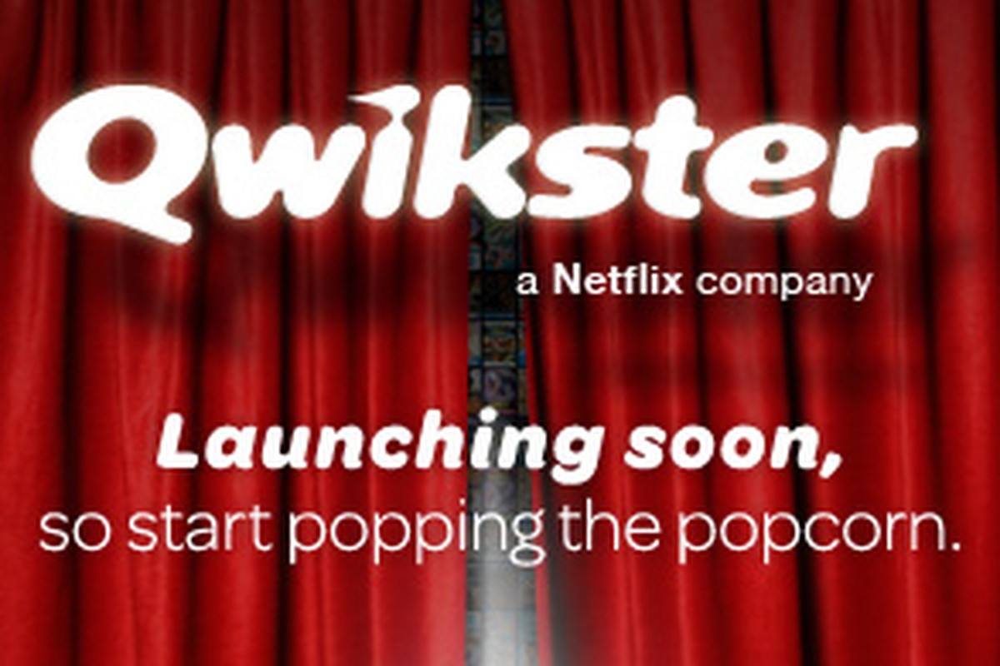{fig-align="center" height="150px"}

::: {.callout-note appearance="minimal"}
This case study is ancient but it makes a key point
:::

::: notes
- Netflix was founded in 1997 to deliver movies over the internet. It's right there in the name ...Net Flix...Transmission speeds weren't good enough, so they invented the DVD-by-mail business...Consumers attached Netflix to the red envelopes
:::

##

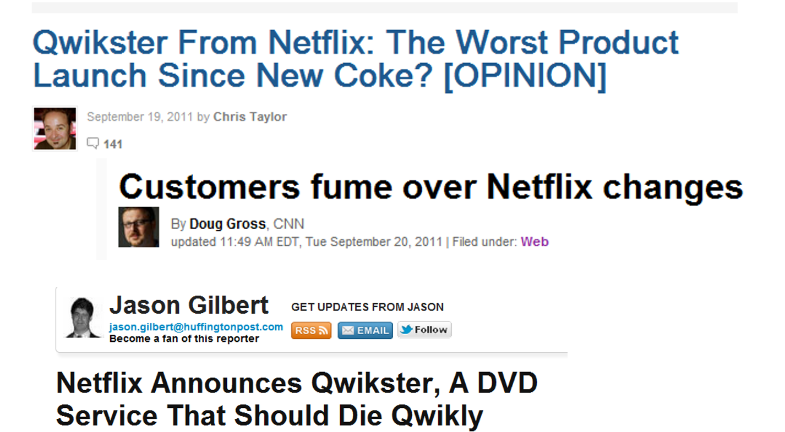{fig-align="center" height="450px"}

::: {.callout-note appearance="minimal"}
The market reaction was as vicious as I've ever seen
:::

::: notes
- Anybody want to argue that all news is good news? Let's check look at some data
:::

##

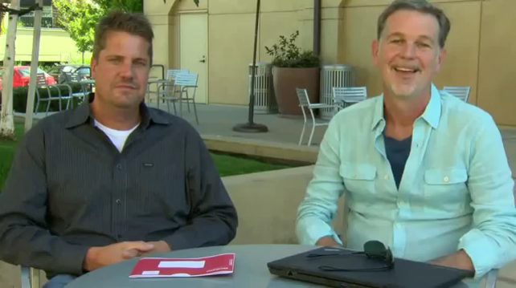{fig-align="center" height="450px"}

::: {.callout-note appearance="minimal"}
CEO Reed Hastings apologized on video — but said Netflix would proceed with the split anyway, and introduced Qwikster CEO. Guess how many people saw this video on youtube?
:::

::: notes
- This was a few days later. In the video, Reed Hastings apologizes, but says they are still going forward with the plan
:::

##

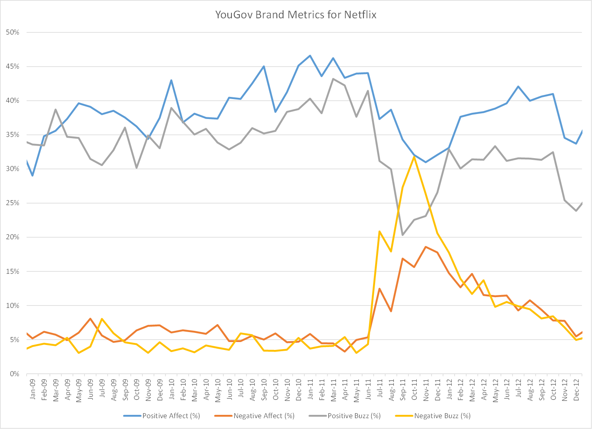{fig-align="center" height="450px"}

::: {.callout-note appearance="minimal"}
These are called monthly brand tracking statistics, summarizing surveys from ~2,400 respondents/month. Affect means, How do you feel about Netflix? Buzz means, What have you heard about Netflix? Answers could be positive, negative, or nothing. First shift was the July price hike; the second was September's rebrand. What do you see?
:::

::: notes
- Monthly brand tracking statistics for Netflix. Approx. 2400 people every month answered the questions "Do you have a positive or negative feeling about Netflix?" and "Have you heard something positive or negative about Netflix recently?" Blue/gray lines are the positive percentage, red/yellow lines are the negatives. ...
- Initial change in July. Second major movement in September.
:::

##

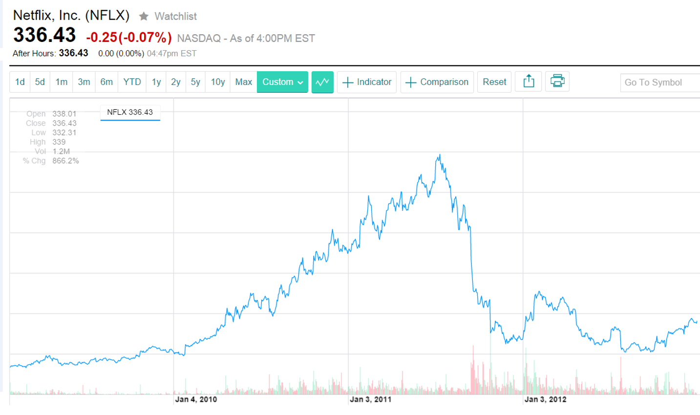{fig-align="center" height="450px"}

::: {.callout-note appearance="minimal"}
Note the vertical drop in the stock price on the rebranding date. The second, smaller drop was when they announced they were going ahead with it. Netflix dropped the rebrand shortly after
:::

::: notes
- Note the vertical drop on the date of the rebranding
:::

## Netflix Case study: Takeaways

:::: {.columns}

::: {.column width="65%"}
- Brand adjustments require consumer acceptance
    - You own the IP, not the mental real estate
    - Smaller steps encounter less resistance
- Great brands monitor customer perceptions
- If you mis-step, change course -- some news is bad news

::: {.callout-note appearance="minimal"}
Coda: DVD-by-mail business fell by 90% from 2010 to 2019, then Netflix announced a gradual phasing out
:::
:::

::: {.column width="35%"}
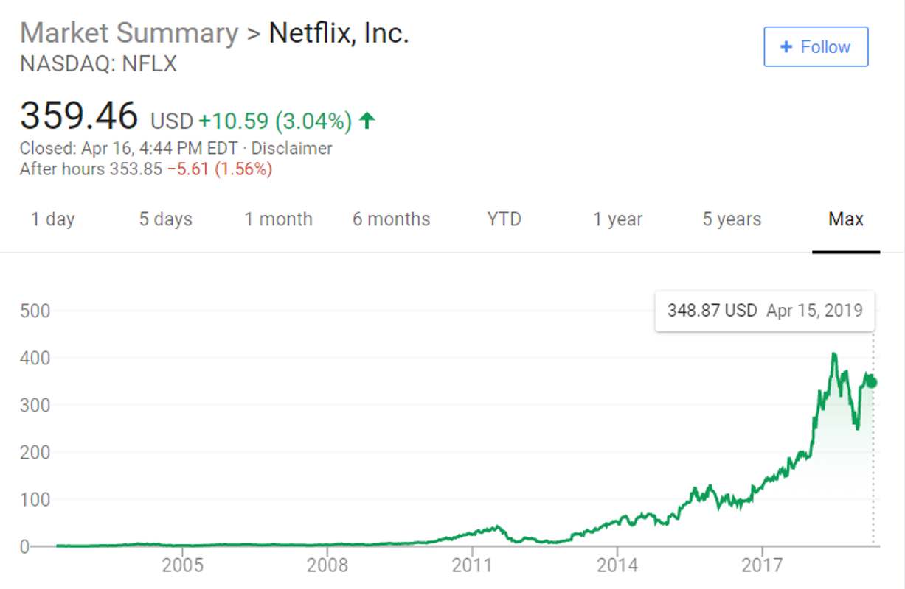{fig-align="center" height="300px"}
:::

::::

## Case study: Kraft Mac n Cheese

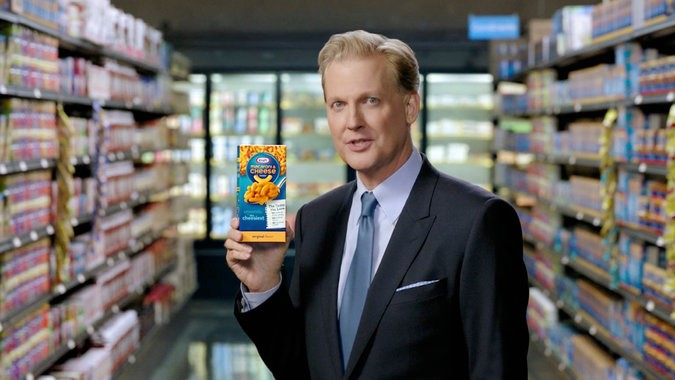{fig-align="center" height="440px"}

::: {.callout-note appearance="minimal"}
Kraft quietly dropped Yellow 5 & 6, artificial flavors and preservatives--replacing them with paprika, annatto, and turmeric--then announced the change after 50 million boxes had shipped. "We'd invite you to try it, but you already have."
:::

::: notes
- "We'd invite you to try it, but you already have"
:::

## What is a brand?

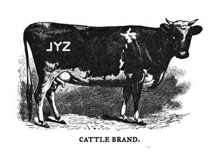{fig-align="center" height="420px"}

::: {.callout-note appearance="minimal"}
The word "brand" comes from the Old West; it was a theft deterrent, but it came to mean much more
:::

::: notes
- The term originated in the old west. ...Cattle were branded as an anti-theft mechanism...The function of the brand evolved with time, eventually coming to indicate quality
:::

##

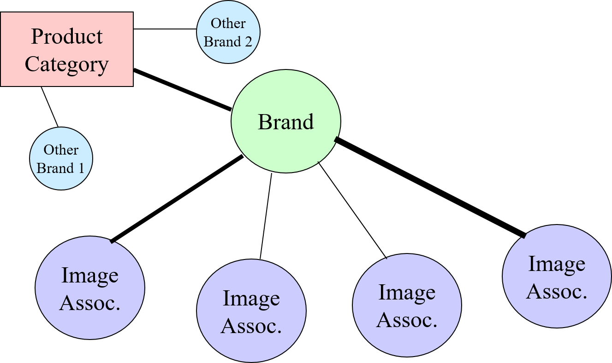{fig-align="center" height="430px"}

::: {.callout-note appearance="minimal"}
Memory is an “auto-associative network.” A brand is defined by the network of concepts it connects to in human memory, including the product category, among other associations
:::

::: notes
- Your memory is an auto-associative network. You recall sequences by initiating the sequence...What is the 5th word in the happy birthday song? The way you retrieve this information is by singing the song and counting. You can't go straight to it. We retrieve information from memory using cues. When we see a cue, the concepts that are associated with that idea in our memory are activated...Some associations are stronger, some are weaker
:::

## What is a brand?

- An *idea* that shifts preference
- Brands reside in consumers' minds
    - Mental real estate: Firm owns trademark but not brand
    - Rooted in reality but reflects consumer experiences, perceptions and idiosyncrasies

::: {.callout-note appearance="minimal"}
What can be branded? Physical goods, services, retailers, organizations, people, places, activities, even fictional characters
:::

::: notes
- one of the reasons brands are so concerned about "brand safety" in social media : they don't want to be next to hate speech, porn, etc., because they believe consumers will associate their ads with such concepts
- We can try to influence our brands; success depends on consumer acceptance
- "Fast brain" learns too quickly and forgets too slowly
:::

## Some auto-associative sequences

{fig-align="center" height="360px"}

::: {.callout-note appearance="minimal"}
Why do firms spend so much to create these associations in consumers' minds? "Search markets" vs. "Selection markets"
:::

::: notes
A: The theory behind brand advertising is, if the brand connects strongly enough to the product category concept in consumer memory, then when the consumer has a need in the product category, she will come directly to the brand rather than shopping around.
Further, she will be more loyal and forgiving when the brand messes up.
:::

## What association?

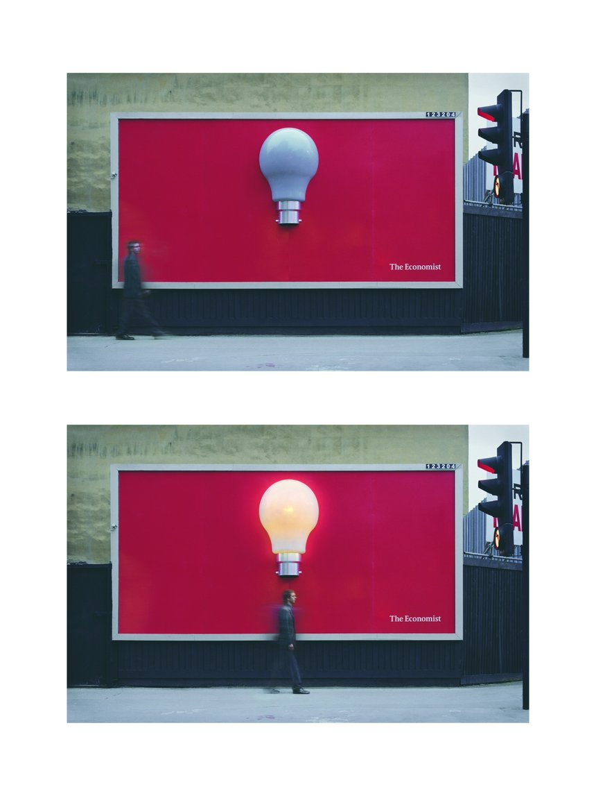{fig-align="center" height="420px"}

::: {.callout-note appearance="minimal"}
Firms often seek to influence their brand associations. Here, the *Economist* seeks to influence consumer perceptions of its trademark as a source of bright ideas. When will this work? It depends on what consumers will accept
:::

## Brand Safety {.smaller}

- Brands try to avoid unsavory placements -- misinformation, hate, violence, obscenity, etc -- as they may upset consumers, generate embarrassing publicity, and damage brand associations
- Brands demand advertising-supported platforms maintain "brand safety" via content moderation

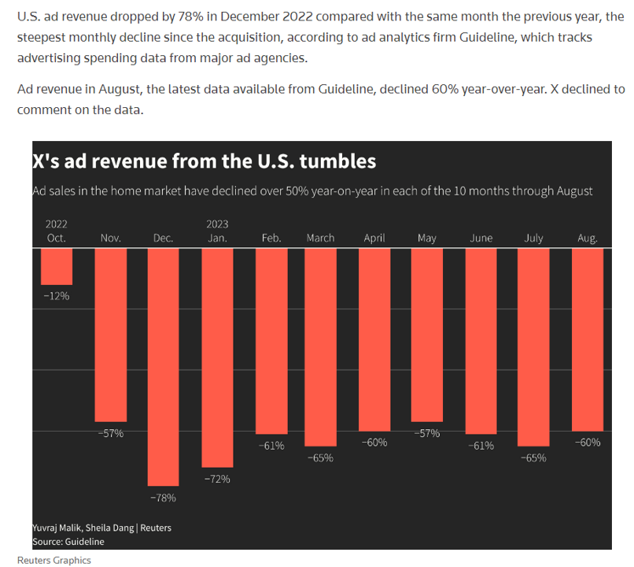{fig-align="center" height="340px"}

::: {.callout-note appearance="minimal" style="font-size: 1.3em;"}
Have you ever heard of "brand safety?" When Twitter/X's new owner announced the shift to a "free speech platform" without content moderation, advertisers asked him to reconsider due to brand safety risks. Earlier ad boycotts included [Facebook](https://en.wikipedia.org/wiki/2020_Facebook_ad_boycotts){target="_blank"} and YouTube
:::

::: notes
- You might naively think 'brand safety' means safety for consumers. No
- Brand safety means safety for the brand's associations in consumer memory
- The new owner's policy of maximizing free-speech inadvertently upset his paying customers (the advertisers) in a way that the platform did not appear to anticipate
- However, this was not only predictable, it was predicted by many observers, including the advertisers themselves
- This is why Twitter/X pivoted primarily to a fee-based business model
- There have been similar advertiser boycotts of youtube, facebook and most other major digital advertising platforms in the past, which is partly why those platforms are content-moderated now
- This is not at all specific to X; google 'facebook advertiser boycott,' 'youtube advertiser boycott,' 'instagram advertiser boycott,' all of which began over advertiser concerns about ineffective content moderation policies
:::

# How do Brands Work?

1. Credibility

2. Rapid communication

3. Personality & Self-expression

4. Gestalt

## 1. Credibility

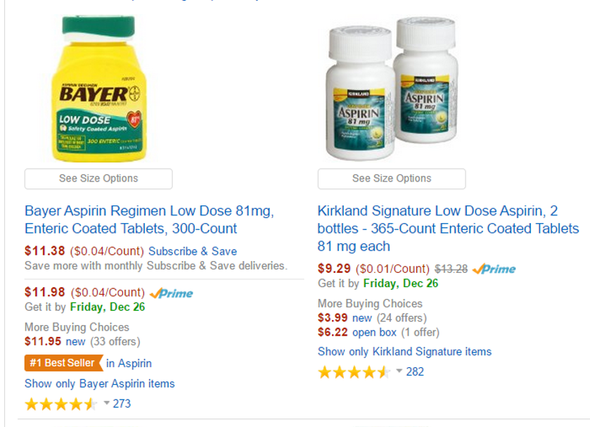{fig-align="center" height="430px"}

::: {.callout-note appearance="minimal"}
Bayer introduced Aspirin as one of the first patented drugs in the U.S. Aspirin went off patent in the 1950s, and Bayer lost trademark ownership due to genericization after that. Yet Bayer still charges a premium price over nearly identical competitors
:::

::: notes
- Bayer sells at a huge premium over generic versions, even though they are pretty much the same thing. Note the 3-4x price difference per pill in the picture... Not only does it sell at a large premium, it often sells more... Bayer used to own the word "Aspirin," but it became one of those trademarks that was so ubiquitous, it lost its copyright protection... Do highly informed consumers pay the brand premium?
:::

##

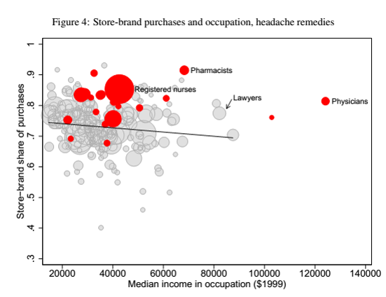{fig-align="center" height="440px"}

::: {.callout-note appearance="minimal"}
This figure summarizes millions of shopping trips by head-of-household profession. Store-brand shares are high in headache remedies, due to price differentials. Yet household income barely predicts store-brand share. Medical professionals tend to buy store-brands more often; why?
:::

::: {.source-url}
[Bronnenberg et al. (QJE 2015)](https://papers.ssrn.com/sol3/papers.cfm?abstract_id=2460893){target="_blank"}
:::

::: notes
- Bronnenberg, et al., QJE 2015
- Authors summarized a scanner panel dataset of 66 million shopping trips by 110,000 households between 2004 and 2010.... You see three things here. One is that store-brand market shares are pretty high in the headache remedies category.
Two, income has a surprisingly small effect on the probability of paying the brand premium...Three, medical professionals are more likely to buy store-brand products than branded products (compared to other professions). Note that pharmacists have the highest store-brand market share. However, the store-brand market share is still far from 100%.... These people have a better understanding of the equivalence between the two products, suggesting that the brand substitutes for the lack of information possessed by non-medical-professionals, and helps to justify the premium price
:::

##

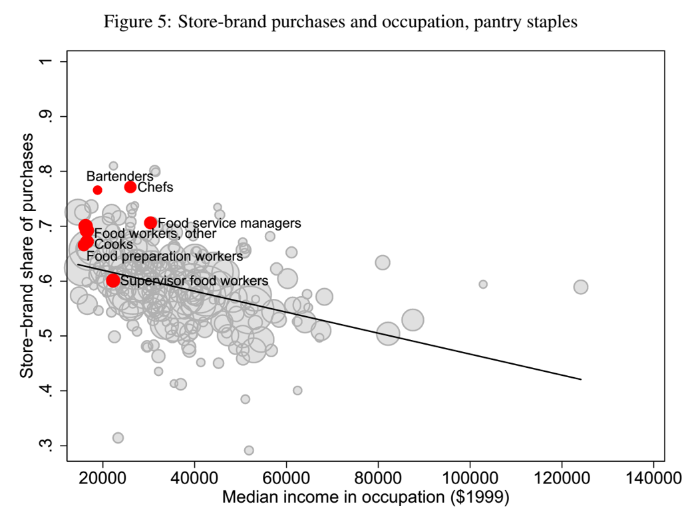{fig-align="center" height="440px"}

::: {.callout-note appearance="minimal"}
Similar pattern in commodity foodstuffs (baking soda, plain salt, sugar, etc): Food service professionals more often avoid paying the brand premium due to high product knowledge
:::

::: {.source-url}
[Bronnenberg et al. (QJE 2015)](https://papers.ssrn.com/sol3/papers.cfm?abstract_id=2460893){target="_blank"}
:::

::: notes
- After controlling for income, chefs buy a higher percentage of store brands than nearly any other profession...These results suggest that brands reassure uninformed consumers about product quality
:::

## What happens when consumers gain knowledge?

- Bron. et al. (*MkSc* 2020): Intercepted shoppers in-store
- First, a survey, including:
    - Q2: Do you prefer private label or nat'l brand? (NB=0, PL=1)
- Then, a blind brand/PL taste test, followed by
    - Q3: Which did you prefer? (NB=0, PL=1)
    - Q4: Will you buy PL next time?

::: {.callout-note appearance="minimal"}
Some shoppers said they prefer the National Brand, but learned they prefer the Private Label (Q2=0, Q3=1); some said they prefer the Private Label, but learned they prefer the National Brand (Q2=1, Q3=0); the remainder confirmed their expectation. How do you think stated preferences changed in each case?
:::

::: {.source-url}
[Bronnenberg, Dube & Sanders (MkSc 2020)](https://pubsonline.informs.org/doi/pdf/10.1287/mksc.2019.1189){target="_blank"}
:::

::: notes
 -  
- Context was Roundy's yogurt sales
:::

##

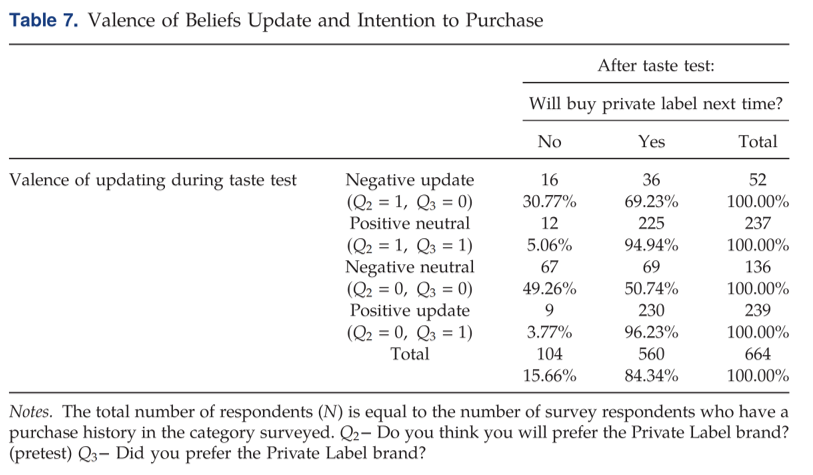{fig-align="center" height="460px"}

::: {.callout-note appearance="minimal"}
The intervention had a dramatic effect on stated preferences among those who said they preferred the National Brand, but then learned they preferred the Private Label. Recall that the Private Label is cheaper. Have you ever given yourself a blind taste test to learn your own preferences?
:::

::: notes
- Work through each of the cases
- Effects on stated purchase intentions were dramatic, especially among those who were surprised (ie Q2=0)
:::

## PL Share among Surveyed Shoppers

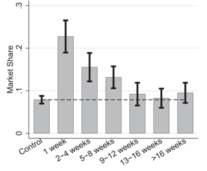{fig-align="center" height="430px"}

::: {.callout-note appearance="minimal"}
A cool thing about this study was that survey answers could be linked to frequent shopper cards, so researchers observed subsequent purchases. This is a large impact for a one-time intervention. Why did the effect fade with time?
:::

::: notes
- What did they actually buy after the survey?
- Huge sales increase; reverted to baseline after 2 months
- Control was within-shopper, vs. what they were buying before the taste test
:::

## 1. Credibility: Takeaways

- Less-knowledgeable consumers are more likely to pay the brand premium
    - Recognized brands assumed better/safer than alternatives
- Informing consumers can change brand/PL sales
    - Changes may be transitory

::: {.callout-note appearance="minimal"}
Calls back to pricing discussion, how consumers infer unobserved product quality based on price and other signals that would be costly if the firm does not deliver as expected
:::

::: notes
- E.g. instore sampling at costco
- Can work the other way too, eg pointing out risks of nonbrand consumption
:::

## 2. Rapid communication

- Names and graphics
    - facilitate understanding
    - call attention to differentiating attributes
- What is the value proposition?

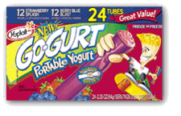{fig-align="center" height="210px"}

::: {.callout-note appearance="minimal"}
Target: Busy 8-12-year-olds. Differentiation: no spoon. Intangibles: easy, cool, fun. Helped General Mills overtake Dannon in a mature product category.
:::

::: notes
 Target: Busy 8-12-year-olds; Differentiation: you don't need a spoon; Intangibles: 1. easy 2. cool 3. fun. ... Helped General Mills to overtake Dannon as market leader in early 2000s
:::

## 3. Personality & Self-expression

:::: {.columns}

::: {.column width="55%"}
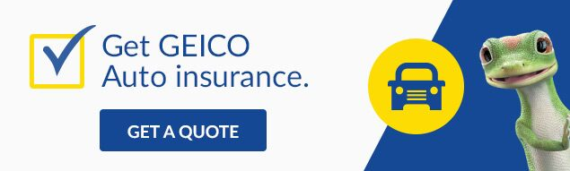{fig-align="center" width="90%"}

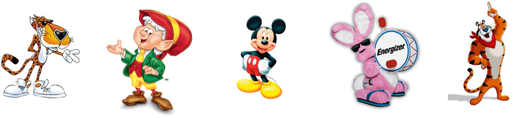{fig-align="center" width="90%"}
:::

::: {.column width="45%"}
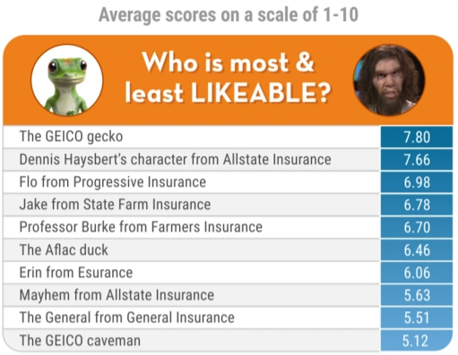{fig-align="center" height="380px"}
:::

::::

::: {.callout-note appearance="minimal"}
Geico is in the business of pricing risk. Insurers commonly seek to humanize themselves to seem approachable. As a former Met Life employee told me: “We used to talk about it all the time. We would be nothing without that stupid dog.” (Snoopy)
:::

::: notes
- By definition, Geico trades off money for risk. You bet them on when you are going to have car accidents, and they give you odds. ....
- Insurance customers perceive insurance brands as more approachable and human as that. As a former Met Life employee told me: "We used to talk about it all the time. We would be nothing without that stupid dog."
- https://medium.com/illumination-curated/the-genius-behind-the-geico-gecko-100ee1455546
- https://insurancenewsnet.com/innarticle/at-age-20-the-geico-gecko-remains-king-of-the-insurance-ads
:::

##

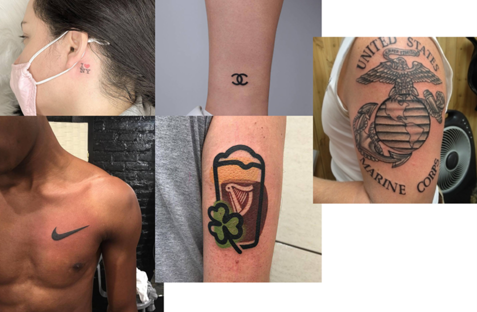{fig-align="center" height="460px"}

::: {.callout-note appearance="minimal"}
Does anyone here have a brand tattoo? What do these tattoos say about their wearers? About their brand relationships? We are getting back to the original definition of branding
:::

::: notes
- What do these tattoos say about their wearers? About their brands?
- We're getting back to the original definition of the term branding
:::

## Brands can

- Express shared identities: UC San Diego, San Diego Padres
- Personify seller attributes, eg Jordan Brand, Kylie Cosmetics
- Adopt a common brand "personality"
    - Sincerity (honest, wholesome): Hallmark, Trader Joe's, In-n-Out
    - Excitement (daring, youthful): Red Bull, Duolingo
    - Competence (reliable, efficient): Amazon, Google, Toyota, Visa
    - Sophisticated (glamorous, refined): Apple, Rolex, Tiffany
    - Rugged (tough, outdoorsy): Carhartt, Jeep, North Face, Yeti

::: {.callout-note appearance="minimal"}
Best practice: match brand personality to value proposition & target customer's preferences/aspirations
:::

::: {.source-url}
[Davies et al. (2018)](https://drive.google.com/file/d/1kATGvFLXFkFGRidTc8Mbmhuu5DjNao_e/view?usp=drive_link){target="_blank"}
:::

## 4. Gestalt

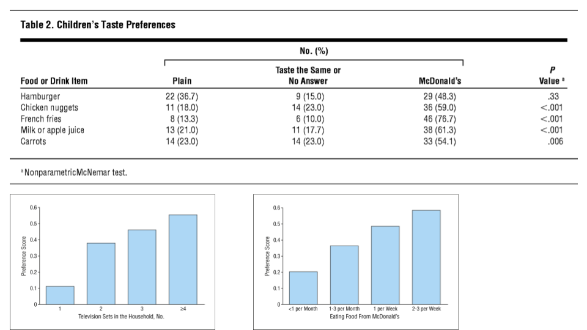{fig-align="center" height="300px"}

::: {.callout-note appearance="minimal"}
We have evidence that branding can complement product consumption. In this study, 3-5 year olds were given identical food in McDonald's branded containers or plain containers, and asked which version tasted better, indicating the McDonald's-branded versions for 4 out of 5 foods. Brand preference increased with TV exposure and brand experience. Neuroscientists gave Coke or Pepsi to subjects in fMRI machines, reporting that "In the brand-cued experiment, brand knowledge for one of the drinks had a dramatic influence on expressed behavioral preferences and on the measured brain responses."
:::

::: {.source-url}
[Robinson et al. (2007)](https://drive.google.com/file/d/14GyktbKhGAs-nfuDcvycCktYxC6h-gM5/view?usp=drive_link){target="_blank"} | [McClure et al. (2004, Neuron)](https://www.cell.com/neuron/fulltext/S0896-6273(04)00612-9){target="_blank"} | [Becker & Murphy (1993)](https://drive.google.com/file/d/1gcViqoZe78R3ktVLBXL7MsfPnuc7rrzL/view?usp=sharing){target="_blank"}
:::

::: notes
- Figure 1: Give people a choice of the same peanut butter in three different jars, with one jar labelled with a known brand. Which one do they choose?
- Figure 2: Now swap the labels between a high-quality peanut butter brand and a low-quality peanut butter brand. What happens?
- Figures came from a pre-print by McClure et al.  (2004), "Neural Correlates of Behavioral Preferences for Culturally Familiar Drinks" in the Neuron. I learned about it here https://hbr.org/2007/03/getting-attention-for-unrecognized-brands
:::

##

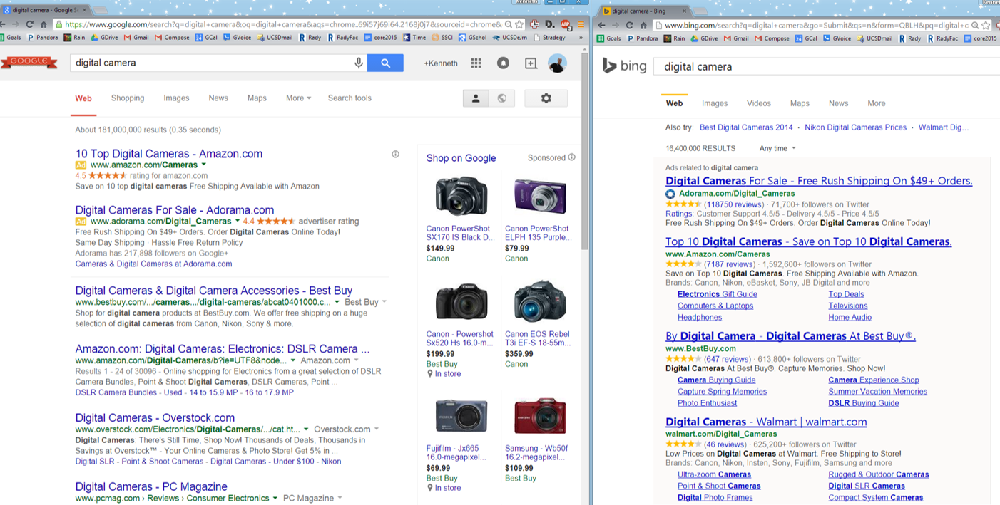{fig-align="center" height="460px"}

::: {.callout-note appearance="minimal"}
One way Google tracks its own brand strength is to compare preference differentials in its own search results compared to Bing's, vs. Bing's results in Google's format compared to Google's results in Bing's format. Brand dominates content in predicting preference
:::

::: notes
- Another example of switching the packaging...
- Google example: How many consumers prefer Google search results to Bing search results?
- How many people prefer Bing search results in Google format to Google search results in Bing format?
- A: they always prefer the results in the google format; but the difference fluctuates over time, reflecting google's brand strength
:::

## Creating artificial differentiation

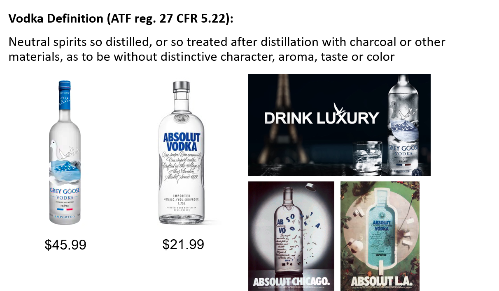{fig-align="center" height="450px"}

::: {.callout-note appearance="minimal"}
The vodka category proves that branding can create differentiation that relieves pricing pressure. It costs around $5 to make a low-end bottle of vodka, $15-17 on the high end
:::

::: {.source-url}
[Felene (2024)](https://felenevodka.com/how-much-does-it-cost-to-make-a-bottle-of-vodka/){target="_blank"}
:::

## Liquid Death's Brand Strategy {.smaller}

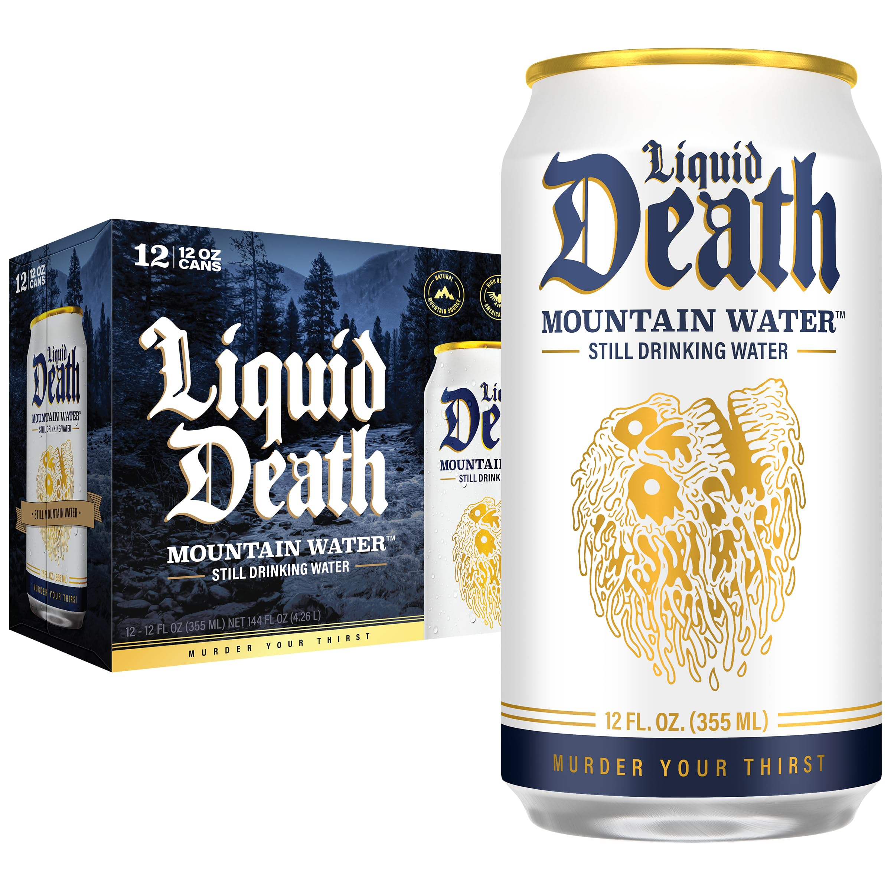{.absolute top="100" right="40" height="400px"}

:::: {style="width: 55%;"}
1. Build an entertainment-first brand
    - Comedy is the one thing Coke and Pepsi can't do
2. Prioritize top of funnel (awareness)
3. Be nimble and take risks
4. Problems? Entertain the solution
    - People thought LD sold alcohol, so LD advertised "Drink on the job"
5. Turn your fans into content

::: {.callout-note appearance="minimal" style="font-size: 1.3em;"}
Liquid Death founder was a graphic designer at an ad agency inspired by watching festivalgoers reuse an energy drink can to drink water. What's the margin on that water?
:::
::::

::: {.source-url}
[Feifer (2025)](https://web.archive.org/web/20260211215235/https://www.entrepreneur.com/growing-a-business/liquid-death-is-worth-14-billion-because-of-this/494168){target="_blank"} | [a16z (2026)](https://speedrun.substack.com/p/liquid-deaths-mike-cessario-on-building){target="_blank"}
:::

::: notes
- Bottled water is the canonical modern example of artificial differentiation for a homogeneous product.
- Ties to the earlier vodka slide: regulated homogeneity + unregulated branding = enormous markups.
:::

## What's in a name?

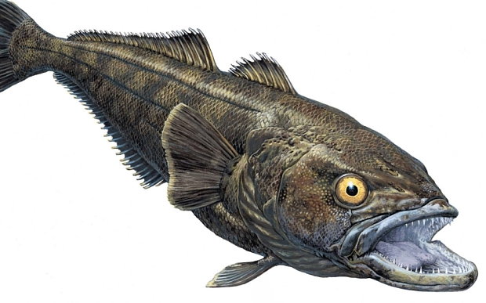{fig-align="center" height="440px"}

::: {.callout-note appearance="minimal"}
Meet the Patagonian Toothfish. This adorable little monster is a 6' bottom feeder. What would you rename it if you want to start selling it in fancy restaurants?
:::

::: notes
- A new product's name can dramatically influence consumer perceptions of the job the product can perform
- This adorable little monster is a Patagonian toothfish. Well, that's what it was called in the US until 1977. Fishermen used to catch these by accident and throw them back--nobody wanted them. Until a fish wholesaler named Lee Lantz decided to rename it. Now it's called a "Chilean Sea Bass."
- In 1994, the FDA accepted this relabeling as an 'alternative market name.' In 2013, it accepted that the same label could be applied to an Antarctic Toothfish.
- Pre-1977, toothfish was unknown in the US. It often got caught by deep-water longline fisherman by mistake. After the rebranding, demand for toothfish took off. You can find it everywhere now, including some of the priciest restaurants.  Similar rebranding efforts have helped make various species of fish more palatable to US restaurants– for example, calling sea urchins by their Japanese name (uni) instead of their traditional name "whore's eggs," renaming "goosefish" to "monkfish," and renaming the 'slimehead' fish as the 'orange roughy'
- Why did the renaming work? Everybody in the US knows "bass"—"Chilean" explains where it's from—and "Sea" explains where it lives. Bam. Now you (feel like you) know everything you need to know about the toothfish. (Never mind that it's not a bass)
- Another example of how names can affect demand for a new product: evocative adjectives and proper nouns support initial sales of new coffee SKUs
:::

# Advertising

- Brand vs. Performance advertising
- Programmatic advertising
- Does advertising build brands?
- Advertising measurement

## Brand Ads vs. Performance Ads?

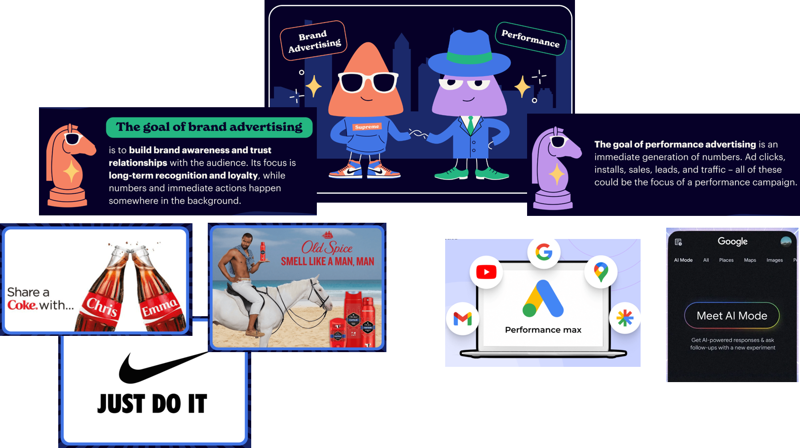{fig-align="center" height="450px"}

::: {.callout-note appearance="minimal"}
Brand and performance ads differ in their time horizon, content, measurability, and optimizability. Which approach do you think is better?
:::

::: {.source-url}
[Silverback Strategies](https://www.silverbackstrategies.com/blog/brand-vs-performance-marketing/){target="_blank"}
:::

## Brand is Dead?

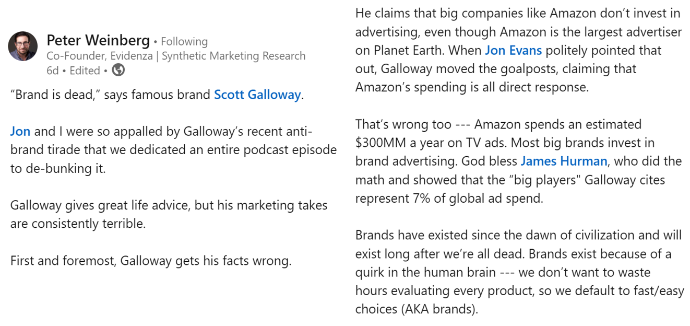{fig-align="center" height="460px"}

::: {.callout-note appearance="minimal"}
We've been hearing takes like this for generations. Every new channel promises to replace brand advertising with something more measurable. So far brand keeps not being dead. Why not?
:::

##

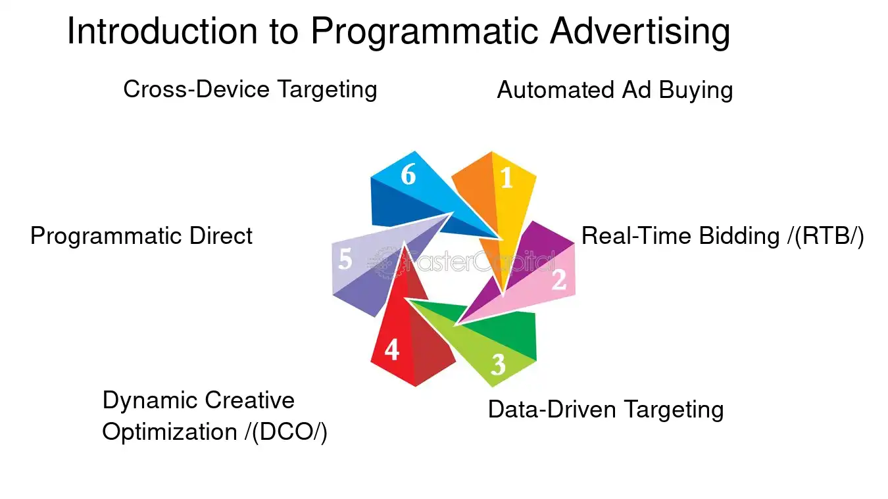{fig-align="center" height="450px"}

::: {.callout-note appearance="minimal"}
"Programmatic" means using technology to automate and optimize the ad buying process. Initially, these technologies were developed in the 2000s to allocate unsold ad inventory, but they are now at the top of the food chain
:::

::: {.source-url}
[IAB Glossary](https://www.iab.com/insights/glossary-of-terminology/){target="_blank"} | [FasterCapital overview](https://fastercapital.com/content/Programmatic-Advertising--How-to-Use-Programmatic-Advertising-to-Automate-and-Optimize-Your-Advertising-Funnel.html){target="_blank"}
:::

##

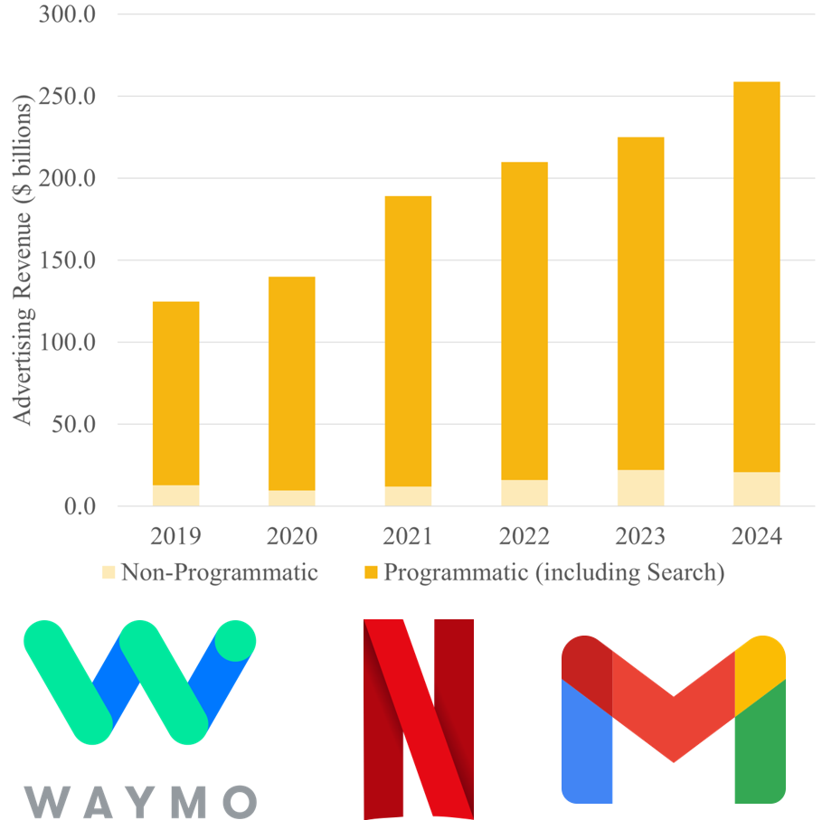{fig-align="center" height="420px"}

::: {.callout-note appearance="minimal"}
Advertising conversion rates are about 0.1% on average. Programmatic methods promise to leverage data across campaigns, like Waymo ("the world's most experienced driver"), Netflix recommendations, or Gmail spam filters. More ads placed -> more conversions/non-conversions observed -> more effective placement algorithms
:::

::: {.source-url}
[IAB 2024 Internet Advertising Revenue Report](https://www.iab.com/insights/internet-advertising-revenue-report-full-year-2024/){target="_blank"}
:::

##

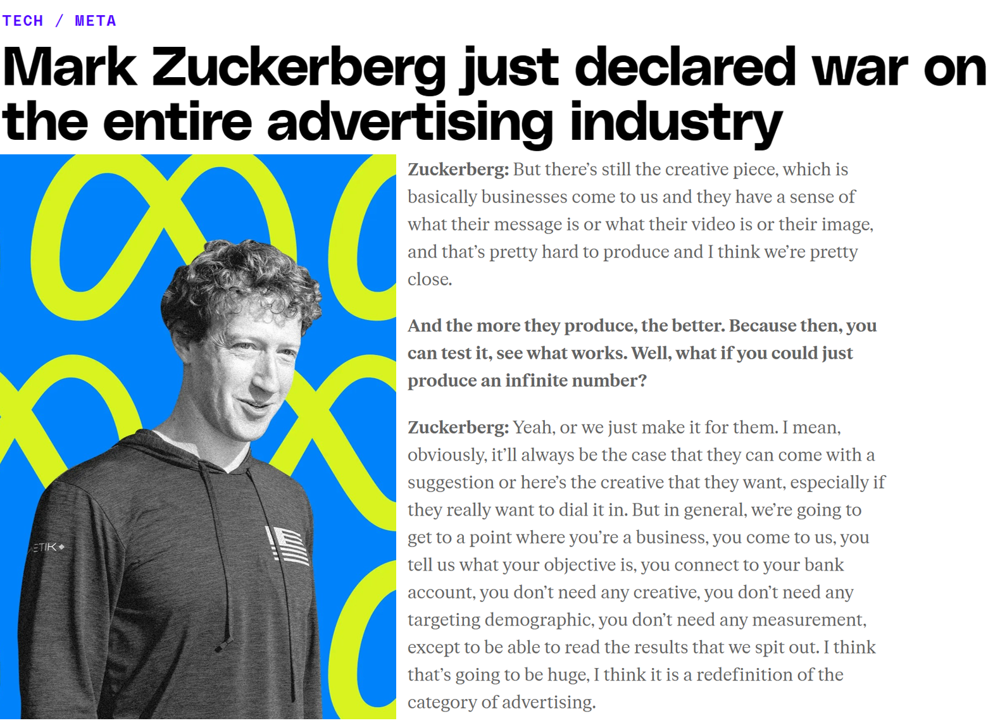{fig-align="center" height="460px"}

::: {.callout-note appearance="minimal"}
Zuckerberg poses provocative questions. Do platforms still need advertisers to supply advertisements? Would you sign up to connect your bank account?
:::

::: {.source-url}
[The Verge: Zuckerberg on AI and Facebook ads](https://www.theverge.com/meta/659506/mark-zuckerberg-ai-facebook-ads){target="_blank"}
:::

## Should AI make ads?

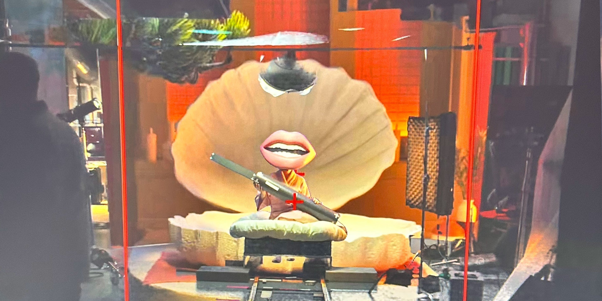{fig-align="center" height="400px"}

::: {.callout-note appearance="minimal"}
Quip was accused of using AI to make its ad, so it blogged the production process. How will consumers respond to AI-generated ads?
:::

::: {.source-url}
[Modern Retail (2026)](https://web.archive.org/web/20260429101836/https://www.modernretail.co/marketing/quips-latest-ad-wasnt-ai-generated-people-were-convinced-it-was/){target="_blank"} | [Quip (2026)](https://web.archive.org/web/20260512085244/https://www.getquip.com/blogs/mouthoff-blog/behind-the-scenes-of-ultra-lite){target="_blank"} | [Quip ad](https://drive.google.com/file/d/1snnIYALlcN0LQiL5xsRfznFhF1W-uExy/view?usp=drive_link){target="_blank"}
:::

## Programmatic downsides

- Infrastructure maximizes conversions, not incremental conversions
    - Attribution/credit "stealing"
- Goliath sellers, unlawful monopolization, enshittification
- Fraud, Algorithmic opacity, Privacy regulations
- Ad blockers: ~25-45% usage, charge ~30% toll
- "Ad Tech Tax": 20-50% of ad spend

::: {.callout-note appearance="minimal"}
You might ideally want programmatic infrastructure to maximize causal sales lift, but it is not designed that way. Why do you think that is?
:::

::: {.source-url}
[Gordon et al. (2021, p. 33-37) overview ad fraud](https://arxiv.org/pdf/1912.09012){target="_blank"}
:::

##

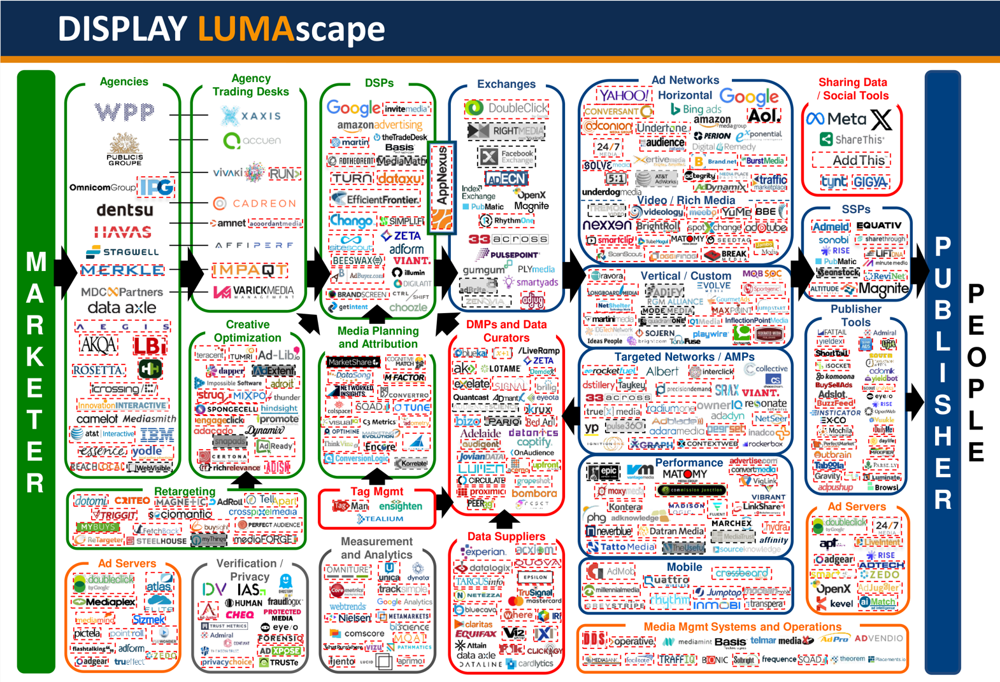{fig-align="center" height="470px"}

::: {.callout-note appearance="minimal"}
The ad tech tax feeds the ad tech ecosystem. The LUMAscape maps the ad tech supply chain. Each box represents a category of vendors working together to promise the "right ad, right person, right time"
:::

::: {.source-url}
[LUMA Partners](https://lumapartners.com/lumascapes/){target="_blank"}
:::

##

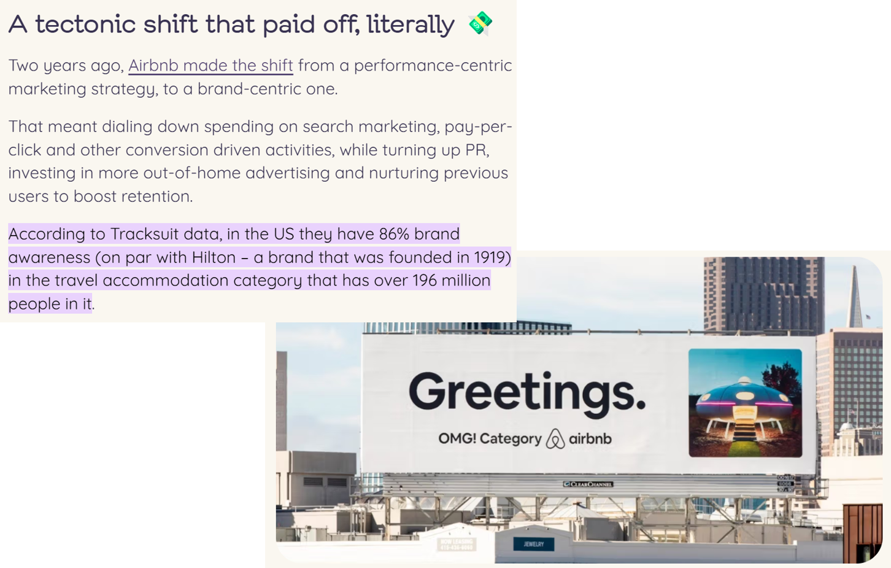{fig-align="center" height="450px"}

::: {.callout-note appearance="minimal"}
Airbnb shifted from performance ads to brand ads, and said the shift paid off. Should other companies follow suit?
:::

::: {.source-url}
[Tracksuit: Airbnb brand investment case](https://www.gotracksuit.com/blog/posts/how-airbnb-proves-the-power-of-brand){target="_blank"} | [Airbnb brand ad example](https://www.youtube.com/watch?v=or4P0p_ojkM){target="_blank"}
:::

##

{fig-align="center" height="450px"}

::: {.callout-note appearance="minimal"}
Airbnb's ad agency argues that Airbnb's high preference:consideration ratio justifies the shift to brand ads... but this viz looks funky
:::

##

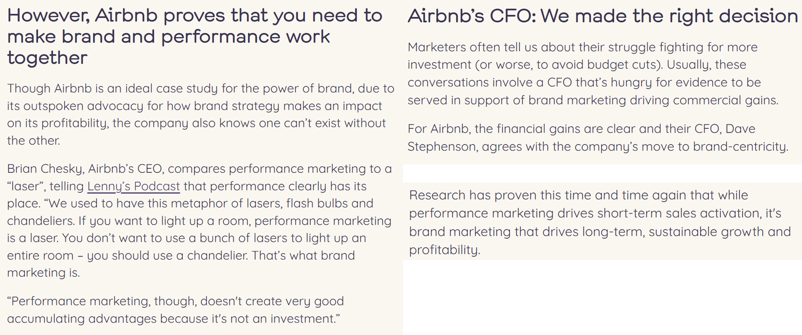{fig-align="center" height="450px"}

::: {.callout-note appearance="minimal"}
Most large companies run both brand campaigns and performance campaigns, but it is hard to determine the optimal split of advertising budget between them, as we don't have great ways of establishing returns on brand campaigns
:::

## Does advertising build brands? Toyota

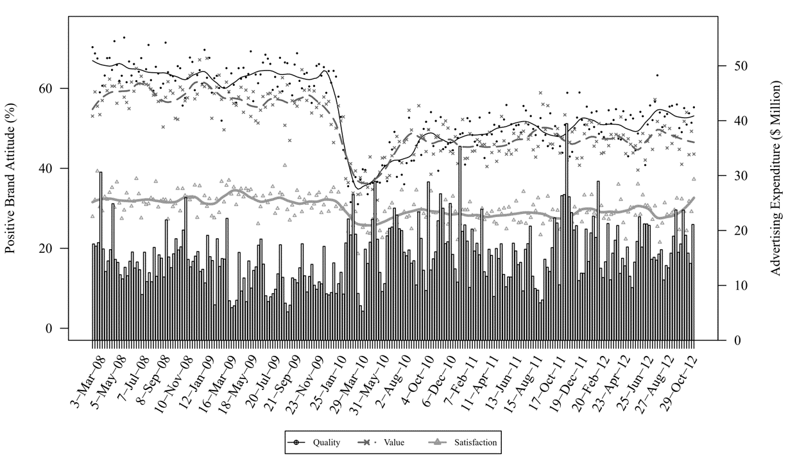{fig-align="center" height="460px"}

::: {.callout-note appearance="minimal"}
Weekly brand surveys (dots) and moving averages (lines), with weekly ad spend as columns. The 2010 accelerator recall hurt Toyota's brand. Advertising increased afterward and brand attitudes slowly recovered
:::

::: notes
- These are similar YouGov metrics that we saw earlier for Netflix
- Dots are weekly brand attitude surveys; lines are moving averages
- Columns show total brand spend on ads each week
- You can see the accelerator recall crisis hurt Toyota's image in 2010
- Asymmetric pattern is typical: Quick negatives, slow positives
:::

## Does advertising build brands? Coke

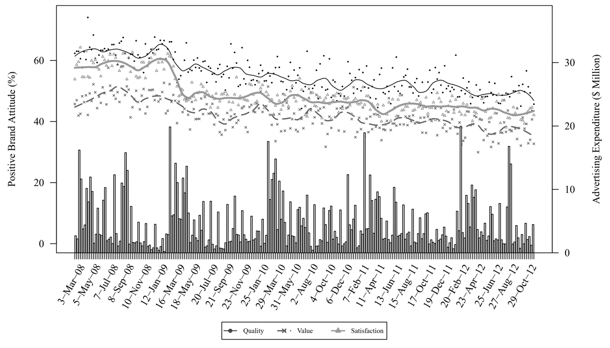{fig-align="center" height="460px"}

::: {.callout-note appearance="minimal"}
Coke's brand metrics slipped as soda lost popularity. Huge Super Bowl ad-spend spikes – not much bounce in brand tracking
:::

::: notes
- Coke's brand metrics slipped with as soda became less popular Huge spikes in ad spend around the super bowl, not much bounce
- This data sample was before most ad spending moved online
- Tough to update this study because google, meta, etc hoard data
:::

## Does advertising build brands? Apple

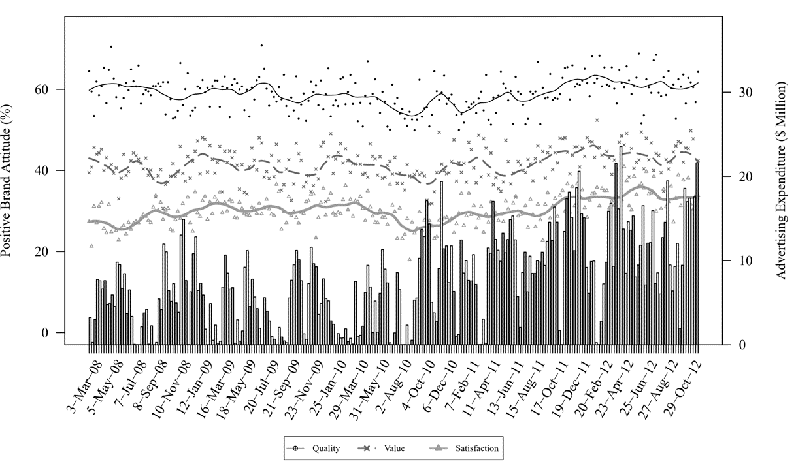{fig-align="center" height="460px"}

::: {.callout-note appearance="minimal"}
Apple's brand turned upward in late 2010, after Apple introduced the iPad and started advertising more. Ad spending and product quality often correlate
:::

::: notes
- Apple's attitudes were fairly stable, with quality around 60%, value 40%
- Big change in ad spend may have lifted metrics, or it may have simply coincided with quality improvements, or both
- Many companies and agencies estimate correlational ad effects
:::

## Advertising and brand attitudes

- We regressed brand tracking statistics on brand ad spending of various types, using multiple strategies to control for unobservables
- Findings:
    - Own advertising increases brand perceptions
    - Competitor advertising decreases brand perceptions
        - Advertising looks like a prisoner's dilemma
    - Massive data needed to estimate precise effects

::: {.callout-note appearance="minimal"}
We analyzed 10 million brand surveys and \$264B in ad spend by 575 brands in 37 categories over 5 years. This was the largest observational analysis to date, suggesting that advertising is a prisoner's dilemma game that incentivizes brands to over-invest
:::

::: {.source-url}
[Du, Joo, Wilbur (2019)](https://drive.google.com/file/d/1V9TYcKEw3RSxytTkk8W7RIM7p2uL-WD9/view?usp=sharing){target="_blank"}
:::

::: notes
- 37\% of all measured media
- Over 10 million brand surveys
- Meta-analytic scope without publication bias
- Suggests advertising is a prisoner's dilemma
- Ad effects are small, likely don't justify observed ad spending
:::

## Ads Measurement Approaches

- Marketing Mix Models
- Multi-touch Attribution
- Incrementality Testing
    - Marketers' word for experimental/causal lift
    - A/B/.../n testing, geo-lift tests, going-dark designs
- Quasi-experiments
    - Instrumental variables, synthetic controls

::: {.callout-note appearance="minimal"}
Large marketers usually use multiple methods in parallel. Each approach has known strengths and weaknesses. Ultimately the CFO and CMO decide what gets funded, and how results affect decisions
:::

::: notes
- Big, digital-first marketers are doing most of these
- Active debates about the best approach are expected
- Ultimately, CFO and CMO adjudicate, decide what combination gets funded
:::

## Tying Things Together {.smaller}

- Brand advertising
    - Should make performance ads more effective
    - Long-term, high-cost, requires strategic commitment
    - Hard to measure incremental returns
    - Possible to measure correlational returns
- Performance advertising
    - Highly targeted, low-cost, short-term, no attachments
    - Definitely possible to measure incremental returns
    - Pray to the algorithmic overlords
- Popular theory: More brand ads in "search markets," more performance ads in "selection markets"
    - Search markets: Consumer usually searches, eg car insurance
    - Selection markets: Consumer usually chooses from a set, eg grocery store

::: {.callout-note appearance="minimal" style="font-size: 1.3em;"}
Brand and performance ads are substitutes in the short run and complements in the long run
:::

## Toolkit: Find wtp for sponsorship {.smaller}

- We can pay a celebrity brand $\$W$ to sponsor our phone. Conjoint estimates indicate the sponsorship will increase phone brand utility from $\hat\beta$ to $\hat\beta'$. Should we do it?
- Let $\pi_0=q_j(p_j-c)$ be current contribution
- Let $q'_j(p_j)=N \hat{s}'_j(p_j)$ be celebrity-sponsored demand
- Calculate $\pi_1=q'_j(p_j)(p_j-c)$
    - $\pi_1-\pi_0$ is pure demand effect of celebrity association
- Find new optimal price $p'_j$ for demand $q'_j(p_j)$
- Calculate $\pi_2=q'_j(p'_j)(p'_j-c)$; associate with celebrity if $\pi_2-\pi_0>W$
- Discuss: What if the celebrity's threat point is to associate with a competitor?
- Discuss: What if celebrity association persists multiple years?
- Discuss: What if there is a 20\% chance that a celebrity scandal reduces $\hat\beta'$ to $\hat\beta''\lt\hat\beta$?

{.absolute bottom="20" right="20" height="80px"}

## Class script

- Two-dimensional grid search to optimize S1 and S2 prices simultaneously
- Assess profit effect of celebrity affiliation with brand, without price reoptimization
- Assess profit effect of celebrity affiliation, with joint price reoptimization

{.absolute bottom="20" right="20" height="100px"}

# Wrapping up

## Competition {.smaller}

- Find the Nash equilibrium in S1-vs-A1 pricing, under two celebrity-endorsement scenarios
- Scenario A: Samsung hires the celebrity (CCE applied to S1 and S2 utilities only)
    - Step 1: For each A1 price in {\$599, \$649, \$699, \$749, \$799, \$849, \$899, \$949, \$999}, find S1's profit-maximizing price using the class dataset and week 6 model `out10`
    - Step 2: For each S1 price in {\$599, \$649, \$699, \$749, \$799, \$849, \$899, \$949, \$999}, find A1's profit-maximizing price (hold all other prices fixed; assume A1 marginal cost = \$450)
    - Step 3: Predict (p_S1, p_A1) at the intersection of the two best-response curves -- this is the Nash equilibrium for Scenario A -- and compute profits
- Scenario B: Apple hires the celebrity instead (CCE applied to A1 and A2 utilities)
    - Steps 4-6: Repeat Steps 1-3 for Scenario B
- Plot all four best-response curves in (p_A1, p_S1) space; mark both Nash equilibria; compare profits across the two scenarios

{.absolute bottom="20" right="20" height="120px"}

::: {.callout-note appearance="minimal"}
Do not re-optimize prices of S2 or A2 at any point. This is our most challenging competition of the quarter. We won't ask something this hard on midterm 2.
:::

## Recap

- Brands are consumer associations between company assets (products, trademarks, etc) and related concepts
    - Mental real estate: We can influence it but we don't own it
- Brands work by establishing credibility, rapid communication, personality/self-expression and gestalt
- Brand/performance advertising debate trades off LR correlations vs. SR causal effects
- Demand models can quantify returns to brand investments

{.absolute bottom="20" right="20" height="100px"}

## Going further

- [Advertising Measurement by Wilbur (2026)](https://kennethcwilbur.github.io/admeas/admeas.html#/title-slide){target="_blank"}
- [Gordon et al (2026): Predicted Incrementality for Experimentation](https://drive.google.com/file/d/1UHRg-34HBjBSV-J3u51wWqmD_y0MCMxf/view?usp=drive_link){target="_blank"}
- [Advertising and brand attitudes: Evidence from 575 brands over five years (QME 2019)](https://drive.google.com/file/d/1V9TYcKEw3RSxytTkk8W7RIM7p2uL-WD9/view?usp=sharing){target="_blank"}
- [Swaminathan et al. (2020): Branding in a hyperconnected world (JMR)](https://www.sciencedirect.com/science/article/abs/pii/S0022243720300064){target="_blank"}

{.absolute bottom="20" right="20" height="100px"}
