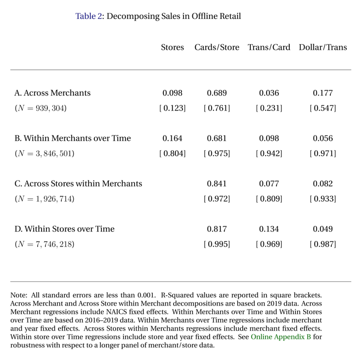
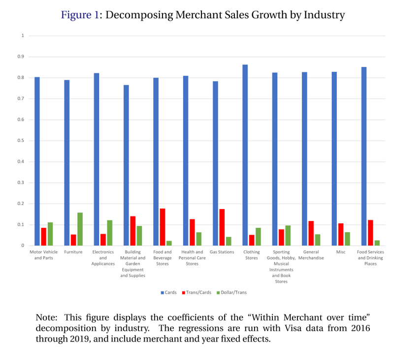
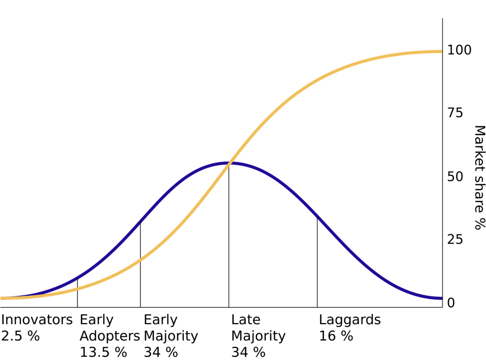
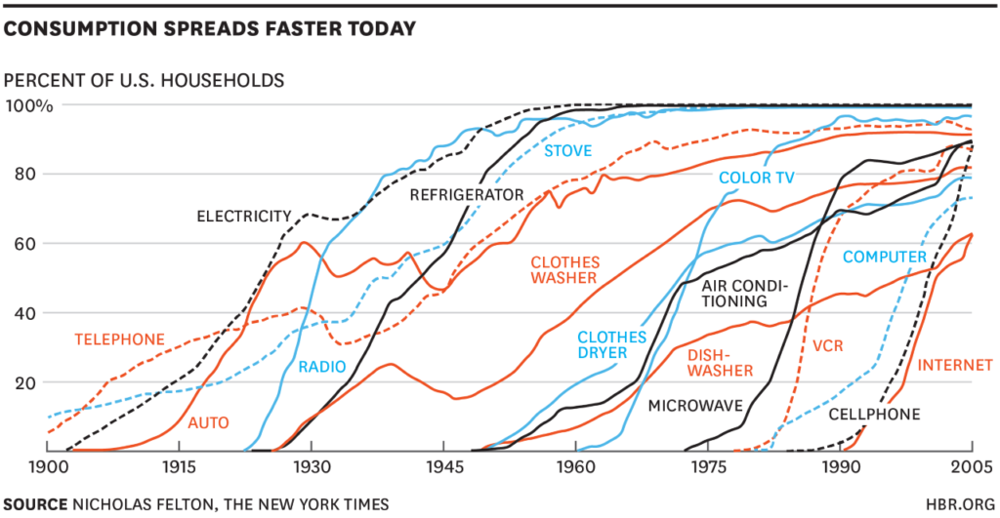
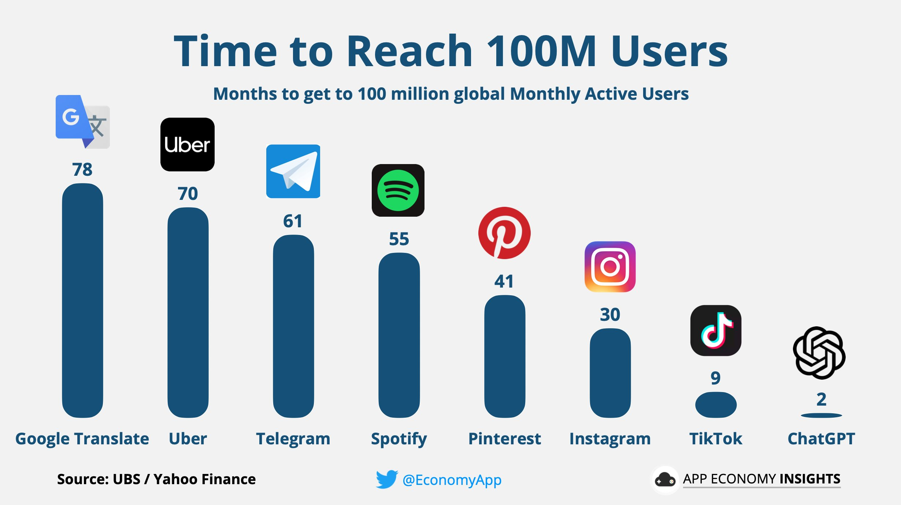
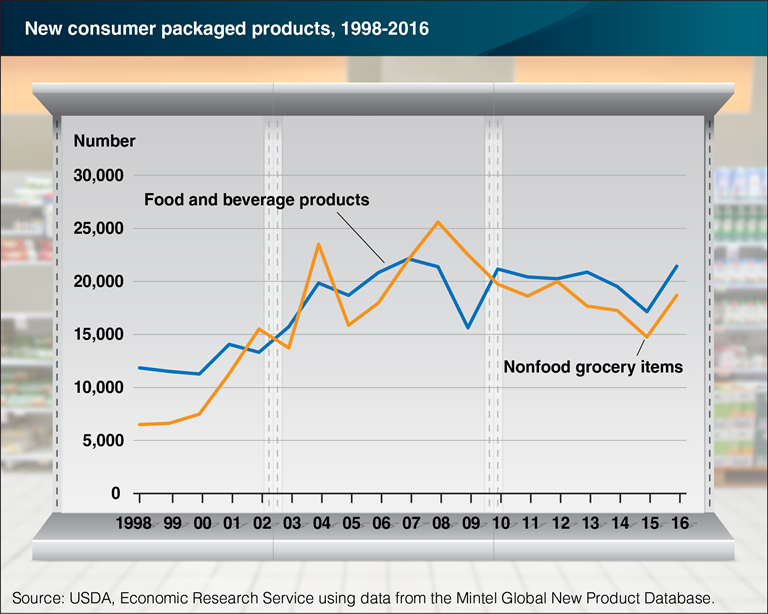
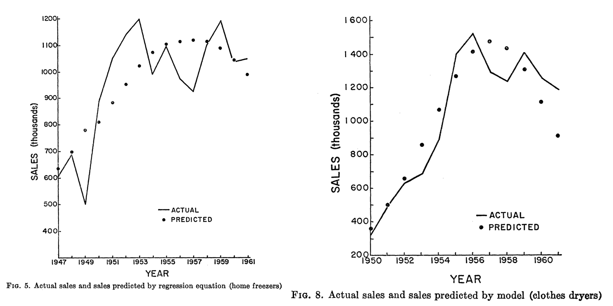
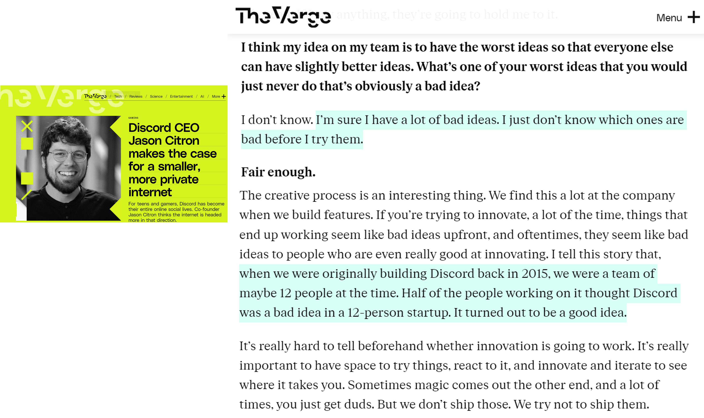
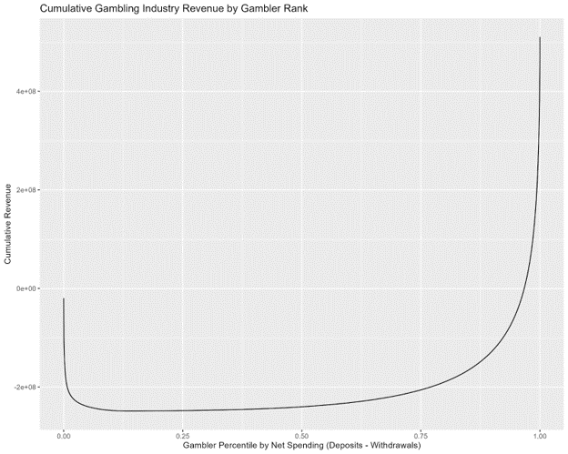
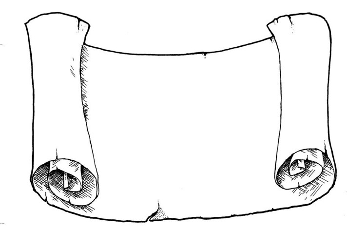

# Predictive Customer Analytics{.smaller}

- Importance of Customer Acquisition

- Market size: How many customers experience the core need?

- Diffusion: How does the served market change over time?

    - Model based on [Bass (1969)](https://drive.google.com/file/d/1eitW-EncbPxkOFWiGSzeaLXpQkVEh4pa/view?usp=drive_link){target="_blank"}

- CLV: How profitable are customer relationships?


::: notes
-   Until now, we have taken the perspective of a dispassionate
    economist or market analyst. But, most customer analytics work
    happens inside firms. Let's consider how you look at the market when
    you're inside a company.
:::


::: notes
- This paper was published several years before even I was born
- It has been cited 11,000 times. Probably the most cited paper in marketing
- One of the first predictive analytics papers published in any business discipline
- This is a differential equation model, in which the change in a function modeled as a function of the level of the function
- Model was borrowed from epidemiology
- Performs well, but not overall, only relative to all other failed attempts to predict the future
:::

## Importance of Customer Acquisition

- [Einav et al. (2021)](https://www.nber.org/system/files/working_papers/w29561/w29561.pdf){target="_blank"} analyzed all US Visa CC transaction data
    - \>\$1T spent in 32B transactions by 428MM cards at 1MM stores from 2016-19
    - Assume card~=customer

$\text{BrandRev.} = \sum spend \equiv \sum \frac{stores}{1} \frac{cards}{stores} \frac{transactions}{cards} \frac{spend}{transactions}$

- Research question: How well does each factor correlate with brand revenue?
- Regressed log revenue on log RHS with merchant and year fixed effects

::: {.callout-note appearance="minimal"}
Which of the four factors do you expect to explain most of the variation in revenue? Why?
:::

::: {.source-url}
[Einav et al. (2021)](https://www.nber.org/system/files/working_papers/w29561/w29561.pdf){target="_blank"}
:::

##

{fig-align="center" height="500px"}

::: {.callout-note appearance="minimal"}
The correlation holds remarkably well across different levels within the data. Which factor best predicts revenue? Was it what you expected?
:::

::: notes
-   Row B is the most representative and controls for merchant dummies
    and year dummies
-   Compare column 2 to other columns: ( \# unique customers / store )
    explains 68-84% of variation in merchant revenue
-   Far more than other variables
:::

##

{fig-align="center" height="500px"}

::: {.callout-note appearance="minimal"}
The correlation holds remarkably well across industries, illustrating its generality. What does this imply for prioritization among these four variables?
:::

::: notes
-   Similar finding across merchant types
-   Remarkably consistent across sectors. These numbers are above 70pct
    bc it's a subsample of offline retailers
-   Explains why companies focus more on customer-level metrics than
    store, visit or transaction level metrics
:::


## Predictive Analytics Help to Inform Decisions

:::: {.columns}

::: {.column width="50%"}
- Weather forecasts
    - What to do, what to wear
- Stock prices
    - Buy or sell, how much, when
- Safety
    - Where to live, how to commute
:::

::: {.column width="50%"}
- Lifespan
    - Schooling, savings/spending, work/retire
- Product quality
    - Buy now/later, return, warranty, insurance
:::

::::

::: {.callout-note appearance="minimal"}
Data always describes the past, but decisions affect the future. Predictive analytics help to convert past data $X$ into decisions $A$ to maximize expected utility of outcomes:
$$\arg\max E[U(A,Y) | X]$$
Examples include election forecasts, product recommendations, and fraud prevention
:::

{.absolute bottom="20" right="20" height="120px"}

## Understanding Predictive Analytics

- Correlations alone can enable powerful predictions
    - Causal drivers may help, but aren't necessary
- Predictive analytics are not designed to be prescriptive or diagnostic
    - Predictive analytics are oft misused & overinterpreted
- Predictive Analytics typically have wide error bars
    - Often forgotten or ignored, even by those who know better
    - CIs should account for data variability, parameter estimation error, and model uncertainty
- Numbers oft misinterpreted, e.g., 92% means 11 out of every 12

::: {.callout-note appearance="minimal"}
Predictive analytics is seductive, as astrology or "picks of the week" suggest. Where have you seen people misunderstand or overinterpret a prediction?
:::

## Remember Dray?

{fig-align="center" height="400px"}

::: {.callout-note appearance="minimal"}
Dray has a powerful predictive analytics engine between his ears. He knows what will happen next after someone puts on their shoes and picks up the leash. But he doesn't always know why--he is less good at diagnostic analytics
:::

## Market Size

- Market size ($N$): \# of people who might pay to address the core need in a given time period
    - Alternatively measured in $, units or volume
    - Noisy but helps inform potential returns to investments
    - Typical investor's first question: How big is the market? $100B market differs from a $100MM market
    - How will you know if you got the right answer?
    - What happens if you overestimate market size?
- "Marketing myopia:" Neglecting nontraditional competitors, e.g. Zoom v. Uber or Carnival v. Whistler

::: {.callout-note appearance="minimal"}
Market size counts both purchasers and non-purchasers who share the core need. Past purchasers can often be counted, but non-purchasers usually can't
:::

::: notes
-   Market size counts both purchasers and non-purchasers
-   The idea would be that for people who have a core need to work, they
    might alternately use Uber to work in an office, or Zoom to work
    from home; hence Uber and Zoom compete
-   How will the investor react if your market size estimate sounds off?
    Some might proceed anyway; some might immediately pass, figuring
    they can't trust you; some might want to dive into the details to
    see if you know something they don't, or if you have solid math
    backing up your claims
:::

## Market Size

- 3 ways to estimate:
    - "Top Down" Total Addressable Market (TAM): <br>How many people have the core need?
    - "Bottom up" Served Available Market (SAM): <br>How many people currently pay to solve the core need?
        - TAM=SAM+Unserved
    - Analyst estimates
- Best practice: Use all three, triangulate, gauge sensitivity

::: {.callout-note appearance="minimal"}
Each method has different blind spots — top-down requires estimating Unserved, bottom-up ignores Unserved, analysts have incentives.
:::

## Case study: US Mattress Market

- USA population: \~340 million
- Assumption: $TAM\approx SAM$ (why? pros, cons?)
- Assumption: Avg mattress lasts 7 years (pros, cons?)
- Market size $\approx$ 47.1 million people annually
- Average mattress price: \$283, across all bed sizes
- Market size $\approx$ \$13.3B/year

::: {.callout-note appearance="minimal"}
Market size predictions usually require assumptions. "Sensitivity analysis" shows how much results differ when you vary the assumptions. What changes if mattresses last 5 years instead of 7? How much do those analyst estimates cost?
:::

::: {.source-url}
[Grand View Research](https://www.grandviewresearch.com/industry-analysis/mattress-market){target="_blank"} | [ISPA](https://sleepproducts.org/resources/statistics/industry-sales-data/){target="_blank"}
:::

::: notes
-   Consider 2nd homes & hotels vs. homeless population
-   How much do those analyst reports cost?
-   What are analyst incentives? How should they price? How often should
    they update their estimates?
:::

## Diffusion curves

{fig-align="center" height="368px"}

::: {.callout-note appearance="minimal"}
Diffusion curves show how SAM changes over time. Adoption is often an S-curve: slow start, accelerating takeoff, saturation, eventual decline. Blue is the density, Yellow is the CDF. Sometimes a "Dip" phase appears between early adopters and early majority; sometimes a "Decline" phase follows maturity. Also appears in epidemiology, with adoption recast as infection and influence recast as contagion
:::

::: {.source-url}
[Godin (2007) talks about "the dip"](https://www.amazon.com/Dip-Little-Book-Teaches-Stick/dp/1591841666/){target="_blank"}
:::

::: notes
-   Distinguish between current and cume sales in the graph
-   Discuss similarities between disease contagion & product adoption
-   Spend a few minutes talking about the phases; mention Moore (1991)'s
    "chasm" or "saddle" idea between initial growth and takeoff
:::

## Diffusion curves

{fig-align="center" height="450px"}

::: {.callout-note appearance="minimal"}
There are claims that diffusion is speeding up
:::

::: notes
-   There are claims that diffusion curves are speeding up in recent
    years. That may be consistent with social media and generally
    accelerating information diffusion
-   Consider product complementarities, eg electricity + TV, or
    substitution between products, eg telephone + cellphone
:::

##

{fig-align="center" height="450px"}

::: {.callout-note appearance="minimal"}
Digitization and social media are plausible mechanisms for accelerating diffusion curves, but these products are not randomly selected. Large majorities of products get lost in the multitude
:::

::: notes
- Important: these products are not randomly selected, they are intentionally selected to make a point
- Of course there remain many technology products with slow adoption. Think about robot vacuums, time-lapse or other phone peripherals, etc etc etc
- But there does seem to be something to the idea that social media has the potential to dramatically accelerate diffusion for some "winning" products
:::

## New CPG Products by Year

{fig-align="center" height="400px"}

::: {.callout-note appearance="minimal"}
In food and drug channels, 35-40k new SKUs launch each year; 90-95% fail completely within six months (Wilbur & Farris 2014). Why is product failure so common, and why do firms keep launching anyway?
:::

::: {.source-url}
[USDA (2017)](https://ers.usda.gov/data-products/charts-of-note/chart-detail?chartId=83141){target="_blank"} | [Wilbur & Farris (2014)](https://drive.google.com/file/d/1pUmJI0ZRoAo1c0SxwXzJPMmVDU0putXl/view?usp=drive_link){target="_blank"}
:::

::: notes
- For completeness we should consider the full scope of products launched every year
- Even if we limit ourselves to food & drug channels, it's massive, on the order of 35-40k new SKUs launched in a typical year
- 90-95% fail completely within 6 months, as in revenues go to zero and manufacturer withdraws the product (Wilbur & Farris 2014)
- Unfortunately USDA stopped updating these data publicly, probably because Mintel increased price too much
:::

## Which new products will catch on?

{fig-align="center" height="450px"}

::: {.callout-note appearance="minimal"}
New products launch frequently, but most fail, and success is notoriously unpredictable. Addressing a real core need is necessary but far from sufficient. Which of these would you bet on?
:::

::: {.source-url}
[Kickstarter](https://www.kickstarter.com/){target="_blank"} | [Product Hunt](https://www.producthunt.com/){target="_blank"} | [Gizmodo](https://gizmodo.com/){target="_blank"}
:::

::: notes
Fastest way to get rich: Invent a new product that sells a lot
That requires addressing a real customer need that people will pay for
And it requires going to market successfully
Success in the market is notoriously hard to predict, most new products fail quickly
Addressing a real core need is necessary but far from sufficient
Which of these new products will succeed?
:::

## Predicting Diffusion: [Bass (1969)](https://en.wikipedia.org/wiki/Bass_diffusion_model){target="_blank"}

- $M$: Market size (we'll estimate this)
- $t$: Time periods
- $A(t)$: Accumulated sales before time $t$
    - AKA "installed base"
    - A(0)=0 by assumption
- $\frac{dA(t)}{dt}$: number of new adopters in time $t$
- $R(t)$: Remaining customers who have yet to adopt, $R(t)\equiv M-A(t)$

::: {.callout-note appearance="minimal"}
A "differential equation" model relates the level of a variable to its derivative. Fits sigmoid curves well
:::

::: notes
-   Can you see where we're going? DiffEQ using A(t) to predict dA/dt
:::

##

- Bass (1969) proposed:

$$\frac{dA(t)}{dt}=pR(t)+q\frac{A(t)}{M}R(t)$$

- $p$: "coefficient of innovation"
- $q$: "coefficient of imitation"
    - p and q assumed constant

::: {.callout-note appearance="minimal"}
LHS is growth per unit of time. 1st term on RHS indicates those who would buy regardless of others' choices ("innovators"), which is assumed to be a constant proportion of the unserved market. 2nd term is those whose purchases are influenced by others ("imitators"), increasing in proportion of market that is served
:::

::: notes
-   LHS is sales in time period t.
-   R(t) is \# of potential buyers who have not bought yet.
-   p is the share of remaining market who would buy at any given moment
    irrespective of previous sales ("innovators").
-   q is the share of nonadopters who adopt at t because they observe
    past purchasers ("imitators")
-   so qR is the number of nonadopters who adopt at t because they
    observe past purchasers
-   and A/M is the fraction of the market who has adopted, and therefore
    could possibly be observed
-   so we scale qR by A/M because each nonadopter's chance of observing
    an adopter increases with the number of adopters available to be
    observed
:::

## Estimating Bass model via NLLS {style="font-size: 0.85em;"}

$$\frac{dA(t)}{dt}=pR(t)+q\frac{A(t)}{M}R(t)$$

- This is a first-order diffEQ with analytic solution

$$A(t)=M\frac{1-e^{-(p+q)t}}{1+\frac{q}{p}e^{-(p+q)t}}$$

- If you have sales data by time, you can use Nonlinear Least Squares to estimate $p$, $q$ and $M$, i.e. choosing parameters to minimize square errors $(LHS-RHS)^2$

::: {.callout-note appearance="minimal"}
You don't have to know how to solve differential equations for this class. Just take my word that the 2nd equation is the solution to the 1st equation. <br><br>NLLS is a straightforward generalization of OLS in which the errors can be nonlinear in the parameters. Parameter estimates are still chosen to minimize the sum of square errors, but they don't have closed-form solutions
:::

::: {.source-url}
[NLLS on Wikipedia](https://en.wikipedia.org/wiki/Non-linear_least_squares){target="_blank"}
:::

::: notes
-   We state this without proof, because differential equations is not a
    prerequisite, and the solution technique is mechanical and
    uninteresting
:::

## Estimating Bass model via OLS {style="font-size: 0.85em;"}

- Or, notice that $\frac{dA(t)}{dt}=pR(t)+q\frac{A(t)}{M}R(t)$<br>$=p(M-A(t)) + q* \frac{A(t)}{M}(M-A(t))$<br>$=pM + (q-p)A(t)+\frac{q}{M} A(t)^2$<br>$\equiv \beta_0+\beta_1 A(t) + \beta_2 A(t)^2$
- We can use OLS to regress $\frac{dA(t)}{dt}$ on a quadratic in installed base $A(t)$
- Bass model extensions: Multiple markets, hazard models, <br>multiple influence types

::: {.callout-note appearance="minimal"}
If we want, we can solve the system of 3 equations in 3 unknowns to recover $\hat{p}$, $\hat{q}$ & $\hat{M}$ from $\hat{\beta}_0$, $\hat{\beta}_1$, & $\hat{\beta}_2$
:::

::: {.source-url}
[Bass (2004)](https://drive.google.com/file/d/1eDUR4ADeh3bo24Ffwxyy1gMS8VyHzAvX/view?usp=drive_link){target="_blank"}
:::

## Models:estimators aren't 1:1?

- Consider 3 OLS estimators:

$$\hat{\beta}=(X'X)^{-1}X'Y$$

$$min_\beta (Y-X\beta)'(Y-X\beta)$$

$$min_\beta [X'(Y-X\beta)]^2$$

::: {.callout-note appearance="minimal"}
"In theory, there's no difference between theory & practice. In practice, there is."<br>Some theoretical models offer multiple estimators. Some have no estimators<br>Estimators may yield different estimates due to assumptions, numerical properties<br>Subfields that invent estimators and study their properties: "econometrics," "data science," "machine learning," "statistics"
:::

::: notes
- Estimation performance may depend on numerical properties, availability of existing algorithms, etc.
- Estimators may differ in speed, complexity, efficiency and econometric properties
:::


##

{fig-align="center" height="450px"}

::: {.callout-note appearance="minimal"}
These figures are from Bass's original 1969 paper. Compared to having no predictive framework, these were like magic to investors and managers. But look closely-- although retrodictions are often near-right on average, every individual retrodiction is wrong
:::

::: notes
-   These are two of the graphics from the OG paper. He even forecasted
    sales of black & white TVs
-   I kind of cherry picked these examples. others were not so clean,
    but I'm glad he showed the non-clean examples, it helps to show
    that he didn't cherrypick what to include or not.
-   Think about what an advance this looked like at the time. with just
    a few data points of sales, you could reasonably predict the future,
    which would help to inform investment decisions
-   Important to note: As is typical in predictive analytics, every single prediction is wrong. Keep your expectations in check
:::

## Rogers' Diffusion Framework

- Diffusion depends on Relative Advantage, Compatibility, Complexity, Trialability, Observability. All from customer's perspective
    - Incredibly influential on managerial practice
    - Provided diagnostics to interpret Bass (1969)'s predictive analytics
    - Prototypes have often been modified to max these 6 dimensions

::: {.callout-note appearance="minimal"}
Everett Rogers was a professor at UNM who spent 50 years studying the "diffusion of innovations," which now includes over 5k published studies. Rogers' framework is the most widely used to explain and predict new product success/failure. Pick a product and score it on each dimension
:::

::: {.source-url}
[Rogers (2010)](https://drive.google.com/file/d/1SfuCT0Mh2tF2GSK-RXDzdPptgai-062s/view?usp=drive_link){target="_blank"}
:::

## More explanations for diffusion curves {style="font-size: 0.85em;"}

- Conspicuous omission: Customer heterogeneity. <br>Preferences, needs, income, or risk attitudes could predict adoption timing
- Conspicuous omission: Marketing efforts like advertising and retail distribution
- Markets typically evolve after introduction
    - Production becomes more efficient & reliable; costs fall; price and customer risk fall
    - New features, technology generations, safety improves
    - Competitors introduce variants targeting unserved customers
    - Network effects, e.g. smartphone compatibility with chargers or accessories
    - Complementors, e.g. Verizon stores, iFixIt, Genius Bar
    - Consumer preferences, e.g. expected reliability rises over time

::: {.callout-note appearance="minimal"}
Bass + Rogers offer the most widely used framework, but neglect important alternate explanations
:::

::: {.source-url}
[Peres, Muller & Mahajan (2010)](https://drive.google.com/file/d/1HIrUtd_v_IRzHklKWKi0dUkSpfvfIufs/view?usp=drive_link){target="_blank"} | [Van den Bulte & Lilien (2001)](https://drive.google.com/file/d/1QWIGoqtwTBlFFuPAJDNXp8o0TPnr5ckf/view?usp=drive_link){target="_blank"} | [Chandrasekaran & Tellis (2008)](https://drive.google.com/file/d/1x_e9ihWn3YVH9CnAUjzx_aAola87ERIB/view?usp=drive_link){target="_blank"}
:::

::: notes
-   Features: Smartphone cameras improve, GPS improves, 4G beats 2G, etc
-   Complementors: Apps improve, payment processors accept mobile
    payments, etc.
-   Apple drops the headphone jack, Android keeps it
-   Early in a category lifecycle, competitors may benefit each other,
    e.g. ads promote category consumption more than brand share. those
    interactions become zero-sum when the category matures
-   Bass+Rogers is kind of an intellectual trap, where you have a
    logical story and data, and then get blinded to alternate
    explanations
:::

## Causal Evidence of Social Influence {style="font-size: 0.85em;"}

- "Viral marketing" seeks to identify & seed influencers within social networks
- After Facebook movie app users rated movies, Aral & Walker (2012) randomly notified 1.3MM friends about their movie ratings, then observed app adoption to estimate influence and susceptibility
- Key finding: Social influence causally drives adoption. Influencers are less susceptible, and susceptible users are less influential
- Influence and susceptibility are both heterogeneous:
    - Older users more influential; younger more susceptible
    - Women influence men more than men influence women
    - Influencers with influential friends had most influence in this context
    - Married users tend to be influential; Relationship/Engaged/Complicated users tend to be susceptible; Single users tend to be both influential and susceptible

::: {.callout-note appearance="minimal"}
Classic conundrums in viral marketing: Should you seed the experts, the taste makers, the network-central hubs, or those with track records of relevant influence? When and whom should you gift vs. pay to promote?
:::

::: {.source-url}
[Aral & Walker (Science 2012)](http://www.dylantwalker.com/pdfs/Science-Identifying-Influential-and-Susceptible-Members-of-Social-Networks-Aral-and-Walker-2012.pdf){target="_blank"}
:::

##

{fig-align="center" height="450px"}

::: {.callout-note appearance="minimal"}
I love Citron's flat priors and bias for testing. It fascinates me that half the team thought the idea was bad, but they proceeded anyway. I wonder which half he was in?
:::

::: {.source-url}
[The Verge — Discord CEO interview](https://web.archive.org/web/20240516070323/https://www.theverge.com/24134914/discord-ceo-gaming-chat-teens-safety-moderation-decoder-interview){target="_blank"}
:::

## Market Size & Career Choice {style="font-size: 0.85em;"}

- Your first job includes a bet on a market
    - Mature market: Big, reputable employers, established career tracks
    - But markets typically decline at some point
    - Growing market: Exciting, high risk, high reward, more opportunity
    - But market may not take off as you expect
    - Will your skillset enable a transition if needed?
- Today's safe option might not be safe tomorrow!
    - Mature markets will decline
    - New markets will grow
    - Consider diffusion trends, not just current market size

::: {.callout-note appearance="minimal"}
I missed a lucrative boat before I found my calling. Should I tell you the story?
:::


## Core Needs Data: [Google Trends](https://trends.google.com/){target="_blank"}

- Best available indicator of unserved market
- Reports search volume indices by keyword, place, time, service
    - Also identifies topics, trending terms & related queries
    - Samples the query database, reports estimates not actual counts
    - Requires a minimum query volume for reporting
    - Free, so it could get sunsetted

::: {.callout-note appearance="minimal"}
Google started Trends back in the 00s because it worried about SEC regulation, given that its search data could predict stock price movements. Seems quaint
:::

::: {.source-url}
[Choi & Varian (2012) discuss data usage considerations](https://drive.google.com/file/d/18aecUVA9gxUTuaItl4i-ceB9sDxVAhb1/view?usp=drive_link){target="_blank"}
:::


## Customer Lifetime Value

- CLV is the most powerful predictive customer analytics metric
    - Expresses the firm's value of an individual customer relationship as the net present value of expected future customer profits
    - Pioneered by catalogue retailers in the 1960s
    - Has spread widely, but not yet everywhere
    - CLV metrics enable quantification & serious discussion of new policies
    - But, prediction uncertainty hinders CLV adoption and usage

::: {.callout-note appearance="minimal"}
CLV can account for customer heterogeneity using same approaches we talked about in week 5
:::

::: notes
-   Catalogue retailers had huge customer databases, and mailed out
    expensive books multiple times per year. Had to test which customers
    were worth sending books, how often
:::

## CLV Example: Housing First {style="font-size: 0.9em;"}

- "In 2005, Utah set out to fix a problem that's often thought of as unfixable: chronic homelessness. The state had almost 2,000 chronically homeless people. Most of them had mental-health or substance-abuse issues, or both. Utah started by just giving the homeless homes...
- The cost of shelters, emergency-room visits, ambulances, police, and so on quickly piles up. Lloyd Pendleton, the director of Utah's Homeless Task Force ... said that the average chronically homeless person used to cost Salt Lake City more than \$20,000/year. Putting someone into permanent housing costs the state just \$8,000 [including case managers]...
- Utah's first pilot program placed 17 people in homes scattered around Salt Lake City, and after twenty-two months not one of them was back on the streets. In the years since, the number of Utah's chronically homeless has fallen by 74%."

::: {.callout-note appearance="minimal"}
Republican Utah might not be your first guess as to whom invented Housing First, but it CLV analysis made this dramatic policy shift look like a no-brainer
:::

::: {.source-url}
[Surowiecki (2014)](https://web.archive.org/web/20240330030348/https://www.newyorker.com/magazine/2014/09/22/home-free){target="_blank"}
:::

::: notes
-   http://www.politico.com/magazine/story/2016/12/what-works-albuquerque-homeless-solution-housing-policy-214527
-   I'm not sure your stereotype about utah, but many would not guess
    they invented housing first. It was CLV metrics that showed it to be
    a no-brainer. It's the serious effort to quantify lifetime value
    that moved this from dream to reality. Humanitarian upsides have
    been tremendous.
:::

## Housing First: Looking deeper {.smaller}

- Housing First has certainly not solved homelessness
    - "Chronic" means disabled and unhoused for 1+ yrs, or 4x in 3 yrs
    - ~28% of CA homelessness is chronic (2019)
    - UT originally claimed 90% reduction, then revised their metric definitions
    - Reliable efficacy metrics are rare
    - Housing First has been implemented haphazardly
    - UT built new apartments. CA cities mostly use shelters, SROs, vouchers
    - Key Q: Require wraparound services? E.g. Addiction treatment, etc
    - Key Q: Does Housing First somehow encourage homelessness?
- I claim: Quantification enables bold policy shifts
    - U.S. HUD adopted Housing First as preferred approach to homelessness in 2014
    - CLV quantifies policy costs and benefits & enables ex-post evaluations
    - We then can use data to refine CLV estimates and policies

::: {.callout-note appearance="minimal"}
Basing policy choices on CLV requires us to quantify and clarify our assumptions, and shows how we expect policies to impact customers. Quantifying disagreements facilitates next steps toward resolutions. What are possible next steps toward evaluating how Housing First policy attributes affect homelessness?
:::

::: notes
-   UT annual homeless figures inflate a January count using a
    multiplier
-   Officials changed the multiplier over time but did not revise past
    figures
-   For more,
    https://www.sltrib.com/news/politics/2020/05/11/utah-was-once-lauded/
:::

## Calculating CLV

- $T$: planning horizon
- $m_t$: contribution margin of serving customer $i$ in time $t$
- $r$: retention probability that customer buys in $t+1$
- $i$ is the cost of capital
- $CLV=\sum_{t=0}^T\frac{m_t r^t}{(1+i)^t}$
    - Assumes start-of-year calculation, including yet-to-be-realized margins in year $t=0$; alternate formula assumes end-of-year calculation starting from $t=1$
- $m_t$ and $r$ observable in past data; future values are predictions

::: {.callout-note appearance="minimal"}
$T$ is often set at 3 years, but Bezos says Amazon's 7-year horizon lets them justify investments competitors can't match. The horizon, retention, and discount rate are all judgment calls. Prediction uncertainty increases with $T$
:::

::: notes
-   Often set arbitrarily at T=3 years, but Bezos says Amazon's 7-year
    horizon lets them amortize and justify investments that competitors
    can't match
-   $m_t$ and should depend on future firm strategy and market
    conditions
-   Extensible to model purchase frequency, basket size, profitability
-   Heterogeneity: $m$ and $r$ often vary across cohorts and segments,
    but we'll disregard that for simplicity
:::

## CLV Example

- A tennis club charges an annual fee of \$300
- The average club member spends \$100 per year (concessions, etc.)
- The average contribution margin on add'l expenditures is 60%
- Historically, 80% of the members rejoin the club in any given year. The club's cost of capital is 15%
- What is the club's CLV per member for T=1, T=2, or T=3?
    <!-- # m=300+.6\*100=360, i=.15, r=.8 - CLV(1yr)=360 - CLV(2yr)=360+360\*.8/1.15=610.43 - CLV(3yr)=360(1+.8/1.15+.64/1.3225)=784.65 -->

::: notes
-   Notice how quickly avg. CLV starts to asymptote as T grows large
-   is i=.15 realistic? yes-- business payday loans industry like
    mulligan funding
:::

## Using CLV for Customer Acquisition {style="font-size: 0.85em;"}

- Marketing campaigns should be profitable if Avg. Customer Acquisition Cost (CAC) $<$ CLV
    - Caveat: So long as acquired customers have CLV>=avg CLV of existing customers
    - Often, managers impose a "fudge factor" as a speedbump
- Suppose the tennis club has a chance to pay \$20k for a billboard. It will be seen by 100K people with an expected conversion rate of .1%. Should we do it?
    - To decide, lay out decision rule MR >= ff * MC and calculate

```{=html}
<!-- # CAC=20K/(.001\*100k)=20k/100=200. Profitable even on a 1-yr horizon.
    yes in a vacuum; but more realistically, how confident are we in
    that .1% conversion prediction? can we get our money back if the ad
    performs poorly? do we have better ways to spend the \$20k? -->
```

- Similar "break-even" calculations possible for any fixed cost that impacts future profits, e.g. product launch, store openings, price promotions

::: {.callout-note appearance="minimal"}
Most common "fudge factor" values: 3 or 7. Why?
:::

::: notes
-   Common fudge factors: 3, 7. Why?
:::

## CLV Metrics in Practice {.smaller}

- CLV popularity rose alongside CRM data systems
    - Firms used CLV to set customer experiences: high-CLV flyers got upgraded, high-CLV lodgers got better rooms, high-CLV shoppers got sterling return service and attention, high-CLV callers got shorter wait times and more consideration
- In the 00s, consulting firms published claims that 20-30% of customers were unprofitable. Firing the least-profitable customers sounded attractive
    - American Express offered some cardholders $300 to cancel their cards. Best Buy stopped notifying some shoppers about upcoming promotions. Banks used minimum balances and teller fees to drive away some accountholders. Amazon stops selling to frequent returners. Uber terminates driver and rider accounts if they violate policy
- Customers talk to each other; firing customers is a brand risk

::: {.callout-note appearance="minimal"}
Firing customers can be direct/confrontational or indirect/quiet. Better yet, redesign product menus and reprice so that unprofitable customers either become profitable or self-select out
:::

::: {.source-url}
[MIT Sloan — "Firing the Right Customers Is Good Business" (2024)](https://sloanreview.mit.edu/article/firing-the-right-customers-is-good-business/){target="_blank"}
:::

::: notes
-   In other words, line up all the customers from most profitable to
    least profitable, and the bottom 20% or more would show
    negative CLV. If true, then you immediately increase your profit by
    dropping your bottom 20% of customers. Note, this is very simplistic
    thinking; maybe prices are too low or return policies are too
    generous?
:::

##

{fig-align="center" height="400px"}

::: {.callout-note appearance="minimal"}
This graphic shows total gambling industry net revenue as a function of gambler net spending percentiles. 5% of gamblers cost online gambling operators 20% of their revenue, whereas the most profitable 3% of customers generate half of net revenue. Operators block and limit frequent winners, so pros use "beards"
:::

::: {.source-url}
[Funt (2022)](https://archive.ph/LERIB){target="_blank"} | [Rose-Berman (2025)](https://archive.ph/4dDzB){target="_blank"} | [McCarthy et al. (2026)](https://papers.ssrn.com/sol3/papers.cfm?abstract_id=4856684){target="_blank"}
:::

::: notes
- Graph shows cumulative online gambling operator revenue by gambler net loss rank, in a 5-year cohort of 717,000 gamblers
:::

## CLV Cautions & Risks {.smaller}

- CRM data may be incomplete, disconnected, error prone
    - E.g., can you connect customer identity across different credit card #s?
    - Think about how identity mismeasurement affects retention rate measurement
- CLV models are predictive analytics, not prescriptive or diagnostic
    - CLV usually contains no customer purchase model, because it's purely predictive
    - Heterogeneous CLV-based policies may be self-fulfilling: treat someone as unprofitable, they may act that way
- Guiding Principles
    - Firm & customer both benefit by increasing customer value provided. CLV metrics for value creation benefit everyone
    - Firm & customer have opposing interests in price. CLV for margin extraction may generate perverse customer incentives
    - Customer dissatisfaction may reveal CLV flaws; requires careful attention
    - Hence many firms now measure point-of-sale satisfaction, rather than blaming customers for unprofitability

::: notes
-   Think about the retention measurement error this could cause, and
    the dramatic change in CLV
-   POS satisfaction: e.g. NPS or those "smiley face" 1-button
    indicators. Try to detect issues faster before they affect customer
    relationships.
-   This frontier is actively moving
:::


## Example: CLV for Pricing

- Assume price is \$100, margin \$50, retention 50%, discount rate 10%, horizon T=1: CLV = 50 + .5 * 50 / 1.1 = $72.72
- Suppose you consider increasing price to $120, holding all else constant: Then, CLV = 70 + .5 * 70 / 1.1 = $101.82

- Should you raise the price?
    - What is this analysis missing?
    - How could we resolve that problem?
    - Hint: CLV is predictive analytics, not diagnostic or prescriptive

::: {.callout-note appearance="minimal"}
When can CLV analysis optimize price?
:::

::: {.source-url}
[Palumbo (2023)](https://archive.ph/O6Wv0){target="_blank"} | [Pfeiffer and Farris (2004)](https://drive.google.com/file/d/15njIpqcSy99e4l04kAfhDvvDjgIirkRo/view?usp=drive_link){target="_blank"}
:::

::: notes
The law of demand says that increasing price causally reduces sales
Hence increasing price must lower retention, as well as reducing acquisition
A demand model could quantify the price/retention tradeoff to accurately revise the retention assumption given a price change
:::


## Class script

- Let's estimate the Bass model using OLS and NLLS, compare their properties, and simulate SAM evolutions over different time horizons

{.absolute bottom="20" right="20" height="100px"}


# Wrapping up

## Competition {.smaller}

Suppose you consider a 28-period time horizon, with true $p=.03$, true $q=.1$, and $M=435$. Simulate data from these parameters. Now suppose you only had data for periods 4-12, supposing that measurements for periods 1-3 are unavailable. Use OLS and NLLS to estimate the Bass model based only on data from periods 4-12. Then use both estimated models to make out-of-sample predictions for periods 13-28. Calculate mean square prediction errors in periods 13-28 for both models. Visualize the two MSPEs to illustrate which estimator generalized to the non-training data better.

{.absolute bottom="20" right="20" height="120px"}


## Recap {style="font-size: 1.3em;"}

- Customer acquisitions best predict revenues
- Market size estimates how many people share a core need
- Diffusion models predict how served market changes
- CLV metrics can quantify and enable novel policies

{.absolute bottom="20" right="20" height="100px"}

## Going further {style="font-size: 1.3em;"}

- [Innovation Diffusion and New Product Growth Models](https://drive.google.com/file/d/1HIrUtd_v_IRzHklKWKi0dUkSpfvfIufs/view?usp=drive_link){target="_blank"}

- [Customer-Base Valuation in a Contractual Setting with Heterogeneity](https://drive.google.com/file/d/14zg5gPEOqlqp_JZ_bRmewCsqOmoOBKdH/view?usp=drive_link){target="_blank"}

- [Exploring the Distribution of Customer Lifetime Value](https://drive.google.com/file/d/150sD29FpyzpQ9B0WL5kHwJdrwpp9bf_S/view?usp=drive_link){target="_blank"}

- [Firing your best customers](https://drive.google.com/file/d/15Ix93FCBM8JPqLPcUcIlL_2sxHRedVqs/view?usp=drive_link){target="_blank"}

{.absolute bottom="20" right="20" height="100px"}
