# Marketing+Finance

- Customer-based corporate valuation

- CBCV using credit card expenditure panels

- Asset price game

- Wrapping up

## Hi Finance, I'm Marketing

- Finance/marketing crossovers

    - Marketing policy effects on stock prices
    - ROI estimates & budgets (ads, sales, product launch, ...)
    - Customer opportunity evaluations & financial forecasts
    - M&A analyses, complementarities & market impacts
    - Behavioral finance AKA acknowledging that investors are humans and therefore subject to biases

- Yet disciplinary cultures differ

::: {.callout-note appearance="minimal"}
Finance professionals are significantly less neurotic and more conscientious than the population at large. Marketing professionals are more extroverted and less agreeable than the population at large. Effect sizes are 1/3-1/2 of a SD
:::

::: {.source-url}
[Anni et al. (2025)](https://psycnet.apa.org/fulltext/2025-38154-001.html){target="_blank"}
:::

::: notes
- We're going to do some maths today, lots of symbols but only elementary operations
- then we'll look at some case studies
:::

## *Corporate Valuation* {.smaller}

- Quantitative current valuation of a business

    - True valuation, like wtp, is inherently subjective bc future is unknown
    - Yet we often need to assess value without a full sale, eg investment advice, M&A, settling a lawsuit, IPO pricing, approving a business loan

- Theoretical best way to measure: sell x\% at auction

    - But how does valuation change with x?
    - Tough experiment to run, but demand usually slopes down

- $CorpVal$: Develops, applies models to value businesses

    - Inherently predictive, but ideally closer to appraisal than speculation
    - Results may depend on who pays: Buyer, seller, 3rd party

::: {.callout-note appearance="minimal" style="font-size: 1.3em;"}
Appraisal-style valuations lead to regular procedures and formulas.
:::

::: notes
- Corporate valuation is its own field
- something something "Gamestop"
:::

## Standard $CorpVal$ Formulas

$$Shareholder Value_T=OA_T+NOA_T-ND_T$$

- $T$ indicates current expectation given *T*oday's data
- $OA_T$ is net present value of Operating Assets
- $NOA_T$ is npv of Non-Operating Assets
- $ND_T$ is net debt

::: {.callout-note appearance="minimal" style="font-size: 1.3em;"}
We're going to zoom in on $OA_T$ as the only customer-relevant term.
:::

::: {.source-url}
*Investment Valuation* by Damodaran (2012)
:::

::: notes
- $NOA_T$ : e.g. cash holdings, crypto, investments in other businesses, value of patents, ...
- Net Debt = Funds owed - funds lent
- Let's zoom in on $OA_T$
:::

## Discounted Cash Flow (DCF) Model

$$
OA_T=\sum_{t=0}^{\infty}\frac{FCF_{T+t}}{(1+WACC_T)^t}
$$

- $WACC$ is the weighted average cost of capital
- $FCF$ is Free cash flow, or net operating profit after taxes $(NOPAT)$ minus capital expenditures plus depreciation and amortization $(D\&A)$, minus change in nonfinancial working capital $(\Delta NFWC)$:

$$
FCF_t=NOPAT_t-(CAPEX_t-D\&A_t)-\Delta NFWC_t
$$

::: {.callout-note appearance="minimal" style="font-size: 1.3em;"}
We're going to zoom in on $NOPAT_t$ as the only customer-relevant term.
:::

::: notes
:::

## Discounted Cash Flow (DCF) Model

$$
    NOPAT_t=[Rev_t*(1-VCR_t)-FC_t]*(1-TR_t)
$$

- $Rev$ is revenue
- $VCR$ is the variable cost ratio, i.e. total variable cost divided by revenue
- $FC$ is fixed cost
- $TR$ is corporate tax rate

::: {.callout-note appearance="minimal"}
We finally get to something that looks like a profit function.
:::

::: notes
- Finally, a profit function!
:::

## Is this the best way?

- $CorpVal$ uses recent $NOPAT$ to predict future $NOPAT$:

  $$
  NOPAT_T = f(\{NOPAT_{T-t}\}_{t=1,...,T})
  $$

- Can we do better? Enter CBCV

::: {.callout-note appearance="minimal"}
It is easier to start with subscription businesses, since revenue/customer is roughly constant; we will talk about transaction businesses later.
:::

::: notes
- Of course, subscription businesses have tiers, discounts, etc.; ignore for simplicity
- Extensible to non-subscription biz, but more moving pieces
:::

## Core CBCV Idea {.smaller}

- Firm strategies have two attributes:

    1. Promotion focus: High customer acquisition, high CAC, high churn

        - Expensive, because customer acquisition tends to cost more than customer retention
        - Requires a large market to sustain; risk of "pump and dump"

    2. Retention focus: High retention, higher CLV, low CAC

        - Offers higher $OA_T$ but tends toward slower acquisition

- CBCV innovation: Use customer data to measure past promotion and churn/retention separately, to better predict future $NOPAT$

    - Intentionally simplified. A biz could both promote & retain well, or neither

- Hence we should assume $NOPAT_T = f(\{ACQ_{T-t},RET_{T-t}\}_{t=1,...,T})$

::: {.callout-note appearance="minimal" style="font-size: 1.3em;"}
Retention + Churn = 100%. Subscription businesses observe churn directly; transaction businesses must infer churn. What marketing tactics influence promotion? What marketing tactics influence retention? Which would you describe as more controllable or discretionary?
:::

## The $C$ Matrix {.smaller}

- Let $C(t,t')$ be the number of customers acquired in time $t$ & still active in time $t'\ge t$
    - Firm can count customers $C(t,t')$ for all pairs $(t<T,t'<T)$
    - $C(t,t)$ is simply customers acquired in period $t$
    - $C(t,t')$ is weakly decreasing in $t'$
    - $C(.,t)$ is all customers active at time $t$, roughly proportional to $NOPAT_t$
    - $C(.,t)-C(.,t-1)$ is attrition at time $t$
- CBCV advocates public reporting of customer acquisition & retention by cohort, as well as profits
- Many startups use $C$ to manage customer cohorts; called "Triangle Retention Charts"

::: {.callout-note appearance="minimal" style="font-size: 1.3em;"}
$C$ is for customer, but also for Cohort, i.e. the set of unique customers first served during a time period (usually, month or quarter). Customers within a cohort often share some unobserved characteristics.
:::

##

:::: {.columns}

::: {.column width="50%"}
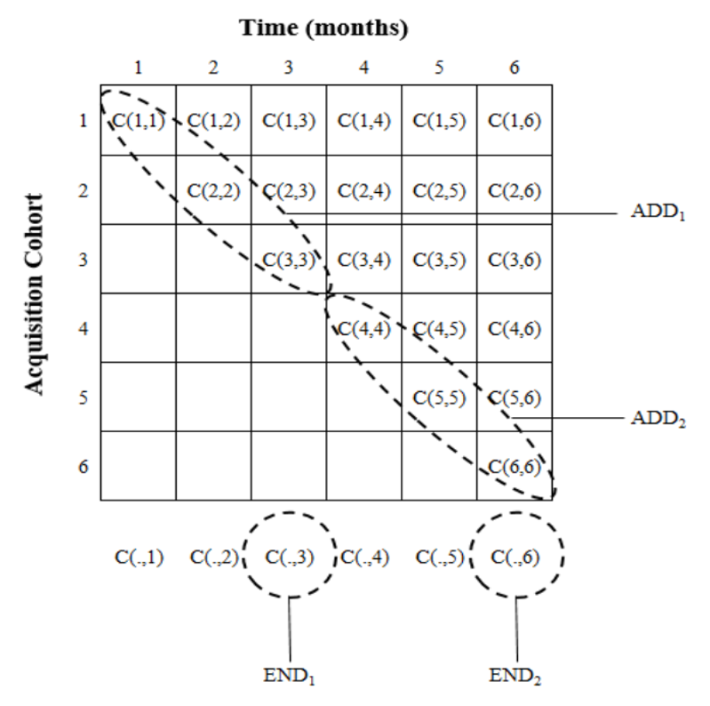{fig-align="center" height="400px"}
:::

::: {.column width="50%"}
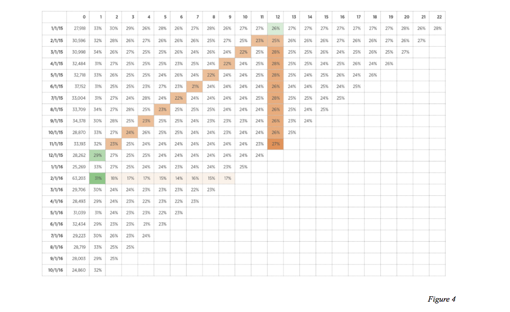{fig-align="center" height="400px"}
:::

::::

::: {.callout-note appearance="minimal"}
Shapes differ because LHS column labels are absolute calendar-time periods, whereas RHS column labels are relative time periods after acquisition
:::

::: {.source-url}
[McCarthy et al. (2017)](https://drive.google.com/file/d/1TDujmUckpJQFEXQ7jN8AVD8gHIgch2Yz/view?usp=drive_link){target="_blank"} | [Sequoia Capital](https://articles.sequoiacap.com/retention){target="_blank"}
:::

::: notes
:::

## What about transaction businesses?

- The basic CBCV concept extends, but

    - Customer attrition not directly observed
    - Purchase frequency varies across customers & time
    - Spending varies across customers & time
    - Customer development varies across customers & time

- Greater variance and model uncertainty, hence forecasts are more volatile

::: {.callout-note appearance="minimal"}
Of the four uncertainties listed, which are harder or easier to control for with more data?
:::

::: {.source-url}
[McCarthy and Fader (2018)](https://journals.sagepub.com/doi/pdf/10.1177/0022243718802843){target="_blank"}
:::

::: notes
- Modeling details treated by McCarthy and Fader (2018)
:::

## Blue Apron

:::: {.columns}

::: {.column width="50%"}
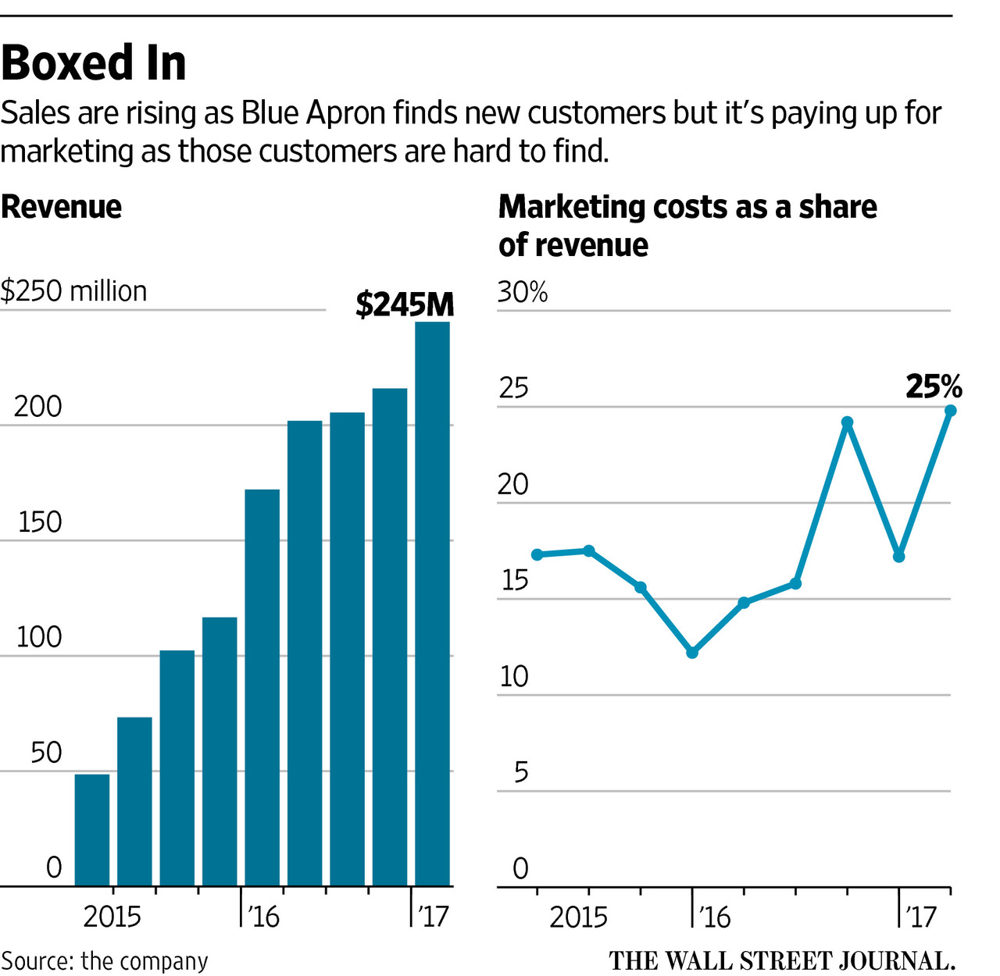{fig-align="center" height="320px"}
:::

::: {.column width="50%"}
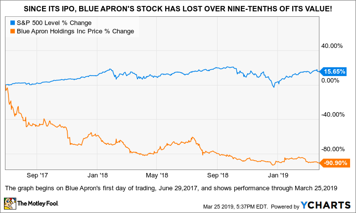{fig-align="center" height="320px"}
:::

::::

::: {.callout-note appearance="minimal"}
Blue Apron became a famous meal-prep brand by spending a lot. However its customer acquisition budget was astonishingly large. Usually you're looking at marketing in the 0.2–8% of gross margin range, but Blue Apron's was around 25% of revenue. The stock did poorly after IPO.
:::

::: {.source-url}
[WSJ on Blue Apron Financials, pre-IPO](https://web.archive.org/web/20201112043423/https://www.wsj.com/articles/stir-fry-on-sale-blue-apron-turns-to-deals-to-draw-customers-1498561202){target="_blank"} | [Motley Fool in 2019](https://web.archive.org/web/20210228221306/https://www.fool.com/investing/2019/03/28/lyfts-ipo-the-one-article-you-need-to-read.aspx){target="_blank"} | [Wilbur (2026, p. 18)](https://drive.google.com/file/d/1u_62o5PxHqc7deFQQtLoS-gPrAt-TpGy/view?usp=sharing){target="_blank"}
:::

::: notes
- This isn't showing all $C(t,t')$ data, but marketing is a HUGE % of revenue, and rising proportionally with total customers. McCarthy pointed out in social media that's very likely unsustainable.
- This is an example of a high-CAC, low-retention business. 25\% is incredibly high. 1-10% is more typical
- Note also that CAC was rising: Somewhat akin to the "pump and dump" trading strategy. Using new investor money to increasingly acquire new customers, but neglected retention
- Sadly, after IPO at $32 in march 2018, and a peak at $58 in July 2018, the stock reached $.70 in 2023, a loss of 98% from IPO valuation
- Dan was right, despite this being a new category and inherently uncertain to predict
- This was an early "win" for CBCV
:::

## Card spending panels

- Data report anonymous cardholder IDs, Merchant Name & Category, Spending, Timestamp, Location

- Data are anonymized, but data fusion enables stochastic reidentification

- Powerful implications for CBCV:

    - You no longer need internal data to estimate $C$
    - Investors can mine card spending data for customer insights

- We can test this using the COVID-19 pandemic, which spiked revenue at many digital-first businesses. Key question: How did pre-pandemic retention trends predict post-pandemic results?

::: {.callout-note appearance="minimal"}
Card spending data became popular in the mid-2010s, but still tend to be expensive.
:::

::: {.source-url}
[PYMNTS (2017): card data and retail-stock volatility](https://www.pymnts.com/news/investment-tracker/2017/reliance-on-card-data-sneak-peaks-is-making-retail-stocks-volatile/){target="_blank"}
:::

::: notes
- Let's look at some case studies of privately held corporations
- AKA not publicly traded stocks
:::

## Gross order value & cohort retention

:::: {.columns}

::: {.column width="50%"}
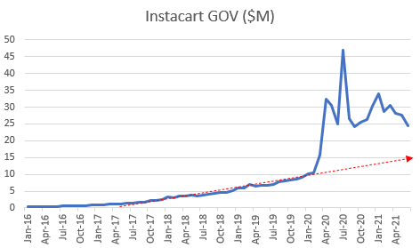{fig-align="center" height="320px"}
:::

::: {.column width="50%"}
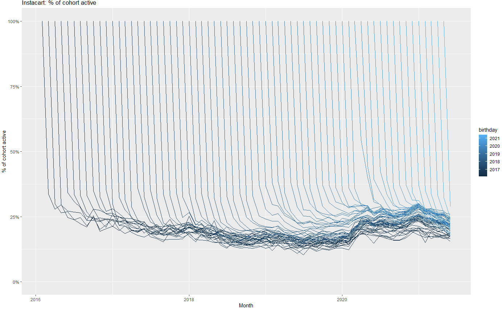{fig-align="center" height="320px"}
:::

::::

{.absolute bottom="20" right="20" height="25px"}

::: {.callout-note appearance="minimal"}
Left figure shows de-seasonalized spending per card. Right figure shows $C$ for each monthly cohort in each month served, hence is 100% in month 1 by definition. Instacart retention was flat before Covid, then increased and remained high throughout. The business remained healthy for years after.
:::

::: {.source-url}
[McCarthy (2021)](https://www.linkedin.com/pulse/doordash-instacart-shipt-tale-3-covid-bumps-daniel-mccarthy/){target="_blank"}
:::

::: notes
- GOV: roughly proportional to revenue
- Notice how smoothly GOV changed from 2017-20
- What happened in 2020-March?
- Working with a totally different data source here: credit card expenditure panels with millions of consumers from Earnest Research
- Now, let's look under the hood at $C(.,.)$
- Again, notice how smoothly Instacart retention changed from 2017-20
- But, retention was trending down from 2017-20 as more stores started delivering
- You can see that Instacart retention rose during the pandemic
- Investors could translate that retention increase to firm value
:::

## Gross order value & cohort retention

:::: {.columns}

::: {.column width="50%"}
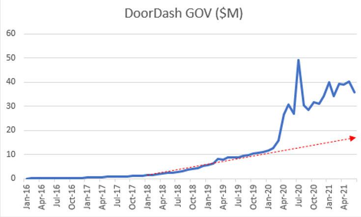{fig-align="center" height="320px"}
:::

::: {.column width="50%"}
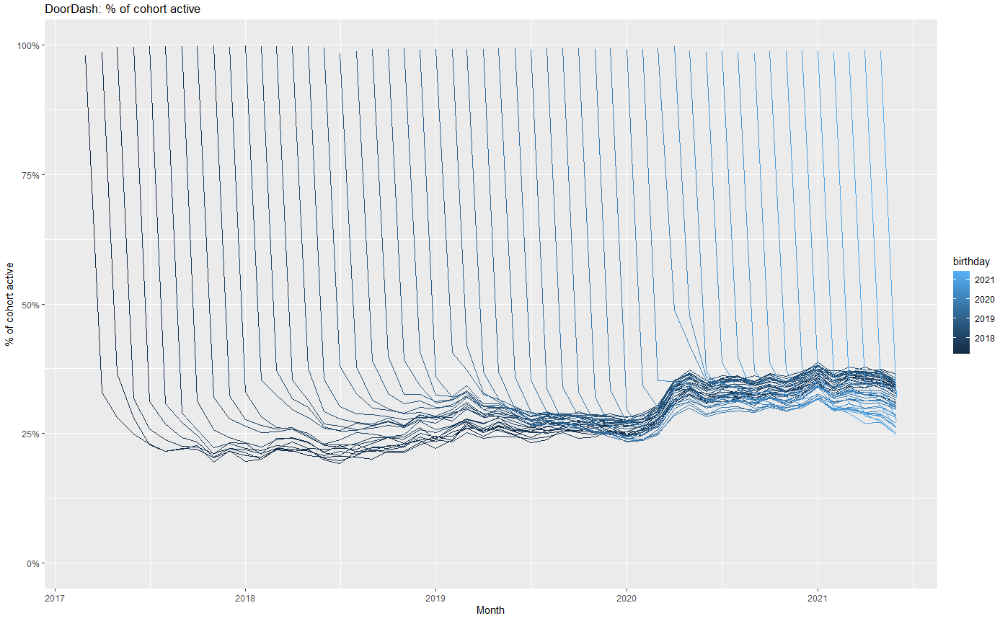{fig-align="center" height="320px"}
:::

::::

{.absolute bottom="20" right="20" height="25px"}

::: {.callout-note appearance="minimal"}
Doordash retentions were increasing before Covid, then increased even more and stayed high. The various customer cohorts show remarkably stable retention rates.
:::

::: {.source-url}
[McCarthy (2021)](https://www.linkedin.com/pulse/doordash-instacart-shipt-tale-3-covid-bumps-daniel-mccarthy/){target="_blank"}
:::

::: notes
- Again, notice how smoothly Doordash GOV changed from 2017-20. Builds confidence in using past retention to predict future retention
- Unlike Instacart, Doordash retention was trending up from 2017-20
- Pandemic goosed GOV, but then it resumed trend
- But, the newest cohorts after the pandemic had much lower retentions than the older cohorts
:::

## Gross order value & cohort retention

:::: {.columns}

::: {.column width="50%"}
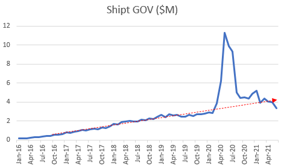{fig-align="center" height="320px"}
:::

::: {.column width="50%"}
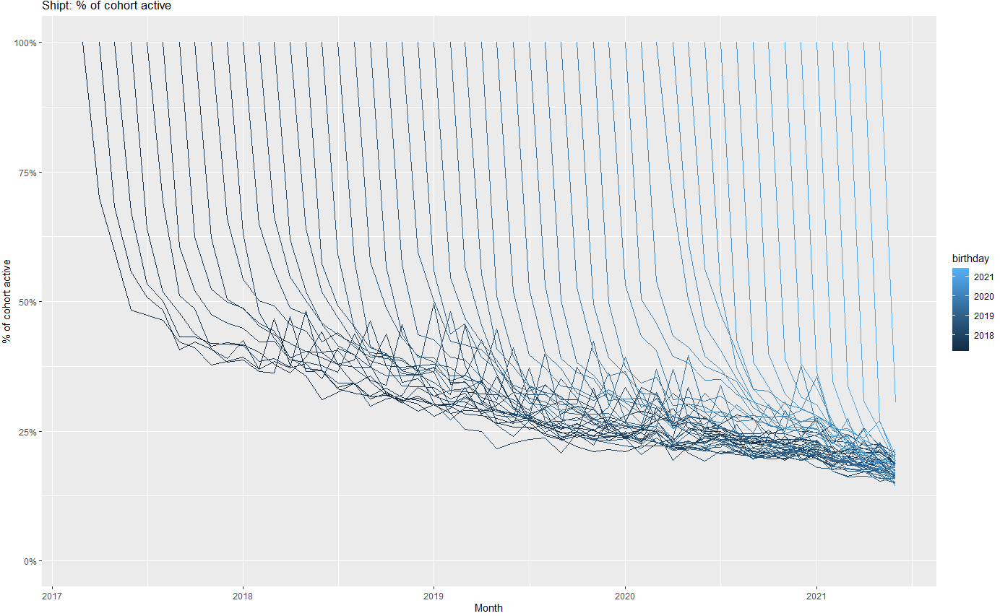{fig-align="center" height="320px"}
:::

::::

{.absolute bottom="20" right="20" height="25px"}

::: {.callout-note appearance="minimal"}
Shipt is an e-commerce delivery service. Cohort retentions had been declining for years before Covid, a deeply troubling sign of dissatisfaction and possible value problems. Shipt eventually sold to Target at a discount.
:::

::: {.source-url}
[McCarthy (2021)](https://www.linkedin.com/pulse/doordash-instacart-shipt-tale-3-covid-bumps-daniel-mccarthy/){target="_blank"}
:::

::: notes
- Like Instacart & Doordash, Shipt had predictable & rising GOV from 2017-20
- Big pandemic bump, then big crash!
- Red alert! What do you see here?
:::

## Customer-data disclosure headwinds {.smaller}

- SEC (2020) asks registrants to disclose the operational/non-financial KPIs management uses to run the business — e.g. ARPU, churn, CAC, cohort metrics
- Morgan Stanley report introduced CBCV to a mainstream sell-side audience
- FASB (2024) invited comment on accounting for customer relationships as intangible assets & asked whether it should pursue uniform measurement and disclosure standards; no decision yet
- Damodaran: Valuing subscription/user businesses requires firms to disclose customer acquisition cost, contribution profitability, and cohort retention tables; cites Atlassian, Dropbox, Slack
- EY (2025) reports that SEC often requests companies to disclose specific results of operations, e.g., new customer revenue, impact of changes in pricing and quantity, changes related to customer acquisitions

::: {.callout-note appearance="minimal" style="font-size: 1.3em;"}
Emerging consensus that customer-level reporting should improve corporate valuation accuracy.
:::

::: {.source-url}
[SEC (2020)](https://www.sec.gov/files/rules/interp/2020/33-10751.pdf){target="_blank"} | [Mauboussin (2021)](https://www.morganstanley.com/im/publication/insights/articles/article_theeconomicsofcustomerbusinessesV2_us.pdf){target="_blank"} | [FASB (2024)](https://storage.fasb.org/ITC%E2%80%94Recognition%20of%20Intangibles.pdf){target="_blank"} | [Damodaran (2025)](https://pages.stern.nyu.edu/~adamodar/pdfiles/eqnotes/valpacket2spr25.pdf){target="_blank"} | [EY (2025)](https://www.ey.com/content/dam/ey-unified-site/ey-com/en-us/technical/accountinglink/documents/ey-secru28204-251us-09-11-2025.pdf){target="_blank"}
:::

::: notes
:::

## How many firms track and report customer analytics?

- Surveyed 300 firms regarding customer analytics measurement & use

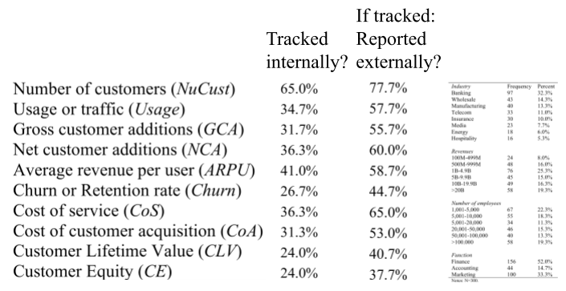{fig-align="center" height="330px"}

::: {.callout-note appearance="minimal"}
Many customer analytics are tracked and reported, though not systematically, and not by all firms
:::

::: {.source-url}
[Bonacchi & Perego (2024)](https://drive.google.com/file/d/1_dLCcqJPPOq33p3Ri3__zDivjdS7Owhq/view?usp=drive_link){target="_blank"}
:::

::: notes
Customer equity is a firm-level intangible asset corresponding to total customer-base value (Gupta Lehmann & Stuart 2004)
:::

## CBCV rollout

- CBCV is *slowly* entering finance & accounting canon

    - Standardized reports would be helpful

- Predictions

    - Should incentivize start-ups toward customer retention
    - Should make capital allocation more efficient
    - May require investors to demand $C$ disclosures, and/or high-retention firms to self-select in

::: {.callout-note appearance="minimal"}
Will we get to a tipping point? The existing systematic reporting regime of balance sheets is deeply entrenched. Wouldn't more information be better?
:::

::: notes
- Like econ, Finance & accounting worlds are famously conservative and slow to adopt
- Fader & McCarthy are on their second related start-up to popularize CBCV, having sold the first one to Nike
- when enough firms report customer-level metrics, then the ones that don't should be seen as low quality investments
- Ofc, lots of investors still buy low-quality investments
- Currently, customer acquisition is overemphasized by many investors
:::

## Asset Price Game

- You are VCs trading start-up shares ("assets")

- Each team starts with 4 assets and $500 million cash

- Teams can make money in 1 of 4 ways:

    1. Collect dividends
    2. Buy and sell assets
    3. Hold cash and collect interest
    4. Asset payouts at the end of the game

- Top few winners get 10 contribution points each

## Trading rounds {.smaller}

- We will play $n$ 2-minute rounds. Within each round :

1. Enter bids and asks in buy/sell auction
    - BID means you offer to trade cash for assets at a given price
    - ASK means you offer to sell assets for cash at a given price
    - A market-making algorithm will determine the market-clearing price for any distribution of bids and asks at end of round
    - All trades will clear at same price within a round
2. After trading, each asset pays its owner a risky dividend, and cash accrues interest

After $n$th round, every asset pays an extra $14

- Any questions? [Veconlab](https://veconlab.com/login.html?submit=Login+as+Participant){target="_blank"}

## Let's play!

{fig-align="center" height="350px"}

##

- How did prices change across rounds?

- What strategy did your team use?

- How did that work out?

- How might this connect to real financial markets?

    - Takeaway #1
    - Takeaway #2

# Wrapping up

## Modeling: 1000' view {.smaller}

- *Model*: Simple representation of complicated phenomena

    - We can't fully understand the phenomena
    - We can fully understand the model, but even this can be hard

- Modeling is a superpower!

    - You can understand, explain and predict things that others can't
    - Modeling skills develop with practice & transfer across domains

- Cautions

    - Simple models are often 85-95% effective
    - There is never a true model: "Model uncertainty" is always present
    - All models assume; good models assume transparently
    - Anyone can tear down a model; improving a model is work

<!--Beginners often say: "my model," "my data," "my assumptions"... -->
<!-- Modeling for the sake of modeling might be fun; might increase your modeling skill level; but it does not tell you about the world, and generally won't interest others-->

## Congrats you did it!

{fig-align="center" height="400px"}

- Special congratulations for those who are graduating

    - It's a big deal. We're proud of you.

## Recap

- Corporate valuation uses past profits to predict future profits, without using granular customer metrics
- Customer-Based Corporate Valuation (CBCV) advocates reporting $C(t,t')$ to enable investors to better predict profits
- Asset price takeaways #1 & #2
- No customers, no business

{.absolute bottom="20" right="20" height="100px"}

## Going further

- [IPO Disclosures Are Ripe for Reform](https://drive.google.com/file/d/1yHjslNFl4y2Y3qb6OWoJyIhfUTB7LFJf/view?usp=drive_link){target="_blank"}

- [Nice 1000' View: The Economics of Customer Businesses](https://drive.google.com/file/d/1K9nLpBXOUeJ8xyjRyNCGfebLlwvBiAcA/view?usp=drive_link){target="_blank"}

- [Theta Webinars](https://thetaclv.com/resources/webinars/){target="_blank"}

- [Decomposing Firm Value by Belo et al. (2021)](https://drive.google.com/file/d/1KFlvd-9PBVkafPE4RCiRRZWeCUT91Ctm/view?usp=drive_link){target="_blank"} for a competing perspective

- [Bruce Hardie's customer-base analysis materials](https://brucehardie.com/){target="_blank"}

- [What are the most important statistical ideas of the past 50 years?](https://drive.google.com/file/d/1Jyu2c43eCbHD-IU7MLtv_6BefPGbFr5y/view?usp=drive_link){target="_blank"}

{.absolute bottom="20" right="20" height="100px"}

::: notes
- Hardie is a marketing professor at LBS and a longtime expert on customer lifetime value whose website offers free papers, notes and datasets on his website. For those who want to go way deeper on the customer-base analysis stuff
- The first paper is a good big-picture overview of analytics in general, and a brief preview of where two world's experts think analytics might be going in the future. From a statistics perspective moreso than econ. Good summer reading
:::
