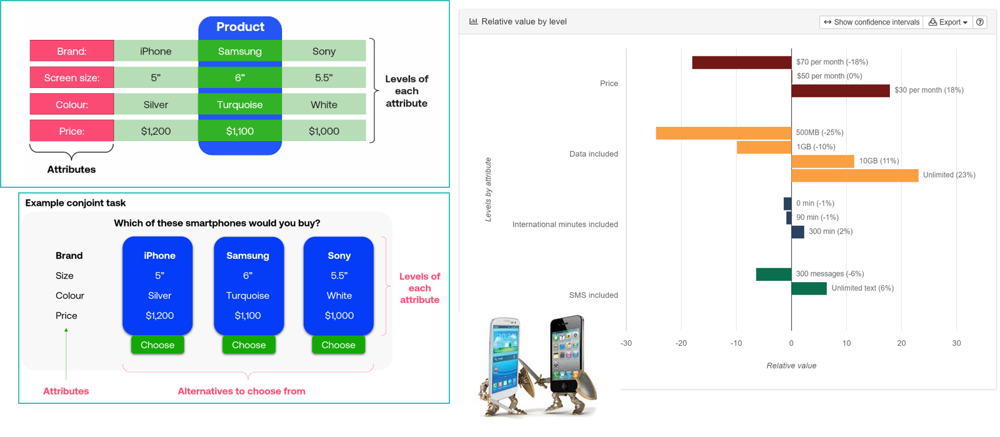

# Conjoint Analysis

- Generate consumer choice data, analyze it to 

    - Use a supervised choice model to map the market
    - choose locations in attribute space
    - predict sales and profits

## Choosing Product Attributes

- Until now, we studied existing product attributes 

    - What about choosing new product attribute levels? 
    - Or what about introducing new attributes?

- Enter conjoint analysis:  Survey and model to estimate attribute utilities 

- Probably the most popular quant marketing framework

        - Autos, phones, hardware, durables
        - Travel, hospitality, entertainment
        - Professional services, transportation
        - Consumer package goods

- Combines well with cost data to select optimal attributes 

::: notes
- Developed in the 1960s
:::
        
## How to do conjoint analysis

1. Identify $K$ product attributes and levels/values $x_k$

2. Hire consumers to make choices

3. Sample from product space, record consumer choices

4. Specify model, i.e. $U_j=\sum_{k}x_{jk}\beta_k-\alpha p_j+\epsilon_j$  and $P_j=\frac{\sum_{k}x_{jk}\beta_k-\alpha_k p_j}{\sum_l\sum_{k}x_{lk}\beta_k-\alpha_k p_l}$

          - Beware: p is price , P is choice probability or market share

5. Calibrate choice model to estimate attribute utilities

6. Combine estimated model with cost data to choose product locations and predict outcomes

::: notes
- We'll talk a lot more about this model next week
:::

## Trucks Example

{fig-align="center" width=7in}

::: notes
- [Source](https://sawtoothsoftware.com/conjoint-analysis)
:::

## Phones/Service Plans Example

{fig-align="center" width=11in}

::: notes
- Note: Example graphics are simplified. There were many more attributes than those shown
- [Source](https://conjointly.com/guides/what-is-conjoint-analysis/)
:::

## Case study: UberPOOL

- In 2013, Uber hypothesized  

      - some riders would wait and walk for lower price
      - some riders would trade pre-trip predictability for lower price
      - shared ridership could ↓ average price and ↑ quantity
      - more efficient use of drivers, cars, roads, fuel

{fig-align="center" width=6in}

::: aside
Source: [UberPOOL white paper](https://drive.google.com/file/d/17cuhv-oTeQaoommAMXLSLNgXjOeBYNdX/view?usp=share_link)
:::

::: notes
- Important note: Figure 2 is mistaken in the paper. It has the illustrations flipped on bottom 2 rows. I corrected it in the slides.
:::

## Business case was clear! But ...

- Shared rides were new for Uber

            - Rider/driver matching algo could reflect various tradeoffs            
            - POOL reduces routing and timing predictability 

- Uber had little experience with price-sensitive segments

            - What price tradeoffs would incentivize new behaviors?
            - How much would POOL expand Uber usage vs cannibalize other services?

- Coordination costs were unknown

            - "I will never take POOL when I need to be somewhere at a specific time"
            - Would riders wait at designated pickup points?
            - How would comunicating costs upfront affect rider behavior?
            
- So, Uber used market research to design UberPOOL

## Approach

1. 23 in-home diverse interviews in Chicago and DC

          - Interviewed {prospective, new, exp.} riders to (1) map rider's regular travel, (2) explore decision factors and criteria, (3) a ride-along for context
          - Findings identified 6 attributes for testing

2. Online Maximum Differentiation Survey 

          - Selected participants based on city, Uber experience & product; N=3k, 22min

{fig-align="center" width=5.7in}

## Maxdiff results

{fig-align="center" width=7in}

::: notes
- The purpose of the Maxdiff format is to select M out of N<M attributes. 
- Asking for most or least important, the survey design is thought to be less susceptible to "scale effects" than others. 
- That is to say, going from a 2-point to 3-, 5- or 7-point scale can change judgements
- In this case, they found that walking was not very important per unit of walking
- Fixed route and number of stops were relatively unimportant overall
:::

## Conjoint Design

{fig-align="center" width=9in}

::: notes
- Based on Maxdiff, Uber tested a conjoint analysis with ETA, walking, trip length, trikp variance and discount
- Notice that we can have different # of levels per attribute
- These are the data that go into the X variables in the model
- X also may include some customer attributes
:::

## Conjoint Sample Question

{fig-align="center" width=9in}

::: notes
- This is an example of how the choice task looked to participants
- Data sample was 18,000 riders contacted via email in 2017
- Resulted in 1,934 completed surveys, response rate of 10.7%, 5.5 minutes/survey
- 5 respondents selected for $500 amazon gift cards
:::

## Conjoint Model

{fig-align="center" width=8in}

::: notes
- Same choice model that we saw earlier, and will estimate next week
- The Hierarchical Bayes version is the one that performed best, in the model comparison that we we looked at in week 3
- Let's talk about what that HB attribute means here
:::

## Conjoint Findings

{fig-align="center" width=8.5in}

::: notes
- Unfortunately, Uber did not give us the Y axis labels. That's common when firms worry about competitive secrecy
- We can see that ETA matters
- We can see that walking matters as much as ETA
- Trip length seems to matter also less over the range tested
- ETD variance doesn't matter as much, at least within the range tested
- Price matters a LOT
- Uber also found some heterogeneous results: 
- "Newer riders are more price sensitive"
- "Shorter commutes make you more likely to opt in but also more sensitive to walking than riders with a longer commute"
:::

## Product Redesign

{fig-align="center" width=9in}

::: notes
- This graphic shows how Uber redesigned the app to show product attributes
- Including how far to walk; how long to destination; variance in ETD; and price
- For example, POOL intentionally delayed matching by 40 seconds on average while searching for additional riders
- The representation of walking distance was nontrivial. The first version (leftmost panel) had to be redesigned (rightmost panel) when it led consumers to overestimate total walking
- The new product was launched with the tag line "Walk a little, save a lot'
:::

## Business Results

{fig-align="center" width=9in}

::: notes
- Uber shared limited revenue data, but this is one clear example of improving efficiencies
- UberPOOL had been live in SF the longest; this looks like a meaningful decrease in cancellations
:::

## More Products

{fig-align="center" width=3in}

::: notes
- Apparently this approach is working out for Uber... 
- They are offering lots more options, including Uber Pet
:::

## Conjoint: Limitations, Workarounds{.smaller .scrollable}

- We may fail to consider most important attributes or levels

        - But we can consult with experts beforehand and ask participants during

- Additive utility model may miss interactions or other nonlinearities

        - But this is testable & can be specified in the utility model

- Exploring a large attribute space gets expensive

        - But we can prioritize attributes and use efficient, adaptive sampling algorithms

- Assumes accurate hypothetical choices based on attributes 

        - But we can train consumers how to mimic more organic choices 

- Participants may not represent the market

        - But we can measure & debias some dimensions of selection 

- Choice setting may not represent typical purchase contexts

        - But we can model the retail channel and vary # of competing products

- Participant fatigue or inattention

        - But we can incentivize them and check for preference reversals
        
- Consumer preferences evolve

        - But we can repeat our conjoints regularly to gauge durability
        
::: notes
- ["the importance of making responses incentive compatible is evaluated. The most directly relevant evidence comes from laboratory experiments, where one can crisply compare environments in which the responses are incentive compatible and those where they are not. This distinction has typically been examined by just looking at choices made when the consequences are hypothetical or imagined, and comparing them to choices made when the consequences are real. There is systematic evidence of differences in responses across a wide range of elicitation procedures" (Harrison 2022")](https://drive.google.com/file/d/1GJ4SD3W81gWVRZv17rUmioeqUKUukYFd/view?usp=share_link)
:::

## Class script

-   Let's use PCA to draw some product maps.

{fig-align="right" width=2in}
 
# Wrapping up

## Homework 

- Let's take a look

{fig-align="right" width=4in} 

## Recap

- Market maps use customer data to depict competitive situations
- PCA projects high dimensional data into lower dimensional space w minimal information loss
- Embeddings represent words as points in concept-space, enabling word-math
- Conjoint analysis uses survey choice data to 

          - map markets
          - estimate product attribute utilities
          - help design products as bundles of attributes
          - predict how location choice leads to revenues, profits

{fig-align="right" width=2in}

## Going further
 
- [Intro to Large Language Models by Karpathy](https://www.youtube.com/watch?v=zjkBMFhNj_g)
- [ChatGPT: 30 Year History | How AI Learned to Talk](https://www.youtube.com/watch?v=OFS90-FX6pg)
- [Mapping Market Structure Evolution by Matthe et al. 2023](https://drive.google.com/file/d/1hErG0Akz3o9OJc5XcyiA6C2LZDfXglWa/view?usp=drive_link)
- [Deeper dive on data reduction: *R4MRA*, Section 8.2](https://drive.google.com/file/d/1fsD4f7x1NtZWYkiSbw7YYbDctYYZJxd9/view?usp=sharing)
- MGT 108R to design & run conjoint analyses
- Conjoint literature is huge. Good entry points: [Chapman 2015](https://drive.google.com/file/d/1hVKKbfyJgGLusiySXCFFAeBtIAFkTmH5/view?usp=sharing), [Ben-Akiva et al 2019](https://drive.google.com/file/d/1hJzBl9UHabKxQPmP1xI51VX7VlLuMAwH/view?usp=drive_link), [Green 2022](https://drive.google.com/file/d/1hWkhH1nNUnp03ScTb8q3HaGKodev06VG/view?usp=drive_link), [Allenby et al. 2019](https://drive.google.com/file/d/1hKkvptyW8noB1Iudra77yjdpPy9Nj7Tw/view?usp=drive_link)

{fig-align="right" width=2in}
